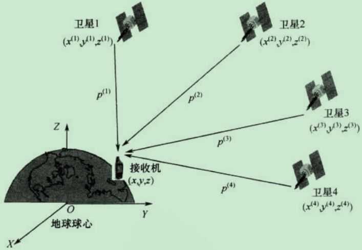

# GNSS背景知识

GVINS使用的是SPP算法，需要测量伪距及多普勒频移，当前有四个GNSS系统，分别是GPS，GLONASS、Galileo、BeiDou

发送信号由三层组成，导航信息（轨迹参数即星历信息、时钟校正误差、电离层延迟系数、卫星状态其他相关信息）、PRN伪随机噪声、高频调制载波信号；接收端获得多普勒频移、伪距； 

## GNSS定位原理

如果卫星n（其值在此为1~4）的空间位置在某一直角坐标系中的坐标值为$(x^{(n)},y^{(n)},z^{(n)})$，而接收机测得其本身到该卫星的伪距为$\rho ^{(n)}$，那么可以列出如下方程式：
$$
\sqrt{(x^{(n)}-x)^2+(y^{(n)}-y)^2+(z^{(n)}-z)^2}+c·\delta t_u=\rho ^{(n)}
$$
那么至少需要4个及以上的卫星有伪距测量值，列出4个或4个以上与上式相仿的方程，然后利用**最小二乘法**或卡尔曼滤波等算法解出$x,y,z和\delta t_u$四个未知数。

同时，接收机还可以从卫星信号中获取**多普勒频移测量值**，==它的值跟接收机与卫星在它们两者连线方向上的相对速度成正比==，其中根据卫星轨道参数计算所得的卫星运行速度与卫星空间位置坐标值一道可作为已知量看待，于是我们能够从中解算出接收机的运动速度。

**单点定位与差分定位的概念：**

单点定位也叫做绝对定位，它是**单个接收机通过测量多个卫星信号的伪距实现的**。**与绝对定位相对应的是相对定位，时常又叫差分定位。**但事实上相对定位和差分定位是有区别的：一般所说的差分定位其实是一种改进的绝对定位，利用**差分GNSS所提供的差分校正量来减小或消除伪距等测量值中的误差**，从而提高绝对定位精度；而**相对定位一般涉及一个基准站和一个用户流动站**，这两个测量站的接收机同时对相同卫星点的信号进行测量，然后双方的伪距和载波相位等测量值被整合到一起，从中求解出基站至流动站的基线向量而实现相对定位。

## 坐标系统与时间系统

### 常用的坐标系统

+ **右手地心惯性坐标系（ECI）**

定义：采用地球中心为原点，其z轴指向国际协议原点（CIO），x轴指向J2000.0春分点。且右手地心惯性坐标系不会相对原点进行旋转运动，因此也成为**地心空间固定坐标系**。

地心惯性坐标系不是绝对不动的，受到岁差和章动的影响

+ 地心地固坐标系(ECEF)

在计算地球上用户的位置时，使用地心地固坐标系会更为方便。其原点与地球质心重合，XY平面与地球赤道平面重合。但是**ECEF坐标系X轴指向平均格林威治子午线，Z轴垂直于赤道平面指向地理北极，Y轴与X，Z轴形成右手坐标系**。

### 常用的时间系统

+ 协调世界时（UTC）

从1972年开始采用的协调世界时是以国际原子秒长为基础，在时刻上尽量接近世界时UT1的一种时间尺度

# 卫星导航中的多普勒效应

卫星导航中传播信息用的是无线电波，因为卫星在绕地球高速运动，所以也有多普勒效应。

多普勒效应的主要内容为**物体辐射的波长因为波源和观测者的相对运动而产生变化**。在运动的波源前面，波被压缩，波长变得较短，频率变得较高（蓝移 blue shift）；在运动的波源后面时，会产生相反的效应。波长变得较长，频率变得较低（红移 red shift）；波源的速度越高，所产生的效应越大。根据波红（蓝）移的程度，可以计算出波源循着观测方向运动的速度。

我们定义多普勒频移值$f_d$为接收机接收频率与卫星信号发射频率的差值。设$v$为接收机与卫星之间的相对速度矢量，$e$为接收机到卫星的单位观测矢量，则有
$$
f_d=\frac{v·e}{\lambda}=\frac{V}{\lambda}\cos \alpha
$$
其中$v$与$e$之间是矢量点积运算，$\lambda$为载波波长，$V=|v|$，$\alpha$为v与e之间的夹角。接收机内部的锁频环可以输出观测到的多普勒频移值 $f_d$，利用这个值，我们就可以进行多普勒定速。
