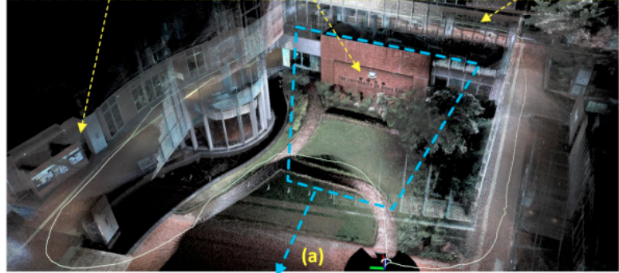

# GVIO： 

+ **RI-MSCKF**+**GNSS**实现紧耦合Slam系统，作为前端的**odometry**，滤波算法主要是在精度方面不差于优化算法，但是在速度上优于优化算法。 

RI-MSCKF是具有**右不变性**的MSCKF，相较于传统的MSCKF，可以在数学上证明，RI-MSCKF可以解决传统的MSCKF**非一致性**和**发散**的问题。目前是一种比较优秀的多传感器融合的基于滤波的方案，IGVIO基于这个框架融合了视觉、惯性、GNSS数据，取得了不错的结果。

另一种滤波框架是目前激光-视觉-惯性SLAM常用的：ESIKF（误差状态迭代卡尔曼滤波器），在LIO方案中，Fast-LIO使用的此滤波方案；在LVIO的方案中，R2LIVE、R3LIVE、FT-LVIO、Fast-LVIO、LA-VIL等也使用的这个方案。

其他一些基于滤波框架的LVIO，有IEFK（迭代扩展卡尔曼滤波器）的：

A Robust and Efficient LiDAR-Inertial-Visual Fused Simultaneous Localization and Mapping System with Loop Closure

论文链接：https://ieeexplore.ieee.org/document/9907651

还有基于EKF的：

LiDAR/Visual SLAM-Aided Vehicular Inertial Navigation System for GNSS-Denied Environments

论文链接：https://ieeexplore.ieee.org/document/10019210

Deep Learning-Aided Inertial/Visual/LiDAR Integration for GNSS-Challenging Environments

论文链接：https://www.semanticscholar.org/paper/Deep-Learning-Aided-Inertial-Visual-LiDAR-for-Abdelaziz-El-Rabbany/e7db9948cdfccd438ae9d96403e30a4aecf175c9

+ 对于MSCKF的初始化，目前比较流行的是黄国权团队开发的OpenVINS中提出的静态初始化策略，而其动态初始化策略没有开源，实际上对于MSCKF来说，静态初始化比较容易，动态初始化比较困难，网络上资料较少，可以尝试更改为VINS-MONO的初始化策略。 
+ 关于GNSS初始化，GVINS使用spp单点定位算法，可以使用上海交通大学的开源库使用PPP精密单点定位算法进行初始化。

上海交通大学GICI-LIB github地址：https://github.com/chichengcn/gici-open

+ 建图，一般滤波算法是不具有建图功能的，所以配置一个posegrah可以构建复用的地图，具体思路是从前端RI-MSCKF滑窗中提取一些关键帧保存下来，在posegraph中做优化，后续可以给点云地图增加RGB，类似R3LIVE。 

# LGVIO：

深度关联这块目前看到的最新的工作是LE-VINS，它在原有的LVI-SAM的基础上增加了平面检查算法，也就是用五个激光点拟合一个平面，计算这五个点到平面的距离，若超过阈值则关联失败。

可以在LE-VINS工作的基础上做出一定的修改：

**期刊：**将LIO子系统估计出的位姿使用SIM3变换到VIO系统，相当于对VIO的尺度进行约束，并且激光点云和视觉的landmark做深度关联的时候可以将仿射变换投影过来的尺度信息做为一个参考，提高深度关联的准确性。同时使用VIO计算的位姿，为点云匹配提供初始猜想。使用配准的点云信息，为IMU初始化提供约束。 

**期刊：**基于滤波算法的多模态匹配：可以使用激光雷达构建的点云，使用双目相机计算的点云，进行一个定位，可以使用深度学习的方法学习二者的对应关系，从而进行匹配，另外前端可以考虑使用半直接法代替传统的光流跟踪。 

**会议：**建图，使用点云进行地图构建，构建过程中可以使用深度学习技术进行点云动态点去除，使用YOLOV8。

==前端滤波，后端建图现成方案：R2LIVE系列==

知乎链接：https://zhuanlan.zhihu.com/p/582569498

论文链接：https://ieeexplore.ieee.org/document/9478206

github链接：https://github.com/hku-mars/r2live

配送机器人进出室内外的轨迹对齐技术：机器人在进入室内前，GNSS信号良好，当进入室内后，GNSS信号丢失，开启一个临时posegraph，存储室内的位姿，当走出室外后，恢复GNSS信号，通过posegraph进行位姿修正，将结果输出，替换掉之前的那一段室内位姿。（主要思路是将室外丢失GNSS信号时那个时刻的位姿的id记录下来，当恢复GNSS信号时，替换轨迹，并清空posegraph）
