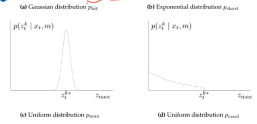
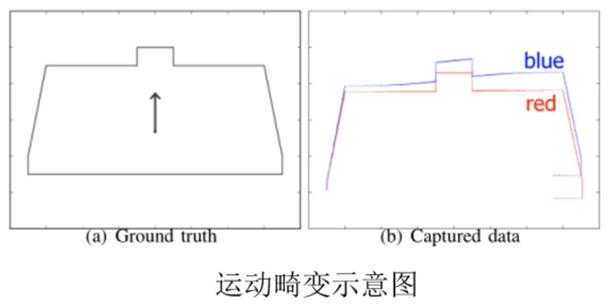
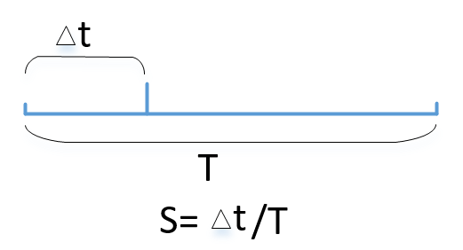
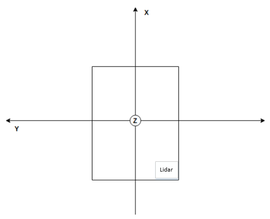
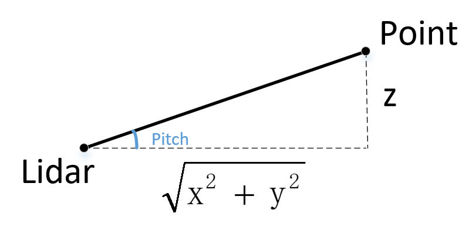
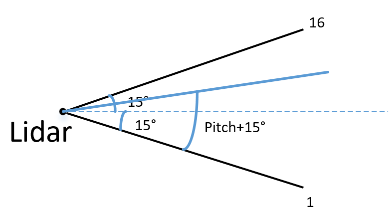
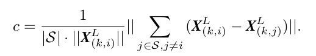
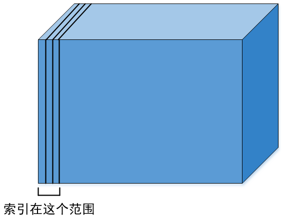

# 激光雷达的基本原理

## 2D激光雷达传感器介绍

测距原理：

+ 三角测距 ：中近距离精度较高，价格便宜，远距离精度较差，易受干扰，一般在室内使用
+ 飞行时间（TOF）：测距范围广，测距精度高，抗干扰能力强，价格昂贵，室内外皆可

## 2D激光雷达数学模型介绍

+ 光束模型（beam model）

激光的观测值有四种可能性，实际上常用到的只有两种。

（a）满足高斯分布（正常情况，有噪声存在）

（b）满足指数分布（有遮挡）



**光束模型的缺点：**

1.期望值的计算需要用raytracking，每一个位姿需要进行N次raytracking，计算量大。

2.在非结构化场景中，位姿微小的改变会造成期望值的巨大变化。


+ 似然场模型（likelihood model）

优势：

（a）对图像进行高斯平滑，在任何环境中期望值对于位姿都是平滑的

（b）得分不需要经过raytracking，直接通过查表获得，计算量低

（c）适合结构化和非结构化场景


## 运动畸变介绍（※）



运动畸变的产生原因：

+ 激光点数据不是瞬时获得**（实际上我们认为同一帧的数据是同时获得的，但是激光一帧（转一圈）不是瞬间完成的，和激光的频率有关，频率越慢的激光运动畸变越大）**

  注：激光雷达的频率比如10HZ，代表的是激光雷达一秒转10圈，也就是转一圈需要花费100ms，在这100ms内，机器人实际上是运动的，但是我们认为机器人没有动，因此产生了偏差。

+ 激光测量时伴随着机器人的运动

+ 激光帧率较低时，机器人的运动不能忽略

### 运动畸变的去除

+ 纯估计方法（类似ICP）VICP
+ 传感器辅助方法（增加IMU或轮式里程计）

运动补偿的目的就是**把所有的点云补偿到某一时刻**，**这样就可以把本身在过去100ms内收集的点云统一到一个时间点上去** 这个时间点可以是起始时刻,也可以是结束时刻,也可以是中间的任意时刻，常见的是补偿到起始时刻。

**畸变校准方法**

因此运动补偿需要知道每个点时刻对应的位姿 T_start_current 通常有几种做法

1 如果有高频里程计,可以比较方便的获取每个点相对起始扫描时刻的位姿

2 如果有imu,可以方便的求出每个点相对起始点的旋转

3 如果没有其它传感器,可以使用匀速模型假设,使用上一帧间里程计的结果,作为当前两帧之间的运动,同时假设当前帧也是匀速运动,也可以估计出每个点相对起始时刻的位姿

ALOAM是使用的纯lidar的方式,所以使用的是第3种方式

==对于ALOAM，前面的点的预处理时将 intensity 附了别的值 实数部分存的是 scan上点的 id 虚数部分存的这一点相对这一帧起始点的时间差==
[](https://www.guyuehome.com/Uploads/Editor/202110/790d9dacd424419eb76134a1b91653a2.png)

### 3D激光SLAM的帧间匹配

+ **点面ICP**

在2D激光雷达中一般是point-to-point，point-to-line也就是计算点到点的距离和点到线的距离，而在3D激光雷达中是去计算点到平面的距离

+ Feature-based Method（LOAM）

提取特征点：VPF，FHPF，角点，面点等

+ NDT方法

# scanRegistration.cpp

主要分析接收点云的回调函数里面的内容，包括点云数据的处理与特征提取。

==void laserCloudHandler(const sensor_msgs::PointCloud2ConstPtr &laserCloudMsg)==

## 计算初始点到结束点关于x轴的角度：

cmath中的atan2函数使用

在C语言的math.h或C++中的cmath中有两个求反正切的函数atan(double x)与atan2(double y,double x) 他们返回的值是**弧度** 要转化为角度再自己处理下。

前者接受的是一个正切值（直线的斜率）得到夹角，但是由于正切的规律性本可以有两个角度的但它却只返回一个，因为atan的值域是从-90~90 也就是它只处理一四象限，所以一般不用它。

第二个atan2(double y,double x) 其中y代表已知点的Y坐标 同理x ,**返回值是此点与原点连线与x轴正方向的夹角**，这样它就可以处理四个象限的任意情况了，它的值域相应的也就是-180~180了

```cpp
void laserCloudHandler(const sensor_msgs::PointCloud2ConstPtr &laserCloudMsg)
{
    ...
    //计算起始点和结束点的水平角度,与x轴的夹角,由于激光雷达是顺时针旋转,这里取反就相当于转成了逆时针
    int cloudSize = laserCloudIn.points.size();
    //atan2的范围是 [-Pi,Pi] ,这里加上2Pi是为了保证起始到结束相差2PI,符合实际
    float startOri = -atan2(laserCloudIn.points[0].y, laserCloudIn.points[0].x);
    float endOri = -atan2(laserCloudIn.points[cloudSize - 1].y,
                          laserCloudIn.points[cloudSize - 1].x) +
                   2 * M_PI;
    // 总会有一些例外, 转换到合理的范围内
    if (endOri - startOri > 3 * M_PI)
    {
        endOri -= 2 * M_PI;
    }
    else if (endOri - startOri < M_PI)
    {
        endOri += 2 * M_PI;
    }
    ...
}
```

其中机械式Lidar的坐标系如图所示



所以在求与x轴的夹角的时候是 arctan(y/x)，结束点的水平角加上了2pi,主要的目的是：原始的atan2的范围是(-180,180)，给结束点加上2pi可以将角的范围转为 0~360度,因为结束点大部分为负值,比如起点,30度,结束点为-90,转完即为[30,270]

## 计算点云的俯仰角度

第二步是**遍历所有的点**，计算点云的俯仰角度，判断这个点在哪个线的scan上面。

计算角度的原理如下



```float angle = atan(point.z / sqrt(point.x * point.x + point.y * point.y)) * 180 / **M_PI**;```

 上述公式对应的式子其实就是$\frac{z}{\sqrt{x^2+y^2}}$



通过上面的图可以计算出得到的点云具体在哪束激光线上。对应代码如下：

```cpp
//计算俯仰角，单位是角度，用于判断是第几个线束（计算这个点在哪个线的scan上面）
        float angle = atan(point.z / sqrt(point.x * point.x + point.y * point.y)) * 180 / M_PI;
        int scanID = 0; //线束的id

        if (N_SCANS == 16)//16线的激光雷达大约夹角是30°
        {
        //angle是点云对应的俯仰角，默认范围是-15-15，加上15后范围是0-30°，每两条线之间的夹角是2度，所以再÷2就能得到在那根线上
            scanID = int((angle + 15) / 2 + 0.5);//最后加的0.5是为了进一位
            if (scanID > (N_SCANS - 1) || scanID < 0)
            {
                count--;
                continue;
            }
        }
        else if (N_SCANS == 32)
        {
            scanID = int((angle + 92.0/3.0) * 3.0 / 4.0);
            if (scanID > (N_SCANS - 1) || scanID < 0)
            {
                count--;
                continue;
            }
        }
        else if (N_SCANS == 64)
        {   
            if (angle >= -8.83)
                scanID = int((2 - angle) * 3.0 + 0.5);
            else
                scanID = N_SCANS / 2 + int((-8.83 - angle) * 2.0 + 0.5);

            // use [0 50]  > 50 remove outlies 
            if (angle > 2 || angle < -24.33 || scanID > 50 || scanID < 0)
            {
                count--;
                continue;
            }
        }
        else
        {
            printf("wrong scan number\n");
            ROS_BREAK();
        }
```

下一步计算每个点云的水平角(到x轴的距离)，将点云调整到开始角度和结束角度的合理区间内

## 计算曲率（☆）

LOAM中通过曲率的大小来划分是角点还是平面点。程序设定一个阈值，当计算出的曲率大于阈值被认为是边缘点角点，小于阈值认为是面点。

计算曲率的公式如下：



**曲率 = 前五个点（xyz）的值+后五个点（xyz）的值-10*当前点x的值**

除10是因为用了当前点前后共10个点。

角点与面点选取的依据

扫描中的点根据c 值进行排序，然后选择曲率大的为角点，曲率c小的为面点。论文中为了在环境中均匀分布特征点，将扫描分为四个相同的子区域，如果是360度，也就是80度一个区域，每个子区域最多提取2个角点，4个面点。仅当点的曲率大于或小于阈值且所选点的数量不超过最大值，才将该点选为特征点。
```cpp
//计算曲率
    for (int i = 5; i < cloudSize - 5; i++)
    {
        //diffx,diffy,diffz分别是x，y，z的曲率
        float diffX = laserCloud->points[i - 5].x + laserCloud->points[i - 4].x + laserCloud->points[i - 3].x + laserCloud->points[i - 2].x + laserCloud->points[i - 1].x - 10 * laserCloud->points[i].x + laserCloud->points[i + 1].x + laserCloud->points[i + 2].x + laserCloud->points[i + 3].x + laserCloud->points[i + 4].x + laserCloud->points[i + 5].x;
        float diffY = laserCloud->points[i - 5].y + laserCloud->points[i - 4].y + laserCloud->points[i - 3].y + laserCloud->points[i - 2].y + laserCloud->points[i - 1].y - 10 * laserCloud->points[i].y + laserCloud->points[i + 1].y + laserCloud->points[i + 2].y + laserCloud->points[i + 3].y + laserCloud->points[i + 4].y + laserCloud->points[i + 5].y;
        float diffZ = laserCloud->points[i - 5].z + laserCloud->points[i - 4].z + laserCloud->points[i - 3].z + laserCloud->points[i - 2].z + laserCloud->points[i - 1].z - 10 * laserCloud->points[i].z + laserCloud->points[i + 1].z + laserCloud->points[i + 2].z + laserCloud->points[i + 3].z + laserCloud->points[i + 4].z + laserCloud->points[i + 5].z;

        //按照索引存储曲率
        cloudCurvature[i] = diffX * diffX + diffY * diffY + diffZ * diffZ;//x^2+y^2+z^2
        //保存原来点的索引
        cloudSortInd[i] = i;
        //两个标志位
        cloudNeighborPicked[i] = 0;
        cloudLabel[i] = 0;
    }
```

#laserOdometry.cpp

## 激光雷达里程计原理

## 工程记录

### PCL和ROS等各种类型的点云之间的转换

包含头文件：\#include <sensor_msgs/point_cloud_conversion.h>

+ **pcl::PointCloud\<pcl::PointXYZ\>   pcl的点云**
+ **pcl::PCLPointCloud2   pcl的第二种点云（`pcl::PCLPointCloud2` 是 ROS（机器人操作系统）消息类型，取代旧的 `sensors_msgs::PointCloud2`。因此，它只能在与 ROS 进行交互时使用。）**
+ **sensor_msgs::PointCloud2   ROS中的点云**
+ **sensor_msgs::PointCloud ROS中的点云**

####sensor_msgs::PCLPointCloud2 <=> pcl::PCLPointCloud2

```c++
void pcl_conversions::toPCL(const sensor_msgs::PointCloud2 &, pcl::PCLPointCloud2 &) 
```

```c++
void pcl_conversions::moveFromPCL(const pcl::PCLPointCloud2 &, const sensor_msgs::PointCloud2 &);
```

#### pcl::PCLPointCloud2 <=> pcl::PointCloud\<pcl::PointXYZ>

```c++
void pcl::fromPCLPointCloud2(const pcl::PCLPointCloud2 &, pcl::PointCloud<pointT> &);
```

```c++
void pcl::toPCLPointCloud2(const pcl::PointCloud<pointT> &, pcl::PCLPointCloud2 &);
```

####sensor_msgs::PCLPointCloud2 <=> pcl::PointCloud\<pcl::PointXYZ>

```cpp
void pcl::fromROSMsg(const sensor_msgs::PointCloud2 &, pcl::PointCloud<T> &);
```

```cpp
void pcl::toROSMsg(const pcl::PointCloud<T> &, sensor_msgs::PointCloud2 &);
```

  这2个函数实际上都是inline函数，调用的就是1. 2.的方法。

#### sensor_msgs::PointCloud2 <=> sensor_msgs::PointCloud

```cpp
static bool sensor_msgs::convertPointCloudToPointCloud2(const sensor_msgs::PointCloud & input,sensor_msgs::PointCloud2 & output);
```

```cpp
static bool sensor_msgs::convertPointCloud2ToPointCloud(const sensor_msgs::PointCloud2 & input,sensor_msgs::PointCloud & output);
```

# laserMapping.cpp

在k+1帧的最后,激光里程计得到了经过畸变校正的点云 ^Pk+1,并且同时得到了 一个位姿变换 Tk+1.建图算法就是将 ^Pk+1 配准到世界坐标系中.

程序中订阅四种消息：

- 当前帧全部点云(经过一次降采样)
- 上一帧的边线点集合
- 上一帧的平面点集合
- 当前帧的位姿粗估计

发布六种消息：

- 附近5帧组成的降采样子地图 for rviz
- 所有帧组成的点云地图
- 经过Map to Map精估计优化后当前帧位姿精估计
- 当前帧原始点云（从velodyne_cloud_3订阅来的点云未经其他处理）
- 里程计坐标系位姿转化到世界坐标系位姿（地图坐标系），mapping输出的1Hz位姿，odometry输出的10Hz位姿，整合成10hz作为最终结果
- 经过Map to Map 精估计优化后的当前帧平移

前面数据的处理部分比较简单，略过。直接从process()函数开始。

## 地图栅格化处理

+ **栅格点云地图处理原因**

不同于前端的scan-to-scan的过程,ALOAM的后端是scan-to-map的算法,具体来说就是把当前帧和地图进行匹配,得到更准确的位姿同时也可以构建更好的地图。由于是scan-to-map的算法,因此计算量会明显高于scan-to-scan的前端,所以后端通常处于一个低频的运行频率,但是由于scan-to-map的精度往往优于scan-to-scan.因此后端也有比前端更高的精度.**为了提高后端的处理速度,所以要进行地图的栅格化处理**

+ **栅格地图构成原理：**

ALOAM只考虑存储离当前帧比较近的部分地图，具体来说将整个地图分成21×21×11个栅格,每个栅格是一个边长50m的正方体,当地图逐渐累加时,栅格之外的部分就被舍弃,这样可以保证内存空间不会随着程序的运行而爆炸。

水平方向上能存储21×50=1050m的地图，纵向上能存储11×50=550m的地图

+ **栅格地图调整**



如果当前位姿远离栅格覆盖的范围,则地图就没有意义了,因此栅格地图也需要随着当前位姿动态调整,从而保证我们可以从栅格地图中取出离当前位姿比较近的点云来进行scan-to-map的算法,获得最优位姿估计。当当前位姿即将到达地图栅格边界时,调整栅格地图。具体步骤如下：

**1.根据前端里程计的结果，得到后端的一个初始估计值**

```cpp
// set initial guess
void transformAssociateToMap()
{
	// T_w_curr = T_w_last * T_last_curr(from lidar odom)
	q_w_curr = q_wmap_wodom * q_wodom_curr;
	t_w_curr = q_wmap_wodom * t_wodom_curr + t_wmap_wodom;
}
```

**2.根据初始估计值计算寻找当前位姿在地图中的索引**

```cpp
int centerCubeI = int((t_w_curr.x() + 25.0) / 50.0) + laserCloudCenWidth;
			int centerCubeJ = int((t_w_curr.y() + 25.0) / 50.0) + laserCloudCenHeight;
			int centerCubeK = int((t_w_curr.z() + 25.0) / 50.0) + laserCloudCenDepth;
```

3.根据索引的值进行调整，对于整个三维栅格地图的尺寸来说，长×宽×高=21×21×11=4851个栅格。初始估计值作为地图的中心点，坐标分别为x，y，z。分别对x，y，z进行判断：

+ x：太靠近地图左边（x<3），则地图整体向x轴正方向移动；
  + 太靠近地图右边（x>=21 - 3），则地图整体向x轴负方向移动。

+ y和z同理。

每个轴有两段程序，分别调整离地图左边和右边太近的情况，共六段程序。

**调整地图的目的：保证当前帧不在这个局部地图的边缘，这样才可以从地图中获取足够的约束**

## 构建角点约束和面点约束

前面对于栅格地图调整后，下面需要根据当前的格子，选出地图中一定范围的点云。具体为x方向前后两个，y方向前后两个，z方向前后一个，共5×5×3个格子内的所有点云。

+ 记录拉取范围内所有点云的索引，并按照索引取出所有的角点和面点
+ 对之前的涵盖所有的角点地图和面点地图下采样

下面开始构建角点约束和面点约束。后端的构建约束问题和前端不一样。原因就是前端从上一帧上去找，而后端是在局部地图上找，点要多很多，并且没有了线束信息，所以原理上不一样了。

+ **构建角点约束**

循环上一帧（下采样后）的每个角点，取出该点，先根据初值投影到地图坐标系中，再将角点的子图构建kdtree，以便于紧邻搜索。

**其中紧邻搜索函数有些细节需要声明：**

```cpp
kdtreeCornerFromMap->nearestKSearch(pointSel, 5, pointSearchInd, pointSearchSqDis);
```

第一个参数pointSel表示当前点，第二个参数5表示选取当前点最近的5个点，第三个参数和第四个参数是保存输出结果的参数，分别表示找到的这五个点的索引和值。

==细节是这五个点的排序是从小到大排列的，也就是离当前点最远的点排在最后面：pointSearchSqDis[4]==

**还有一个细节是在拉取一些点云的时候，比如说我想从子图的所有点中拉取出来我kdtree中找到的这五个点，一般使用索引套索引的形式，比如：**

```cpp
laserCloudCornerFromMap->points[pointSearchInd[j]].x
```

这里面pointSearchInd[j]就是kdtree的nearestKSearch找到的五个点的id，对应的就是子图中的点

**计算五个点的协方差矩阵，构建的方法是：**

+ 每个点减去均值
+ 各自点向量乘上各自点向量的转置，然后加在一起

对这五个点构建出的协方差做特征值分解，判断若**最大特征值大于次大特征值的三倍**，则认为这个特征是线特征，五个点构成一条直线。**线特征的方向是最大特征值对应的特征向量**

当然上述五个点不可能完美的在一条直线上，只能说近似为一条直线，所以不能直接用这几个点构建约束。选取当前的角点，根据计算出的线特征的方向（最大特征值对应的特征向量），以当前点为平均点构建两个虚拟的点，三者构成约束。

```cpp
Eigen::Vector3d point_on_line = center;
Eigen::Vector3d point_a, point_b;
// 根据拟合出来的线特征方向，以平均点为中心构建两个虚拟点
point_a = 0.1 * unit_direction + point_on_line;
point_b = -0.1 * unit_direction + point_on_line;
// 构建约束，和lidar odom约束一致
ceres::CostFunction *cost_function = LidarEdgeFactor::Create(curr_point, point_a, point_b, 1.0);
problem.AddResidualBlock(cost_function, loss_function, parameters, parameters + 4);
```

+ **构建面点约束**

和角点约束类似，区别在于没有用特征值分解，而是使用平面方程拟合平面，然后检查每个点到平面的距离是否满足约束，满足则构建面点约束。

最后使用ceres求解
