# MSCKF 核心思想

MSCKF的目标是解决EKF-SLAM的维数爆炸问题。传统EKF-SLAM将**特征点加入到状态向量中与IMU状态一起估计**，当环境很大时，特征点会非常多，状态向量维数会变得非常大。MSCKF不是将特征点加入到状态向量，而是==将不同时刻的相机位姿(位置 和姿态四元数 )加入到状态向量，特征点会被多个相机看到，从而在多个相机状态（Multi-State）之间形成几何约束（Constraint），==进而利用几何约束构建观测模型对EKF进行update。由于相机位姿的个数会远小于特征点的个数，MSCKF状态向量的维度相较EKF-SLAM大大降低，历史的相机状态会不断移除，只维持固定个数的的相机位姿（Sliding Window），从而对MSCKF后端的计算量进行限定。
$$
X_{EKF\_SLAM}=[X_{IMU},f_1,f_2,...,f_m]\\
X_{MSCKF}=[X_{IMU},p_{c1},q_{c1},...,p_{cn}]
$$

## INS系统中的IMU状态EKF估计

MSCKF本质是一个EKF，介绍MSCKF之前，我们先介绍一下INS(Inertial Navigation System)中的IMU状态EKF估计。

INS中IMU的状态向量为
$$
X_{IMU}=[^I_Gq^T,b_g^T,^Gv_I^T,b_a^T,^Gp_I^T]^T
$$
其中：

+ $^I_Gq$为单位四元数，表示从世界系（G系）到IMU坐标系（I系）的旋转
+ $b_a$为加速度计accelerator的bias
+ $^Gv_I$为IMU在G系下的速度
+ $b_g$为陀螺仪gyroscope的bias
+ $^Gp_I$为IMU在G系下的位置

**INS的EKF步骤为：**

- EKF预测：先利用传感器获得的**观测加速度**和**观测角速度**，可以对状态进行估计，显然，该步骤会使得估计的不确定度/协方差越来越大
- EKF更新：然后利用GPS观测构建观测模型，对状态向量的均值和协方差进行更新, 修正预测过程的累积误差，减少不确定度。

## MSCKF中的观测模型

对于MSCKF来说，EKF预测步骤与INS一样，区别在EKF观测更新，需要用视觉信息来构建观测模型，从而对IMU预测的状态进行更新。INS中GPS可以直接给出位置$^Gp_I$的观测，而视觉通常只能提供多个相机之间相对位姿关系的约束。

视觉中，约束通常都是特征点到相机的重投影误差，我们希望用这个**重投影误差的约束等式来作为观测模型**，但前提是需要知道特征点的3D坐标，**而实际应用中特征点的3D坐标是未知的。**

- EKF-SLAM的做法是将特征点加入到状态向量进行估计，但它的状态向量会随特征点的增多而变得非常大。
- MSCKF的做法是根据历史相机位姿和观测来三角化计算特征点的3D坐标。这又带来了一个问题：如何确保三角化的精度呢？如果三角化误差太大，那么观测模型就会不准，最终会使得VIO精度太差。MSCKF做法是当特征点跟踪丢失后再进行三角化，特征点跟丢表示该特征的观测不会再继续增加了，这时利用所有的历史观测三角化。**所以MSCKF中观测更新的时机是特征点跟丢。**

## MSCKF算法步骤

1. **IMU积分**：先利用IMU加速度和角速度对状态向量中的IMU状态进行预测，一般会处理多帧IMU观测数据。
2. **相机状态扩增**：每来一张图片后，计算当前相机状态并加入到状态向量中, 同时扩充状态协方差.
3. **特征点三角化**：然后根据历史相机状态三角化估计3D特征点
4. **特征更新**：再利用特征点对多个历史相机状态的约束，来更新状态向量。注意：这里不只修正历史相机状态，因为历史相机状态和IMU状态直接也存在关系(相机与IMU的外参)，所以也会同时修正IMU状态。
5. **历史相机状态移除**：如果相机状态个数超过N，则剔除最老或最近的相机状态以及对应的协方差.

MSCKF状态propagation和update的流程如下图所示：

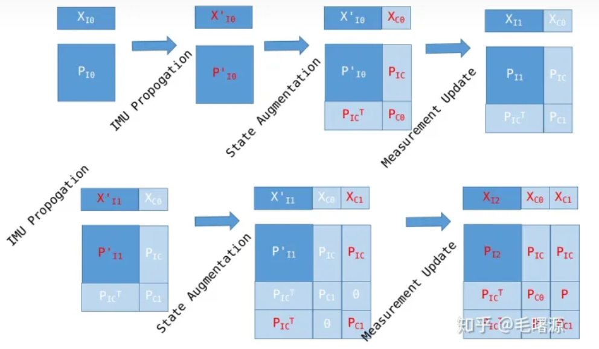

传统EKF-SLAM，keyframe-based SLAM 和MSCKF比较

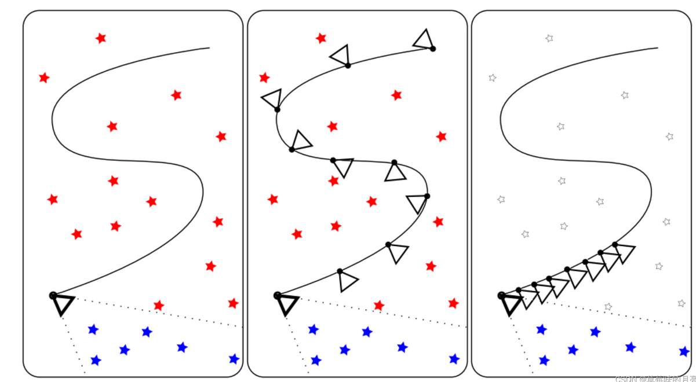

左边代表的是传统EKF-SLAM, 红色五角星是old feature,这个也是保存在状态向量中的,状态向量为**之前的所有特征点和最新的位姿**；

中间这张可以表示的是keyframe-based SLAM, 它会**保存稀疏的关键帧和它们之间相关联的地图点**;

最右边这张则可以代表MSCKF的一个基本结构, MSCKF中老的地图点和滑窗之外的相机姿态是被丢弃的, 它只存了滑窗内部的相机姿态和它们共享的地图点.

# MSCKF-MONO公式推导

按照FAST-LIO系统状态量的顺序$\tilde X_k=[\tilde \theta \quad \tilde p \quad\tilde v \quad\tilde b_g \quad\tilde b_a \quad\tilde g]$

这里我们也考虑将camera和IMU之间的外参加入状态量:
$$
\tilde X_k=[\tilde \theta \quad \tilde p \quad\tilde v \quad\tilde b_g \quad\tilde b_a \quad\tilde g \quad {_C^I}\tilde\theta\quad {^I}\tilde p_C^T]
$$

## IMU惯性解算

状态转移公式：
$$
\mathbf{F}_{\widetilde{\mathbf{x}}}=\left[\begin{array}{cccccc}
\operatorname{Exp}\left(-\widehat{\boldsymbol{\omega}}_{i} \Delta t\right) & \mathbf{0} & \mathbf{0} & -\mathbf{A}\left(\widehat{\boldsymbol{\omega}}_{i} \Delta t\right)^{T} \Delta t & \mathbf{0} & \mathbf{0} & \mathbf{0} & \mathbf{0}\\
\mathbf{0} & \mathbf{I} &\mathbf{I} \Delta t & \mathbf{0} & \mathbf{0} & \mathbf{0} & \mathbf{0} & \mathbf{0}\\
-{ }^{G} \widehat{\mathbf{R}}_{I_{i}}\left\lfloor\widehat{\mathbf{a}}_{i}\right\rfloor_{\wedge} \Delta t & \mathbf{0} & \mathbf{I} & \mathbf{0} & -{ }^{G} \widehat{\mathbf{R}}_{I_{i}} \Delta t & \mathbf{I} \Delta t & \mathbf{0} & \mathbf{0}\\
\mathbf{0} & \mathbf{0} & \mathbf{0} & \mathbf{I} & \mathbf{0} & \mathbf{0} & \mathbf{0} & \mathbf{0}\\
\mathbf{0} & \mathbf{0} & \mathbf{0} & \mathbf{0} & \mathbf{I} & \mathbf{0} & \mathbf{0} & \mathbf{0}\\
\mathbf{0} & \mathbf{0} & \mathbf{0} & \mathbf{0} & \mathbf{0} & \mathbf{I}& \mathbf{0} & \mathbf{0}\\
\mathbf{0} & \mathbf{0} & \mathbf{0} & \mathbf{0} & \mathbf{0} & \mathbf{0}& \mathbf{I} & \mathbf{0}\\
\mathbf{0} & \mathbf{0} & \mathbf{0} & \mathbf{0} & \mathbf{0} & \mathbf{0}& \mathbf{0} & \mathbf{I}
\end{array}\right]
$$
噪声模型：
$$
\mathbf{F}_{\mathbf{w}}=\left[\begin{array}{cccc}
\mathbf{A}\left(\widehat{\boldsymbol{\omega}}_{i} \Delta t\right)^{T} \Delta t & \mathbf{0} & \mathbf{0} & \mathbf{0}  & \mathbf{0}& \mathbf{0}\\
\mathbf{0} & \mathbf{0} & \mathbf{0} & \mathbf{0}  & \mathbf{0}& \mathbf{0}\\
\mathbf{0} & -{ }^{G} \widehat{\mathbf{R}}_{I_{i}} \Delta t & \mathbf{0} & \mathbf{0}  & \mathbf{0}& \mathbf{0}\\
\mathbf{0} & \mathbf{0} & \mathbf{I} \Delta t & \mathbf{0}  & \mathbf{0}& \mathbf{0}\\
\mathbf{0} & \mathbf{0} & \mathbf{0} & \mathbf{I} \Delta t  & \mathbf{0}& \mathbf{0}\\
\mathbf{0} & \mathbf{0} & \mathbf{0} & \mathbf{0} & \mathbf{0}& \mathbf{0}\\
\mathbf{0} & \mathbf{0} & \mathbf{0} & \mathbf{0} & \mathbf{0}& \mathbf{0}\\
\mathbf{0} & \mathbf{0} & \mathbf{0} & \mathbf{0} & \mathbf{0}& \mathbf{0}\\
\end{array}\right]
$$

## 状态扩增

每来一帧图像后，先根据IMU Propogation对IMU状态进行预测，然后根据相机外参计算当前帧的相机位姿，将最新相机状态加入到状态向量中并扩展协方差矩阵，这就是状态扩增（State Augmentation）。

根据预测的当前IMU位姿${_G^I}\hat q$，${^G}\hat p_I$以及相机外参 ${_I^C} q$，${^I} p_C$来计算当前相机的位姿：

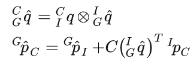

现需要对协方差矩阵进行扩增

注：第一个式子是关于相机旋转的，**只与IMU两个变量有关**，故有两个相应的雅可比，其余的为零。

第二个式子关于相机平移，**只与三个IMU状态量有关**，故有三个相应的雅可比，其余的为零。

雅可比矩阵是求新增相机状态分别对IMU状态量和老的相机状态的雅可比==(这里修改为3×24维)==

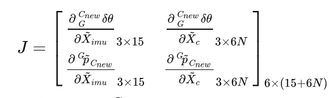

根据误差卡尔曼滤波

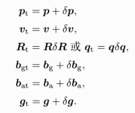

对于位置量，我们有$x=\hat x +\tilde x$ 对于旋转量，我们有$R=\delta x \cdot \hat x=(I-\lfloor\delta\theta_\times\rfloor)\cdot\hat R$

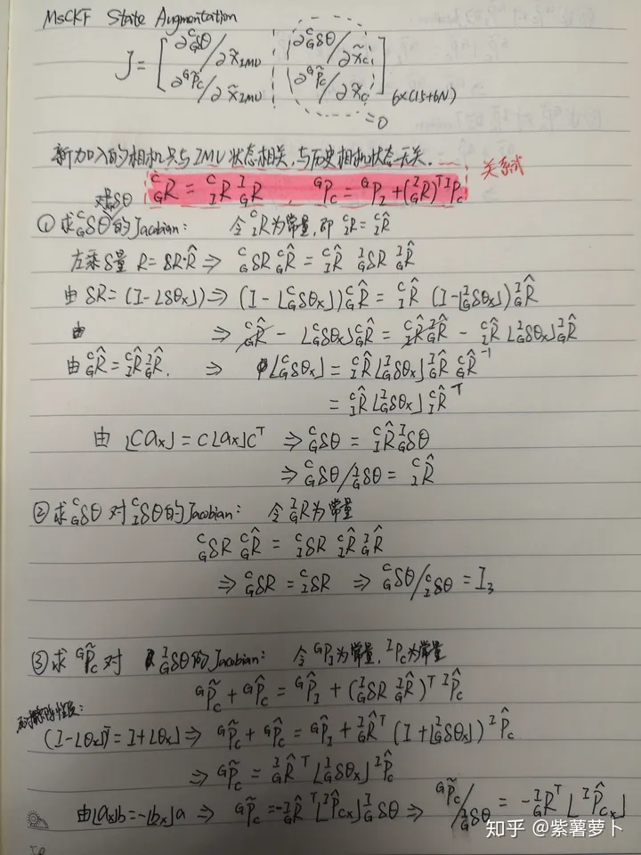

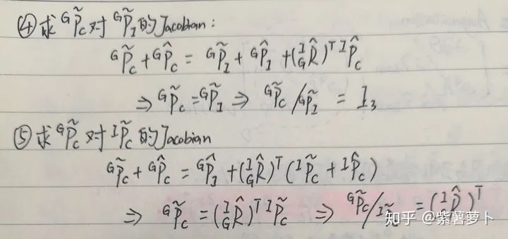

求导思路：根据IMU位姿转Camera位姿的关系式，对IMU状态中的相关量求导，根据对应关系对位置量和旋转量进行展开，等式两边相约得到误差量的关系式，然后根据叉乘的性质进行等式变形，最终得到Jacobian。
 **注意** **的左乘和右乘，这里所有推导用的左乘，而MSCKF的原论文中用的是右乘，所以推导出来的Jacobian会不一样。**

以左乘的形式举例：

已知相机公式：${_G^C}R={_I^C}R\cdot{_G^I}R$      ${^G}p_C={^G}p_I+({_G^I}R)^T{^I}p_c$

①求${_G^C}\delta \theta$对${_G^I}\delta \theta$的雅可比，我们认为此时相机的旋转外参${_I^C}R$是常量，定义为${_I^C}\hat R$

将$=\delta R\cdot \hat R$带入到相机公式中（其中$\delta R$是误差量，$\hat R$是带噪声的名义状态量，$R_t$是真值）
$$
{_G^C}\delta R\cdot {_G^C}\hat R={_I^C}\hat R\cdot  {_G^I}\delta R\cdot{_G^I}\hat R\\
将\delta R=(I-\lfloor \theta_\times\rfloor)带入上式\\
(I-\lfloor {_G^C}\delta\theta_\times\rfloor)\cdot {_G^C}\hat R={_I^C}\hat R\cdot {_G^I}\hat R-{_I^C}\hat R\lfloor {_G^I}\delta\theta_\times\rfloor){_G^I}\hat R\\
\lfloor {_G^I}\delta\theta_\times\rfloor={_I^C}\hat R\lfloor {_G^I}\delta\theta_\times\rfloor){_G^I}\hat R\cdot{_G^C}\hat R^{-1}={_I^C}\hat R\lfloor {_G^I}\delta\theta_\times\rfloor){_I^C}\hat R^T\\
由\lfloor ca_\times\rfloor=c\lfloor a_\times\rfloor c^T\\
{_G^C}\delta\theta={_I^C}\hat R\cdot{_G^I}\delta\theta\\
故\frac{{_G^C}\delta\theta}{{_G^I}\delta\theta}={_I^C}\hat R
$$

==下面是用到的相关的叉乘性质：==
$$
\lfloor ca_\times\rfloor=c\lfloor a_\times\rfloor c^T\\
(I-\lfloor \theta_\times\rfloor)^T=(I+\lfloor \theta_\times\rfloor)\\
\lfloor a_\times\rfloor b=-\lfloor b_\times\rfloor a
$$
我们将上述的式子按照FAST-LIO的变量进行排列，得到最终的$J$
$$
J=\begin{pmatrix}
{_I^C}R & 0_{3\times15} & I_{3\times3} & 0_{3\times3} & 0_{3\times6N}\\
-{_G^I}R^T\lfloor {^I}p_{C\times}\rfloor & I_{3\times3} & 0_{3\times15} & {_G^I}R^T &  0_{3\times6N}

\end{pmatrix}
$$
计算出雅可比矩阵后对协方差进行扩增：

**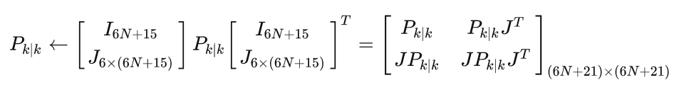**

## **相机状态维护**

相机状态扩增

- 扩增时机：IMU Propagation之后，Measurement Update之前。
- 扩增条件：每一帧新的图像观测都进行相机状态扩增。
- 扩增操作：计算最新相机状态并插入到状态向量中；扩展新状态的自身协方差以及与原状态向量的关联协方差。

相机状态移除

- 移除时机：Measurement Update之后
- 移除条件：当相机状态个数超过最大限制$N$时移除。正常是移除最老的相机状态，但当相机运动较小时也可以移除最近的相机状态。

移除操作：将待移除相机状态从状态向量中删除；删除协方差中对应的行和列。

## 状态扩增的意义

MSCKF中，IMU Propagation只改变IMU状态向量和其对应的协方差，与相机无关；而Measurement  Updata的观测模型是残差相对于相机状态的观测模型，**与IMU状态没有直接关联**。==状态扩增就相当于相机和IMU状态之间的桥梁，通过关联协方差$P_{IC}$描述相机和IMU状态之间的关系，每一个相机状态都与IMU状态形成关联，这样在观测更新相机状态的同时，会间接更新IMU状态。==

# 观测更新（Measurement Update）

MSCKF观测更新的原理：一个静止的特征点被多个相机位姿观测到，从而对观测到该特征点的多个相机产生约束（即多个相机对该特征点的观测射线应该汇聚在一点）。MSCKF以此为出发点，先根据多个观测三角化特征点的空间坐标，然后定义特征点到各相机的重投影误差（残差 ）作为观测量，并推导残差与状态向量之间的线性化关系，即残差观测模型。
$$
r=H\tilde X+n
$$
其中$H$为残差对误差状态向量$\tilde X$的Jacobian， $n$为特征的高斯白噪声，最后，直接套用EKF公式对状态向量和协方差进行更新。

## 特征点三角化

特征点三角化保持当前Sliding Windows中的相机位姿不变，根据特征点在多个相机中的观测，利用最小二乘优化估计特征点的3D坐标，为了提高数值计算的稳定性，特征点坐标采用逆深度来表示。设特征点在相机坐标系下的坐标为 $[x_C,y_c,z_C]^T$，其逆深度表示为 $[\alpha,\beta,\rho]=[\frac{x_C}{z_C},\frac{y_C}{z_C},\frac{1}{z_C}]^T$。对特征点 $f_i$，选取$C_n$为参照器，根据相机之间的相对位姿关系可以转到其他相机坐标系：

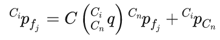

将逆深度表示带入：

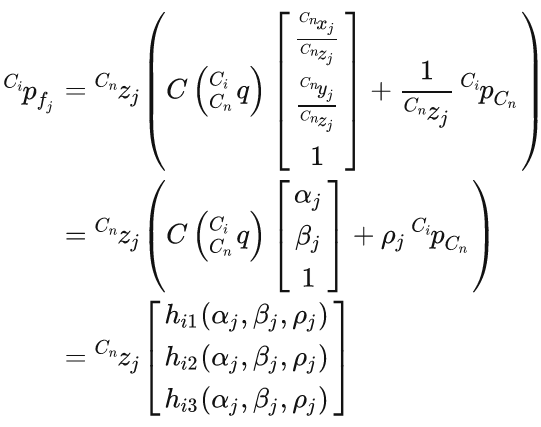

上式的逆深度表示实际上就是特征点p在$C_i$系下的三维坐标，我们根据外参将其转换到像素坐标系：
$$
\begin{pmatrix}
u\\v\\1
\end{pmatrix}
=\frac{1}{Z}K
\begin{pmatrix}
X\\Y\\Z
\end{pmatrix}
$$
这里我们假设相机内参为单位阵$I$。

${^{C_i}}p_{f_j}$投影相机$C_i$中的观测为(**注意：这里忽略的相机内参，默认观测是在相机的Normalize平面**)：

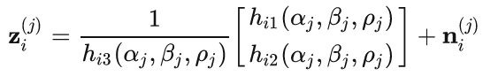

这里的z表示投影到像素平面的观测值，是2维的。假设$f_j$在$C_1,...C_n$相机下的观测分别为$z^{(j)}_1,...,z^{(j)}_n$，则最小二乘优化问题为：
$$
\min \frac{1}{2}\sum^{n}_{i=1}||e_i(\alpha_j,\beta_j,\rho_j)||^2=\min\frac{1}
{2}\sum^{n}_{i=1}||z^{(j)}_i-\hat z^{(j)}_i||^2
$$
推导误差对优化参数的Jacobian如下：

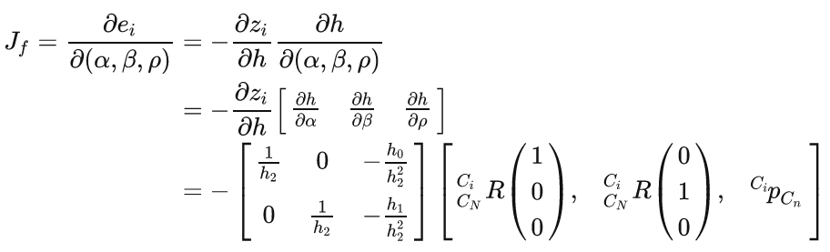

推导出Jacobian后，可以通过Gauss-Newton法或Levenberg-Marquardt法进行最小二乘求解$(\hat \alpha_j,\hat\beta_j,\hat\rho_j)$ ，最后得到世界坐标系下特征点坐标：

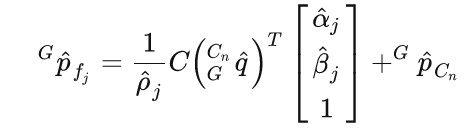

## 观测模型

MSCKF中的观测是根据特征进行聚集，即每个特征点保存所有观测相机及对应观测。单个特征点对单个相机有一个残差模型，残差定义为:

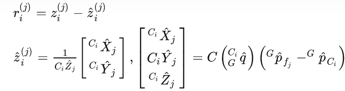

其中$z^{(j)}_i$为特征$f_j$在相机$C_i$的观测值，$\hat z^{(j)}_i$为特征$f_j$在相机$C_i$的2D投影。将所有观测到该特征点的相机的残差模型聚集起来后，再将所有特征点的观测模型合并得到完整的观测模型。

### 单个特征点对单个相机的观测模型

对残差进行线性化，得到线性模型：

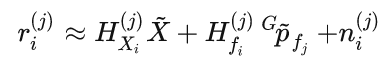

其中，$H^{(j)}_{X_i}$ ，$H^{(j)}_{f_i}$ 分别是残差$r^{(j)}_i$ 对状态向量和特征点的Jacobian，计算公式如下：

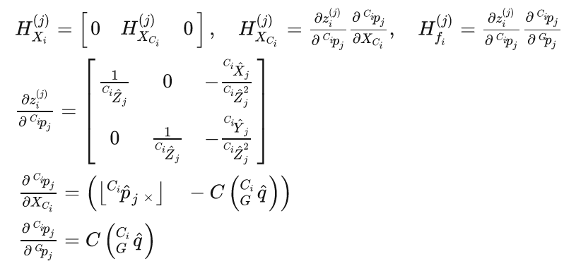

Jacobian推导：

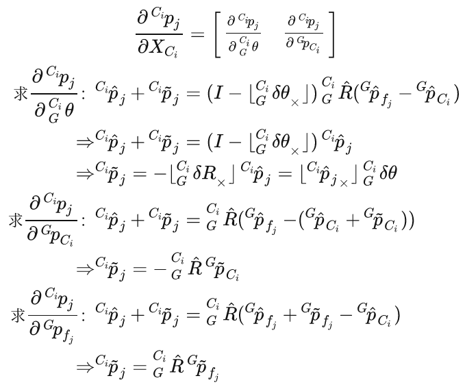
