# 特征跟踪

前端特征跟踪主要在**img_callback**中实现，首先对读进来的图片进行预处理，包括**时间戳检查**，**控制发布频率**。之后开始对图像进行处理，最后将提取的特征点发布出去。

其中最重要的部分是图像的处理部分，这部分主要定义了一个类：

```c++
class FeatureTracker{
public:
    FeatureTracker();
  ☆ void readImage(const cv::Mat &_img,double _cur_time); 
    void setMask();
    void addPoints();
    bool updateID(unsigned int i);
    void readIntrinsicParameter(const string &calib_file);
    void showUndistortion(const string &name);
    void rejectWithF();
    void undistortedPoints();
    
//对应帧图像，这个以时间来论，forw>cur>prev，即forw最新
     cv::Mat prev_img, cur_img, forw_img;
//向量，其中每个元素都是通过特征提取获得的特征点（而其余特征都是通过光流得到的）
  ☆  vector<cv::Point2f> n_pts;
//对应图像帧中的特征点    
  ☆  vector<cv::Point2f> prev_pts, cur_pts, forw_pts;
//归一化相机坐标系下的坐标
  ☆  vector<cv::Point2f> prev_un_pts, cur_un_pts;
  ☆  vector<int> ids;//被追踪到的特征点的ID
  ☆  vector<int> track_cnt;//每个特征点被追踪到的次数
   ...
}
```

这里只列举出最重要的几个变量(☆)号

## 图像处理

在回调函数img_callback()中实例化了出了FeatureTracker的类对象trackerData并调用图像读取函数，对每一帧图像进行处理：

```c++
//readImage这个函数需要传两个参数：当前帧的图像和当前帧的时间戳
trackerData[i].readImage(ptr->image.rowRange(ROW * i, ROW * (i + 1)), img_msg->header.stamp.toSec()); 
```

在readImage()函数中实现了绝大多数的操作

# VINS-MONO初始化

## 外参标定

当旋转外参$q_b^c$未知的时候，会首先标定旋转外参，这部分在整个系统初始化开始之前进行，原理比较简单，相当于对两条路径做差求解。

根据几何关系有如下等式存在：

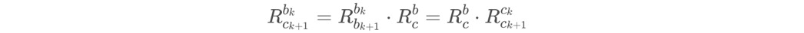

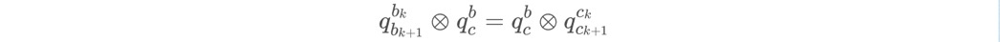

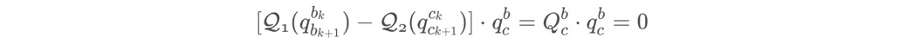

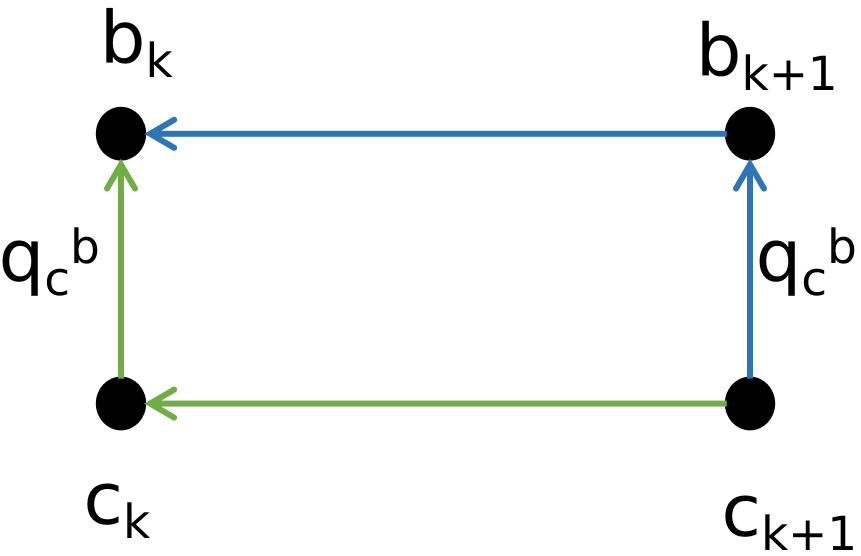

根据上图，作解释：从第$c_{k+1}$帧出发可以走蓝色的路线，也就是先乘c到b系的旋转矩阵，然后乘$q_{b_{k+1}}^{b_k}$，相当于从$c_{k+1}$转到$b_{k}$的旋转，同理，可以从第$c_{k+1}$帧出发走绿色的路线，先乘$q_{c_{k+1}}^{c_k}$，再乘外参。这里用旋转矩阵表示与四元数表示都是相同的。

注意第一行公式，下标都是==从下往上看==，有的时候可能会对左乘旋转矩阵还是右乘旋转矩阵的意义搞不清楚，这里实际上在学习b站《线性代数的本质》课程的时候说过，旋转矩阵执行的空间变换是==从右往左执行的==。

将多个帧之间的等式关系一起构建超定方程Ax=0。对A进行svd分解，其中最小奇异值对应的奇异向量便为需要求解的qbc。

##利用SfM确定各个pose和特征点的相对于c0帧的位置关系

这一部分和基于图像的三维重建比较像，可以用三角化和PnP把这一串的ck帧的位姿和特征点位置确定下来(特征点是伪深度)，在加上外参数$q_{b}^{c}$和$p_{b}^{c}$，一系列$b_k$帧的位姿也确定下来。注意，这里把$c_0$帧作为基础帧，实际上，$c_0$帧旋转一下使$g_{c_0}$和$g_w$方向一致时获得的坐标系就是vins的世界坐标系，也就是先验。在vins代码中，这一部分篇幅很长，但是这一部分也是很重要的部分。
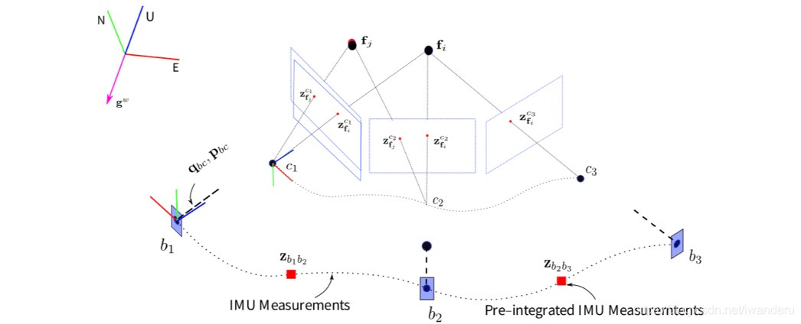

首先我们先推导论文式(14)，所有帧的位姿(Rc0ck,qc0ck)表示相对于第一帧相机坐标系(·)c0。相机到IMU的外参为(Rbc,qbc)，得到姿态从相机坐标系转换到IMU坐标系的关系。

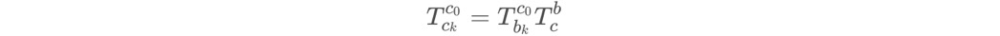

 将T展开有成R与p有：

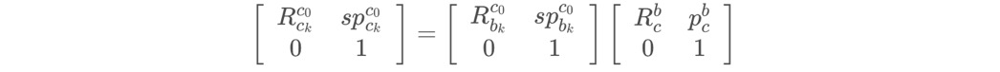

 左侧矩阵的两项写开：

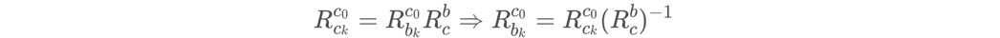

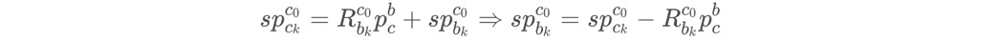

## 利用相机旋转约束标定IMU角速度bias

**求解的目标函数如下公式所示**

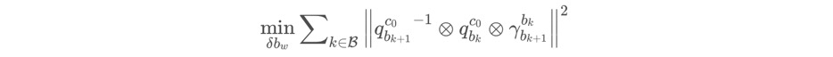

在SfM完成且外参数标定完之后，头两个值是已知的了，而且我们假设头两个值是准的。理想状态下，这三个数乘积应该是单位四元数，很可惜，第三个值是IMU预积分得到的，而预积分里面是有bias的。所以，通过最小化这个目标函数的，可以把旋转bias标定出来！
在IMU预积分部分，也就是4.1.1最后的那个公式，有：
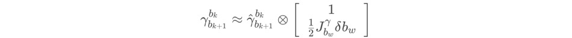

 带入到损失函数里，可以得到：

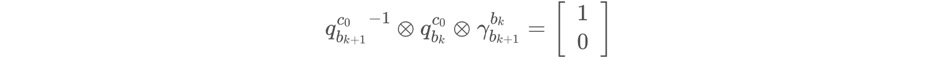

 或者是：

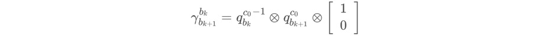

 带入bias的残差后，得到，

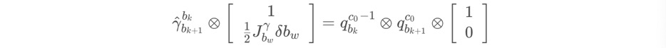

 实部没有需要标定的量，所以只用考虑虚部，也就是：
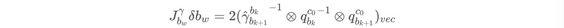

 两侧再乘以 ，可以构造出Ax=B的形式，在采用LDLT分解，就可以求出状态量：


其实这里不像那种用高斯牛顿法迭求解，而更像是用直接法,也就是矩阵运算的方式来求待优化的状态量，6.1.4也是一样的思路。代具体代码见:initial_aligment.cpp 函数 solveGyroscopeBias()。