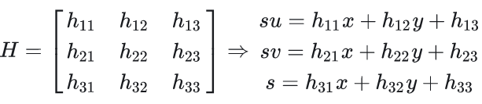

# 关于视觉SLAM位姿变换的一些理解

## R和t下标的定义

对于空间中的某点$p$，其在坐标系1和坐标系2中的投影分别是$p_1$和$p_2$,那么三者有如下的关系：
$$
p_2 = R_{21}p_1+t_{21}
$$
注意这里的下标是**从右往左读**的，表示从坐标系1到坐标系2的旋转和平移。这里需要着重说明$t_{21}$，它的方向是从坐标系2指向坐标系1的向量。具体原因和向量的减法有关。

由上面的式子，$p_2 = R_{21}p_1+t_{21}$，如果先不考虑旋转，那么可以写成：$b = a + c$

那么$c=b-a$，根据向量的减法可以判断出c的方向是从坐标系2指向坐标系1的。

+ 注：

其实主要是要理解透彻在SLAM中的R和t是如何定义的，**R和t不是表示两个坐标系的变换，而是表示坐标系下的某点的变换关系**

以上述例子举例，坐标系1到坐标系2的R和t表示的是在坐标系2下的某点通过R和t转换到坐标系1中的坐标。而对于坐标系的转换：

$[R,t]$ 表示从坐标系2到坐标系1的转换。
$[R^T,-R^Tt]$表示从坐标系1到坐标系2的转换。

# 一些其他的重要的知识

## 协方差和散度矩阵

样本均值：
$$
\overline x=\frac{1}{n}\sum^N_{i=1}x_i
$$
样本方差：
$$
S^2=\frac{1}{n-1}\sum^n_{i=1}(x_i-\overline x)^2
$$
样本X和Y的协方差：

散度矩阵和协方差矩阵的意义差不多，散度矩阵前乘以系数1/(n-1)就可以得到协方差矩阵了。

### 协方差矩阵的性质

（1）协方差矩阵是一个对称矩阵，且是**半正定矩阵**，**主对角线是各个随机变量 的方差（各个维度上的方差）**。

（2）标准差和方差一般是用来描述一维数据的；对于多维情况，而协方差是用于描述任意两维数据之间的关系，一般用协方差矩阵来表示。==因此协方差矩阵计算的是不同维度之间的协方差，而不是不同样本之间的==。

（3）协方差计算过程可简述为：先求各个分量的均值E(Xi)和E(Xj)，然后每个分量减去各自的均值得到两条向量，在进行内积运算，然后求内积后的总和，最后把总和除以n-1。

### 协方差矩阵的意义：

总结：

(1)样本均值决定**样本分布中心点的位置**。

(2)协方差矩阵决定**样本分布的扁圆程度**。

   是扁还是圆，由协方差矩阵的**特征值**决定：当特征值D1和D2的比值为1时（D1/D2=1），则样本分布形状为圆形。当特征值的比值不为1时，样本分布为扁形；

   偏向方向（数据传播方向）由**特征向量**决定。==最大特征值对应的特征向量，总是指向数据最大方差的方向（椭圆形的主轴方向）。次大特征向量总是正交于最大特征向量（椭圆形的短轴方向）。==

## X点法总结

### 二点法P2P

是一种4Dof的PnP算法，常用在特征点剔除中剔除外点，也可以用来估计平移量。通常PnP至少需要三组匹配对才能求解出R、t，但如果旋转R已知(陀螺积分)，则只需要两个点就可以求出平移向量。

### 三点法

+ 3D-3D位姿匹配，ICP
  + 匹配点中心化（减去点的均值）
  + 求最优旋转矩阵$R$​ ：
  + 求最优平移向量$t$:$t=\mu _p-R\mu_q$ ： 

+ P3P

P3P是求解6DoF PnP用到匹配点数最少的算法，只需要3对匹配点就能恢复出 ，但**需要额外一对验证点**，用来从多个可行解中选择符合正确的那一组解。所以本质上还是需要4对点，只是有1对点不参与求解。

求解方法：根据余弦定理

### 四点法

+ 求解单应矩阵

Homography本质是求解3D到2D的变换，只是它假设3D点都在同一面上，所以简化成了平面到平面的变换。

将$s$代入前两行，得到

令$h=[h_{11}， h_{12}，h_{13}，h_{21}，h_{22}，h_{23}，h_{31}，h_{32}，h_{33}]^T$，则上面两个等式整理为：

共有9个未知数，按理需要5对点才能求解出H，但是考虑到$H$包含尺度因子（ $H$和 $kH$等价），令 $h_{33}$，则只需要4对点（8个方程）即可求解出 。

+ Epnp

EPnP在世界系中选取4个点（称之为控制点，论文中取的3D点中心加PCA3个单位向量的点），将世界坐标系中所有点表示成控制点的加权，如下：

(未完待续)

### 五点法 

求解本质矩阵

### 六点法

使用直接线性变换(DLT)求解PNP

### 七点法

求解基础矩阵(一般不用)，求一元三次方程解出$\lambda$从而得到唯一解 $F$。 $\lambda$的解的个数可能为1或3，如果有多个解，需要引入额外的验证点来选取唯一的正确解。

### 八点法

求解基础矩阵或单应矩阵都可以。

### 总结

