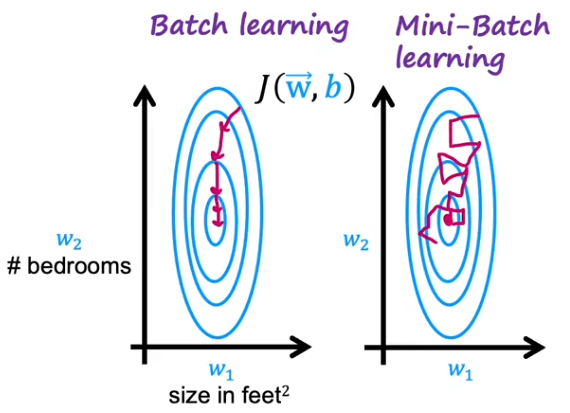

#强化学习的基本概念

**强化学习的过程**

强化学习循环输出state,action和reward的序列,agent的目的是==最大化预计累计奖励(==expected
cumulative reward)

**奖励假设函数的核心思想**
$$
G_t=R_{t+1}+\gamma R_{t+2}+\gamma^2R_{t+3}
$$
简单来说,每个奖励将通过伽玛的时间步长指数倍进行折扣。随着时间步长的增加,未来的奖励的获得越来越不可能发生。

**两种学习方式：**

+ 在剧集结束时收集奖励,然后计算最大预期未来奖励: *蒙特卡洛方法*

  + 当episode结束时(智能体达到“终端状态”,Agent 会查看总累积奖励,看看它的表现如何。在
    蒙特卡洛方法中,==奖励仅在比赛结束时收到==。

    $V(S_t)\leftarrow V(S_t)+\alpha [G_t-V(S_t)]$

+ 估算每一步的奖励: *时序差分方法*

  + TD学习不会等到剧集结束时更新最大预期未来奖励估计:它将更新其在该经历中发生的非最终状
    态$S_t$的价值估计V.
    该方法称为TD(0) 或一步TD(在任何单个步骤之后更新值函数)。

    $V(S_t)\leftarrow V(S_t)+\alpha [R_{t+1}+\gamma V(S_{t+1})-V(S_t)]$
    

**勘探/开发平衡(exploation and exploitation)**

+ 勘探是寻找有关环境的更多信息。
+ 开发是利用已知信息来最大化奖励。

==（两者从本质上来说是矛盾的）==

# 强化学习的三种方法

## 基于数值

目标是价值函数V(s)。

价值函数是一个函数,表明agent在**每个状态获得的最大预期未来奖励**。

每个状态的数值是以该状态为起始点,agent在**未来积累的奖励总额的期望**。

## 基于策略

我们希望在不使用值函数的情况下直接优化策略函数 π(s)。

即 action=policy(state)

两种策略类型：

+ 确定性:给定状态下的策略将**始终返回相同的操作**。
+ 随机:输出行动上的分别概率

## 基于模型

在基于模型的 RL 中,我们对环境进行建模。这意味着我们创建了一个环境行为的模型。
问题是每个环境都需要不同的模型表示。

## Q-learning

Q-Learning 是一种基于数值的强化学习算法。

Q表：计算每种状态state下采取的每种行动action的最大的未来预期奖励。多亏了这个策略,我们将知道对每种状态采取的最佳行动是什么。Q表相当于一个备忘录,记录下每种状态下执行各个动作的奖励值

# 贝尔曼方程

$$
Q(s,a)=Q(s,a)+\alpha [R(s)+\gamma \max\limits_{a'}Q(s',a')-Q(s,a)]
$$

$Q(s,a)$表示如果从状态s开始，采取了a的行动，并且之后也是**最优行动**的情况下获得的价值、$\gamma$是折扣函数、$R(s)$是当前状态能获得的奖励 (即时奖励)

## 一些更好的策略

### $\epsilon$-greedy 策略

### mini-batch

作用：加快神经网络的收敛速度

思想：对于一个十分大的数据集$m$，每次只选择一部分数据$m_1,m_2,m_3...$避免梯度下降等算法每一次都需要计算所有的梯度。

mini-batch的每一次更新不一定都会朝着代价函数减小的方向，但是总体下来的速度一定比原始的方法快。

### update soft

作用：为了避免更新Q函数时，将一个表现的更糟糕的$Q_{new}$覆盖掉之前的Q，soft update 可以让你逐步更新Q，你可以选择更新的速度，如：
$$
w=0.01w_{new}+0.99w\\
b=0.01b_{new}+0.99b
$$
这表示每一次更新取老的参数的99%加上新参数的1%

使用soft update 可以使强化学习算法更可靠地收敛，降低了强化学习算法振荡或不收敛或其他不良性质