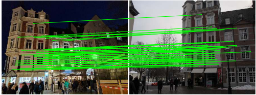
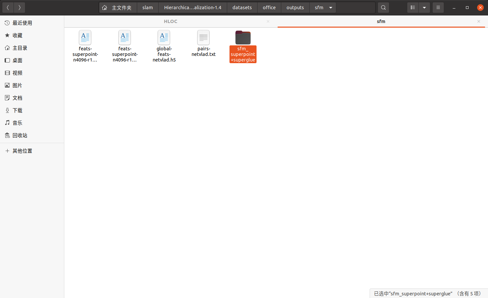
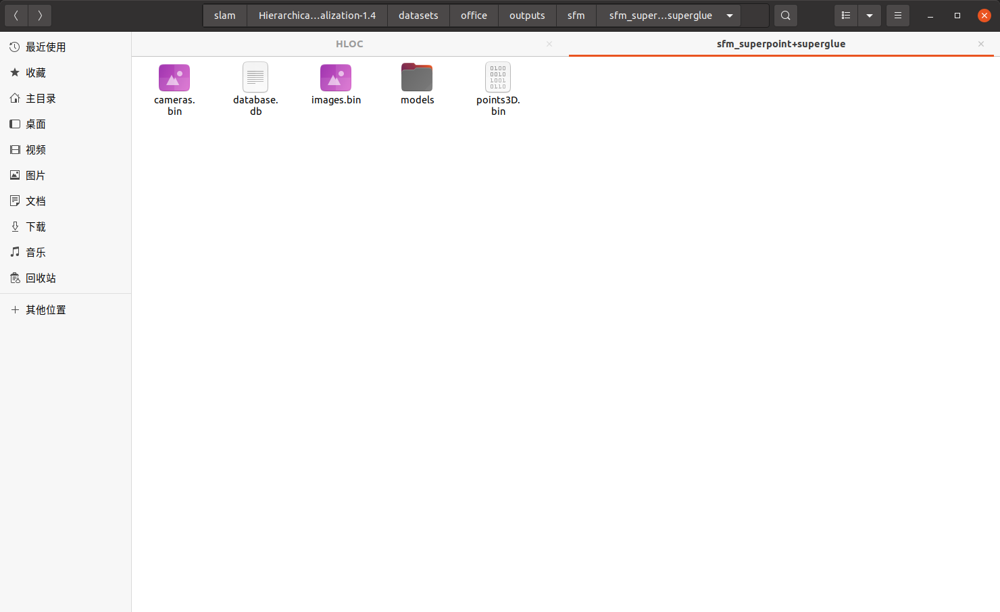
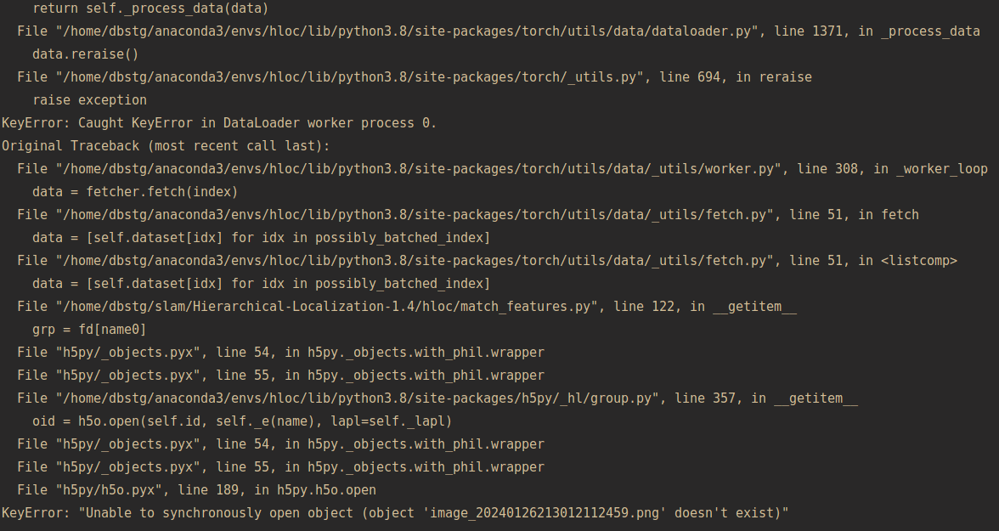
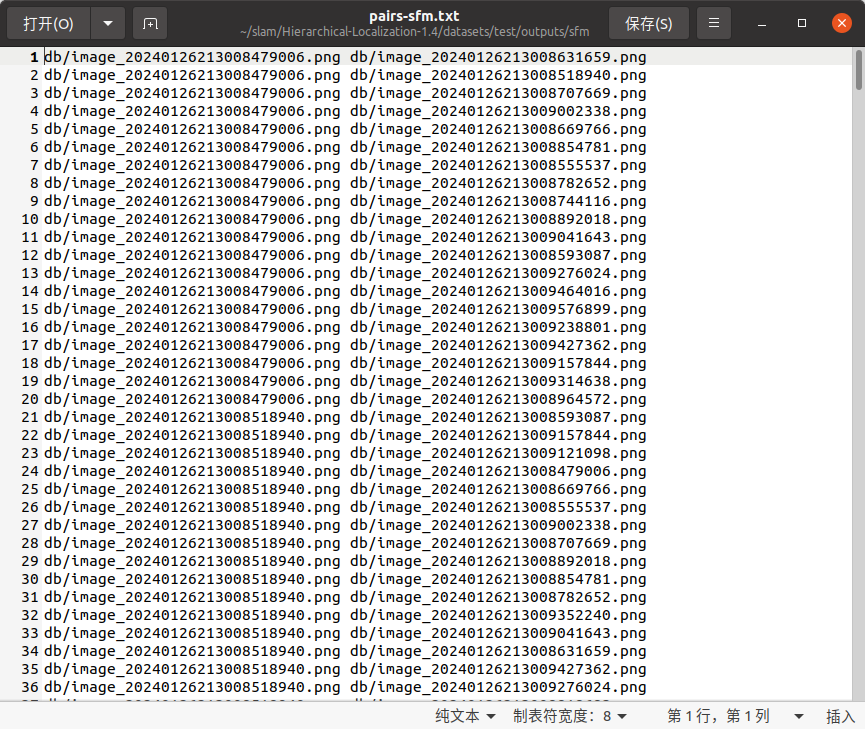

# HLOC使用流程

什么是match？什么是pair？

对于两幅已经匹配上的图片来说，叫做一个pair，如下图，而对于描述子匹配的过程来说，叫做match



## sfm重建

首先使用工程中的sfm.py进行colmap重建，得到一个预先的colmap模型。

程序输入：mapping images

程序输出：三个h5文件，一个netvlad匹配文件(txt)，还有一个文件夹：sfm_superpoint+superglude



sfm_superpoint+superglude文件夹内的内容如下：



## HLOC重要函数介绍

### 提取特征点 extract_features

extract_features的主函数参数如下：

```python
def main(conf: Dict, # 通过外面设置，具体是需要选择相应的模型，如netvlad，superpoint等
         image_dir: Path, # 输入图像的路径
        + export_dir: Optional[Path] = None, # +结果的输出路径
         as_half: bool = True,
         image_list: Optional[Union[Path, List[str]]] = None,
         feature_path: Optional[Path] = None, # + 输出
         overwrite: bool = False) -> Path:
    logger.info('Extracting local features with configuration:'
                f'\n{pprint.pformat(conf)}')
```

对于main函数，有一些默认的参数：

```python
    parser = argparse.ArgumentParser()
    parser.add_argument('--image_dir', type=Path, required=True)
    parser.add_argument('--export_dir', type=Path, required=True)
    parser.add_argument('--conf', type=str, default='superpoint_aachen',
                        choices=list(confs.keys()))
    parser.add_argument('--as_half', action='store_true')
    parser.add_argument('--image_list', type=Path)
    parser.add_argument('--feature_path', type=Path)
    args = parser.parse_args()
    main(confs[args.conf], args.image_dir, args.export_dir, args.as_half)
```

特征点提取函数可以指定image_list，也就是读取图片所在的文件目录，保存为一个txt文件。如下：

```
db/9.jpg
db/22.jpg
db/6.jpg
db/4.jpg
....
```

这个文件保存了当前图片的名称以及其上级目录的名称。在extract_features中可以指定是否添加这样的图片路径，如果添加了，那么最终生成的h5文件前面就会增加一个Group，名称是图片上级目录的名称，如下：

未添加：

```
H5 File Structure:
Group: 1.jpg
  Dataset: descriptors
  Dataset: image_size
  Dataset: keypoints
  Dataset: scores
Group: 10.jpg
  Dataset: descriptors
  Dataset: image_size
  Dataset: keypoints
  Dataset: scores
```

添加：

```
Group: db
  Group: 1.jpg
    Dataset: descriptors
    Dataset: image_size
    Dataset: keypoints
    Dataset: scores
  Group: 10.jpg
    Dataset: descriptors
    Dataset: image_size
    Dataset: keypoints
    Dataset: scores
```

如果所给的路径里面既有db文件夹也有query文件夹，那么生成的h5文件中的值就有两个大的group：一个是db一个是query

### 特征匹配 match_features

主函数参数如下：

```python
def main(conf: Dict, # 匹配模型
         pairs: Path,  #匹配对的路径
         features: Union[Path, str], # 特征点路径
        + export_dir: Optional[Path] = None, # 输出路径
         matches: Optional[Path] = None, # 输出的匹配结果(h5)
         features_ref: Optional[Path] = None, 
         overwrite: bool = False) -> Path:
```

默认传参：

```python
parser = argparse.ArgumentParser()
parser.add_argument('--pairs', type=Path, required=True)
parser.add_argument('--export_dir', type=Path)
parser.add_argument('--features', type=str,
                    default='feats-superpoint-n4096-r1024')
parser.add_argument('--matches', type=Path)
parser.add_argument('--conf', type=str, default='superglue',
                    choices=list(confs.keys()))
args = parser.parse_args()
main(confs[args.conf], args.pairs, args.features, args.export_dir)
```

注意：这里面的feature的内容最重要，为所有的查询的和建图的特征点的集合，也就是里面的结构既要包括"query/"，也要包括“db/”

成功匹配后，h5文件的内容如下：

```
H5 File Structure:
Group: query-00.jpg
  Group: db-12.jpg
    Dataset: matches0
    Dataset: matching_scores0
  Group: db-13.jpg
    Dataset: matches0
    Dataset: matching_scores0
  Group: db-14.jpg
    Dataset: matches0
    Dataset: matching_scores0
  Group: db-15.jpg
```

注意：每张匹配的图片下面有两个dataset，matches0和matching_scores0。这里面matches0和matching_scores0的维度是**一致的**，且都是一个**一维的数组**，其维度都是提取的**特征点的个数**，在config中设置为了1024，那么每个值都是1024维。

==具体matches0和matching_scores0的内容如下：==

+ matches0，一个N维的数组，数组维度是特征点的个数，**里面的每个值代表这个特征点与query图像中提取的特征点是否能match上**，如果不能，设为-1，如果可以，**设置为query图像match上的特征点的索引号**。

例：

db01.jpg: [-1,3,-1,-1,-1]  

也就是说，这里总共提取了5个特征点，db图像中只有第二个位置的值不是-1，代表db的第二个特征点与query中的第三个特征点有匹配关系

+ matching_scores0 一个N维的数组，每个值代表匹配的得分

### 场景识别

+ ==完全匹配  （pairs_from_exhaustive）==

main函数形参如下：

```py
def main(
       + output: Path, # 输出路径 ，sfm配对结果
        image_list: Optional[Union[Path, List[str]]] = None, #图片列表是参考数据还是查询数据
        features: Optional[Path] = None, # 特征点路径
        ref_list: Optional[Union[Path, List[str]]] = None,
        ref_features: Optional[Path] = None):
```

主函数：

```py
    parser = argparse.ArgumentParser()
    parser.add_argument('--output', required=True, type=Path)
    parser.add_argument('--image_list', type=Path)
    parser.add_argument('--features', type=Path)
    parser.add_argument('--ref_list', type=Path)
    parser.add_argument('--ref_features', type=Path)
    args = parser.parse_args()
    main(**args.__dict__)
```

+ ==从现有模型的共视图中配对 (pairs_from_covisibility)==

这种方法是需要先获得一个3D模型，可以参考Aachen数据集中的**3D Models**的内容，一般是COLMAP的结果

```py
def main(model, output, num_matched):
    logger.info('Reading the COLMAP model...')
```

model：sfm_sift模型的路径**(这个是可以从colmap_from_nvm中获得的，但是需要nvm的模型文件作为输入)**

+output：输出路径 （sfm_pairs）

num_matched：匹配的个数

+ ==从图像检索中获得配对（pairs_from_retrieval.py）==

mian函数的形参如下：

```python
def main(descriptors, output, num_matched,
         query_prefix=None, query_list=None,
         db_prefix=None, db_list=None, db_model=None, db_descriptors=None):
    logger.info('Extracting image pairs from a retrieval database.')
```

主要输入三个参数：

descriptors：描述子，主要是extract_features这个函数的返回值，是特征点的h5文件

+output：输出路径

num_matched：匹配的个数

主函数：

    parser = argparse.ArgumentParser()
    parser.add_argument('--descriptors', type=Path, required=True)
    parser.add_argument('--output', type=Path, required=True)
    parser.add_argument('--num_matched', type=int, required=True)
    parser.add_argument('--query_prefix', type=str, nargs='+')
    parser.add_ argument('--query_list', type=Path)
    parser.add_argument('--db_prefix', type=str, nargs='+')
    parser.add_argument('--db_list', type=Path)
    parser.add_argument('--db_model', type=Path)
    parser.add_argument('--db_descriptors', type=Path)
    args = parser.parse_args()
    main(**args.__dict__)

### 三角化/场景重建

如果我们事先有一个sfm的模型，那么我们可以直接进行三角化，不需要再花时间重建，需要用到triangulation这个库。如果没有事先的sfm模型，则需要用reconstruction这个库重建。

triangulation函数参数如下：

```python
def main(sfm_dir: Path, # + sfm模型的路径,新构建的
         reference_model: Path, # 参考模型的路径
         image_dir: Path, # mapping图片的路径
         pairs: Path, # 匹配对路径
         features: Path, # 特征点路径
         matches: Path, # 匹配信息路径
         skip_geometric_verification: bool = False,
         estimate_two_view_geometries: bool = False,
         min_match_score: Optional[float] = None,
         verbose: bool = False,
         mapper_options: Optional[Dict[str, Any]] = None,
         ) -> pycolmap.Reconstruction:
```

函数返回值： reconstruction，函数的形参中没有输出路径！

reconstruction模块的参数如下：

```py
def main(sfm_dir: Path,  # +输出 sfm的输出结果
         image_dir: Path,# sfm重建图片数据集
         pairs: Path, # 从场景识别中获得的pair结果
         features: Path, # 特征点 (h5数据结果)
         matches: Path,# h5 匹配结果
         camera_mode: pycolmap.CameraMode = pycolmap.CameraMode.AUTO,
         verbose: bool = False,
         skip_geometric_verification: bool = False,
         min_match_score: Optional[float] = None,
         image_list: Optional[List[str]] = None,
         image_options: Optional[Dict[str, Any]] = None,
         mapper_options: Optional[Dict[str, Any]] = None,
         ) -> pycolmap.Reconstruction:
```


### 定位 (localize_sfm)

```py
def main(reference_sfm: Union[Path, pycolmap.Reconstruction], # 三角化/重建出的模型
         queries: Path, # 图片的内参信息(txt)
         retrieval: Path, # 从场景识别中获得的匹配信息(sfm_pairs)
         features: Path, # 特征点
         matches: Path, # 匹配信息
         results: Path, # + 输出的结果（txt）
         ransac_thresh: int = 12,
         covisibility_clustering: bool = False,
         prepend_camera_name: bool = False,
         config: Dict = None):
```

```
    parser = argparse.ArgumentParser()
    parser.add_argument('--reference_sfm', type=Path, required=True)
    parser.add_argument('--queries', type=Path, required=True)
    parser.add_argument('--features', type=Path, required=True)
    parser.add_argument('--matches', type=Path, required=True)
    parser.add_argument('--retrieval', type=Path, required=True)
    parser.add_argument('--results', type=Path, required=True)
    parser.add_argument('--ransac_thresh', type=float, default=12.0)
    parser.add_argument('--covisibility_clustering', action='store_true')
    parser.add_argument('--prepend_camera_name', action='store_true')
    args = parser.parse_args()
    main(**args.__dict__)
```

#### 从一张图片中定位

```py
def pose_from_cluster(
        localizer: QueryLocalizer,
        qname: str,
        query_camera: pycolmap.Camera,
        db_ids: List[int],
        features_path: Path,
        matches_path: Path,
        **kwargs):
```

一个重要的类：

```py
class QueryLocalizer:
    def __init__(self, reconstruction, config=None):
        self.reconstruction = reconstruction
        self.config = config or {}

    def localize(self, points2D_all, points2D_idxs, points3D_id, query_camera):
        points2D = points2D_all[points2D_idxs]
        points3D = [self.reconstruction.points3D[j].xyz for j in points3D_id]
        ret = pycolmap.absolute_pose_estimation(
            points2D, points3D, query_camera,
            estimation_options=self.config.get('estimation', {}),
            refinement_options=self.config.get('refinement', {}),
        )
        return ret
```


## 如何使用我们自己的数据集？

+ 构建一个COLMAP参考模型，可以使用colmap_from_nvm这个库创建

+ 构建一个包含匹配图像的列表(==三种方法==)

  + 如果你的图像数据集小于100张，使用完全匹配的方法。[here](https://nbviewer.org/github/cvg/Hierarchical-Localization/blob/master/pipeline_SfM.ipynb#Exhaustive-matching)  (pairs_from_exhaustive)
  + 对于一个已经存在的3D模型，使用共视图：如果你还有3D点，可以使用hloc/pairs_from_covisibility.py的函数 (pairs_from_covisibility)
  + 使用图像检索，像NetVLAD这样的网络  (pairs_from_retrieval)

  对于图像检索，有如下note：

   hloc还通过hlo/extract_features.py为图像检索提供了一个接口。如前所述，只需向hloc/extractors/添加一个新接口即可。或者，您需要将全局描述符导出到HDF5文件中，其中每个键对应于图像相对于数据集根的相对路径，并包含一个大小为D的数据集全局描述符。然后，您可以使用hloc/pairs_from_retrieval.py导出图像对。

+ 运行三角化的库，细节见Aachen的pipeline。

## 问题记录：

### KeyError: "Unable to synchronously open object (object 'image_20240126213012112459.png' doesn't exist)"

sfm_matches = match_features.main(matcher_conf, sfm_pairs, features=features, matches=matches) 这行代码报错，找不到对应的图片。



这个问题是报的找不到相应的图片路径，实际上该图片是存在的，出现这个问题的原因是在使用COLMAP构建模型的时候，保存的几个3D模型(几个相应的bin文件)中的图片路径**不是实际的路径**，**因此需要对输出的配对文件修改**，详情见这个[issue](https://github.com/cvg/Hierarchical-Localization/issues/128)。

我的做法是，在使用pairs_from_covisibility.main()输出了sfm_pairs后，对输出的文件进行操作，把里面每个图片都添加上前缀"db/"，代码如下：

```py
# 增加db/前缀
with open(sfm_pairs, 'r') as infile, open(outputs / 'tmp.txt', 'w') as outfile:
    # 遍历原始文件的每一行
    for line in infile:
        # 分割行为单独的图片路径
        images = line.split()
        # 在每个图片路径前添加 "db/"
        new_images = ['db/' + img for img in images]
        # 将新的图片路径合并为一行，用空格分隔
        new_line = ' '.join(new_images)
        # 将新的行写入新文件
        outfile.write(new_line + '\n')
# 删除原始文件
os.remove(sfm_pairs)
# 将临时文件重命名为原始文件
os.rename(outputs / 'tmp.txt', sfm_pairs)
```

增加后的pairs-sfm如下：



此时可正常匹配