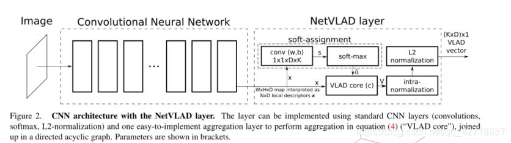

# NetVLAD 原理详解和推导

+ NetVLAD 是做什么用的？

`VLAD`算法作为`Image Retrival`领域的经典算法，被这篇论文做了扩展，让VLAD算法变成一个differentiable的算法，从而可以利用反向传播去更新优化算法中的参数，从而诞生了`NetVLAD`这个**pluggable to any CNN**的算法。

本论文focus on的领域是large scale visual place recognition（大尺度视觉地点识别），这类问题可以简单地理解为**同一个地点在不同时期、光照、照相设备等外部条件下的图像匹配问题**，与目前主流Geo-localization研究的Cross View Matching不一样，这里的图像匹配视角变换并没有ground-to-aerial这么大，个人感觉应该算是一个ground-to-ground匹配。

## SIFT（Scale-invariant feature transform）

在了解NetVLAD之前需要先了解VLAD算法，而了解VLAD算法之前又需要先了解SIFT算法。所以，博主先从SIFT算法开始介绍。SIFT算法是一种局部特征描述子(local feature discriptor)，其本质就是在不同的尺度空间（保证尺度不变性）上查找关键点，并计算出关键点的方向。

如下图所示，对于理解VLAD算法，其实只需要知道SIFT算法寻找到N个关键点并计算其方向之后，就能将一副图像转换为 $N \times D $维的张量，也可以理解为N个D维的向量（这里D一般是128）。

## VLAD算法（Vector of locally aggregated descriptors）

VLAD、BOF（Bag of Features）、FV（Fisher Vector）是==图像特征提取方法==的一种，这些算法都是**基于特征描述子**的**特征编码算法**，即利用如SIFT等特征描述子，将整幅图像进行编码，得到整个图像的representation。

+ 图像检索经典思路：
+ + 存在一个图像库$I$ ，对每张图片$I_i$通过特征函数提取特征 $f(I_i)$
  + 提供一张query图片$q$，通过特征函数提取特征$f(q)$
  +  将query特征$f(q)$与图库特征$f(I)$做相似度计算，一般为欧式距离$d(q,I)=||f(q)-f(I)||$，距离越小，越相似。

这里提到的VLAD算是特征提取函数  $f$的一种，可简称为$f_{vlad}$ 。但VLAD方法如其描述——==局部聚类向量==，**将局部特征聚类得到一个向量**。所以VLAD应用的前提是**要先获得图像的局部特征**。

图像局部特征可以用SIFT，SURF，ORB等一般方法，也可以通过当前流行的CNN方法提取。
$$
V(j,k)=\sum_{i=1}^{N}a_k(x_i)(x_i(j)-c_k(j))
$$

VLAD算法公式如上图所示，首先需要明确的是VLAD的目标是将N个D维的特征描述子转换为 K × D K \times D K×D维的图像representation。整个过程分为三步：

+ 根据N个SIFT特征描述子 x i x_i xi，使用聚类算法如k-means等，得到k个聚类中心。
+ 计算 a k ( x i ) a_k(x_i) ak(xi)，即VLAD中的assginment。
+ 根据assginment将特征描述子到簇中心的残差全部加起来。
  

### 计算簇中心

 VLAD算法一般是利用SIFT算法去提取图像的descriptor（描述子），在得到N个D维的特征描述子之后，使用k-means算法得到K个簇中心，这个过程就相当于训练一本码书。这本码书就可以根据向量到K个簇中心的距离来确定向量属于哪个中心。

###  计算assignment

 VLAD算法中的assignment就是公式中的$a_k(x_i)$，也就是如果$$x_i$$向量属于第k个中心簇，那么  $$a_k(x_i)=1$$，否则$$a_k(x_i)=0 $$。这里就为后面的改进埋下了伏笔，因为这里的assginment是hard assginment，这种方式是不可微的。

### 求和

   $$N \times K$$维的assginment矩阵之后，就能以这个矩阵为权重，把向量到每一个簇中心的残差 $$(x_i(j) - c_k(j))$$ 全部加起来。公式里面的j就是指向量中的第j个元素。
 这样，一个簇求一次加权残差向量和，就得到了一个 $$K \times D$$维的全局图像的representation。

## NetVLAD算法原理

NetVLAD算法对VLAD的改进有两点：

    将局部特征描述子的聚合k-means改成了1 by 1卷积
    将hard assignment改成了soft assignment

 这里我们着重讲一下主要改进，就是将传统的VLAD算法的hard assginment改成了soft assginment，让整个VLAD算法变成了一个differentiable的算法。公式如下：

从上面这个公式就能看出来， $$ \bar{a}_k(x_i)$$ 相当于是根据各个向量到簇中心的距离再做一个softmax得到的。我们继续从上面这个公式推导：把2范数写成向量的乘法：

  展开：

分子分母将  $x_i^Tx_i $约掉：

因为这里的 $x_i $和$c_k$都是向量，所以可以化成这样：

其中$w_k^T=2\alpha c_k, b_k = -\alpha||c_k||^2 $。

化简到（4）这里就很容易看出来，soft assginment其实就是在对特征描述子做一个线性变换再加上一个bias，最后进行softmax操作。从（4）也可以看出来，现在的VLAD算法其实只有一个  $c_k$ 变量，而为了能够更加方便地利用卷积操作实现上面的全部过程，作者让  $w_k、c_k、b_k$ 变成三个无关的变量。当然原文肯定不会这么写，作者原文写的是：This enables greater flexibility than original VLAD。至此，NetVLAD算法改进的核心部分就讲完了，接下来的残差求和操作就与VLAD算法保持一致。

如上图所示，这是整个NetVLAD算法的流程图，作者为了实现end-to-end的训练，所以提取特征描述子也没有使用SIFT这种hand-crafted特征，而是直接使用了卷积神经网络进行提取。经过CNN提取特征描述子之后，得到一个  $W \times H \times D$ 即 $N \times D$ 的feature maps。

 第二个虚线框中，features maps向上经过了一个  $1 \times 1 \times D \times K$ 的卷积核，相当于对特征子做了一个线性变换，得到一个$N \times K$ 的线性变换结果，然后经过soft-max操作得到  $N \times K$ 的soft assginment结果。然后 $N \times D $的features进入VLAD core经过聚类得到了 $K \times D$ 的聚类中心向量，然后利用 $N \times K $的soft assginment去分配feature到聚类中心残差所占的权重，按照聚类中心进行加权求和，最终得到一个 $K \times D$的VLAD vector作为整幅图片的representation。
