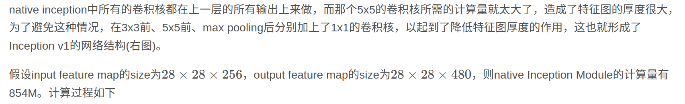
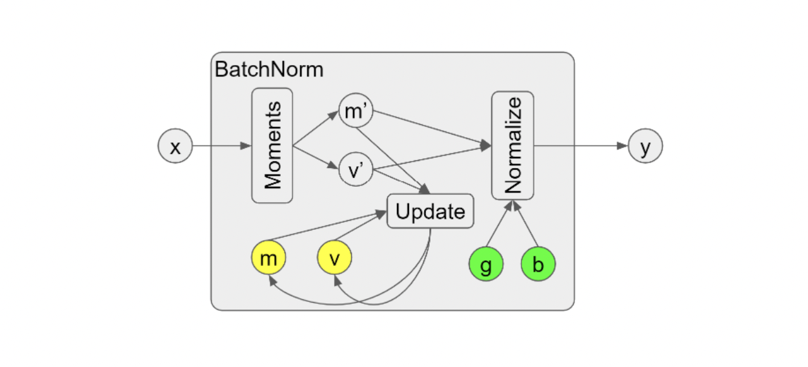
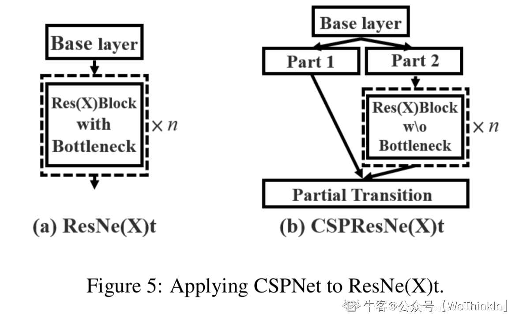
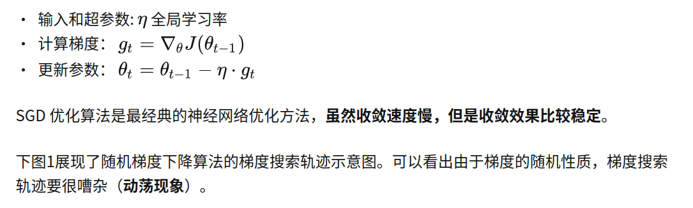
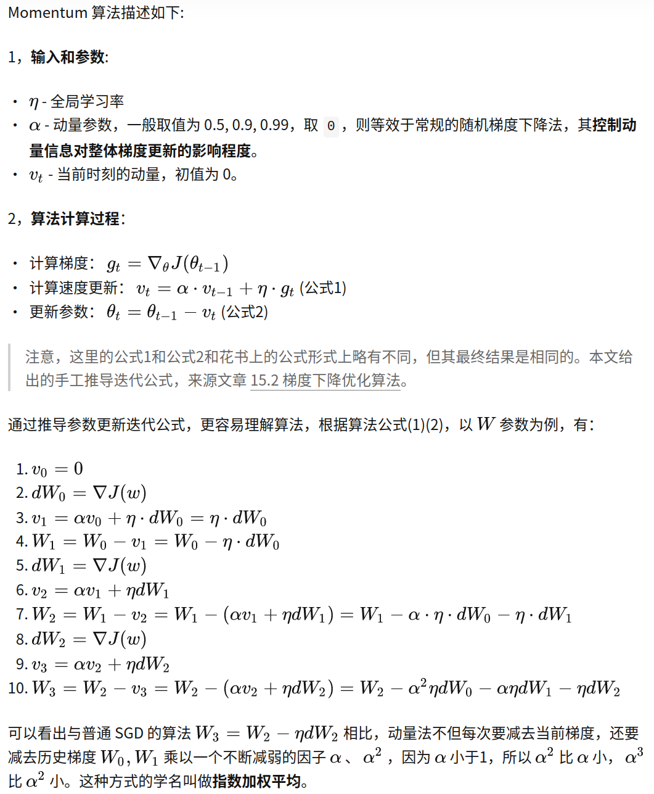
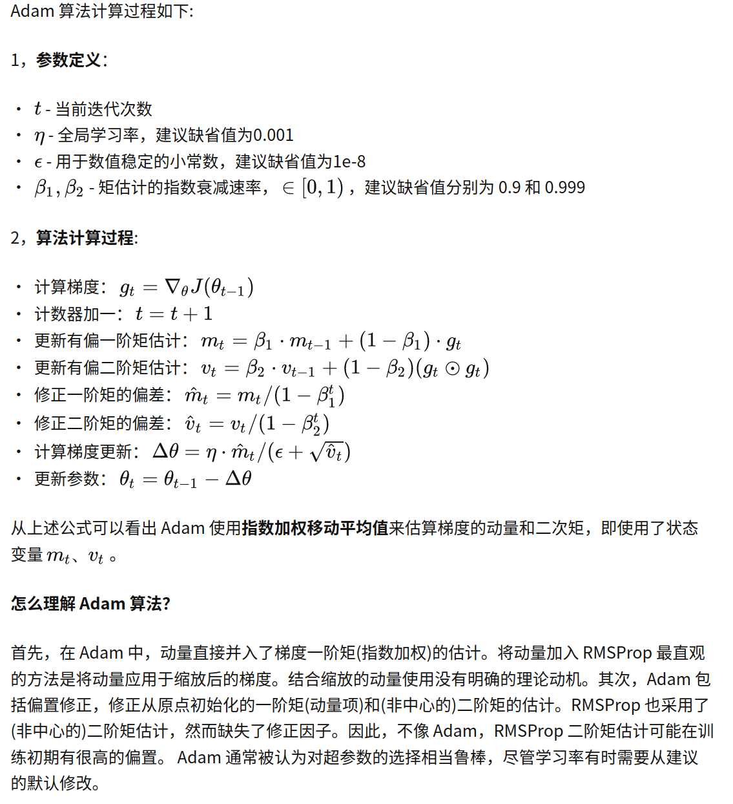
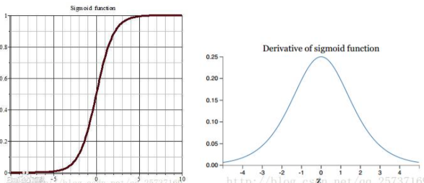
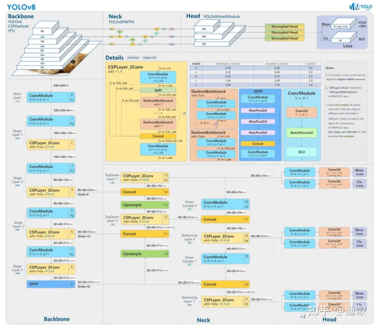
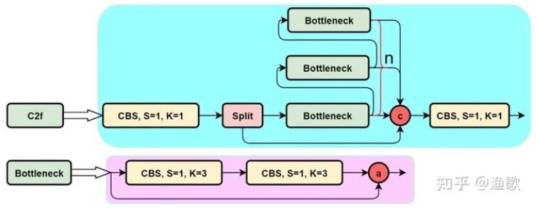

关于深度学习中正则化总结：

https://zhuanlan.zhihu.com/p/128129015

激活函数：

https://zhuanlan.zhihu.com/p/192497127

面试25道题：

**1、什么是深度学习?**

深度学习涉及获取大量结构化或非结构化数据，并使用复杂算法训练神经网络。它执行复杂的操作来提取隐藏的模式和特征(例如，区分猫和狗的图像)

**2、什么是神经网络?**

神经网络复制了人类的学习方式，灵感来自于我们大脑中的神经元是如何激活的，但是比人类大脑要简单得多。

最常见的神经网络由三个网络层组成:

- 输入层
- 隐藏层(这是最重要的一层，在这里进行特征提取，并进行调整以更快地训练和更好地运行)
- 输出层

神经网络用于深度学习算法，如CNN, RNN, GAN等。

**3、什么是多层感知机(MLP)?**

和神经网络一样，mlp有一个输入层、一个隐藏层和一个输出层。 它与具有一个或多个隐藏层的单层感知器的的结构相同。 单层感知器只能对具有二进制输出 (0,1) 的线性可分类进行分类，但 MLP 可以对非线性类进行分类。

除输入层外，其他层中的每个节点都使用非线性激活函数。 输入层、传入的数据和激活函数基于所有节点和权重相加从而产生输出。 MLP 使用一种称为“反向传播”的方法来优化节点的权重。  在反向传播中，神经网络在损失函数的帮助下计算误差，从误差的来源向后传播此误差（调整权重以更准确地训练模型）。

**4、什么是数据规范化（Normalization），我们为什么需要它？**

**Normalization**的中文翻译一般叫做“规范化”，是一种对数值的特殊函数变换方法，也就是说假设原始的某个数值是x，套上一个起到规范化作用的函数，对规范化之前的数值x进行转换，形成一个规范化后的数值。

规范化将越来越偏的分布拉回到标准化的分布,使得激活函数的输入值落在激活函数对输入比较敏感的区域,从而使梯度变大,加快学习收敛速度,避免梯度消失的问题。

按照规范化操作涉及对象的不同可以分为两大类：

一类是对第L层每个神经元的激活值 进行Normalization操作，比如BatchNorm/ LayerNorm/ InstanceNorm/ GroupNorm等方法都属于这一类；

另外一类是对神经网络中连接相邻隐层神经元之间的边上的权重进行规范化操作，比如Weight Norm就属于这一类。

一般机器学习里看到的损失函数里面加入的对参数的的L1/L2等正则项，本质上也属于这这一类的规范化操作。

L1正则的规范化目标是造成参数的稀疏化，就是争取达到让大量参数值取得0值的效果，而L2正则的规范化目标是有效减小原始参数值的大小。

有了这些规范目标，通过具体的规范化手段来改变参数值，以达到避免模型过拟合的目的。

**6、激活函数在神经网络中的作用是什么？**

激活函数模拟生物学中的神经元是否应该被激发。 它接受输入和偏差的加权和作为任何激活函数的输入。从数学角度讲引入激活函数是为了增加神经网络模型的非线性。 Sigmoid、ReLU、Tanh 都是常见的激活函数。

**7、什么是成本函数?**

成本函数也被称为“损失”或“误差”，它是评估模型性能好坏的一种度量方法。它用于计算反向传播过程中输出层的误差。我们通过神经网络将错误向后推并在不同的训练函数中使用它。

**8、什么是梯度下降?**

梯度下降是一种最小化成本函数或最小化误差的最优算法。目的是找到一个函数的局部全局极小值。这决定了模型应该采取的减少误差的方向。

9、反向传播是什么?

这是深度学习面试中最常被问到的问题之一。

1974年，Paul Werbos首次给出了如何训练一般网络的学习算法—back  propagation。这个算法可以高效的计算每一次迭代过程中的梯度。反向传播算法是目前用来训练人工神经网络（Artificial Neural Network，ANN）的最常用且最有效的算法。其主要思想是：

（1）将训练集数据输入到ANN的输入层，经过隐藏层，最后达到输出层并输出结果，这是ANN的前向传播过程；

（2）由于ANN的输出结果与实际结果有误差，则计算估计值与实际值之间的误差，并将该误差从输出层向隐藏层反向传播，直至传播到输入层；

（3）在反向传播的过程中，根据误差调整各种参数的值；不断迭代上述过程，直至收敛。

**10、前馈神经网络和循环神经网络有什么区别？**

前馈神经网络信号从输入到输出沿一个方向传播。 没有反馈回路； 网络只考虑当前输入。 它无法记住以前的输入（例如 CNN）。

循环神经网络的信号双向传播，形成一个循环网络。 它考虑当前输入和先前接收到的输入，以生成层的输出，并且由于其内部存储器，它可以记住过去的数据。

**11、循环神经网络 (RNN) 有哪些应用？**

RNN 可用于情感分析、文本挖掘等，可以解决时间序列问题，例如预测一个月或季度的股票价格。

**12、Softmax 和 ReLU 函数是什么？**

Softmax 是一种激活函数，可生成介于 0 和 1 之间的输出。 它将每个输出除以所有输出的总和，使得输出的总和等于 1。 Softmax 通常用于分类任务的输出层和注意力机制的计算。

ReLU是使用最广泛的激活函数。 如果 X 为正，则输出 X，否则为零。 ReLU 常用于隐藏层的激活函数。

**13、什么是超参数？**

这是另一个经常被问到的深度学习面试问题。  超参数在机器学习的上下文中，超参数是在开始学习过程之前设置值的参数，而不是通过训练得到的参数数据。因为一般情况下我们将可以根据模型自身的算法，通过数据迭代自动学习出的变量称为参数，而超参数的设置可以影响到这些参数是如何训练，所以称其为超参数。

**14、如果学习率设置得太低或太高会发生什么?**

当学习率太低时，模型的训练将进展得非常缓慢，因为只对权重进行最小的更新。它需要多次更新才能达到最小值。如果非常小可能最终的梯度可能不会跳出局部最小值，导致训练的结果并不是最优解。

如果学习率设置得太高，由于权重的急剧更新，这将导致损失函数出现不希望的发散行为。可能导致模型无法收敛，甚至发散(网络无法训练)。

**15、什么是Dropout和BN?**

Dropout是一种随机删除网络中隐藏和可见单元的技术，可以以防止数据过拟合(通常删除20%内的节点)。它使收敛网络所需的迭代次数增加。

BN是一种通过对每一层的输入进行规范化，变为平均为0，标准差为1的正态分布，从而提高神经网络性能和稳定性的技术。

**17、什么是过拟合和欠拟合，以及如何解决?**

**过拟合**是指模型在训练集上表现很好，到了验证和测试阶段就很差，即模型的泛化能力很差。当模型对训练数据中的细节和噪声的学习达到对模型对新信息的执行产生不利影响的程度时，就会发生过拟合。它更可能发生在学习目标函数时具有更大灵活性的非线性模型中。样本数量太少，样本噪音干扰过大，模型复杂度过高都会产生过拟合。

**欠拟合**是指模型在训练集、验证集和测试集上均表现不佳的情况。这通常发生在训练模型的数据较少且不正确的情况下。

为了防止过拟合和欠拟合，您可以重新采样数据来估计模型的准确性(k-fold交叉验证)，并通过一个验证数据集来评估模型。

**18、如何在网络中初始化权值?**

一般情况下都使用随机初始化权值。

不能将所有权重初始化为0，因为这将使您的模型类似于线性模型。所有的神经元和每一层都执行相同的操作，给出相同的输出，使深层网络无用。

随机初始化所有权重通过将权重初始化为非常接近0的值来随机分配权重。由于每个神经元执行不同的计算，它使模型具有更好的准确性。

**19、CNN中常见的层有哪些?**

1. 卷积层——执行卷积操作的层，创建几个更小的图片窗口来浏览数据。
2. 激活层-它给网络带来非线性，例如RELU将所有负像素转换为零。输出是一个经过整流的特征映射。
3. 池化层——池化是一种向下采样的操作，它降低了特征图的维数。
4. 全连通层——该层出处类别或者回归的数值。

**20、CNN的“池化”是什么?它是如何运作的?**

池化用于减少CNN的空间维度。它执行下采样操作来降低维数，并通过在输入矩阵上滑动一个过滤器矩阵来创建一个汇集的特征映射。

**21、LSTM是如何工作的?**

长-短期记忆(LSTM)是一种特殊的循环神经网络，能够学习长期依赖关系。LSTM网络有三个步骤:

1. 网络决定忘记什么，记住什么。
2. 它有选择地更新单元状态值。
3. 网络决定当前状态的哪一部分可以输出。

**22、什么是梯度消失和梯度爆炸?**

在训练RNN时，你的斜率可能会变得太小或太大;这使得训练非常困难。当斜率太小时，这个问题被称为“消失梯度”。当坡度趋向于指数增长而不是衰减时，它被称为“爆炸梯度”。梯度问题导致训练时间长，性能差，精度低。

**23、深度学习中Epoch、Batch和Iteration的区别是什么?**

Epoch —— 表示整个数据集的一次迭代(训练数据的所有内容)。

Batch——指的是因为不能一次性将整个数据集传递给神经网络，所以我们将数据集分成几个批处理进行处理，每一批称为Batch。

Iteration——如果我们有10,000张图像作为数据，Batch大小为200。那么一个Epoch 应该运行50次Iteration(10,000除以50)。

**24、深度学习框架中的张量是什么意思?**

这是另一个最常被问到的深度学习面试问题。张量是用高维数组表示的数学对象。这些具有不同维度和等级的数据数组作为神经网络的输入被称为“张量”。

**25、比较常用的深度学习框架例如Tensorflow，Pytorch**

大概说下就可以了，例如：这些框架提供c++和Python  api，都支持CPU和GPU计算设备。那个熟悉说那个就可以了比如常用Pytorch，但是因为有些实现是Tensorflow的所以需要看代码所以对Tensorflow也了解一些，不要说谁好谁坏，因为很容易落入圈套，万一你说Tensorflow好，面试公司用Pytorch怎么办。

# 卷积

## **1\*1卷积**

**1、实现特征的升降维**

当1*1卷积出现时，在大多数情况下它作用是升/降特征的维度，这里的维度指的是通道数（厚度），而不改变图片的宽和高。

因为1*1的卷积核，并不会改变图像的宽和高，但是其能够通过卷积核的数量，来调节输出的feature map的通道数。同时，其对不同通道上的像素点进行线性组合，有助于通道间信息的交互和整合过程

**2、减少模型参数量**

这一想法最早在GoogleNet中被提出，比如说如下两个Inception模块：


从直观上来看，感觉像是只有3*3卷积的模块会拥有更少的训练数据，实则不然，我们可以计算一下训练数据个数：

情况1:

1) 1*1卷积部分： 96*32*1*1=3072个

2) 3*3卷积部分 32*48*3*3=13824个

总计16896个训练参数

情况2:

总计 96*48*3*3 = 41472个训练参数

从实际上来看，带1*1卷积的模型参数量更少，本质原因是因为1*1的卷积对数据的特征向量进行了降维的处理，使得特征通道数目先有了一定的减少。

如下所示：在ResNet中的残差模块使用1*1的卷积核的意义也在于此：


## 空洞卷积（Dilated Convolution）

顾名思义，其做法就是在卷积map中加入空洞的部分，以此增加感受域。如下图所示，


这个做法起源于最开始的语义分割领域，主要问题在于CNN本身可能存在一些致命性的缺陷，比如up-sampling和pooling layer的设计。问题主要在于：

1. 上采样和池化层是人为设计好的，是不可学习的。
2. 容易丢失内部数据结构与空间的层次化信息
3. 小物体的信息无法重建，假设有多个pooling layer，那么从理论上来讲在一定小的范围内的像素的物体是无法被重建的。

所以有人提出了空洞卷积的思想。其本身避免了一部分上述讲到的2、3的问题，但是其也存在一些潜在问题，具体可以参考：

https://www.zhihu.com/question/54149221

最终，图森组提出了一个HDC的设计结构，来满足整个基于空洞卷积的设计。较为具体的内容也可以参考上述的文章。

## **可变形卷积（Deformable Convolution ）**

普通的卷积在应对一些物体复杂形变的场景的时候，往往无法得到好的结果。这个时候就有人提出了可变性卷积。

简单而言，Deformable Conv 在感受野中引入了偏移量，而且这偏移量是可学习的，这样可以使得感受野不再是单一的方形，而是能够尽可能与物体的实际形状贴近，于是卷积区域便始终覆盖在物体形状周围，无论物体如何形变，加入可学习的偏移量后都可以搞定。

****

在训练过程中，用来生成输出特征的卷积核和用来计算offsets的卷积核是同时进行学习的。下图是一个3*3的可变形卷积的示意图。


## 从2D卷积到3D卷积，都有什么不一样

首先看一下二维卷积，一个3*3的卷积核，在单通道图像上进行卷积，得到输出。


然后我们再看一下3维卷积，一个3*3*3的卷积核在立方体上进行卷积，得到输出。


就是这样，没什么其他花样了。

可能有人会问，这跟多通道卷积有什么区别呢？

有。

多通道卷积**不同的通道上的卷积核的参数是不同的**，而3D卷积则由于卷积核本身是3D的，所以这个由于“深度”造成的看似不同通道上用的就是同一个卷积，权重共享嘛。

总之，多了一个**深度通道**，这个深度可能是**视频上的连续帧**，也可能是**立体图像中的不同切片**。

## 网络设计中，为什么卷积核设计尺寸都是奇数

我们发现在很多大部分网络设计时都会使用例如3x3/5x5/7x7等奇数尺寸卷积核，主要原因有两点：

- 保证像素点中心位置，避免位置信息偏移
- 填充边缘时能保证两边都能填充，原矩阵依然对称

## 卷积神经网络的组成层

以图像分类任务为例，在表5.1所示卷积神经网络中，一般包含5种类型的网络层次结构：

 表5.1 卷积神经网络的组成

| CNN层次结构 |             输出尺寸              | 作用                                                         |
| :---------: | :-------------------------------: | :----------------------------------------------------------- |
|   输入层    |      $W_1\times H_1\times 3$      | 卷积网络的原始输入，可以是原始或预处理后的像素矩阵           |
|   卷积层    |      $W_1\times H_1\times K$      | 参数共享、局部连接，利用平移不变性从全局特征图提取局部特征   |
|   激活层    |      $W_1\times H_1\times K$      | 将卷积层的输出结果进行非线性映射                             |
|   池化层    |      $W_2\times H_2\times K$      | 进一步筛选特征，可以有效减少后续网络层次所需的参数量         |
|  全连接层   | $(W_2 \cdot H_2 \cdot K)\times C$ | 将多维特征展平为2维特征，通常低维度特征对应任务的学习目标（类别或回归值） |

> $W_1\times H_1\times 3$对应原始图像或经过预处理的像素值矩阵，3对应RGB图像的通道;$K$表示卷积层中卷积核（滤波器）的个数;$W_2\times H_2$ 为池化后特征图的尺度，在全局池化中尺度对应$1\times 1$;$(W_2 \cdot H_2 \cdot K)$是将多维特征压缩到1维之后的大小，$C$对应的则是图像类别个数。

### 卷积层

​	卷积层(Convolution Layer)通常用作对输入层输入数据进行特征提取，通过卷积核矩阵对原始数据中隐含关联性的一种抽象。卷积操作原理上其实是对两张像素矩阵进行点乘求和的数学操作，其中一个矩阵为输入的数据矩阵，另一个矩阵则为卷积核（滤波器或特征矩阵），求得的结果表示为原始图像中提取的特定局部特征。图5.1表示卷积操作过程中的不同填充策略，上半部分采用零填充，下半部分采用有效卷积（舍弃不能完整运算的边缘部分）。

### 激活层

​	激活层(Activation Layer)负责对卷积层抽取的特征进行激活，由于卷积操作是由输入矩阵与卷积核矩阵进行相差的线性变化关系，需要激活层对其进行非线性的映射。激活层主要由激活函数组成，即在卷积层输出结果的基础上嵌套一个非线性函数，让输出的特征图具有非线性关系。卷积网络中通常采用ReLU来充当激活函数（还包括tanh和sigmoid等）ReLU的函数形式如公式（5-1）所示，能够限制小于0的值为0,同时大于等于0的值保持不变。
$$
f(x)=\begin{cases}
   0 &\text{if } x<0 \\
   x &\text{if } x\ge 0
\end{cases}
\tag{5-1}
$$

### 池化层

​	池化层又称为降采样层(Downsampling Layer)，作用是对感受域内的特征进行筛选，提取区域内最具代表性的特征，能够有效地降低输出特征尺度，进而减少模型所需要的参数量。按操作类型通常分为最大池化(Max Pooling)、平均池化(Average Pooling)和求和池化(Sum Pooling)，它们分别提取感受域内最大、平均与总和的特征值作为输出，最常用的是最大池化。

### 全连接层

​	全连接层(Full Connected Layer)负责对卷积神经网络学习提取到的特征进行汇总，将多维的特征输入映射为二维的特征输出，高维表示样本批次，低位常常对应任务目标。

## 卷积在图像中有什么直观作用

​	在卷积神经网络中，卷积常用来提取图像的特征，但不同层次的卷积操作提取到的特征类型是不相同的，特征类型粗分如表5.2所示。

| 卷积层次 | 特征类型 |
| :------: | :------: |
| 浅层卷积 | 边缘特征 |
| 中层卷积 | 局部特征 |
| 深层卷积 | 全局特征 |

## 卷积层有哪些基本参数？

​	卷积层中需要用到卷积核（滤波器或特征检测器）与图像特征矩阵进行点乘运算，利用卷积核与对应的特征感受域进行划窗式运算时，需要设定卷积核对应的大小、步长、个数以及填充的方式，如表5.4所示。

​                                                            		     表5.4 卷积层的基本参数

|          参数名           | 作用                                                         | 常见设置                                                     |
| :-----------------------: | :----------------------------------------------------------- | :----------------------------------------------------------- |
| 卷积核大小 (Kernel Size)  | 卷积核的大小定义了卷积的感受野                               | 在过去常设为5，如LeNet-5；现在多设为3，通过堆叠$3\times3$的卷积核来达到更大的感受域 |
|    卷积核步长 (Stride)    | 定义了卷积核在卷积过程中的步长                               | 常见设置为1，表示滑窗距离为1，可以覆盖所有相邻位置特征的组合；当设置为更大值时相当于对特征组合降采样 |
|    填充方式 (Padding)     | 在卷积核尺寸不能完美匹配输入的图像矩阵时需要进行一定的填充策略 | 设置为'SAME'表示对不足卷积核大小的边界位置进行某种填充（通常零填充）以保证卷积输出维度与与输入维度一致；当设置为'VALID'时则对不足卷积尺寸的部分进行舍弃，输出维度就无法保证与输入维度一致 |
| 输入通道数 (In Channels)  | 指定卷积操作时卷积核的深度                                   | 默认与输入的特征矩阵通道数（深度）一致；在某些压缩模型中会采用通道分离的卷积方式 |
| 输出通道数 (Out Channels) | 指定卷积核的个数                                             | 若设置为与输入通道数一样的大小，可以保持输入输出维度的一致性；若采用比输入通道数更小的值，则可以减少整体网络的参数量 |

> 卷积操作维度变换公式：
>
> $O_d =\begin{cases} \lceil \frac{(I_d - k_{size})+ 1)}{s}\rceil ,& \text{padding=VALID}\\ \lceil \frac{I_d}{s}\rceil,&\text{padding=SAME} \end{cases}$
>
> 其中，$I_d$为输入维度，$O_d$为输出维度，$k_{size}$为卷积核大小，$s$为步长

## 有哪些池化方法？

​	池化操作通常也叫做子采样(Subsampling)或降采样(Downsampling)，在构建卷积神经网络时，往往会用在卷积层之后，通过池化来降低卷积层输出的特征维度，有效减少网络参数的同时还可以防止过拟合现象。池化操作可以降低图像维度的原因，本质上是因为图像具有一种“静态性”的属性，这个意思是说在一个图像区域有用的特征极有可能在另一个区域同样有用。因此，为了描述一个大的图像，很直观的想法就是对不同位置的特征进行聚合统计。例如，可以计算图像在固定区域上特征的平均值 (或最大值)来代表这个区域的特征。
​                                                                              表5.6 池化分类

|                  池化类型                   |                     示意图                      | 作用                                                         |
| :-----------------------------------------: | :---------------------------------------------: | :----------------------------------------------------------- |
|          一般池化(General Pooling)          |      | 通常包括最大池化(Max Pooling)和平均池化(Mean Pooling)。以最大池化为例，池化范围$(2\times2)$和滑窗步长$(stride=2)$ 相同，仅提取一次相同区域的范化特征。 |
|        重叠池化(Overlapping Pooling)        |  | 与一般池化操作相同，但是池化范围$P_{size}$与滑窗步长$stride$关系为$P_{size}>stride$，同一区域内的像素特征可以参与多次滑窗提取，得到的特征表达能力更强，但计算量更大。 |
| 空间金字塔池化$^*$(Spatial Pyramid Pooling) |  | 在进行多尺度目标的训练时，卷积层允许输入的图像特征尺度是可变的，紧接的池化层若采用一般的池化方法会使得不同的输入特征输出相应变化尺度的特征，而卷积神经网络中最后的全连接层则无法对可变尺度进行运算，因此需要对不同尺度的输出特征采样到相同输出尺度。 |

> SPPNet$^{[3]}$就引入了空间池化的组合，对不同输出尺度采用不同的滑窗大小和步长以确保输出尺度相同$(win_{size}=\lceil \frac{in}{out}\rceil; stride=\lfloor \frac{in}{out}\rfloor; )$，同时用如金字塔式叠加的多种池化尺度组合，以提取更加丰富的图像特征。常用于多尺度训练和目标检测中的区域提议网络(Region Proposal Network)的兴趣区域(Region of Interest)提取

## 卷积核是否一定越大越好？

​	在早期的卷积神经网络中（如LeNet-5、AlexNet），用到了一些较大的卷积核（$11\times11$和$5\times 5$），受限于当时的计算能力和模型结构的设计，无法将网络叠加得很深，因此卷积网络中的卷积层需要设置较大的卷积核以获取更大的感受域。但是这种大卷积核反而会导致计算量大幅增加，不利于训练更深层的模型，相应的计算性能也会降低。后来的卷积神经网络（VGG、GoogLeNet等），发现通过堆叠2个$3\times 3$卷积核可以获得与$5\times 5$卷积核相同的感受视野，同时参数量会更少（$3×3×2+1$ < $ 5×5×1+1$），$3\times 3$卷积核被广泛应用在许多卷积神经网络中。因此可以认为，在大多数情况下通过堆叠较小的卷积核比直接采用单个更大的卷积核会更加有效。

## 怎样才能减少卷积层参数量？

减少卷积层参数量的方法可以简要地归为以下几点：

- 使用堆叠小卷积核代替大卷积核：VGG网络中2个$3\times 3$的卷积核可以代替1个$5\times 5$的卷积核
- 使用分离卷积操作：将原本$K\times K\times C$的卷积操作分离为$K\times K\times 1$和$1\times1\times C$的两部分操作
- 添加$1\times 1$的卷积操作：与分离卷积类似，但是通道数可变，在$K\times K\times C_1$卷积前添加$1\times1\times C_2$的卷积核（满足$C_2 <C_1$）
- 在卷积层前使用池化操作：池化可以降低卷积层的输入特征维度

## 提高卷积神经网络的泛化能力

​	卷积神经网络与其他类型的神经网络类似，在采用反向传播进行训练的过程中比较依赖输入的数据分布，当数据分布较为极端的情况下容易导致模型欠拟合或过拟合，表XX记录了提高卷积网络泛化能力的方法。
​                                                                   表XX 提高卷积网络化能力的方法

|     方法     | 说明                                                         |
| :----------: | :----------------------------------------------------------- |
| 使用更多数据 | 在有条件的前提下，尽可能多地获取训练数据是最理想的方法，更多的数据可以让模型得到充分的学习，也更容易提高泛化能力 |
| 使用更大批次 | 在相同迭代次数和学习率的条件下，每批次采用更多的数据将有助于模型更好的学习到正确的模式，模型输出结果也会更加稳定 |
| 调整数据分布 | 大多数场景下的数据分布是不均匀的，模型过多地学习某类数据容易导致其输出结果偏向于该类型的数据，此时通过调整输入的数据分布可以一定程度提高泛化能力 |
| 调整目标函数 | 在某些情况下，目标函数的选择会影响模型的泛化能力，如目标函数$f(y,y')=|y-y'|$在某类样本已经识别较为准确而其他样本误差较大的侵害概况下，不同类别在计算损失结果的时候距离权重是相同的，若将目标函数改成$f(y,y')=(y-y')^2$则可以使误差小的样本计算损失的梯度比误差大的样本更小，进而有效地平衡样本作用，提高模型泛化能力 |
| 调整网络结构 | 在浅层卷积神经网络中，参数量较少往往使模型的泛化能力不足而导致欠拟合，此时通过叠加卷积层可以有效地增加网络参数，提高模型表达能力；在深层卷积网络中，若没有充足的训练数据则容易导致模型过拟合，此时通过简化网络结构减少卷积层数可以起到提高模型泛化能力的作用 |
|   数据增强   | 数据增强又叫数据增广，在有限数据的前提下通过平移、旋转、加噪声等一些列变换来增加训练数据，同类数据的表现形式也变得更多样，有助于模型提高泛化能力，需要注意的是数据变化应尽可能不破坏元数数据的主体特征(如在图像分类任务中对图像进行裁剪时不能将分类主体目标裁出边界)。 |
|  权值正则化  | 权值正则化就是通常意义上的正则化，一般是在损失函数中添加一项权重矩阵的正则项作为惩罚项，用来惩罚损失值较小时网络权重过大的情况，此时往往是网络权值过拟合了数据样本(如$Loss=f(WX+b,y')+\frac{\lambda}{\eta}\sum{|W|}$)。 |
| 屏蔽网络节点 | 该方法可以认为是网络结构上的正则化，通过随机性地屏蔽某些神经元的输出让剩余激活的神经元作用，可以使模型的容错性更强。 |

> 对大多数神经网络模型同样通用

### [9.2.7 反卷积层理解](https://github.com/scutan90/DeepLearning-500-questions/blob/master/ch09_图像分割/第九章_图像分割.md#927-反卷积层理解)

   Upsampling的操作可以看成是反卷积(deconvolutional)，卷积运算的参数和CNN的参数一样是在训练FCN模型的过程中通过bp算法学习得到。反卷积层也是卷积层，不关心input大小，滑窗卷积后输出output。deconv并不是真正的deconvolution（卷积的逆变换），最近比较公认的叫法应该是transposed convolution，deconv的前向传播就是conv的反向传播。
   反卷积参数: 利用卷积过程filter的转置（实际上就是水平和竖直方向上翻转filter）作为计算卷积前的特征图。
   反卷积的运算如下所示:
   蓝色是反卷积层的input，绿色是反卷积层的outputFull padding, transposed Full padding, transposed。

[](https://github.com/scutan90/DeepLearning-500-questions/blob/master/ch09_图像分割/img/ch9/figure_9.1.8_1.png)

上图中的反卷积，input是2×2, output是4×4。     Zero padding, non-unit strides, transposed。

[](https://github.com/scutan90/DeepLearning-500-questions/blob/master/ch09_图像分割/img/ch9/figure_9.1.8_2.png)

上图中的反卷积，input feature map是3×3, 转化后是5×5, output是5×5 ### 9.2.8 跳级(skip)结构

   对CNN的结果做处理，得到了dense prediction，而作者在试验中发现，得到的分割结果比较粗糙，所以考虑加入更多前层的细节信息，也就是把倒数第几层的输出和最后的输出做一个fusion，实际上也就是加和：

[](https://github.com/scutan90/DeepLearning-500-questions/blob/master/ch09_图像分割/img/ch9/figure_9.1.9_1.png)

   实验表明，这样的分割结果更细致更准确。在逐层fusion的过程中，做到第三行再往下，结果又会变差，所以作者做到这里就停了。

# 详解Inception结构：从Inception v1到Xception

## Inception结构的来源与演变

Inception(盗梦空间结构)是经典模型GoogLeNet中最核心的子网络结构，GoogLeNet是Google团队提出的一种神经网络模型，并在2014年ImageNet挑战赛(ILSVRC14)上获得了冠军，关于GoogLeNet模型详细介绍，可以参考博主的另一篇博客 GoogLeNet网络详解与模型搭建GoogLeNet网络详解与模型搭建。Google团队在随后2年里不断改进，相继提出了v1-v4和xcpetion结构，本文对系列模型进行详细介绍。

## 什么是Inception结构？

Inception就是将多个卷积或池化操作放在一起组装成一个网络模块，设计神经网络时，以模块为单位去组装整个网络结构。Inception结构设计了一个稀疏网络结构，但是能够产生稠密的数据，既能增加神经网络表现，又能保证计算资源的使用效率。


在GoogLeNet之前的网络中，一层一般只使用一种操作（单个卷积或池化），一层只使用一个操作的弊端是提取出来的特征往往过于单调。在实际情况中，由于图像的不同尺度等原因，需要不同程度的下采样，或者说不同大小的卷积核，我们希望网络代替人手工自己决定到底使用$1\times1$，$3\times3$， $5\times5$以及是否需要max_pooling层，由网络自动去寻找适合的结构。并且节省计算提取更为丰富的特征，Inception结构正好满足了这样的需求，因而获得了更好的表现。

## **为什么要提出Inception结构？**

文章提出，提升网络性能最直接的办法就是增加网络深度和宽度，深度指网络层次数量、宽度指神经元数量。但这种方式存在以下问题：

+ 参数太多，如果训练数据集有限，很容易产生过拟合；
+ 网络越大、参数越多，计算复杂度越大，难以应用；
+ 网络越深，容易出现梯度弥散问题（梯度越往后穿越容易消失），难以优化模型。

为了解决提出的问题，就要在增加网络深度和宽度的同时减少参数，减少参数自然就想到将全连接变成稀疏连接。但是在实现上，全连接变成稀疏连接后实际计算量并不会有质的提升，因为大部分硬件是针对密集矩阵计算优化的，稀疏矩阵虽然数据量少，但是计算所消耗的时间却很难减少。

那么，有没有一种方法既能保持网络结构的稀疏性，又能利用密集矩阵的高计算性能。大量的文献表明可以将稀疏矩阵聚类为较为密集的子矩阵来提高计算性能，就如人类的大脑是可以看做是神经元的重复堆积，因此，GoogLeNet团队提出了Inception网络结构，就是构造一种“基础神经元”结构，来搭建一个稀疏性、高计算性能的网络结构。

## Inception v1

下图中展示了原始Inception(native inception)结构和GoogLeNet中使用的Inception v1结构，使用Inception v1 Module的GoogleNet不仅比Alex深，而且参数比AlexNet足足减少了12倍，网络大小约是VGGNet的1/20。


GoogleNet作者的初始想法是用多个不同类型的卷积核（1 × 1 ，3×3，5 × 5 ，3 × 3  Pool）堆叠在一起（卷积、池化后的尺寸相同，将通道相加）代替一个3x3的小卷积核(如左图)，好处是可以使提取出来的特征具有多样化，并且特征之间的co-relationship不会很大，最后用把feature map都concatenate起来使网络做得很宽，然后堆叠Inception Module将网络变深。但仅仅简单这么做会使一层的计算量爆炸式增长。



## Inception v4


# 损失函数：

https://blog.csdn.net/qq_42691298/article/details/126590726

### 一般做分类我们都用交叉熵损失，交叉熵损失是否可以替换为MSE损失呢？ 

> 1. MSE 损失主要适用与回归问题，因为优化 MSE 等价于对高斯分布模型做极大似然估计，而简单回归中做服从高斯分布的假设是比较合理的
> 2. 交叉熵损失主要适用于多分类问题，因为优化交叉熵损失等价于对多项式分布模型做极大似然估计，而多分类问题通常服从多项式分布

## 激活函数的作用是什么？

激活函数的作用是：引入非线性因素，提高了模型的表达能力。

如果没有激活函数，那么模型就只有线性变换，可想而知线性模型能表达的空间是有限的。而激活函数引入了非线性因素，比线性模型拥有更大的模型空间。

##  主要常用的激活函数有哪些？

常用的激活函数有：

- Softmax
- Sigmoid
- Tanh
- **ReLU**（以及基于ReLU的改进系列：Leaky ReLU、ELU、PReLU等）
- Gelu（Gaussian Error Linear Unit，2016年被提出，直到2018年Bert开始使用才被重视）
- Swish（2017年google提出）
- 总结一下：
  - Sigmoid和Tanh很相似，但后者的梯度更陡，都会存在梯度消失、梯度爆炸的风险。
  - ReLU函数一大优点是不会激活所有神经元，前向传播时如果输入是负值，则该神经元不会被激活，那么反向传播时梯度就是0，该神经元权重不会更新，就会变成死神经元。
  - 基于ReLU死神经元的这种缺点，才提出了Leaky ReLU、ELU、PReLU等。
  - Gelu和Swish很相似，在论文中的对比结果也很相近，他们的区别在于前者固定了系数为1.702，后者的系数是可以选择固定为常数，也可以选择为可训练的参数。

## Sigmoid 激活函数

优点：

+ 在[-1,1]区间内有平滑的梯度，这使得模型训练更加稳定；
+ 函数输出在[0,1]之间，可以被解释为概率；
+  原函数为偶函数，输出可以被归一化。
+ Sigmoid 函数的导数在较大或较小的输入值时接近于0，这会导致梯度消失，使得训练过程变得困难；
+ 函数输出不是以0为中心，这可能导致梯度下降时出现偏移。

## Tanh 激活函数

优点：

+ Tanh 函数是一个可导的、平滑的函数，输出在[-1,1]之间，可以被解释为概率；
+ 输出以0为中心，这有利于梯度下降；
+ 与 Sigmoid 函数相比，Tanh 函数的均值接近0，这有助于加速模型的训练。

缺点：

+ 在极端输入值时，Tanh 函数的梯度仍然会变得非常小，导致梯度消失的问题。

## ReLU（Rectified Linear Unit）激活函数

优点：

+ 在实践中，ReLU 函数比 Sigmoid 和 Tanh 函数更快地收敛；
+ 当输入为正时，ReLU 函数的梯度为常数，避免了梯度消失的问题；
+ 计算速度非常快。

缺点：

+ 当输入为负时，ReLU 函数的梯度为0，这被称为“ReLU 死亡现象”，可能导致一些神经元永远不会被激活，影响模型的表达能力；
+ ReLU 函数输出不包括负值，这可能会导致一些神经元的输出偏向于0。

## LeakyReLU 激活函数

优点：

+ LeakyReLU 函数解决了 ReLU 函数的“死亡现象”，使得神经元可以在输入为负时被激活；
+ LeakyReLU 函数保留了 ReLU 函数的快速计算速度。

缺点：

+ LeakyReLU 函数需要额外的超参数 $\alpha$，这增加了模型的复杂性；
+ 当 $\alpha$ 设置不当时，LeakyReLU 函数可能会导致神经元输出过大或过小，影响模型的表达能力。

## ELU（Exponential Linear Unit）激活函数

优点：

+ ELU 函数解决了 ReLU 函数的“死亡现象”，同时保留了 ReLU 函数的快速计算速度；
+ 当输入为负时，ELU 函数具有负饱和度，这有助于提高模型的鲁棒性；
+ ELU 函数的输出可以被归一化，这有助于模型的训练。

缺点：

+ ELU 函数需要计算指数函数，这可能会增加模型的计算复杂度；
+ 当输入为正时，ELU 函数的梯度仍然可能变得非常小，导致梯度消失的问题。

## Softmax 激活函数

优点：

+ Softmax 函数可以将输出映射到概率空间，适用于分类问题；
+ Softmax 函数的输出可以被解释为各个类别的概率；
+ Softmax 函数在多分类问题中表现良好。

缺点：

+ Softmax 函数可能会导致梯度消失或梯度爆炸的问题；
+ Softmax 函数的计算复杂度较高，特别是在输出维度较大时。

## transformer FFN层用的激活函数是什么？为什么?

ReLU. 

> 可以把ReLU的优点提一下，然后提一下解决ReLU死神经元问题的方案。

ReLU的优点是收敛速度快、不会出现梯度消失or爆炸的问题、计算复杂度低。

出现死神经元的原因及解决方案：

- 初始化参数的问题。 --> 采用Xavier初始化方法。
- learning rate太高导致在训练过程中参数更新太大 。==>避免将learning rate设置太大，或者使用Adam等自动调节learning rate的方法。
- 更换激活函数。 --> Leaky ReLU、PReLU、ELU等都是为了解决死神经元的问题。


# 深度学习中的基础知识：

## 深度学习 人工智能 CNN中的底层、高层特征、上下文信息、多尺度


# 深度学习中的BN



## 解释一下BN

**主要解决深度神经网络调参复杂，收敛速度慢以及优化困难的问题。**

对于训练数据，可以计算均值和方差；但是对于测试数据就无法计算，因此这个时候使用的是全量数据的均值和方差。在训练完成之后，会保存全量数据的均值和方差以处理测试数据。

对于BN，在训练时，是对每一个batch的训练数据进行归一化，也即用每一批数据的均值和方差。

而在测试时，比如进行一个样本的预测，就并没有batch的概念，因此，这个时候用的均值和方差是在训练过程中通过滑动平均得到的均值和方差，这个会和模型权重一起，在训练完成后一并保存下来。

对于BN，是对每一批数据进行归一化到一个相同的分布，而每一批数据的均值和方差会有一定的差别，而不是用固定的值，这个差别实际上也能够增加模型的鲁棒性，并会在一定程度上减少过拟合。

但是一批数据和全量数据的均值和方差相差太多，又无法较好地代表训练集的分布，因此，BN一般要求将训练集完全打乱，并用一个较大的batch值，去缩小与全量数据的差别。

## **BN中的移动平均 Moving Average是怎么做的**

训练过程中的每一个batch都会进行移动平均的计算[1]：

```text
moving_mean = moving_mean * momentum + batch_mean * (1 - momentum)
moving_var = moving_var * momentum + batch_var * (1 - momentum)
```

式中的 momentum 为动量参数，在 TF/Keras 中，该值为0.99，在 Pytorch 中，这个值为0.9

初始值，moving_mean=0，moving_var=1，相当于标准正态分布

在实际的代码中，滑动平均的计算会以下面这种更高效的方式，但实际上是等价的：

```text
moving_mean -= (moving_mean - batch_mean) * (1 - momentum)
moving_var -= (moving_var - batch_var) * (1 - momentum)
```

## **移动平均中 Momentum 参数的影响**

整个训练阶段滑动平均的过程，(moving_mean, moving_var) 参数实际上是从正态分布，向训练集真实分布靠拢的一个过程。

理论上，训练步数越长是会越靠近真实分布的，实际上，因为每个batch并不能代表整个训练集的分布，所以最后的值是在真实分布附近波动。

一个更小的 momentum 值，意味着更大的更新步长，对应着滑动平均值更快的变化，能更快地向真实值靠拢，但也意味着更大的波动性，更大的 momentum 值则相反。

训练阶段使用的是 (batch_mean, batch_var)，所以滑动平均并不会影响训练阶段的结果，而是影响预测阶段的效果 。

如果训练步数很短，一个大的 momentum 值可能会导致 (moving_mean, moving_var)  还没有靠拢到真实分布就停止了，这样对预测阶段的影响是很大的，也会是欠拟合的一个状态。如果训练步数足够，一个大的 momentum  值对应小的更新步长，最后的滑动平均的值是会更接近真实值的。

如果batch size 比较小，那单个batch的  (batch_mean, batch_var) 和真实分布会比较大，此时滑动平均单次更新的步长就不应过大，适用一个大的 momentum 值，反之可类比分析。

## **Norm中的标准化、平移和缩放的作用**

对于一般的神经网络，它有这样一些问题[2]：

>  其一，上层参数需要不断适应新的输入数据分布，降低学习速度。
>  其二，下层输入的变化可能趋向于变大或者变小，导致上层落入饱和区，使得学习过早停止。
>  其三，每层的更新都会影响到其它层，因此每层的参数更新策略需要尽可能的谨慎。

Norm 的使用，可以很好的改善这些问题，它包括两个操作：标准化 + 平移和缩放。（注：本文中所有的Norm也都代指这两个操作）

首先，抛开神经网络的背景，标准化这个操作，可以消除不同数据之间由于量纲/数量级带来的差异，而且它是一种线性变换，并不会改变原始数据的数值排序关系。

经过标准化，每层神经网络的输出变成了均值为0，方差为1的标准分布，不再受到下层神经网络的影响（注意是数据分布不受影响，但具体的值肯定还是依赖下层神经网络的输出），可以有效改善上述的几个问题。

那平移和缩放的作用在哪里呢？主要还是为了：**保证模型的表达能力不因为标准化而下降**。

在Norm中引入的两个新参数 γ和β，可以表示旧参数作为输入的同一族函数，但是新参数有不同的学习动态。在旧参数中，  x的均值和方差取决于下层神经网络的复杂关联；但在新参数中， x的均值和方差仅由  γ和β  来确定，去除了与下层计算的密切耦合。新参数很容易通过梯度下降来学习，简化了神经网络的训练。

如果直接只做标准化不做其他处理，神经网络是学不到任何东西的，因为标准化之后都是标准分布了，但是加入这两个参数后就不一样了。

先考虑特殊情况，如果 γ和β 分别等于此batch的标准差和均值，那么y  不就还原到标准化前的x了吗，也即是缩放平移到了标准化前的分布，相当于Norm没有起作用。这样就保证了每一次数据经过Norm后还能保留学习来的特征，同时又能完成标准化这个操作，从而使当前神经元的分布摆脱了对下层神经元的依赖。

## **BN和LN 有哪些差异** 

1）两者做Norm的维度不一样，BN是在Batch维，而LN一般是在最后一维

2）BN需要在训练过程中，滑动平均累积每个神经元的均值和方差，并保存在模型文件中用于推理过程，而LN不需要

3）因为Norm维度的差异，使得它们适用的领域也有差异，BN更多用于CV领域，LN更多用于NLP领域

## **不同Norm方法中都有哪些参数要保存**

BN的参数包括：

1）每个神经元在训练过程中得到的均值和方差，通过移动平均得到

2）每个神经元上的缩放参数 γ 和平移参数 β

LN 只包括上面的第2部分参数，因为它和batch无关，无需记录第1部分参数

## BN的gama labada意义（这个简单） 

因为减均值，除以方差之后数据的分布变了，因此gama labada参数提供的线性尺度变换会恢复它原本的分布。

## BN层的状态包含五个参数:

weight，缩放操作的γ gamma。
bias，缩放操作的β beta。
running_mean，训练阶段统计的均值，测试阶段会用到。
running_var，训练阶段统计的方差，测试阶段会用到。
num_batches_tracked，训练阶段的batch的数目，如果没有指定momentum，则用它来计算running_mean和running_var。一般momentum默认值为0.1，所以这个属性暂时没用。
weight和bias这两个参数需要训练，而running_mean、running_val和num_batches_tracked不需要训练，它们只是训练阶段的统计值。

## BN中均值、方差通过哪些维度计算得到？

神经网络中传递的张量数据，其维度通常记为[N, H, W, C]，其中N是batch_size，H、W是行、列，C是通道数。那么上式中BN的输入集合$B$就是下图中蓝色的部分。


## 多卡时BN如何处理?

多卡为什么同步BN

多卡的原理：

    模型并行，将模型放在不同的卡上，可以不用同步bn
    数据并行，将数据拆分放在不同的卡上需要同步bn

对于数据并行的情况，因为每张卡处理的数据不同因此每张卡在前向传播统计得到的bn参数（均值、方差）自然也不同，因为越大的batchsize统计得到的均值方差越符合整体数据集的均值方差，所以如果如果进行多卡实验，一共两张卡，整个batchsize为512，那么每张卡的batchsize是256，这其实也是一个比较大的batchsize了，其实可以不同步bn参数（不同步训练会稍微快一点，并且现在单卡的batchsize已经很大了，同步的意义不大）。但是如果整体的batchsize是4，那么单卡的batchsize是2，就很有必要同步bn。
原文链接：https://blog.csdn.net/qq_37668436/article/details/121997884

## BN的两大收益：

- 收敛速率增加
- 可以达到更好的精度

在目标检测算法中，BN已经成为了标配。比如Yolov3引入了BN后，mAP提升了两个百分点。在更多实验中可以看到，BN同时起到了正则化作用，防止模型在训练集上过拟合，通常有BN的网络不再需要Dropout层。

# 深度学习中的Tensor 数据格式（N,C,H,W）

## 1、[深度学习框架](https://so.csdn.net/so/search?q=深度学习框架&spm=1001.2101.3001.7020)中的图像格式

### 4DTensor格式

**4DTensor格式**：使用4D张量描述符来定义具有4个字母的2D图像批处理的格式

- 数据布局由二维图像的四个字母表示：   
  - N：Batch，批处理大小，表示一个batch中的图像数量
  - C：Channel，通道数，表示一张图像中的通道数
  - H：Height，高度，表示图像垂直维度的像素数
  - W：Width，宽度，表示图像水平维度的像素数
- 常用的4-D tensor 格式为：   
  - NCHW
  - NHWC
  - CHWN
  - NC/32HW32

### 5DTensor格式

**5D Tensor 格式**：使用5个字母描述的3D图像批处理格式

- 数据布局由三位图像的5个字母表示:   
  - N：批处理大小
  - C：channel，通道数
  - D：深度，表示图像Z维度的特征图数目
  - H：高度
  - W：深度

## 2、数据格式

考虑4-D tensor数据格式，其中N=2，C=16，H=5，W=4，对应数据格式表示为

图中红色标注的数值就是数据里每个元素的数值：value(n,c,h,w) = n x CHW + c x HW + h x W + w
 计算机中的数据是按照 1D 格式来存储的，要将 4D-tensor 映射到 1D memory中，要将 n,c,h,w 作为输入得到对应 value 值得位置（offset）

## 3、物理存储

不同的存储形式映射如下图所示：

### 3.1、NCHW

数据跳转：

- 先取W方向得一行数据，从左向右
- 然后H方向，从上向下
- 之后C方向（in depth）
- 最后N方向，从batch 中的一张图片(n=0) 跳转到下一张(n=1)
   最终序列化出的1D数据为：000（W方向）001 002 003，（H方向）004 005 … 019, (C方向）020 … 318 319 , (N方向）320 321 …
   offset_functoin: offset_nchw(n,c,h,w) = n x CHW + c x HW + h x W + w
   【注意】这里为了方便说明，offset 和 value 值相等。

### 3.2、NHWC

数据跳转：先取C方向数据；然后W方向，然后H方向，最后N方向
 最终序列化出的1D数据为：000（C方向）020 … 300, (W 方向）001 021 … 303, (H方向）004 … 319, (N方向）320 340 …
 offset_function: offset_nhwc(n,c,h,w) = n x HWC + h x WC + w x C + c

### 3.3、CHWN：

数据跳转：先取N方向数据，然后W方向，然后H方向，然后C 方向
 最终序列化出的1D数据为：000（N方向） 320，（W方向）001 321…（H方向）004 324 …019 339, (C 方向）020 340 …
 offset_function: offset_chwn(n,c,h,w) = c x HWN + h x WN + w x N + n

### 3.4、Strides

上面的例子中数据是 packed 的，即表示像素之间是 dense 的。有时数据在memory 中不是连续存储的，例如有时需要选取较大的tensor 中的一个 sub-tensor 工作。有时需要人为的让数据不连续存储。
 下图显示了以行为主格式保存的，大小为行 x 列的 2D 矩阵的简化情况，其中行具有一些 non-trivial （非平凡, 即不等于列数）步幅。
 

offset_function：offset(n,c,h,w) = n x stride_n + c x stride_c + h x stride_h + w x stride_w
 注意，NCHW，NHWC，CHWN 格式都是 strides格式的特殊情况，如 NCHW 格式：
 stride_n = CHW , stride_c = HW , stride_h = W, stride_w=1

### 3.5、Blocked layout

简单的layout便于灵活的数据使用，因此大多数框架和应用使用NCHW 或 NHWC layout。但是数据的应用场景不同，这些布局对应性能方面可能不是最优的。
 为了实现更好的矢量化和缓存重用，Intel MKL-DNN 引入了 blocked layout，将一个或多个维度拆分成固定大小的块，如nChw8c、nChw16c 格式等。
 如 nChw8c 格式，只有 channel 维度被分块，block size 为 8
 offset_funciont :

注意：8个channels 的block 在 memory 中是连续存储的。逐个像素地覆盖空间域。然后下一个 slice 覆盖随后的  8个channels（即从 c=0…7 移动到 c=8…15)。一旦覆盖了所有 channel blocks，就会出现 batch  中的下一个图像。

# 深度学习中的顶层(top-layer)和底层(bottom-layer)

常识可能认为一个[深度](https://so.csdn.net/so/search?q=深度&spm=1001.2101.3001.7020)学习网络结构从上至下，那么最上边的是顶层，最下边的是底层。
 但是结论却恰恰相反，
 以分类网络为例，**靠近输入端的叫底层(下层)，靠近分类端的叫顶层(顶层)**，也就是最上边的叫底层，最下边的是顶层。这或许与各自层的功能划分有关。

# 常见的backbone网络：

https://blog.csdn.net/a486259/article/details/127085783

## VGG网络：

### **VGG卷积核为什么取3\*3 ？ VGG使用3\*3卷积核的优势是什么?**

在VGG中，使用了3个3x3卷积核来代替7x7卷积核，使用了2个3x3卷积核来代替5*5卷积核，这样做的主要目的是**在保证具有相同感知野的条件下，提升了网络的深度，在一定程度上提升了神经网络的效果。**

比如，3个步长为1的3x3卷积核的一层层叠加作用可看成一个大小为7的感受野（其实就表示3个3x3连续卷积相当于一个7x7卷积），其参数总量为 3x(9xC^2) ，如果直接使用7x7卷积核，其参数总量为 49xC^2 ，这里 C  指的是输入和输出的通道数。很明显，27xC^2小于49xC^2，即**减少了参数**；而且3x3卷积核有利于更好地保持图像性质。

## Resnet网络

### **Resnet 主要解决什么问题** 

参考： [The Shattered Gradients Problem: If resnets are the answer, then what is the question?](https://link.zhihu.com/?target=https%3A//arxiv.org/abs/1702.08591)

大意是神经网络越来越深的时候，反传回来的梯度之间的相关性会越来越差，最后接近白噪声。因为我们知道图像是具备局部相关性的，那其实可以认为梯度也应该具备类似的相关性，这样更新的梯度才有意义，如果梯度接近白噪声，那梯度更新可能根本就是在做随机扰动。

有了梯度相关性这个指标之后，作者分析了一系列的结构和激活函数，发现resnet在保持梯度相关性方面很优秀，（相关性衰减从 1 / 根号(2^L) 到 1 / 根号(L)  )。这一点其实也很好理解，从梯度流来看，有一路梯度是保持原样不动地往回传，这部分的相关性是非常强的。

### **为什么会有ResNet？**

在ResNet诞生之前，AlexNet、VGG等这些比较主流的网络都是简单的堆叠层，比较明显的现象是，网络层数越深，识别效果越好。但事实上，当**网络层数达到一定深度的时候，准确率就会达到饱和，然后迅速下降。**


### **深度网络退化的原因**

由于反向传播算法中的链式法则，如果层层之间的梯度均在（0，1）之间，层层缩小，那么就会出现梯度消失。反之，如果层层传递的梯度大于1，那么经过层层扩大，就会出现梯度爆炸。所以，简单的堆叠层将不可避免的出现网络退化的现象。

虽然梯度消失/爆炸是网络隐藏层太深所导致的，但是在论文中，已经说了这问题主要通过标准化初始化和中间规范化层来解决。所以网络退化并不是因为梯度消失/爆炸导致的，那网络退化问题到底是由什么导致的呢？另一篇论文给出了答案：The Shattered Gradients Problem: If resnets are the answer, then what is  the question?

大意是**神经网络越来越深的时候，反传回来的梯度之间的相关性会越来越差，最后接近白噪声**。我们知道图像是具备局部相关性的，那其实可以认为梯度也应该具备类似的相关性，这样更新的梯度才有意义，如果梯度接近白噪声，那梯度更新可能根本就是在做随机扰动。 

### 既然采用了残差结构，为什么当层数达到10^3的数量级时，会出现退化问题？

当层数达到10^3的数量级时，退化的原因就不是网络结构的问题了，而是因为层级太深，而普通训练的数据集太小，完全不能满足这个级别网络的训练，这就导致了过拟合。

### 在ResNet论文中，利用残差网络训练的模型，在训练中会有突然快速收敛？

训练过程中突然收敛快应该是学习率调整策略所导致的，一般网络的训练过程都会设置学习率衰减策略（指数衰减、固定步长衰减、多步长衰减、余弦退火衰减）。

# DenseNet(密集连接的卷积网络)

DenseNet是指Densely connected convolutional networks（密集卷积网络）。它的优点主要包括有效缓解梯度消失、特征传递更加有效、计算量更小、参数量更小、性能比[ResNet](https://so.csdn.net/so/search?q=ResNet&spm=1001.2101.3001.7020)更好。它的缺点主要是较大的内存占用。

### DenseNet网络

DenseNet网络与Resnet、GoogleNet类似，都是为了解决深层网络梯度消失问题的网络。

+ Resnet从深度方向出发，通过建立前面层与后面层之间的“短路连接”或“捷径”，从而能训练出更深的CNN网络。
+ GoogleNet从宽度方向出发，通过Inception(利用不同大小的卷积核实现不同尺度的感知，最后进行融合来得到图像更好的表征)。
+ DenseNet从特征入手，通过对前面所有层与后面层的密集连接，来极致利用训练过程中的所有特征，进而达到更好的效果和减少参数。

### 设计理念

为了详细对比Resnet与DenseNet的区别，分别介绍Resnet网络和DenseNet网络。

####  Resnet


在Resnet网络中，通过一个残差连接将输入部分内容与卷积后的内容结合在一起。如果卷积层因为层数过深而不起作用，这不会影响最终的结果。哪一层卷积层起作用就调用哪一层卷积层，从而避免了层数过深的问题。这也是残差结构所带来的优势所在。

####  DenseNet


在DenseNet中，一个更激进的密集连接机制被设计用来充分利用特征。简单来说就是每一层的特征都被保存下来，在后面的每次卷积操作中用到。因此，每一层的网络结构都用到了前面的所有信息（包括卷积操作前和卷积操作后的信息）。
注意：在Resnet网络结构中，网路的残差连接是+操作。即：两个数据规模是相同的，得到的数据跟前面的数据规模也是相同的。而DenseNet网络中，是合并操作。即：在channel维度上连接在一起（这里各个层的特征图大小是相同的）。

## CSPnet


### CSP思想的应用

CSP思想也可以应用到ResNet或者ResNeXt中：



#### 总结

CSPNet和PRN都是一个思想，将feature map拆成两个部分，一部分进行卷积操作，另一部分和上一部分卷积操作的结果进行concate。

从实验结果来看，分类问题中，使用CSPNet可以降低计算量，但是准确率提升很小；在目标检测问题中，使用CSPNet作为Backbone带来的提升比较大，可以有效增强CNN的学习能力，同时也降低了计算量。


# 训练过程：

https://zhuanlan.zhihu.com/p/137968529

## 深度学习-GPU多卡并行训练总结

### **为什么要使用多GPU并行训练**

​    简单来说，有两种原因：第一种是模型在一块GPU上放不下，两块或多块GPU上就能运行完整的模型（如早期的AlexNet）。第二种是多块GPU并行计算可以达到加速训练的效果。想要成为“炼丹大师“，多GPU并行训练是不可或缺的技能。

### 常见的多GPU训练方法

#### **模型并行方式**

​    如果模型特别大，GPU显存不够，无法将一个显存放在GPU上，需要把网络的不同模块放在不同GPU上，这样可以训练比较大的网络。（下图左半部分）

#### **数据并行方式**

将整个模型放在一块GPU里，再复制到每一块GPU上，同时进行正向传播和反向误差传播。相当于加大了batch_size。（下图右半部分）


 在pytorch1.7 + cuda10 + TeslaV100的环境下，使用ResNet34，batch_size=16, SGD对花草数据集训练的情况如下：使用一块GPU需要9s一个epoch，使用两块GPU是5.5s， 8块是2s。这里有一个问题，为什么运行时间不是9/8≈1.1s ? **因为使用GPU数量越多，设备之间的通讯会越来越复杂**，所以随着GPU数量的增加，训练速度的提升也是递减的。

### 误差梯度如何在不同设备之间通信？

​    在每个GPU训练step结束后，将每块GPU的损失**梯度求平均**，而不是每块GPU各计算各的。

### BN如何在不同设备之间同步？

​    假设batch_size=2， 每个GPU计算的均值和方差都针对这两个样本而言的。而BN的特性是：batch_size越大，均值和方差越接近与整个数据集的均值和方差，效果越好。使用多块GPU时，会计算每个BN层在所有设备上输入的均值和方差。如果GPU1和GPU2都分别得到两个特征层，那么两块GPU一共计算4个特征层的均值和方差，可以认为batch_size=4。注意：如果不用同步BN，而是每个设备计算自己的批次数据的均值方差，效果与单GPU一致，仅仅能提升训练速度；如果使用同步BN，效果会有一定提升，但是会损失一部分并行速度。


单GPU、以及是否使用同步BN训练的三种情况，使用同步BN比不使用同步BN总体效果要好一些，不过训练时间也会更长。使用单GPU和不使用同步BN的效果是差不多的。

### 两种GPU训练方法：DataParallel 和 DistributedDataParallel：

DataParallel是单进程多线程的，仅仅能工作在单机中。而DistributedDataParallel是多进程的，可以工作在单机或多机器中。
DataParallel通常会慢于DistributedDataParallel。所以目前主流的方法是DistributedDataParallel。

### pytorch中常见的GPU启动方式


注：distributed.launch方法如果开始训练后，手动终止程序，最好先看下显存占用情况，有小概率进程没kill的情况，会占用一部分GPU显存资源。下面以分类问题为基准，**详细介绍使用DistributedDataParallel时的过程:**

https://blog.csdn.net/qq_45368632/article/details/131551935

# 部署：

## .trt和.engine有什么区别？

`.trt` 和 `.engine` 都是 TensorRT 中用于存储优化后的模型的文件扩展名，但它们在一些方面有所区别。

- `.trt` 文件：`.trt` 是 TensorRT 的模型文件扩展名。当使用 TensorRT 的 Python API 或 `trtexec` 工具将模型转换为 TensorRT 格式时，生成的文件通常具有 `.trt` 扩展名。`.trt` 文件包含了经过优化和编译的模型的序列化表示，其中包括网络结构、权重参数、优化参数等信息。这些文件可以直接加载到 TensorRT 中，并用于加速模型推理。
- `.engine` 文件：`.engine` 是 TensorRT 运行时引擎文件的扩展名。在 TensorRT 中，引擎文件是通过加载 `.trt` 文件并在运行时构建的。加载 `.trt` 文件并构建引擎时，TensorRT 将根据系统的硬件和配置信息执行各种优化和编译步骤。最终生成的 `.engine` 文件是针对特定硬件平台和优化配置的二进制文件，其中包含了高度优化的模型表示。`.engine` 文件通常比 `.trt` 文件更高效，并且可以直接在应用程序中加载和使用。

总结来说，`.trt` 文件是 TensorRT 模型的序列化表示，而 `.engine` 文件是针对特定硬件和优化配置的 TensorRT 运行时引擎文件。`.trt` 文件是 `.engine` 文件的中间表示，通过加载和构建 `.trt` 文件，可以生成 `.engine` 文件，并在应用程序中使用 `.engine` 文件进行模型推理。

# 理解Focal Loss、正/负样本、难/易分样本

### 样本

训练集中（或者训练时每个batch中），**1张图片就算是1个样本（sample）**

### 标签

训练集中每个样本对应1个**标签（label）**，标签表示该样本是否为猫，我们用 $y$表示。

标签为1，表示该样本是猫；标签为0，表示该样本不是猫。

### **正/负样本**

如果样本对应的标签为1，则该样本为**正样本（positive sample）**。

如果样本对应的标签为0，则该样本为**负样本（negative sample）**。

### 模型训练

在训练模型时，**模型会为每个样本输出1个概率** $p$ **，其取值范围为** $[0,1]$ **，表示该样本为猫的概率**。

在训练模型时，我们可知某样本对应的标签 $y$和模型判断该为猫的概率$p$  ，我们可以使用某个损失函数计算出该样本的损失（loss）。

在训练模型时，整个训练集/每个batch的损失就可以是其中所有图片/样本的损失的总和，然后我们使用梯度下降法就可以更新模型参数。

### 难/易分样本

- 首先，我们从字面意思来理解难分样本（hard example）和易分样本（easy sample）。

样本的“难分”还是“易分”，其实是模型视角下的概念。

比如说**现在有1个样本，如果模型很容易就能将其正确分类，那该样本对于模型就是易分样本；如果模型很难将其正确分类，那该样本对于模型就是难分样本**。这就像我们做数学题一样，对于我们来说会有难题也会有简单题。

需要明确的一点是，上面所说的“正确分类”具体指的是模型认为正样本是猫、认为负样本不是猫。

接下来，我们再从微观角度理解难分样本和易分样本。

假如现在有1个正样本，其标签为 $y=1$ 。如果模型预测其为猫的概率很小，比如$p=0.1$  ，那对于模型来讲该样本就是难分样本（**难分正样本，hard positive**）。如果模型预测其为猫的概率很大，比如$p=0.98$ 

 ，那对于模型来说该样本就是易分样本（**易分正样本，easy positive**）。

假如现在有1个负样本，其标签为 

 。如果模型预测其为猫的概率很大，比如  ，那对于模型来讲该样本就是难分样本（**难分负样本，hard negative**）。如果模型预测其为猫的概率很小，比如  ，那对于模型来说该样本就是易分样本（**易分负样本，easy negative**）。

# 过拟合+最优化方法

### 随机梯度下降 SGD





因此，在实际应用中，**随机梯度下降 SGD 法必须和动态学习率**方法结合起来使用，否则使用固定学习率 + SGD的组合会使得模型收敛过程变得更复杂。

### 动量 Momentum

虽然**随机梯度下降**仍然是非常受欢迎的优化方法，但其学习过程有时会很慢且其梯度更新方向完全依赖于当前 `batch` 样本数据计算出的梯度，因而十分不稳定，因为数据可能有噪音。

受启发于物理学研究领域研究，基于动量 Momentum  (Polyak, 1964) 的 SGD 算法**用于改善参数更新时可能产生的振荡现象**。动量算法旨在加速学习，特别是处理高曲率、小但一致的梯度，或是带噪声的梯度。两种算法效果对比如下图 2所示。

>  花书中对动量算法对目的解释是，解决两个问题: Hessian 矩阵的病态条件和随机梯度的方差。更偏学术化一点。


Momentum 算法的通俗理解就是，其模拟了物体运动时的惯性，**即更新参数的时候会同时结合过去以及当前 batch  的梯度**。**通俗来讲就是，Momentum 算法更新的时候在一定程度上保留之前更新的方向，同时利用当前batch  的梯度微调最终的更新方向**。这样一来，可以在一定程度上增加稳定性，从而学习地更快，并且还有一定摆脱局部最优的能力




### Nesterov 动量

受 Nesterov 加速梯度算法 (Nesterov, 1983, 2004) 启发，Sutskever *et al.* (2013) 提出了动量算法的一个变种，Nesterov 动量随机下降法（`NAG` ，英文全称是 Nesterov Accelerated Gradient，或者叫做 Nesterov Momentum 。

Nesterov 动量随机梯度下降方法是在上述动量梯度下降法更新梯度时加入对当前梯度的校正，简单解释就是**往标准动量方法中添加了一个校正因子**。


### 代码实践


**功能解释**：

可实现 SGD 优化算法、带动量 SGD 优化算法、带 NAG(Nesterov accelerated gradient)动量 SGD 优化算法，并且均可拥有 weight_decay 项。

2，**参数解释**：

- `params`(iterable): 参数组(参数组的概念参考优化器基类: `Optimizer`)，即优化器要管理的那部分参数。
- `lr`(float): 初始学习率，可按需随着训练过程不断调整学习率。
- `momentum`(float): 动量因子，通常设置为 0.9，0.8。
- `weight_decay`(float): 权值衰减系数，也就是 L2 正则项的系数。
- `nesterov`(bool)- bool 选项，是否使用 NAG(Nesterov accelerated gradient)。

训练模型时常用配置如下:

```python
torch.optim.SGD(lr=0.02, momentum=0.9, weight_decay=0.0001)
```

## 自适应学习率算法

神经网络研究员早就意识到学习率肯定是难以设置的超参数之一，因为它对深度学习模型的性能有着显著的影响。

### AdaGrad

在 AdaGrad 提出之前，我们对于所有的参数使用相同的学习率进行更新，它是第一个自适应学习率算法，通过**所有梯度历史平方值之和的平方根**，从而使得步长单调递减。它根据自变量在每个维度的梯度值的大小来调整各个维度上的学习率，从而避免统一的学习率难以适应所有维度的问题。

`AdaGrad` 法根据训练轮数的不同，对学习率进行了动态调整。具体表现在，对低频出现的参数进行大的更新（快速下降的学习率），对高频出现的参数进行小的更新（相对较小的下降学习率）。因此，他很适合于处理稀疏数据。

AdaGrad 算法描述如下:


### RMSProp

`RMSProp`（Root Mean Square Prop），均方根反向传播。

RMSProp 算法 (Hinton, 2012) 和 AdaGrad 算法的不同在于， **RMSProp算法使⽤了小批量随机梯度按元素平⽅的指数加权移动平均来调整学习率**。


```python
class torch.optim.RMSprop(params, lr=0.01, alpha=0.99, eps=1e- 08, weight_decay=0, momentum=0, centered=False)
```

### AdaDelta

AdaDelta 法也是对 AdaGrad 法的一种改进，它**旨在解决深度模型训练后期，学习率过小问题**。相比计算之前所有梯度值的平方和，AdaDelta 法仅计算在一个大小为 

 的时间区间内梯度值的累积和。

RMSProp 算法计算过程如下:

1，**参数定义**：

- **Adadelta 没有学习率参数**。相反，它使用参数本身的变化率来调整学习率。
- 

### Adam

**Adam** (Adaptive Moment Estimation，Kingma and Ba, 2014) 是另一种学习率自适应的优化算法，相当于 `RMSProp + Momentum` 的效果，即**动量项的 RMSprop 算法**。

Adam 算法在 RMSProp 算法基础上对小批量随机梯度也做了指数加权移动平均。**和 AdaGrad 算法、RMSProp 算法以及 AdaDelta 算法一样，目标函数自变量中每个元素都分别拥有自己的学习率**。

Adam 算法计算过程如下:



## 总结

### PyTorch 的十个优化器

PyTorch 中所有的优化器基类是 `Optimizer` 类，在 Optimizer 类中定义了 5 个 实用的基本方法，分别是 

- `zero_grad()`：将梯度清零。
- `step(closure)`：执行一步权重参数值更新, 其中可传入参数 closure(一个闭包)。
- `state_dict()`：获取模型当前参数，以一个有序字典形式返回，key 是参数名，value 是参数。
- `load_state_dict(state_dict)` ：将 state_dict 中的参数加载到当前网络，常用于 finetune。
- `add_param_group(param_group)`：给 optimizer 管理的参数组中增加一组参数，可为该组参数定制 lr, momentum, weight_decay 等，在 finetune 中常用。

PyTorch 基于 `Optimizer` 基类构建了十种优化器，有常见的 SGD、ASGD、Rprop、 RMSprop、Adam 等等。注意 PyTorch  中的优化器和前文描述的优化算法略有不同，PyTorch 中 给出的优化器与原始论文中提出的优化方法，多少是有些改动的，详情可直接阅读源码。

### 优化算法总结

-  Adam 等自适应学习率算法对于稀疏数据具有优势，且收敛速度很快；但精调参数的 SGD（+Momentum）往往能够取得更好的最终结果。
-  用相同数量的超参数来调参，尽管有时自适应优化算法在训练集上的 loss 更小，但是他们在测试集上的 loss 却可能比 SGD 系列方法高。
-  自适应优化算法在训练前期阶段在训练集上收敛的更快，但可能在测试集上的泛化性不好。 
- 目前，最流行并且使用很高的优化算法包括 SGD、具动量的 SGD、RMSProp、 具动量的 RMSProp、AdaDelta 和 Adam。但选择哪一个算法主要取决于使用者对算法的熟悉程度(更方便调节超参数)。

## 权值初始化方法有哪些？

在深度学习的模型中，从零开始训练时，权重的初始化有时候会对模型训练产生较大的影响。良好的初始化能让模型快速、有效的收敛，而糟糕的初始化会使得模型无法训练。

目前，大部分深度学习框架都提供了各类初始化方式，其中一般常用的会有如下几种：

 **1. 常数初始化(constant)**

​	把权值或者偏置初始化为一个常数。例如设置为0，偏置初始化为0较为常见，权重很少会初始化为0。TensorFlow中也有zeros_initializer、ones_initializer等特殊常数初始化函数。

**2. 高斯初始化(gaussian)**

​	  给定一组均值和标准差，随机初始化的参数会满足给定均值和标准差的高斯分布。高斯初始化是很常用的初始化方式。特殊地，在TensorFlow中还有一种截断高斯分布初始化（truncated_normal_initializer），其主要为了将超过两个标准差的随机数重新随机，使得随机数更稳定。

**3. 均匀分布初始化(uniform)**

​	给定最大最小的上下限，参数会在该范围内以均匀分布方式进行初始化，常用上下限为（0，1）。

**4. xavier 初始化(uniform)**

​	在batchnorm还未出现之前，要训练较深的网络，防止梯度弥散，需要依赖非常好的初始化方式。xavier  就是一种比较优秀的初始化方式，也是目前最常用的初始化方式之一。其目的是为了使得模型各层的激活值和梯度在传播过程中的方差保持一致。本质上xavier 还是属于均匀分布初始化，但与上述的均匀分布初始化有所不同，xavier 的上下限将在如下范围内进行均匀分布采样： $$ [-\sqrt{\frac{6}{n+m}},\sqrt{\frac{6}{n+m}}] $$ 	其中，n为所在层的输入维度，m为所在层的输出维度。

**6. kaiming初始化（msra 初始化）**

​	kaiming初始化，在caffe中也叫msra 初始化。kaiming初始化和xavier  一样都是为了防止梯度弥散而使用的初始化方式。kaiming初始化的出现是因为xavier存在一个不成立的假设。xavier在推导中假设激活函数都是线性的，而在深度学习中常用的ReLu等都是非线性的激活函数。而kaiming初始化本质上是高斯分布初始化，与上述高斯分布初始化有所不同，其是个满足均值为0，方差为2/n的高斯分布： $$ [0,\sqrt{\frac{2}{n}}] $$ 	其中，n为所在层的输入维度。

除上述常见的初始化方式以外，不同深度学习框架下也会有不同的初始化方式，读者可自行查阅官方文档。

## 如何进行特征选择(feature selection)?

### 特征类型有哪些？

对象本身会有许多属性。所谓特征，即能在某方面最能表征对象的一个或者一组属性。一般地，我们可以把特征分为如下三个类型：

（1）相关特征：对于特定的任务和场景具有一定帮助的属性，这些属性通常能有效提升算法性能；

（2）无关特征：在特定的任务和场景下完全无用的属性，这些属性对对象在本目标环境下完全无用；

（3）冗余特征：同样是在特定的任务和场景下具有一定帮助的属性，但这类属性已过多的存在，不具有产生任何新的信息的能力。

### 如何考虑特征选择

当完成数据预处理之后，对特定的场景和目标而言很多维度上的特征都是不具有任何判别或者表征能力的，所以需要对数据在维度上进行筛选。一般地，可以从以下两个方面考虑来选择特征:

（1）特征是否具有发散性：某个特征若在所有样本上的都是一样的或者接近一致，即方差非常小。 也就是说所有样本的都具有一致的表现，那这些就不具有任何信息。

（2）特征与目标的相关性：与目标相关性高的特征，应当优选选择。

### 特征选择方法分类

根据特征选择的形式又可以将特征选择方法分为 3 种: （1）过滤法：按照发散性或者相关性对各个特征进行评分，设定阈值或者待选择阈值的个数，选择特征。

（2）包装法：根据目标函数(通常是预测效果评分)，每次选择若干特征，或者排除若干特征。

（3）嵌入法：先使用某些机器学习的算法和模型进行训练，得到各个特征的权值系数，根据系数从大到小选择特征。

###  特征选择目的

（1）减少特征维度，使模型泛化能力更强，减少过拟合;

（2）降低任务目标的学习难度；

（3）一组优秀的特征通常能有效的降低模型复杂度，提升模型效率

## 梯度消失/梯度爆炸原因，以及解决方法

### 为什么要使用梯度更新规则?

目前深度学习的火热，其最大的功臣之一就是反向传播。反向传播，即根据损失评价函数计算的误差，计算得到梯度，通过梯度反向传播的方式，指导深度网络权值的更新优化。这样做的原因在于，深层网络由许多非线性层堆叠而来，每一层非线性层都可以视为是一个非线性函数，因此整个深度网络可以视为是一个复合的非线性多元函数： $$ F(x)=f_n(\cdots f_3(f_2(f_1(x)*\theta_1+b)*\theta_2+b)\cdots) $$ 我们最终的目的是希望这个多元函数可以很好的完成输入到输出之间的映射，假设不同的输入，输出的最优解是g(x) ，那么，优化深度网络就是为了寻找到合适的权值，满足 Loss=L(g(x),F(x))取得极小值点，比如最简单的损失函数： $$ Loss = \lVert g(x)-f(x) \rVert^2_2. $$ 假设损失函数的数据空间是下图这样的，我们最优的权值就是为了寻找下图中的最小值点， 对于这种数学寻找最小值问题，采用梯度下降的方法再适合不过了。

[](https://github.com/scutan90/DeepLearning-500-questions/blob/master/ch13_优化算法/img/ch13/figure_13_15_1.png)

图 13.8.1 

### 梯度消失/爆炸产生的原因?

本质上，梯度消失和爆炸是一种情况。在深层网络中，由于网络过深，如果初始得到的梯度过小，或者传播途中在某一层上过小，则在之后的层上得到的梯度会越来越小，即产生了梯度消失。梯度爆炸也是同样的。一般地，不合理的初始化以及激活函数，如sigmoid等，都会导致梯度过大或者过小，从而引起消失/爆炸。

下面分别从网络深度角度以及激活函数角度进行解释：

（1）网络深度

若在网络很深时，若权重初始化较小，各层上的相乘得到的数值都会0-1之间的小数，而激活函数梯度也是0-1之间的数。那么连乘后，结果数值就会变得非常小，导致**梯度消失**。若权重初始化较大，大到乘以激活函数的导数都大于1，那么连乘后，可能会导致求导的结果很大，形成**梯度爆炸**。

（2）激活函数
 如果激活函数选择不合适，比如使用 sigmoid，梯度消失就会很明显了，原因看下图，左图是sigmoid的函数图，右边是其导数的图像，如果使用sigmoid作为损失函数，其梯度是不可能超过0.25的，这样经过链式求导之后，很容易发生梯度消失

。 [](https://github.com/scutan90/DeepLearning-500-questions/blob/master/ch13_优化算法/img/ch13/figure_13_15_2.png)

图 13.8.2 sigmod函数与其导数

### 梯度消失、爆炸的解决方案

**1、预训练加微调**
 此方法来自Hinton在2006年发表的一篇论文，Hinton为了解决梯度的问题，提出采取无监督逐层训练方法，其基本思想是每次训练一层隐节点，训练时将上一层隐节点的输出作为输入，而本层隐节点的输出作为下一层隐节点的输入，此过程就是逐层“预训练”（pre-training）；在预训练完成后，再对整个网络进行“微调”（fine-tunning）。Hinton在训练深度信念网络（Deep Belief  Networks中，使用了这个方法，在各层预训练完成后，再利用BP算法对整个网络进行训练。此思想相当于是先寻找局部最优，然后整合起来寻找全局最优，此方法有一定的好处，但是目前应用的不是很多了。

**2、梯度剪切、正则**
 梯度剪切这个方案主要是针对梯度爆炸提出的，其思想是设置一个梯度剪切阈值，然后更新梯度的时候，如果梯度超过这个阈值，那么就将其强制限制在这个范围之内。这可以防止梯度爆炸。
 另外一种解决梯度爆炸的手段是采用权重正则化（weithts regularization）比较常见的是L1和L2正则。

**3、ReLu、leakReLu等激活函数**
 （1）ReLu：其函数的导数在正数部分是恒等于1，这样在深层网络中，在激活函数部分就不存在导致梯度过大或者过小的问题，缓解了梯度消失或者爆炸。同时也方便计算。当然，其也存在存在一些缺点，例如过滤到了负数部分，导致部分信息的丢失，输出的数据分布不在以0为中心，改变了数据分布。
 （2）leakrelu：就是为了解决relu的0区间带来的影响，其数学表达为：leakrelu=max(k*x,0)其中k是leak系数，一般选择0.01或者0.02，或者通过学习而来。

**4、batchnorm**
 Batchnorm是深度学习发展以来提出的最重要的成果之一了，目前已经被广泛的应用到了各大网络中，具有加速网络收敛速度，提升训练稳定性的效果，Batchnorm本质上是解决反向传播过程中的梯度问题。Batchnorm全名是Batch Normalization，简称BN，即批规范化，通过规范化操作将输出信号x规范化到均值为0，方差为1保证网络的稳定性。

**5、残差结构**
 残差的方式，能使得深层的网络梯度通过跳级连接路径直接返回到浅层部分，使得网络无论多深都能将梯度进行有效的回传。

**6、LSTM**
 LSTM全称是长短期记忆网络（long-short term memory networks），是不那么容易发生梯度消失的，主要原因在于LSTM内部复杂的“门”(gates)。在计算时，将过程中的梯度进行了抵消。

## 深度学习为什么不用二阶优化？

目前深度学习中，反向传播主要是依靠一阶梯度。二阶梯度在理论和实际上都是可以应用都网络中的，但相比于一阶梯度，二阶优化会存在以下一些主要问题：
 （1）计算量大，训练非常慢。
 （2）二阶方法能够更快地求得更高精度的解，这在浅层模型是有益的。而在神经网络这类深层模型中对参数的精度要求不高，甚至不高的精度对模型还有益处，能够提高模型的泛化能力。
 （3）稳定性。二阶方法能更快求高精度的解，同样对数据本身要的精度也会相应的变高，这就会导致稳定性上的问题。

## 训练/验证/测试集的定义及划分

训练、验证、测试集在机器学习领域是非常重要的三个内容。三者共同组成了整个项目的性能的上限和走向。

训练集：用于模型训练的样本集合，样本占用量是最大的；

验证集：用于训练过程中的模型性能评价，跟着性能评价才能更好的调参；

测试集：用于最终模型的一次最终评价，直接反应了模型的性能。

在划分上，可以分两种情况：

1、在样本量有限的情况下，有时候会把验证集和测试集合并。实际中，若划分为三类，那么训练集：验证集：测试集=6:2:2；若是两类，则训练集：验证集=7:3。这里需要主要在数据量不够多的情况，验证集和测试集需要占的数据比例比较多，以充分了解模型的泛化性。

2、在海量样本的情况下，这种情况在目前深度学习中会比较常见。此时由于数据量巨大，我们不需要将过多的数据用于验证和测试集。例如拥有1百万样本时，我们按训练集：验证集：测试集=98:1:1的比例划分，1%的验证和1%的测试集都已经拥有了1万个样本。这已足够验证模型性能了。

此外，三个数据集的划分不是一次就可以的，若调试过程中发现，三者得到的性能评价差异很大时，可以重新划分以确定是数据集划分的问题导致还是由模型本身导致的。其次，若评价指标发生变化，而导致模型性能差异在三者上很大时，同样可重新划分确认排除数据问题，以方便进一步的优化。

## 什么是泛化误差，如何理解方差和偏差？

一般情况下，我们评价模型性能时都会使用泛化误差。泛化误差越低，模型性能越好。泛化误差可分解为方差、偏差和噪声三部分。这三部分中，噪声是个不可控因素，它的存在是算法一直无法解决的问题，很难约减，所以我们更多考虑的是方差和偏差。

方差和偏差在泛化误差上可做如下分解，假设我们的预测值为g(x)，真实值为f(x)，则均方误差为 $$ E((g(x)−f(x))2) $$ 这里假设不考虑噪声，g来代表预测值，f代表真实值，g¯=E(g)代表算法的期望预测，则有如下表达： $$ \begin{align} E(g-f)^2&=E(g^2-2gf+f^2) \&=E(g^2)-\bar g^2+(\bar g-f)^2 \&=E(g^2)-2\bar g^2+\bar g^2+(\bar g-f)^2 \&=E(g^2-2g\bar g^2+\bar g^2)+(\bar g-f)^2 \&=\underbrace{E(g-\bar g)^2}*{var(x)}+\underbrace{(\bar g-f)^2}*{bias^2(x)} \end{align} $$ 有上述公式可知，方差描述是理论期望和预测值之间的关系，这里的理论期望通常是指所有适用于模型的各种不同分布类型的数据集；偏差描述为真实值和预测值之间的关系，这里的真实值通常指某一个特定分布的数据集合。

所以综上方差表现为模型在各类分布数据的适应能力，方差越大，说明数据分布越分散，而偏差则表现为在特定分布上的适应能力，偏差越大越偏离真实值。

## 如何提升模型的稳定性？

评价模型不仅要从模型的主要指标上的性能，也要注重模型的稳定性。模型的稳定性体现在对不同样本之间的体现的差异。如模型的方差很大，那可以从如下几个方面进行考虑：

（1）正则化（L2, L1, dropout）：模型方差大，很可能来自于过拟合。正则化能有效的降低模型的复杂度，增加对更多分布的适应性。

（2）提前停止训练：提前停止是指模型在验证集上取得不错的性能时停止训练。这种方式本质和正则化是一个道理，能减少方差的同时增加的偏差。目的为了平衡训练集和未知数据之间在模型的表现差异。

（3）扩充训练集：正则化通过控制模型复杂度，来增加更多样本的适应性。那增加训练集让模型适应不同类型的数据本身就是一种最简单直接的方式提升模型稳定的方法，也是最可靠的一种方式。  与正则有所不同的是，扩充数据集既可以减小偏差又能减小方差。

（4）特征选择：过高的特征维度会使模型过拟合，减少特征维度和正则一样可能会处理好方差问题，但是同时会增大偏差。但需要注意的是若过度删减特征，很可能会删除很多有用的特征，降低模型的性能。所以需要多注意删减的特征对模型的性能的影响。

## 有哪些改善模型的思路

改善模型本质是如何优化模型，这本身是个很宽泛的问题。也是目前学界一直探索的目的，而从目前常规的手段上来说，一般可取如下几点。

### 数据角度

增强数据集。无论是有监督还是无监督学习，数据永远是最重要的驱动力。更多的类型数据对良好的模型能带来更好的稳定性和对未知数据的可预见性。对模型来说，“看到过的总比没看到的更具有判别的信心”。但增大数据并不是盲目的，模型容限能力不高的情况下即使增大数据也对模型毫无意义。而从数据获取的成本角度，对现有数据进行有效的扩充也是个非常有效且实际的方式。良好的数据处理，常见的处理方式如数据缩放、归一化和标准化等。

### 模型角度

模型的容限能力决定着模型可优化的空间。在数据量充足的前提下，对同类型的模型，增大模型规模来提升容限无疑是最直接和有效的手段。但越大的参数模型优化也会越难，所以需要在合理的范围内对模型进行参数规模的修改。而不同类型的模型，在不同数据上的优化成本都可能不一样，所以在探索模型时需要尽可能挑选优化简单，训练效率更高的模型进行训练。

###  调参优化角度

如果你知道模型的性能为什么不再提高了，那已经向提升性能跨出了一大步。  超参数调整本身是一个比较大的问题。一般可以包含模型初始化的配置，优化算法的选取、学习率的策略以及如何配置正则和损失函数等等。这里需要提出的是对于同一优化算法，相近参数规模的前提下，不同类型的模型总能表现出不同的性能。这实际上就是模型优化成本。从这个角度的反方向来考虑，同一模型也总能找到一种比较适合的优化算法。所以确定了模型后选择一个适合模型的优化算法也是非常重要的手段。

### 训练角度

很多时候我们会把优化和训练放一起。但这里我们分开来讲，主要是为了强调充分的训练。在越大规模的数据集或者模型上，诚然一个好的优化算法总能加速收敛。但你在未探索到模型的上限之前，永远不知道训练多久算训练完成。所以在改善模型上充分训练永远是最必要的过程。充分训练的含义不仅仅只是增大训练轮数。有效的学习率衰减和正则同样是充分训练中非常必要的手段。

## 如何快速构建有效初始模型？

​	构建一个有效的初始模型能帮助我们快速了解数据的质量和确定模型构建的方向。构建一个良好的初始模型，一般需要注意如下几点：

​	 1、了解"对手"。这里的“对手”通常是指数据，我们在得到数据时，第一步是需要了解数据特点和使用场合。了解数据特点能帮助我们快速定位如何进行建模。确定使用场合能帮助我们进一步确定模型需要优化的方向。数据特点一般需要了解例如数据集规模、训练集和验证集是否匹配、样本的分布是否均匀、数据是否存在缺失值等等。

​	2、站在巨人肩膀上。根据数据特点，我们通常能匹配到一个现有比较优秀的模型。这类模型都通常能在类似数据上表现出一个比较不错的性能。

​	 3、一切从简。初始模型的作用在于迅速了解数据质量和特点，所以模型的性能通常不需要达到很高，模型复杂度也不需要很高。例如，做图像分类时，我们在使用预训练模型时，不需要一开始就使用例如ResNet152这类模型巨大，复杂度过高的模型。这在数据量较小时，很容易造成过拟合而导致出现我们对数据产生一些误导性的判断，此外也增加了额外训练构建时间。所以使用更小更简单的模型以及损失函数来试探数据是相比更明智的选择。

​	4、总比瞎猜强。构建模型的意义在于建立一个高效的模型，虽然初始模型我们不对性能做过高的要求。但前提在于必须要比随机猜测好，不然构建模型的意义就不存在了。

​	 5、解剖模型。一旦确定了一个初始模型时，无论你对该模型多熟悉，当其面对一批新数据时，你永远需要重新去认识这个模型，因为你永远不确定模型内部到底发生了些什么。解剖模型一般需要在训练时注意误差变化、注意训练和验证集的差异；出现一些NAN或者INf等情况时，需要打印观察内部输出，确定问题出现的时间和位置；在完成训练后，需要测试模型的输出是否正确合理，以确认评价指标是否符合该数据场景。无论使用任何一种模型，我们都不能把它当做黑盒去看待。

# 超参数调整

## 超参数概念

### 什么是超参数，参数和超参数的区别？

  区分两者最大的一点就是是否通过数据来进行调整，模型参数通常是有数据来驱动调整，超参数则不需要数据来驱动，而是在训练前或者训练中人为的进行调整的参数。例如卷积核的具体核参数就是指模型参数，这是有数据驱动的。而学习率则是人为来进行调整的超参数。这里需要注意的是，通常情况下卷积核数量、卷积核尺寸这些也是超参数，注意与卷积核的核参数区分。

### 神经网络中包含哪些超参数？

通常可以将超参数分为三类：网络参数、优化参数、正则化参数。

网络参数：可指网络层与层之间的交互方式（相加、相乘或者串接等）、卷积核数量和卷积核尺寸、网络层数（也称深度）和激活函数等。

优化参数：一般指学习率（learning rate）、批样本数量（batch size）、不同优化器的参数以及部分损失函数的可调参数。

正则化：权重衰减系数，丢弃比率（dropout）

### 为什么要进行超参数调优？

  本质上，这是模型优化寻找最优解和正则项之间的关系。网络模型优化调整的目的是为了寻找到全局最优解（或者相比更好的局部最优解），而正则项又希望模型尽量拟合到最优。两者通常情况下，存在一定的对立，但两者的目标是一致的，即最小化期望风险。模型优化希望最小化经验风险，而容易陷入过拟合，正则项用来约束模型复杂度。所以如何平衡两者之间的关系，得到最优或者较优的解就是超参数调整优化的目的。

### 为什么要进行超参数调优？

  本质上，这是模型优化寻找最优解和正则项之间的关系。网络模型优化调整的目的是为了寻找到全局最优解（或者相比更好的局部最优解），而正则项又希望模型尽量拟合到最优。两者通常情况下，存在一定的对立，但两者的目标是一致的，即最小化期望风险。模型优化希望最小化经验风险，而容易陷入过拟合，正则项用来约束模型复杂度。所以如何平衡两者之间的关系，得到最优或者较优的解就是超参数调整优化的目的。

### 超参数的重要性顺序

- 首先， **学习率，损失函数上的可调参数**。在网络参数、优化参数、正则化参数中最重要的超参数可能就是学习率了。学习率直接控制着训练中网络梯度更新的量级，直接影响着模型的**有效容限能力**；损失函数上的可调参数，这些参数通常情况下需要结合实际的损失函数来调整，大部分情况下这些参数也能很直接的影响到模型的的有效容限能力。这些损失一般可分成三类，第一类辅助损失结合常见的损失函数，起到辅助优化特征表达的作用。例如度量学习中的Center  loss，通常结合交叉熵损失伴随一个权重完成一些特定的任务。这种情况下一般建议辅助损失值不高于或者不低于交叉熵损失值的两个数量级；第二类，多任务模型的多个损失函数，每个损失函数之间或独立或相关，用于各自任务，这种情况取决于任务之间本身的相关性，目前笔者并没有一个普适的经验由于提供参考；第三类，独立损失函数，这类损失通常会在特定的任务有显著性的效果。例如RetinaNet中的focal loss，其中的参数γ，α，对最终的效果会产生较大的影响。这类损失通常论文中会给出特定的建议值。
- 其次，**批样本数量，动量优化器（Gradient Descent with Momentum）的动量参数\*β\***。批样本决定了数量梯度下降的方向。过小的批数量，极端情况下，例如batch size为1，即每个样本都去修正一次梯度方向，样本之间的差异越大越难以收敛。若网络中存在批归一化（batchnorm），batch  size过小则更难以收敛，甚至垮掉。这是因为数据样本越少，统计量越不具有代表性，噪声也相应的增加。而过大的batch  size，会使得梯度方向基本稳定，容易陷入局部最优解，降低精度。一般参考范围会取在[1:1024]之间，当然这个不是绝对的，需要结合具体场景和样本情况；动量衰减参数*β*是计算梯度的指数加权平均数，并利用该值来更新参数，设置为 0.9 是一个常见且效果不错的选择；
- 最后，**Adam优化器的超参数、权重衰减系数、丢弃法比率（dropout）和网络参数**。在这里说明下，这些参数重要性放在最后**并不等价于这些参数不重要**。而是表示这些参数在大部分实践中**不建议过多尝试**，**例如Adam优化器中的*β1，β2，ϵ*，常设为 0.9、0.999、10−8就会有不错的表现**。**权重衰减系数通常会有个建议值，例如0.0005  ，使用建议值即可，不必过多尝试**。dropout通常会在全连接层之间使用防止过拟合，建议比率控制在[0.2,0.5]之间。使用dropout时需要特别注意两点：一、在RNN中，如果直接放在memory  cell中,循环会放大噪声，扰乱学习。一般会建议放在输入和输出层；二、不建议dropout后直接跟上batchnorm，dropout很可能影响batchnorm计算统计量，导致方差偏移，这种情况下会使得推理阶段出现模型完全垮掉的极端情况；网络参数通常也属于超参数的范围内，通常情况下增加网络层数能增加模型的容限能力，但模型真正有效的容限能力还和样本数量和质量、层之间的关系等有关，所以一般情况下会选择先固定网络层数，调优到一定阶段或者有大量的硬件资源支持可以在网络深度上进行进一步调整。

### 部分超参数如何影响模型性能？

| 超参数             | 如何影响模型容量                 | 原因                                                         | 注意事项                                                     |
| ------------------ | -------------------------------- | ------------------------------------------------------------ | ------------------------------------------------------------ |
| 学习率             | 调至最优，提升有效容量           | 过高或者过低的学习率，都会由于优化失败而导致降低模型有效容限 | 学习率最优点，在训练的不同时间点都可能变化，所以需要一套有效的学习率衰减策略 |
| 损失函数部分超参数 | 调至最优，提升有效容量           | 损失函数超参数大部分情况都会可能影响优化，不合适的超参数会使即便是对目标优化非常合适的损失函数同样难以优化模型，降低模型有效容限。 | 对于部分损失函数超参数其变化会对结果十分敏感，而有些则并不会太影响。在调整时，建议参考论文的推荐值，并在该推荐值数量级上进行最大最小值调试该参数对结果的影响。 |
| 批样本数量         | 过大过小，容易降低有效容量       | 大部分情况下，选择适合自身硬件容量的批样本数量，并不会对模型容限造成。 | 在一些特殊的目标函数的设计中，如何选择样本是很可能影响到模型的有效容限的，例如度量学习（metric learning）中的N-pair loss。这类损失因为需要样本的多样性，可能会依赖于批样本数量。 |
| 丢弃法             | 比率降低会提升模型的容量         | 较少的丢弃参数意味着模型参数量的提升，参数间适应性提升，模型容量提升，但不一定能提升模型有效容限 |                                                              |
| 权重衰减系数       | 调至最优，提升有效容量           | 权重衰减可以有效的起到限制参数变化的幅度，起到一定的正则作用 |                                                              |
| 优化器动量         | 调至最优，可能提升有效容量       | 动量参数通常用来加快训练，同时更容易跳出极值点，避免陷入局部最优解。 |                                                              |
| 模型深度           | 同条件下，深度增加，模型容量提升 | 同条件，下增加深度意味着模型具有更多的参数，更强的拟合能力。 | 同条件下，深度越深意味着参数越多，需要的时间和硬件资源也越高。 |
| 卷积核尺寸         | 尺寸增加，模型容量提升           | 增加卷积核尺寸意味着参数量的增加，同条件下，模型参数也相应的增加。 |                                                              |

###  部分超参数合适的范围

| 超参数             | 建议范围                                                     | 注意事项                                                     |
| ------------------ | ------------------------------------------------------------ | ------------------------------------------------------------ |
| 初始学习率         | SGD: [1e-2, 1e-1] momentum: [1e-3, 1e-2] Adagrad: [1e-3, 1e-2] Adadelta: [1e-2, 1e-1] RMSprop: [1e-3, 1e-2] Adam: [1e-3, 1e-2] Adamax: [1e-3, 1e-2] Nadam: [1e-3, 1e-2] | 这些范围通常是指从头开始训练的情况。若是微调，初始学习率可在降低一到两个数量级。 |
| 损失函数部分超参数 | 多个损失函数之间，损失值之间尽量相近，不建议超过或者低于两个数量级 | 这是指多个损失组合的情况，不一定完全正确。单个损失超参数需结合实际情况。 |
| 批样本数量         | [1:1024]                                                     | 当批样本数量过大(大于6000)或者等于1时，需要注意学习策略或者内部归一化方式的调整。 |
| 丢弃法比率         | [0, 0.5]                                                     |                                                              |
| 权重衰减系数       | [0, 1e-4]                                                    |                                                              |
| 卷积核尺寸         | [7x7],[5x5],[3x3],[1x1], [7x1,1x7]                           |                                                              |

## [14.3 网络训练中的超参调整策略](https://github.com/scutan90/DeepLearning-500-questions/blob/master/ch14_超参数调整/第十四章_超参数调整.md#143-网络训练中的超参调整策略)

### [14.3.1 如何调试模型？](https://github.com/scutan90/DeepLearning-500-questions/blob/master/ch14_超参数调整/第十四章_超参数调整.md#1431-如何调试模型)

在讨论如何调试模型之前，我们先来纠正一个误区。通常理解如何调试模型的时候，我们想到一系列优秀的神经网络模型以及调试技巧。但这里需要指出的是数据才是模型的根本，如果有一批质量优秀的数据，或者说你能将数据质量处理的很好的时候，往往比挑选或者设计模型的收益来的更大。那在这之后才是模型的设计和挑选以及训练技巧上的事情。

1、探索和清洗数据。探索数据集是设计算法之前最为重要的一步，以图像分类为例，我们需要重点知道给定的数据集样本类别和各类别样本数量是否平衡，图像之间是否存在跨域问题（例如网上爬取的图像通常质量各异，存在噪声）。若是类别数远远超过类别样本数（比如类别10000，每个类别却只有10张图像），那通常的方法可能效果并不显著，这时候few-shot  learning或者对数据集做进一步增强可能是你比较不错的选择。再如目标检测，待检测目标在数据集中的尺度范围是对检测器的性能有很大影响的部分。因此重点是检测大目标还是小目标、目标是否密集完全取决于数据集本身。所以，探索和进一步清洗数据集一直都是深度学习中最重要的一步。这是很多新手通常会忽略的一点。

2、探索模型结果。探索模型的结果，通常是需要对模型在验证集上的性能进行进一步的分析，这是如何进一步提升模型性能很重要的步骤。将模型在训练集和验证集都进行结果的验证和可视化，可直观的分析出模型是否存在较大偏差以及结果的正确性。以图像分类为例，若类别间样本数量很不平衡时，我们需要重点关注少样本类别在验证集的结果是否和训练集的出入较大，对出错类别可进一步进行模型数值分析以及可视化结果分析，进一步确认模型的行为。

3、监控训练和验证误差。首先很多情况下，我们忽略代码的规范性和算法撰写正确性验证，这点上容易产生致命的影响。在训练和验证都存在问题时，首先请确认自己的代码是否正确。其次，根据训练和验证误差进一步追踪模型的拟合状态。若训练数据集很小，此时监控误差则显得格外重要。确定了模型的拟合状态对进一步调整学习率的策略的选择或者其他有效超参数的选择则会更得心应手。

4、反向传播数值的计算，这种情况通常适合自己设计一个新操作的情况。目前大部分流行框架都已包含自动求导部分，但并不一定是完全符合你的要求的。验证求导是否正确的方式是比较自动求导的结果和有限差分计算结果是否一致。所谓有限差分即导数的定义，使用一个极小的值近似导数。 $$ f^{'}(x_0) = \lim_{n\rightarrow0}\frac{\Delta y}{\Delta x} =  \lim_{n\rightarrow0}\frac{f(x_0+\Delta x -f(x_0))}{\Delta x} $$

### [14.3.2 为什么要做学习率调整?](https://github.com/scutan90/DeepLearning-500-questions/blob/master/ch14_超参数调整/第十四章_超参数调整.md#1432-为什么要做学习率调整)

  学习率可以说是模型训练最为重要的超参数。通常情况下，一个或者一组优秀的学习率既能加速模型的训练，又能得到一个较优甚至最优的精度。过大或者过小的学习率会直接影响到模型的收敛。我们知道，当模型训练到一定程度的时候，损失将不再减少，这时候模型的一阶梯度接近零，对应Hessian  矩阵通常是两种情况，一、正定，即所有特征值均为正，此时通常可以得到一个局部极小值，若这个局部极小值接近全局最小则模型已经能得到不错的性能了，但若差距很大，则模型性能还有待于提升，通常情况下后者在训练初最常见。二，特征值有正有负，此时模型很可能陷入了鞍点，若陷入鞍点，模型性能表现就很差。以上两种情况在训练初期以及中期，此时若仍然以固定的学习率，会使模型陷入左右来回的震荡或者鞍点，无法继续优化。所以，学习率衰减或者增大能帮助模型有效的减少震荡或者逃离鞍点。

### [14.3.3 学习率调整策略有哪些？](https://github.com/scutan90/DeepLearning-500-questions/blob/master/ch14_超参数调整/第十四章_超参数调整.md#1433-学习率调整策略有哪些)

通常情况下，大部分学习率调整策略都是衰减学习率，但有时若增大学习率也同样起到奇效。这里结合TensorFlow的内置方法来举例。

1、**exponential_decay**和**natural_exp_decay**

```
exponential_decay(learning_rate, global_step, decay_steps, decay_rate,
                   staircase=False, name=None)

natural_exp_decay(learning_rate, global_step, decay_steps, decay_rate,
                   staircase=False, name=None)
```

​    

指数衰减是最常用的衰减方式，这种方式简单直接，在训练初期衰减较大利于收敛，在后期衰减较小利于精调。以上两种均为指数衰减，区别在于后者使用以自然指数下降。

[](https://github.com/scutan90/DeepLearning-500-questions/blob/master/ch14_超参数调整/img\ch14\指数衰减.jpeg)

2、**piecewise_constant**

```
piecewise_constant(x, boundaries, values, name=None)
```

​    

分段设置学习率法，跟指数型类似，区别在于每个阶段的衰减并不是按指数调整。可在不同阶段设置手动不同的学习率。这种学习率重点在有利于精调。

3、**polynomial_decay**

```
polynomial_decay(learning_rate, global_step, decay_steps,
                  end_learning_rate=0.0001, power=1.0,
                  cycle=False, name=None)
```

​    

多项式衰减，计算如下：


有别于上述两种，多项式衰减则是在每一步迭代上都会调整学习率。主要看Power参数，若Power为1，则是下图中的红色直线；若power小于1，则是开1/power次方，为蓝色线；绿色线为指数，power大于1。

[](https://github.com/scutan90/DeepLearning-500-questions/blob/master/ch14_超参数调整/img\ch14\多项式衰减.jpeg)

此外，需要注意的是参数cycle，cycle对应的是一种周期循环调整的方式。这种cycle策略主要目的在后期防止在一个局部极小值震荡，若跳出该区域或许能得到更有的结果。这里说明cycle的方式不止可以在多项式中应用，可配合类似的周期函数进行衰减，如下图。


[](https://github.com/scutan90/DeepLearning-500-questions/blob/master/ch14_超参数调整/img\ch14\cycle衰减.jpeg)

4、**inverse_time_decay**

```
inverse_time_decay(learning_rate, global_step, decay_steps, decay_rate,
                   staircase=False, name=None)
```

    

逆时衰减，这种方式和指数型类似。如图，

5、**cosine_decay**

```
cosine_decay(learning_rate, global_step, decay_steps, alpha=0.0,
                 name=None)
```

    

余弦衰减，即按余弦函数的方式衰减学习率，如图

[](https://github.com/scutan90/DeepLearning-500-questions/blob/master/ch14_超参数调整/img\ch14\余弦衰减.jpeg)

6、**cosine_decay_restarts**

```
cosine_decay_restarts(learning_rate, global_step, first_decay_steps,
                           t_mul=2.0, m_mul=1.0, alpha=0.0, name=None)
```

    

余弦衰减，即余弦版本的cycle策略，作用与多项式衰减中的cycle相同。区别在于余弦重启衰减会重新回到初始学习率，拉长周期，而多项式版本则会逐周期衰减。

[](https://github.com/scutan90/DeepLearning-500-questions/blob/master/ch14_超参数调整/img\ch14\余弦cycle衰减.jpeg)

7、**linear_cosine_decay**

```
linear_cosine_decay(learning_rate, global_step, decay_steps,
                        num_periods=0.5, alpha=0.0, beta=0.001,
                        name=None)
```

​    

线性余弦衰减，主要应用于增强学习领域。


8、**noisy_linear_cosine_decay**

噪声线性余弦衰减，即在线性余弦衰减中加入随机噪声，增大寻优的随机性。


### 

## 合理使用预训练网络

### 什么是微调（fine-tune）

 微调（fine-tune），顾名思义指稍微调整参数即可得到优秀的性能，是迁移学习的一种实现方式。微调和从头训练（train from  scratch）的本质区别在于模型参数的初始化，train from  scratch通常指对网络各类参数进行随机初始化（当然随机初始化也存在一定技巧），随机初始化模型通常不具有任何预测能力，通常需要大量的数据或者特定域的数据进行从零开始的训练，这样需要训练到优秀的模型通常是稍困难的。而微调的网络，网络各类参数已经在其他数据集（例如ImageNet数据集）完成较好调整的，具备了较优秀的表达能力。因此，我们只需要以较小的学习速率在自己所需的数据集领域进行学习即可得到较为优秀的模型。微调通常情况下，无须再重新设计网络结构，预训练模型提供了优秀的结构，只需稍微修改部分层即可。在小数据集上，通常微调的效果比从头训练要好很多，原因在于数据量较小的前提下，训练更多参数容易导致过度拟合。

# 目标检测评价指标

https://zhuanlan.zhihu.com/p/362851038?utm_id=0

### 微调有哪些不同方法？

​	以图像分类为例，通常情况下由于不同数据集需要的类别数不同，我们需要修改网络的输出顶层。这种情况下有两种微调方式：

- 不冻结网络模型的任何层，对最后的改动层使用较大的学习率，对未改动层以较小的学习率进行训练全模型训练，进行多轮训练即可。即一步完成训练。

- 冻结除了顶部改动层以外的所有层参数，即不对冻结部分的层进行参数训练更新，进行若干轮的微调训练后，放开顶部层以下的若干层或者全部放开所有层的参数，再次进行若干轮训练即可。即分多步训练。

  以上两种都属于微调。目前由于存在大量优秀的预训练模型，如何确定哪个模型适合自己的任务并能得到最佳性能需要花大量的时间探索。此时，上述的前者是种不错训练方式，你无须进行过多分步的操作。而当探索到一个比较适合的模型时，你不妨可以再次重新尝试下以第二种方式进行训练，或许能得到相比于前者稍高些的性能，因为小数据集上调整过多的参数过拟合的机率也会增大，当然这并不是绝对的。

### 微调先冻结底层，训练顶层的原因？

  14.12中第二种冻结多步训练的方式。首先冻结除了顶部改动层以外的所有层参数，对顶层进行训练，这个过程可以理解为顶层的域适应训练，主要用来训练适应模型的现有特征空间，防止顶层糟糕的初始化，对已经具备一定表达能力的层的干扰和破坏，影响最终的性能。之后，在很多深度学习框架教程中会使用放开顶层往下一半的层数，继续进行微调。这样的好处在于越底层的特征通常是越通用的特征，越往上其整体的高层次语义越完备，这通过感受野很容易理解。所以，若预训练模型的数据和微调训练的数据语义差异越大（例如ImageNet的预模型用于医学图像的训练），那越往顶层的特征语义差异就越大，因此通常也需要进行相应的调整。

### 不同的数据集特性下如何微调？

- 数据集数据量少，数据和原数据集类似。这是通常做法只需修改最后的输出层，训练即可，训练过多参数容易过拟合。
- 数据集数据量少，数据和原数据集差异较大。由于数据差异较大，可以在完成输出顶层的微调后，微调顶层往下一半的层数，进行微调。
- 数据集数据量大，数据与原数据集差异较大。这种情况下，通常已经不需要用预训练模型进行微调，通常直接重新训练即可。
- 数据集数据量大，数据与原数据类似。这时预训练模型的参数是个很好的初始化，可利用预训练模型放开所有层以较小的学习率微调即可。

### 目标检测中使用预训练模型的优劣？

​	目标检测中无论是一阶段的YOLO、SSD或者RetinaNet 还是二阶段的Faster R-CNN、R-FCN 和 FPN都是基于ImageNet上预训练好的分类模型。

​	优势在于：

​	1、正如大部分微调的情况一样，使用预训练网络已拥有优秀的语义特征，能有效的加快训练速度；

​	2、其次，对于大部分二阶段的模型来说，并未实现严格意义上的完全端对端的训练，所以使用预训练模型能直接提取到语义特征，能使两个阶段的网络更容易实现模型的优化。

​	劣势在于，分类模型和检测模型之间仍然存在一定任务上的差异：

​	1、分类模型大部分训练于单目标数据，对同时进行多目标的捕捉能力稍弱，且不关注目标的位置，在一定程度上让模型损失部分空间信息，这对检测模型通常是不利的；

​	2、域适应问题，若预训练模型（ImageNet）和实际检测器的使用场景（医学图像，卫星图像）差异较大时，性能会受到影响；

​	3、使用预训练模型就意味着难以自由改变网络结构和参数限制了应用场合。

### 目标检测中如何从零开始训练(train from scratch)

​	结合FAIR相关的研究，我们可以了解目标检测和其他任务从零训练模型一样，只要拥有足够的数据以及充分而有效的训练，同样能训练出不亚于利用预训练模型的检测器。这里我们提供如下几点建议：

​	1、数据集不大时，同样需要进行数据集增强。

​	2、预训练模型拥有更好的初始化，train from  scratch需要更多的迭代次数以及时间训练和优化检测器。而二阶段模型由于并不是严格的端对端训练，此时可能需要更多的迭代次数以及时间，而一阶段检测模型训练会相对更容易些（例如DSOD以ScratchDet及）。

​	3、目标检测中train from scratch最大的问题还是batch size过小。所以可采取的策略是增加GPU使用异步batchnorm增大batch size，若条件限制无法使用更多GPU时，可使用groupnorm代替batchnorm

​	4、由于分类模型存在对多目标的捕捉能力弱以及对物体空间位置信息不敏感等问题，可借鉴DetNet训练一个专属于目标检测的模型网络，增强对多目标、尺度和位置拥有更强的适应性。

###  网络设计中，为什么卷积核设计尺寸都是奇数

我们发现在很多大部分网络设计时都会使用例如3x3/5x5/7x7等奇数尺寸卷积核，主要原因有两点：

- 保证像素点中心位置，避免位置信息偏移
- 填充边缘时能保证两边都能填充，原矩阵依然对称

# 项目中（毫米波雷达+视觉+IMU+Lidar+轮速里程计）CMflow的项目改进

原始项目中整体框架结构：


## 训练时的改进策略

使用**轮速里程计+RTK+IMU**进行速度的递推可以获得每一个关键帧的速度信息以及位置信息。那么我们可以使用该速度值结合毫米波雷达的多普勒测速值进行自监督的动态点识别，可以替换掉对Lidar的MOT标注结果的依赖，可以简化训练过程。

通过在数据集上进行了重新训练，训练选择的优化器以及超参数与使用Lidar进行多模态训练时的参数是一致的。

在测试集上的测试结果与使用Lidar进行训练的model的表现几乎一致，但是却减少了繁琐的激光雷达标注过程。

## 解耦头策略设计

针对目前任务是侧重于感知还是SLAM定位任务，设计了一个解耦头结构。

首先，通过动静点分割Head的Mask结果将动静态点进行分离，然后在解耦头的第一部分我们侧重于使用RTK+IMU获取的真值进行场景流LOSS的计算。根据公式：OpticalFlow=SceneFlow+EgoFlow，通过静态点可以获得EgoMotion的结果
第二个解耦头则是用于多目标追踪以及感知，用于预测该物体是一个什么类别的物体以及该物体的速度大致为多快。可以考虑与centerfusion融合到一起用于3D感知输出目标的距离，速度，类别，位置等信息。

目前已经完成第一个解耦头的设计与验证。


# YOLO v8

## 算法思想

YOLO（you only look once），指只需要**浏览一次**就可以识别出图中的物体的类别和位置。

也因为只需要看一次，YOLO被称为**Region-free**方法，相比于Region-based方法，YOLO不需要提前找到可能存在目标的Region。与之相对应的是**Region-base**方法，，一个典型的Region-base方法流程是：先通过计算机图形学（或者深度学习）的方法，对图片进行分析，找出若干个可能存在物体的区域（first look），将这些区域裁剪下来，放入一个图片分类器中，由分类器分类（second look）。

Region-free方法也被称为**单阶段（1-stage）模型，**Region-based方法方法也被称为**两阶段（2-stage）方法**。 Yolo目标检测算法是基于监督学习的，每张图片的监督信息是它所包含的N个物体，**每个物体的信息有五个**，分别是：物体的中心位置(x,y)、高(h)、宽(w)以及物体类别。

YOLO 的预测是**基于整个图片**的，并且它会一次性输出所有检测到的目标信息，包括类别和位置。而在YOLO之前的常用算法则是先通过不同尺度大小的窗口在图像上进行滑动，去对一个个物体进行识别；通过设计不同大小的窗口，让这些窗口按照最小的步长滑动，把窗口里的所有图片都放入分类器中一一进行识别。即使是后续的R-CNN通过提前扫描一下图片，得到2000个左右的Region（即窗口）去取代滑窗法中可能得到的几十万个窗口（Region Proposal），并提出[Selective Search的算法](https://link.zhihu.com/?target=http%3A//xxx.itp.ac.cn/pdf/1311.2524)。

YOLO与前面算法的区别主要在于YOLO通过一次将所有的目标识别出来，而之前的算法是选好区域再进行分类，两次一个是only once，另一个则是select and classificay。

## 算法原理：

1.YOLO的第一步是分割图片，它将图片分割为a×a个grid，每个grid的大小都是相等。

不同于之前滑窗法让每个框只能识别出一个物体，且要求这个物体必须在这个框之内，YOLO只要求这个物体的中心落在这个框框之中，这边使得算法不用设计非常非常大的框去框住一些占用较多像素块的目标。

2.基于grid生成bounding box

通过让a×a个grid每个都预测出B个bounding box，这个bounding box有5个量（物体的中心位置(x,y)、高(h)、宽(w)以及这次预测的置信度）。

每个grid不仅只预测B个bounding box，它还要负责预测这个框框中的物体是什么类别的，这里的类别用one-hot(即每一个类别对应一个或多个寄存器，通过0/1标识该目标是否属于这个类别，并且每个目标只能有一个类别)编码表示。

注意，虽然一个grid有多个bounding boxes，但是只能识别出一个物体，因此每个grid需要预测物体的类别，而bounding box不需要。

也就是说，如果我们有a×a个框框，每个框框的bounding boxes个数为B，分类器可以识别出C种不同的物体，那么所有整个ground truth的长度为：a×a×(b×5+c)


在上面的例子中，图片被分成了49个框，每个框预测2个bounding box，因此上面的图中有98个bounding box。

可以看到大致上每个框里确实有两个bounding box，这些BOX中有的边框比较粗，有的比较细，这是置信度不同的表现，置信度高的比较粗，置信度低的比较细。

###bounding box

bounding box可以锁定物体的位置，这要求它输出四个关于位置的值，分别是x,y,h和w。我们在处理输入的图片的时候想让图片的大小任意，这一点对于卷积神经网络来说不算太难，但是，如果**输出的位置坐标是一个任意的正实数，模型很可能在大小不同的物体上泛化能力有很大的差异。**

这时候当然有一个常见的套路，就是对数据进行归一化，让连续数据的值位于0和1之间。

对于x和y而言，这相对比较容易，毕竟x和y是物体的中心位置，既然物体的中心位置在这个grid之中，那么只要让真实的x除以grid的宽度，让真实的y除以grid的高度就可以了。

但是h和w就不能这么做了，**因为一个物体很可能远大于grid的大小**，预测物体的高和宽很可能大于bounding box的高和宽，这样w除以bounding box的宽度，h除以bounding box的高度依旧不在0和1之间。

**解决方法是让w除以整张图片的宽度，h除以整张图片的高度。**

下面的例子是一个448\*448的图片，有3*3的grid，展示了计算x,y,w,h的真实值（ground truth）的过程：


###confidence

confidence的计算公式是：


这个IOU的全称是intersection over union，也就是交并比，它反应了两个框框的相似度。


$IOU_{truth}^{pred}$的意思是预测的bounding box和真实的物体位置的交并比。

Pr(Obj) 是一个grid有物体的概率，在有物体的时候ground truth为1，没有物体的时候ground truth为0.

上述大雁的例子中有9个grid，每个grid有两个bounding box，每个bounding box有5个预测值，假设分类器可以识别出3种物体，那么ground truth的总长度为a×a×(b×5+c)=3×3×(2×5+3)=117

我们假定大雁的类别的one-hot为100，另外两个类别分布用010和001进行标识，并且规定每个grid的ground truth的顺序是confidence, x, y, w, h, c1, c2, c3。

那么第一个（左上角）grid的ground truth应该是：0, ?, ?, ?, ?, ?, ?, ?（这里的"?"的意思是任意值，并不会参与计算损失函数。）

实际上除了最中间的grid以外，其他的grid的ground truth都是这样的。

中间的ground truth应该是：iou, 0.48, 0.28, 0.50, 0.32, 1, 0, 0；

iou要根据x, y, w, h的预测值现场计算。

### 非极大值抑制（NMS）

在实际情况中，让每个grid找到负责的物体，并把它识别出来了。但是还存在一个问题：**如果物体很大，而框框又很小，一个物体被多个框框识别了怎么办？** 这里，我们要用到一个基于交并比实现的非极大值抑制Non-maximal suppression(NMS)技术。


例如在上面狗狗的图里，B1,B2,B3,B4这四个框框可能都说狗狗在框里，但是最后的输出应该只有一个框，那怎么把其他框删除呢？

这里就用到了**confidence**，confidence预测有多大的把握这个物体在我的框里，我们在同样是检测狗狗的框里，也就是B1,B2,B3,B4中，选择confidence最大的，把其余的都删掉，也就是只保留B1.

理论上只用 Pr（obj）也可以选出应该负责识别物体的grid，但是可能会不太精确。这里训练的目标是预测 Pr（obj）*IOU，让本来**不应该预测物体的grid的confidence尽可能的小**，既然 Pr（obj）的效果不太理想，那我就让 IOU尽可能小。

由于bounding boxes是用中点坐标+宽高表示的，每个grid预测的bounding  box都要求其中心在这个grid内，那么如果不是最中间的grid，其他的grid的IOU自然而言就会比较低了，也因此真正的最中间的grid的confidence往往会比较大。

在判断出这几个bounding  boxes识别的是同一个物体时，首先判断这几个grid的类别是不是相同的，假设上面的B1，B2，B3和B4识别的都是狗狗，那么进入下一步，保留B1，然后判断B2，B3和B4要不要删除；将B1成为极大bounding box，计算极大bounding box和其他几个bounding box的IOU，如果超过一个阈值，例如0.5，就认为这两个bounding box实际上预测的是同一个物体，就把其中confidence比较小的删除。

最后，结合极大bounding box和grid识别的种类，判断图片中有什么物体，它们分别是什么，它们分别在哪。


confidence有两个功能：一个是用来极大值抑制，另一个就是在最后输出结果的时候，将某个bounding box的confidencd和这个bounding box所属的grid的类别概率相乘，然后输出。

举个例子，比如某个grid中的某个bounding box预测到了一个物体，将这个bounding  box送入神经网络（其实是整张图片一起送进去的，我们这样说是为了方便），然后神经网络对bounding  box说，这里有一个物体的概率是0.8.然后神经网络又对grid说，你这个grid里物体最可能是狗，概率是0.7。 那最后这里是狗的概率就是  0.8×0.7=0.56 。

## Yolov8模型结构

YOLOv3之前的所有YOLO对象检测模型都是用C语言编写的，并使用了Darknet框架，Ultralytics发布了第一个使用PyTorch框架实现的YOLO  (YOLOv3)；YOLOv3之后，Ultralytics发布了YOLOv5，在2023年1月，Ultralytics发布了YOLOv8，包含五个模型，用于检测、分割和分类。 YOLOv8 Nano是其中最快和最小的，而YOLOv8 Extra Large (YOLOv8x)是其中最准确但最慢的，具体模型见后续的图。 

YOLOv8附带以下预训练模型:

- 目标检测在图像分辨率为640的COCO检测数据集上进行训练。
- 实例分割在图像分辨率为640的COCO分割数据集上训练。
- 图像分类模型在ImageNet数据集上预训练，图像分辨率为224。

### YOLOv8 概述

 具体到 YOLOv8 算法，其核心特性和改动可以归结为如下：

1. 提供了一个全新的SOTA模型（state-of-the-art model），包括 P5 640 和 P6 1280 分辨率的目标检测网络和基于[YOLACT](https://link.zhihu.com/?target=https%3A//arxiv.org/abs/1904.02689)的实例分割模型。和 YOLOv5 一样，基于缩放系数也提供了 N/S/M/L/X 尺度的不同大小模型，用于满足不同场景需求
2. 骨干网络和 Neck 部分可能参考了 YOLOv7 ELAN 设计思想，将 YOLOv5 的 C3 结构换成了梯度流更丰富的 C2f 结构，并对不同尺度模型调整了不同的通道数，属于对模型结构精心微调，不再是一套参数应用所有模型，大幅提升了模型性能。
3. Head 部分相比 YOLOv5 改动较大，换成了目前主流的**解耦头结构**，将**分类和检测头分离**，同时也从Anchor-Based 换成了 Anchor-Free
4. Loss 计算方面采用了TaskAlignedAssigner正样本分配策略，并引入了Distribution Focal Loss
5. 训练的数据增强部分引入了 YOLOX 中的最后 10 epoch 关闭 Mosiac 增强的操作，可以有效地提升精度



### 骨干网络和 Neck

骨干网络和 Neck 部分可能参考了 YOLOv7 ELAN 设计思想，将 YOLOv5 的 C3 结构换成了梯度流更丰富的 C2f  结构，并对不同尺度模型调整了不同的通道数，属于对模型结构精心微调，不再是一套参数应用所有模型，大幅提升了模型性能。 具体改动为：

- 第一个卷积层的 kernel 从 6x6 变成了 3x3
- 所有的 C3 模块换成 C2f，可以发现多了更多的跳层连接和额外的 Split 操作
- 去掉了 Neck 模块中的 2 个卷积连接层
- Backbone 中 C2f 的block 数从 3-6-9-3 改成了 3-6-6-3
- 查看 N/S/M/L/X 等不同大小模型，可以发现 N/S 和 L/X 两组模型只是改了缩放系数，但是 S/M/L  等骨干网络的通道数设置不一样，没有遵循同一套缩放系数。如此设计的原因应该是同一套缩放系数下的通道设置不是最优设计，YOLOv7  网络设计时也没有遵循一套缩放系数作用于所有模型

### C3模块

针对C3模块，其主要是借助CSPNet提取分流的思想，同时结合残差结构的思想，设计了所谓的C3 Block，这里的CSP主分支梯度模块为BottleNeck模块，也就是所谓的**残差模块**。同时堆叠的个数由参数n来进行控制，也就是说不同规模的模型，n的值是有变化的。


其实这里的梯度流主分支，可以是任何之前的模块，比如，美团提出的YOLOv6中就是用来重参模块。

RepVGGBlock来替换BottleNeck Block来作为主要的梯度流分支，而百度提出的PP-YOLOE则是使用了RepResNet-Block来替换BottleNeck  Block来作为主要的梯度流分支。而YOLOv7则是使用了ELAN Block来替换BottleNeck Block来作为主要的梯度流分支。

C3模块和名字思路一致，在模块中使用了3个卷积模块（Conv+BN+SiLU），以及n个BottleNeck。
通过C3代码可以看出，对于cv1卷积和cv2卷积的通道数是一致的，而cv3的输入通道数是前者的2倍，因为cv3的输入是由主梯度流分支（BottleNeck分支）依旧次梯度流分支（CBS，cv2分支）cat得到的，因此是2倍的通道数，而输出则是一样的。

### C2f模块

C2f模块就是参考了C3模块以及ELAN的思想进行的设计，让YOLOv8可以在保证轻量化的同时获得更加丰富的梯度流信息。



### SPPF

SPP（Spatial Pyramid Pooling） SPP全称为空间金字塔池化结构，主要是为了解决两个问题：

1. 有效避免了对图像区域裁剪、缩放操作导致的图像失真等问题；
2. 解决了卷积神经网络对图相关重复特征提取的问题，大大提高了产生候选框的速度，且节省了计算成本。


SPPF（Spatial Pyramid Pooling - Fast）

这个是YOLOv5作者Glenn Jocher基于SPP提出的，速度较SPP快很多，所以叫SPP-Fast


左边是SPP，右边是SPPF。

### Head 部分

Head 部分变化最大，从原先的耦合头变成了解耦头，并且从 YOLOv5 的 Anchor-Based 变成了 Anchor-Free。 YOLOv5 Head 结构如下所示：


YOLOv8 Head 结构：


不再有之前的 objectness 分支，只有解耦的分类和回归分支，并且其回归分支使用了 Distribution Focal Loss 中提出的积分形式表示法。

### 损失函数

Loss 计算过程包括 2 个部分： 正负样本分配策略和 Loss 计算。 现代目标检测器大部分都会聚焦在正负样本分配策略上，典型的如 YOLOX 的  simOTA、TOOD 的 TaskAlignedAssigner 和 RTMDet 的 DynamicSoftLabelAssigner，这类 Assigner 大都是**动态分配策略**，而 YOLOv5 采用的依然是**静态分配策略**。考虑到动态分配策略的优异性，YOLOv8 算法中则直接引用了 TOOD 的 TaskAlignedAssigner。 

TaskAlignedAssigner 的匹配策略简单总结为： **根据分类与回归的分数加权的分数选择正样本**。
$$
t=s^a\times u^{beta}
$$
s 是标注类别对应的预测分值，u 是预测框和 gt 框的 iou，两者相乘就可以衡量对齐程度。

1. 对于每一个 GT，对所有的预测框基于 GT 类别对应分类分数，预测框与 GT 的 IoU 的加权得到一个关联分类以及回归的对齐分数 alignment_metrics
2. 对于每一个 GT，直接基于 alignment_metrics 对齐分数选取 topK 大的作为正样本

 Loss 计算包括 2 个分支： 分类和回归分支，没有了之前的 objectness 分支。

- 分类分支依然采用 BCE Loss
- 回归分支需要和 Distribution Focal Loss 中提出的积分形式表示法绑定，因此使用了 Distribution Focal Loss， 同时还使用了 CIoU Loss

3 个 Loss 采用一定权重比例加权即可。

### Mosaic增强

深度学习研究往往侧重于模型架构，但YOLOv5和YOLOv8中的训练过程是它们成功的重要组成部分。 YOLOv8在在线训练中增强图像。在每个轮次，模型看到的图像变化略有不同。  Mosaic增强，将四张图像拼接在一起，迫使模型学习新位置，部分遮挡和不同周围像素的对象。


