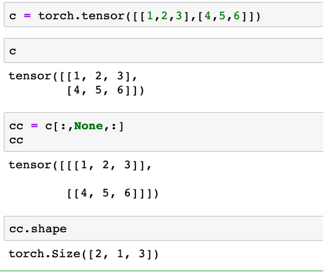

# Pytorch

## pytorch扩展tensor的一个维度或多个维度

在使用神经网络的过程中，经常会用到把一个tensor扩展一个或多个维度的情况，然后把扩展后的维度用来广播。

- 扩展一个维度的情况，使用`unsqueeze()`函数，缩小一个维度使用`squeeze()`函数。参数是dim，是一个int。也就是说只能扩展或缩小一个维度。

```python
t = torch.tensor([[1,2,3]])
t = t.unsqueeze(0)
#t.shape
#[1, 1, 2]
```

+ 如果想扩展多个维度怎么办，答案是用tensor的切片来做，扩展一个维度也可以用切片来做。

```python
# 把一个[2,3]的tensor扩展到[2,1,1,3]的tensor
>>> a = torch.tensor([[1,2,3],[4,5,6]])
>>> a
tensor([[1, 2, 3],
        [4, 5, 6]])
>>> b = a[:,None,None,:]
>>> b
tensor([[[[1, 2, 3]]],


        [[[4, 5, 6]]]])
>>> b.shape
torch.Size([2, 1, 1, 3])
>>> 
```

+ 使用切片来扩展一个维度



#PyTorch中的 forward() 方法详解

问：为什么在定义网络的时候一般需要定义一个forward函数，但是在使用的时候一般不会调用forward？

答：利用了Python中的==\__call__==函数

__ call __ 函数的作用是能够让python中的类的对象能够像方法一样被调用，通过下边的例子来理解一下：

```python
class X(object):
    def __init__(self, a, b, range):
        self.a = a
        self.b = b
        self.range = range
    def __call__(self, a, b):
        self.a = a
        self.b = b
        print('__call__ with （{}, {}）'.format(self.a, self.b))
    def __del__(self, a, b, range):
        del self.a
        del self.b
        del self.range
```

调用： 

```python
>>> xInstance = X(1, 2, 3)
>>> xInstance(1,2)
__call__ with (1, 2)
```

1. xInstance = X(1, 2, 3) 这句代码实例化了xInstance类型的对象X，在实例化时调用了__init__(self, a, b, range)函数；
2. xInstance(1,2)代码使用**类+参数**的语法 直接调用了 __call__(self, a, b)函数，而不需要使用X.__call__(self, a, b)语法，这就是__call__(self, a, b)函数的作用，**能够让python中的类能够像方法一样被调用**

**因为 PyTorch 中的大部分方法都继承自 torch.nn.Module，而 torch.nn.Module  的__call__(self)函数中会返回 forward()函数 的结果，因此PyTroch中的  forward()函数等于是被嵌套在了__call__(self)函数中；因此forward()函数可以直接通过类名被调用，而不用实例化对象**

