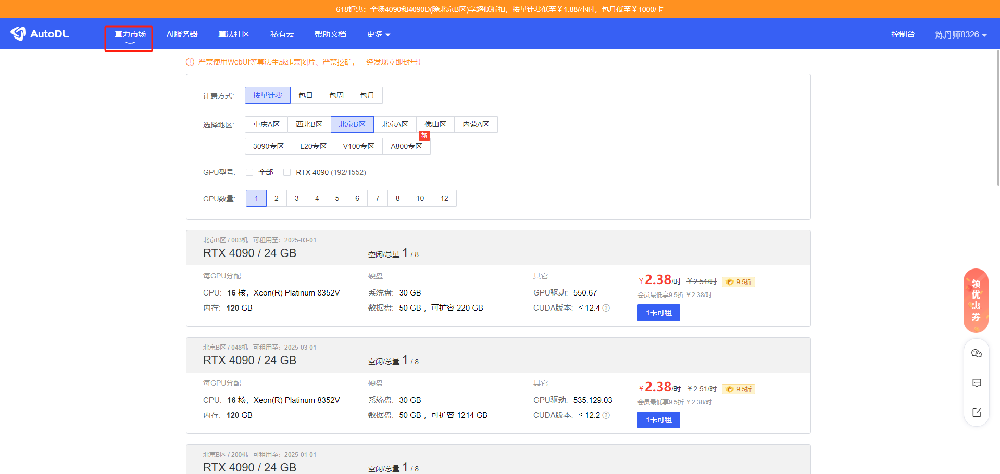
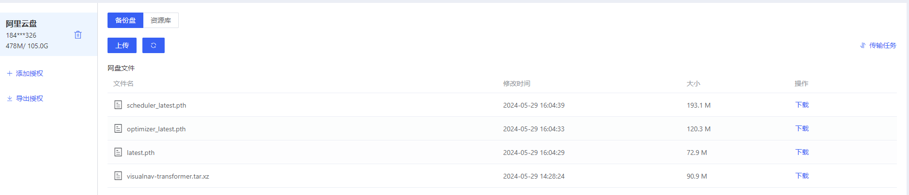

[TOC]

# AutoDL 使用手册

## 准备工作

使用AutoDL之前，需要先去官网注册账号。地址：https://www.autodl.com/home。注册后可以进行学生认证，会有95折优惠。

注册完成后，点击**“算力市场“**，可以根据自己的需求选择显卡的种类。

其中计费的方式有四种，分别为**按量计费**、**包日**、**包周**、**包月**。

- 按量计费就是每个小时收费，每整点扣钱，自己需要预先充值(如果只是偶尔用一下这样比较划算)。
- 如果需要长期使用可以选择剩下三种方式。

**注：**选择按流量计费关机后GPU资源会被释放掉，下次开机的时候可能会遇到没有卡分配给你的情况，需等待分配。

租赁时需要选择镜像，一般选择基础镜像即可，配置如下图，如果用一些流行框架(比如YOLO)，可以从社区镜像中寻找。

选择自己需要的显卡及数量，点击租卡即可。租完后可以在容器实例中查看服务器状态。主要信息如下，包括：服务器状态、显卡详情、磁盘的容量、停机时间、**SSH登陆指令和密码**、以及一些快捷工具。

如果不需要进行训练，可以选择无卡模式开机，计费为0.1元/小时。服务器免费的系统盘30G，数据盘50G，可以花钱扩容。

## 文件上传与下载

使用服务器需要将本地的工程上传到服务器，这里推荐两种传输方式。使用**阿里云盘**或网页版**文件存储**。

### 阿里云（适合大文件传输）

详细步骤可以参考官方说明文档。https://www.autodl.com/docs/netdisk/

快速上手：点击容器实例中快捷工具中的AutoPanel。

再点击公网网盘，选择阿里云盘(官网推荐使用阿里云盘、速度快，容量大)，使用手机APP扫码授权

这里备份盘和资料库都授权即可。

这样我们将工程从本地上传到阿里云盘，然后网页中就能看到共享的文件，如果需要下载到服务器，点击下载即可。

**使用云盘的优势在于，可以快速的上传较大的文件(100M以上)。**

点击下载后，会将我们的文件下载到服务器的/root/autodl-tmp/路径下。

### 文件存储（适合小文件快速传输）

对于小型的文件，可以使用AutoDL中的共享文件区进行快速传输。在网页中容器实例的下边，点击文件存储。

需要注意的是我们要选对服务器的地区，比如我是在北京B区租赁的服务器，就需要选择北京B区，然后点击上传，就可以将本地的文件上上传到服务器(/root/autodl-fs)路径下。

**注：此为共享文件存储区，相同地区下所有租赁的服务器都可以共享这些文件，免费存储20G的文件，且上传下载速度都比较慢。**

## 服务器的使用

上述操作都弄清楚后，就可以开机使用服务器进行训练了。点击开机后，过一小段时间会出现SSH登陆指令和密码。

我们选择**vscode**作为我们的操作终端。

1. 我们在vscode的插件市场中选择Remote-SSH插件进行安装。

2.打开操作栏(键盘ctrl+shift+p)，选择ssh选项。

第一次使用选择添加新的host主机

复制AutoDL中的登陆指令到vscode中

选择第一个选项。

如果是在Ubuntu中，也选择第一个选项即可。

这时右下角出现添加host的弹窗，点击连接会跳出一个新的界面，成功连接服务器！从网页中复制密码，粘贴到窗口中，完成服务器的登陆。

点击左边打开文件夹，所看到的就是服务器中的文件夹目录。

选择需要的文件夹打开即可开始使用！

如果需要在服务器中打开终端，按**ctrl+·**（·在键盘1的左边）即可。

对于训练完成的权重文件，可以复制到/root/autodl-fs/ 目录下，再从网页的文件存储下载到本地。

注：一些经典的数据集可以在服务器/root/autodl-pub 目录中寻找。