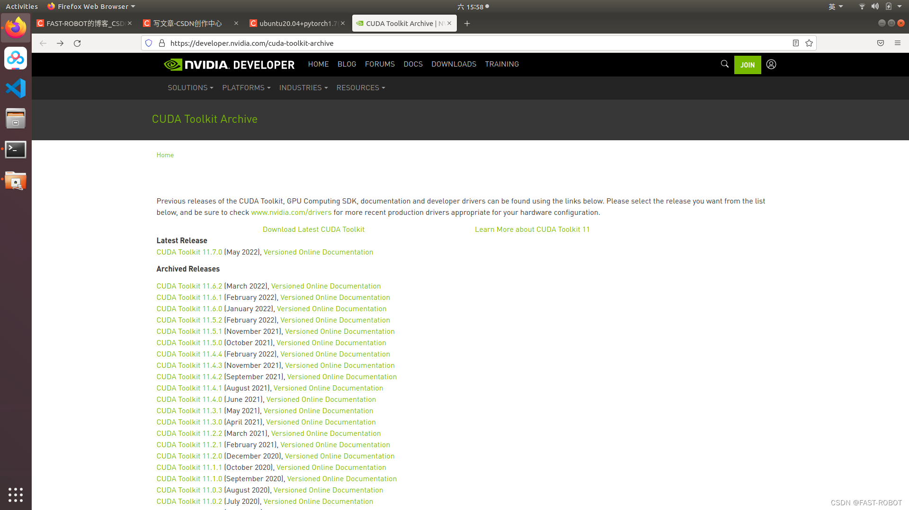
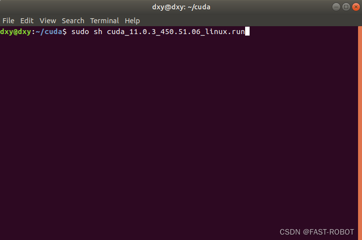

[TOC]


# 一.解决ubuntu无法链接WiFi，无法调节亮度，无法外接显示屏(新下载的ubuntu20.04安装包官方已解决下列问题)

解决办法：升级内核


下载好这四个文件放入到一个文件夹中，然后输入命令

```bash
sudo dpkg -i *.deb
```

然后我们会去换源，当我们进行sudo apt update 这一个命令时，并不会出现任何问题，但是当我们执行sudo apt upgrate 的时候会发生报错。

这个时候我们执行

```bash
sudo apt --fix-broken install
```

其实是因为我们升级内核的时候多执行了一个文件导致的，具体是哪一个文件，报错中也给出了，但是我也一直没看，所以就一直安装的四个文件。

## 1.1解决ubuntu20.04进入的时候黑屏，只有一个_在闪烁的问题。

使用ubuntu高级选项进行修复就可以直接进入到ubuntu了。

在软件与更新中进行换源，切换为阿里源或者清华源

```bash
sudo apt-get update
sudo apt-get upgrade
```

## 1.2Ubuntu 20.04清理多余的内核

此时就有必要清理多余的内核了。对于Ubuntu系统，比如Ubuntu 20.04版本，下面清理内核的方法可供参考：

```bash
（1）uname -r               #查看当前使用的内核版本

（2）dpkg --get-selections|grep linux   #查看系统当前安装有哪些版本的内核

（3）apt-get purge XX         #卸载内核软件包，XX为具体包名
```

类似linux-headers、linux-image等开头且带有版本号的都是跟内核相关的，例如linux-headers-5.4.0-72、linux-headers-5.4.0-72-generic、linux-image-5.4.0-72-generic、linux-modules-5.4.0-72-generic、linux-modules-extra-5.4.0-72-generic，这些都是可以删除的。

**注意：不要删除当前使用的版本**

可以一次删除多个软件包，比如：

```bash
apt-get purge linux-image-5.4.0-88-generic linux-modules-5.4.0-88-generic linux-modules-extra-5.4.0-88-generic
```

我们一次性删除掉现有的5.13版本的内核，会发现它不仅删除了5.13的内核，还会自动安装5.15的内核。

我们重启一下电脑，使用ubuntu高级选项，使用5.15的内核进入系统

操作步骤

首先使用如下命令可以查看系统目前正在使用的内核：

```bash
uname -r
```

输出如下：

```bash
zqfeng@zqfeng-hp-laptop:~$ uname -r
5.15.0-41-generic
```

使用如下命令可以查看系统可用的内核：

    dpkg --get-selections | grep linux-image

然后按照上面的步骤，我们将5.17的内核删除掉

## 1.3安装NVIDIA显卡驱动

删除掉17内核之后，我们再去安装NVIDIA显卡驱动

首先去官网https://www.nvidia.com/Download/index.aspx?lang=en-us找适合自己的显卡驱动，要求是run。

## 1.4禁用nouveau

nouveau 禁止命令写入文件

```bash
sudo gedit /etc/modprobe.d/blacklist.conf
```

文件末尾添加以下语句：

```bash
blacklist nouveau 
blacklist lbm‐nouveau 
options nouveau modeset=0 
alias nouveau off
alias lbm‐nouveau off
```

对刚才修改的文件进行更新:

```bash
sudo update-initramfs -u
```

reboot重启计算机，打开终端检查nouveau是否被禁用

```bash
lsmod | grep nouveau 
```

若执行完该句，终端没有任何输出，则nouveau被成功禁用

## 1.5安装准备

### 1.安装gcc、g++、make

```bash
sudo apt-get  install  build-essential 
gcc --version 验证gcc是否安装成功
sudo apt-get install g++
sudo apt-get install make
sudo apt-get install lightdm
```

### 2.卸载旧的驱动

如果你是第一次安装gpu驱动，这一步可以省略。当然如果你不是第一次安装驱动,需要卸载之前的驱动（不卸载实测也能用）

```bash
sudo apt-get remove --purge nvidia*
```

## 1.6.安装驱动

安装驱动必须要关闭图形界面，否则安装不成功。
 进入 tty 模式

```bash
ctrl + alt+ F1 或 ctrl + alt+ F2 或 ctrl + alt+ F3，视情况
```

输入

```bash
sudo service lightdm stop
```

切换 NVIDIA 安装包指定目录,赋予权限并进行安装

```bash
cd ~/Downloads 
mv NVIDIA-Linux-x86_64-470.63.01.run nvidia.run 
chmod +x nvidia.run 
sudo sh nvidia.run ‐‐no‐opengl-files
```

no 前面是双杠号
 遇到显示32bits那个选项选择NO，其他选择YES，然后等待安装

```bash
 安装完成后，重启，使用nvidia-smi查看
```

## 1.7Discrete Graphics选择

我的电脑是Y9000P，上面所述的操作都正常，但最后发现电脑属性还是显示集成显卡，屏幕也只能检测到一个。后面在系统设置里把显卡模式选为Discrete Graphics后，两个问题都解决了：电脑属性为独立显卡，双屏幕也可正常使用。
注意注意注意
先在系统里面选择Discrete Graphics模式，然后再在ubuntu系统里面设置显卡优先级。否则可能出现一直卡在登录logo界面，反正我的电脑是这种情况。


### 优先级设置

使用一下命令，将nvidia显卡优先级设置为优先。然后reboot一下。

```bash
sudo prime-select nvidia
reboot
```
当设置为独显模式，因为ubuntu与NVIDIA显卡驱动不兼容的问题，我们需要安装一个插件来调节我们的屏幕亮度：
```bash
https://github.com/LordAmit/Brightness
```

下载完成之后：
```bash
sudo apt install python3-qtpy
```

使用

```python
python3 src/init.py
```

便可以控制屏幕亮度。

# Ubuntu下安装gflags glog

通过apt安装的glog，gflags没有config.cmake，所以在一些情况下需要手动编译
## 1.卸载gflags&glog

只适用于通过apt安装的方式

```bash
sudo apt-get remove libgoogle-glog-dev
sudo apt-get remove libgflags-dev
```

然后通过以下命令检查是否删除了：

```bash
locate gflags | grep /usr
```

## 2.安装gflags

    git clone https://github.com/gflags/gflags.git
    cd gflags
    mkdir build && cd build
    cmake .. -DGFLAGS_NAMESPACE=google -DCMAKE_CXX_FLAGS=-fPIC ..
    make -j4
    sudo make install

## 3.安装glog

```bash
git clone https://github.com/google/glog
cd glog
mkdir build && cd build
cmake .. 
make -j4
sudo make install
```


# Ubuntu安装：sogoupinyin 

直接下载最新安装包，sogoupinyin_xxxx_amd64.deb，通过命令行安装搜狗输入法

```bash
sudo dpkg -i sogoupinyin_2.4.0.3469_amd64.deb
```

一、下载[搜狗输入法](https://www.fons.com.cn/tag/搜狗输入法)Linux版本

https://pinyin.sogou.[co](https://www.fons.com.cn/tag/co)m/[linux](https://www.fons.com.cn/tag/linux)/?r=pinyin

二、将下载好的[搜狗输入法](https://www.fons.com.cn/tag/搜狗输入法)[安装包](https://www.fons.com.cn/tag/安装包)移动到/opt目录

三、安装fcitx输入框架，及相关的依赖库

```
sudo apt install fcitx-bin
sudo apt-get install fcitx-table
```

四、安装搜搜输入法安装包

```bash
sudo dpkg -i sogoupinyin_4.0.0.1605_amd64.deb
#缺少依赖，可以使用检查修复依赖项：
sudo apt-get install -f
```

五、点击“设置”—“区域与语言”—“管理已安装的语言”

[](https://www.fons.com.cn/168798.html)

六、将“[键盘](https://www.fons.com.cn/tag/键盘)输入法系统”设置为“fcitx”，然后点击“应用到整个系统”

七、上面的配置完成后，重启下系统

八、点击右上角的[键盘](https://www.fons.com.cn/tag/键盘)图标，点击选择“配置当前输入法”

九、就搜狗输入法移动到最上面

[](https://www.fons.com.cn/168798.html)


十一、再运行如下命令，安装依赖，就可以正常使用了

```bash
sudo apt install libqt5qml5 libqt5quick5 libqt5quickwidgets5 qml-module-qtquick2
sudo apt install libgsettings-qt1
```

# ubuntu下安装截图软件

终端直接输入：

```bash
sudo apt install flameshot 
```

# Ubuntu下安装yaml-cpp

安装yaml-cpp依赖于boost库，确保Boost library已经存在，否则会报错。(yaml-cpp 0.6.0 has been released! This release requires C++11, and no longer depends on Boost.)

**安装BOOST**

  使用命令安装 

````bash
sudo apt-get install libboost-dev
````

**安装yaml-cpp**

文件安装

```bash
1.下载文件
git clone https://github.com/jbeder/yaml-cpp.git
2.创建build目录
cd yaml-cpp
mkdir build
3.编译
cd build
cmake -DBUILD_SHARED_LIBS=ON ..
这里的参数on代表创建动态链接库，默认是off，即创建静态链接库
4.安装
make
sudo make install
sudo ldconfig
如果是共享库文件安装到了/lib或/usr/lib目录下, 那么需执行一下ldconfig命令
5.引用
#include "yaml-cpp/yaml.h"
```

# Ubuntu下安装Typora

```bah
sudo dpkg -i typora_1.2.3_amd64.deb
```


# Ubuntu安装ros(鱼香ros一键安装)

## 1.添加 软件源sources.list（设置你的电脑可从packages.ros.org 接收软件.）

 终端输入                                                 

```bash
sudo sh -c '. /etc/lsb-release && echo "deb http://mirrors.ustc.edu.cn/ros/ubuntu/ $DISTRIB_CODENAME main" > /etc/apt/sources.list.d/ros-latest.list'
```

## 2.添加 密钥

 终端输入

```bash
sudo apt-key adv --keyserver 'hkp://keyserver.ubuntu.com:80' --recv-key C1CF6E31E6BADE8868B172B4F42ED6FBAB17C654
```

添加成功


## 3.从软件源更新一下软件包

 终端输入

```sql
sudo apt update
```

包含ROS的软件包更新成功

## 4.安装ROS桌面完整版 :

 包含ROS、rqt、rviz、机器人通用库、2D/3D 模拟器、导航以及2D/3D感知等(注意：以20.04安装版本: noetic为例，由于每个Ubuntu版本需安装对应的ROS版本18.04应安装版本：melodic（18.04将下面代码中noetic改为melodic即可））

 终端输入

```bash
sudo apt install ros-noetic-desktop-full

```


## 5.初始化rosdep

 终端输入

```swift
 sudo rosdep init
```


### 解决办法

 20.04终端输入

```undefined
sudo apt install python3-rosdep2
```

  18.04终端输入

```undefined
sudo apt install python-rosdep2
```

然后再次初始化rosdep

```swift
 sudo rosdep init
```


### 解决办法

 终端输入

```groovy
sudo rm /etc/ros/rosdep/sources.list.d/20-default.list
```

再次sudo rosdep init

### 无论用什么方法都无法sudo rosdep init，只能祭出终极大招（自己创建20-default.list文件）（创建完成后直接进入rosdep update  ）

终端依次输入

    cd /etc/ros/rosdep/sources.list.d
    sudo touch 20-default.list

然后打开20-default.list添加内容

终端输入

```BASH
sudo gedit 20-default.list 
```

打开sudo gedit 20-default.list 后将下面内容添加到20-default.list 中然后Ctrl+S 保存退出进入第六步

```yaml
# os-specific listings first
yaml https://raw.githubusercontent.com/ros/rosdistro/master/rosdep/osx-homebrew.yaml osx
 
# generic
yaml https://raw.githubusercontent.com/ros/rosdistro/master/rosdep/base.yaml
yaml https://raw.githubusercontent.com/ros/rosdistro/master/rosdep/python.yaml
yaml https://raw.githubusercontent.com/ros/rosdistro/master/rosdep/ruby.yaml
gbpdistro https://raw.githubusercontent.com/ros/rosdistro/master/releases/fuerte.yaml fuerte
 
# newer distributions (Groovy, Hydro, ...) must not be listed anymore, they are being fetched from the rosdistro index.yaml instead
```
## 6.更新rosdep

终端输入

```sql
rosdep update
```


```
链接：https://pan.baidu.com/s/1ZjMcvqOvLRa_iTdXis8ufg 
    提取码：01e2
```

2.改去rosdep update获取文件的网址换为本地地址：

终端输入(注意:下面代码以Ubuntu20.04为例，**18.04将下面代码中python3改为python2.7即可**)

```bash
sudo gedit /usr/lib/python3/dist-packages/rosdep2/rep3.py
REP3_TARGETS_URL = 'https://raw.githubusercontent.com/ros/rosdistro/master/releases/targets.yaml' 替换成 REP3_TARGETS_URL = 'file:///home/jianing/robot/releases/targets.yaml'(你自己的存放地址)

```


终端输入(注意:下面代码以Ubuntu20.04为例，18.04将下面代码中python3改为python2.7即可)

```groovy
sudo gedit /usr/lib/python3/dist-packages/rosdistro/__init__.py
修改：
DEFAULT_INDEX_URL = 'https://raw.githubusercontent.com/ros/rosdistro/master/index-v4.yaml'替换成 DEFAULT_INDEX_URL = 'file:///home/jianing/robot/index-v4.yaml'（此处jianing改为你的用户名因为此处的具体地址为你下载到本地的文件的地址。）

```


终端输入

```bash
sudo gedit /etc/ros/rosdep/sources.list.d/20-default.list
```

输入回车后会弹出20-default.list文件将原来文件中的所有 raw.githubusercontent.com开头的网址替换成对应文件在本地的路径（可将下面代码更换20-default.list中的代码注意：代码中的jianing全部更换为你的用户名）

```bash
# os-specific listings first
yaml file:///home/jianing/ros/rosdep/osx-homebrew.yaml osx
 
# generic
yaml file:///home/jianing/ros/rosdep/base.yaml
yaml file:///home/jianing/ros/rosdep/python.yaml
yaml file:///home/jianing/ros/rosdep/ruby.yaml
gbpdistro file:///home/jianing/ros/releases/fuerte.yaml fuerte
 
# newer distributions (Groovy, Hydro, ...) must not be listed anymore, they are being fetched from the rosdistro index.yaml instead
```


然后再次rosdep update一般99%几率成功，如果不成功可评论或私信我

rosdep update成功 


6.配置环境变量

终端输入（下面代码以20.04为例18.04将下面代码中noetic改为melodic即可）

echo "source /opt/ros/noetic/setup.bash" >> ~/.bashrc

然后终端输入

source ~/.bashrc

## 7.安装rosinstall

20.04终端输入

```bash
sudo apt install python3-rosinstall python3-rosinstall-generator python3-wstool build-essential
```

18.04终端输入

```bash
sudo apt install python-rosinstall python-rosinstall-generator python-wstool build-essential
```

至此ROS安装完毕

## 8.运行一下roscore验证一下ROS是否安装成功

Ctrl+Alt+T新建一个终端输入

```undefined
roscore
```

出现错误Command 'roscore' not found,

解决方法 ：重新安装ROS桌面完整版即可

20.04终端输入

```bash
sudo apt install ros-noetic-desktop-full
```

18.04终端输入

```bash
sudo apt install ros-melodic-desktop-full
```

roscore运行成功界面


# Ubuntu安装opencv3.4.5

## 1、安装依赖项

```bash
sudo apt-get install build-essential libgtk2.0-dev libjpeg-dev  libtiff5-dev libopenexr-dev libtbb-dev
sudo apt-get install libavcodec-dev libavformat-dev libswscale-dev libgtk-3-dev libgstreamer1.0-dev libgstreamer-plugins-base1.0-dev pkg-config
```

事实上，OpenCV的依赖项很多，但是我们并不会用到所有功能，所以以上依赖对于正常的科研项目已经足够了

## 2、cmake分析

将源代码解压，这里我解压到home目录下，然后创建build文件夹，进行cmake分析，在cmake阶段会检查依赖项是否安装，并调整自己的功能。

```bash
cd opencv-3.4.5/
mkdir build
cd build
cmake ..
```

cmake检查完成，就会显示配置和生成已结束。

## 3、make编译

```bash
sudo make -j8
```

可以-j8开启8线程进行编译（-j后面的参数就是使用的线程数量），加快编译速度。这个过程相对比较漫长，中间可能会出现各种warning的提示，但只要最后100%就OK。

## 4、make install安装

```bash
sudo make install
```

## 5、配置环境变量

**1、修改/etc/ld.so.conf文件**

```bash
sudo gedit /etc/ld.so.conf
```

在文件中加上一行 `include /usr/local/lib`，/usr/local是opencv的默认安装路径，这样告诉系统以后去lib目录下找opencv的库文件。

输入命令使得conf生效：

```bash
sudo ldconfig
```

**2、修改bash.bashrc文件**

```bash
sudo gedit /etc/bash.bashrc 
```

在文件末尾加上：

```bash
PKG_CONFIG_PATH=$PKG_CONFIG_PATH:/usr/local/lib/pkgconfig
export PKG_CONFIG_PATH
```

然后source使得bash生效：

```bash
source /etc/bash.bashrc
```

## 6、验证安装

输入命令查看opencv版本信息：

```bash
pkg-config opencv --modversion
```

显示版本，表示安装成功！

# Ubuntu安装Ceres

## 1.Ctrl+Alt+T打开终端：

安装依赖：

```BASH
sudo apt-get install  liblapack-dev libsuitesparse-dev libcxsparse3 libgflags-dev libgoogle-glog-dev libgtest-dev

```

## 2.下载源码：

https://github.com/ceres-solver/ceres-solver

## 3.进入ceres-solve目录：

```bash
mkdir build

cd build

cmake ..

make -j8

sudo make install
```

#include <opencv2/line_descriptor.hpp> 找不到问题

1， 下载 line_descriptor 拓展包
https://github.com/opencv/opencv_contrib/tree/4.x/modules/line_descriptor

2， 找到以前安装的 opencv源码路径，并将1中下载好的 line_descriptor 安装包放入到 modules 模块中.
例如，我的opencv 库路径为， /home/ubuntu/opencv-3.4.5/modules

3，重新编译opencv
在build文件夹下，

```bash
cmake ..
make -j8
sudo make install
```

# Ubuntu安装Eigen

```bash
git clone https://github.com/eigenteam/eigen-git-mirror

#安装

cd eigen-git-mirror
mkdir build
cd build
cmake ..
sudo make install

#安装后,头文件安装在/usr/local/include/eigen3/
#移动头文件

 sudo cp -r /usr/local/include/eigen3/Eigen /usr/local/include 

```


# Ubuntu安装Pangolin

```bash
安装Pangolin所需依赖
sudo apt install libgl1-mesa-dev
sudo apt install libglew-dev
//sudo apt install cmake //注意以前装了就不需要安装了
sudo apt install libpython2.7-dev
//sudo apt install python-pip
//sudo python -mpip install numpy pyopengl Pillow pybind11
sudo apt install pkg-config
sudo apt install libegl1-mesa-dev libwayland-dev libxkbcommon-dev wayland-protocols
//sudo apt install ffmpeg libavcodec-dev libavutil-dev libavformat-dev libswscale-dev libavdevice-dev
//sudo apt install libdc1394-22-dev libraw1394-dev
//sudo apt install libjpeg-dev libpng-dev libtiff5-dev libopenexr-dev
# 默认git版本为0.6
//git clone https://github.com/stevenlovegrove/Pangolin.git  
//坑呀！太坑了！不能安装Pangolin master 版本
git clone https://github.com/stevenlovegrove/Pangolin/tree/v0.6.git    
cd Pangolin
mkdir build && cd build
cmake ..
make -j4
sudo make install
#检测是否成功
cd examples/HelloPangolin
./HelloPangolin

```


# Ubuntu编译Vins-mono

经过前面的安装，Vins-mono所需要的依赖基本已经安装完毕了。但是Ubuntu20与Ubuntu18的ros是不同的，对于ros_msgs格式的图片与OpenCV格式的图片进行转换的话，我们需要使到CV_bridge。Ubuntu20.04使用的是OpenCV4，而Ubuntu18是基于OpenCV3.2开发的，所以我们直接去编译，会报错。

所以我们安装了OpenCV3.4.5，但是Ubuntu20.04中的CV_bridge是不会被修改为OpenCV3的，我们需要自己下载程序包，进行编译，来替代ros-noetic中的CV_bridge。具体过程如下所示：

步骤一： 下载源码

将cv_bridge源码下载到ROS工作空间
cv_bridge下载地址：https://gitee.com/bingobinlw/cv_bridge 或者 github自己寻找对用版本 https://github.com/ros-perception/vision_opencv
步骤二： 编译源码

修改cv_bridge的CMakeList.txt文件，在开头部分加入依赖的新的OpenCV位置，参照如下格式：

```bash
set(OpenCV_DIR "/home/jianing/package/opencv-3.4.5")#使用opencv3.4.5适配cv_bridge
if(NOT ANDROID)
  find_package(PythonLibs)

  if(PYTHONLIBS_VERSION_STRING VERSION_LESS "3.8")
    # Debian Buster
    find_package(Boost REQUIRED python37)
  else()
    # Ubuntu Focal
    find_package(Boost REQUIRED python)
  endif()
else()
find_package(Boost REQUIRED)
endif()

set(_opencv_version 3)#将4改为使用opencv3.4.5
find_package(OpenCV 3.4.5 QUIET)#将4改为使用opencv3.4.5
if(NOT OpenCV_FOUND)
  message(STATUS "Did not find OpenCV 3, trying OpenCV 3")
  set(_opencv_version 3)
endif()
```

然后直接`catkin_make`
 此时在`/home/d/tool/catkin_ws/devel/share/cv_bridge/cmake`已经生成了`cv_bridgeConfig.cmake`文件

在终端的配置文件中加入环境变量的设置

```bash
echo "source /WORKSPACE/devel/setup.bash">>~/.bashrc
```

在vins-mono中的每mpMap->AddKeyFrame(pKFini);
        mpMap->AddKeyFrame(pKFcur);一个CmakeList.txt调用**（使用到cv_bridge的）**：

```cmake
cmake_minimum_required(VERSION 2.8.3)
project(ar_demo)

set(CMAKE_BUILD_TYPE "Release")
set(CMAKE_CXX_FLAGS "-std=c++11 -DEIGEN_DONT_PARALLELIZE")
#-DEIGEN_USE_MKL_ALL")
set(CMAKE_CXX_FLAGS_RELEASE "-O3 -Wall -g")
set(cv_bridge_DIR /home/jianing/package/catkin_ws/devel/share/cv_bridge/cmake)#添加指引路径
find_package(catkin REQUIRED COMPONENTS
  roscpp
  rospy
  std_msgs
  image_transport
  sensor_msgs
  cv_bridge
  message_filters
  camera_model
)
find_package(OpenCV 3.4.5 REQUIRED)#指定使用的OpenCV版本

```

# Ubuntu编译Orb-slam2

```bash
git clone https://github.com/raulmur/ORB_SLAM2.git ORB_SLAM2
cd ORB_SLAM2
chmod +x build.sh
./build.sh
```

编译的时候如果出现usleep error：

error: ‘usleep’ was not declared in this scope

不要慌：将`system.h`头文件修改，加入下面的代码

```c++
#include<unistd.h>
```

将LoopClosing.h文件里的代码做一点小小的修改：


限定OpenCV的版本

```c++
find_package(OpenCV 3.4.5 QUIET)
```

再去编译就会通过了。

# Ubuntu编译Vins-Fusion与Gvins

与编译vins-mono一样，只需要在CmakLists.txt中加入

```cmake
set(cv_bridge_DIR /home/jianing/package/catkin_ws/devel/share/cv_bridge/cmake)#添加指引路径
find_package(OpenCV 3.4.5 REQUIRED)#指定使用的OpenCV版本
```

# Ubuntub编译ORB-slam3

## 1安装RealSense SDK

首先安装以下几个包

```bash
sudo apt-get install libudev-dev pkg-config libgtk-3-dev
sudo apt-get install libusb-1.0-0-dev pkg-config
sudo apt-get install libglfw3-dev
sudo apt-get install libssl-dev
```

然后拉取librealsense

```bash
git clone https://github.com/IntelRealSense/librealsense.git

```

安装依赖

```bash
sudo apt-get install libudev-dev pkg-config libgtk-3-dev
 sudo apt-get install libusb-1.0-0-dev pkg-config
 sudo apt-get install libglfw3-dev
 sudo apt-get install libssl-dev

```

编译

```bash
cd librealsense
mkdir build
cd build
cmake ../ -DBUILD_EXAMPLES=true
make
sudo make install

```

然后连接摄像头，输入以下指令来查看一下是否安装成功

```bash
realsense-viewer 
```

## 2安装ROS Wrapper

1.创建catkin_ws:

```bash
mkdir -p catkin_ws/src

cd catkin_ws/src
```

2.下载realsense-ros安装包和ddynamic_reconfigure包放在src文件夹下,采用源码下载


```bash
realsense-ros网址：

git clone https://github.com/IntelRealSense/realsense-ros

ddynamic_reconfigure网址：

git clone https://github.com/pal-robotics/ddynamic_reconfigure
```

3.编译

```bash
catkin_make
```

4.测试

```bash
roslaunch realsense2_camera rs_camera.launch
```


然后点击终端file->new tab，打开另外一个终端：

```bash
rostopic list
```

该命令可以查看当前发布的topic有哪些。
## 3.改写CmakeLists.txt

```cmake
set(OpenCV_DIR /home/jianing/package/opencv-3.4.5/build)#指向你的OpenCV的路径
find_package(OpenCV 3.0)#指定最低的版本，原本是4
```

## 4.运行 

```cpp
cd ORB_SLAM3
chmod +x build.sh
./build.sh
```

原文链接：https://blog.csdn.net/weixin_53660567/article/details/120254512

```bash
sudo apt-get install ros-noetic-octomap ros-noetic-octomap-mapping ros-noetic-octomap-msgs  ros-noetic-octomap-ros ros-noetic-octomap-rviz-plugins ros-noetic-octomap-server
```

pip install -U numpy


# Ubuntu配置深度学习环境

## 安装CUDA


通过命令`nvidia-smi`查看支持的`cuda`版本，我这里最大支持11.7。

**2. 打开[英伟达官网](https://developer.nvidia.com/cuda-toolkit-archive) 下载官方cuda**



此处我下载的是cuda 11.3 版本，并选择相应配置，复制指令至终端下载


如果遇到下载失败的问题，可以将下载网址复制，然后在浏览器打开，就可以下载成功了。

**3. 运行官网安装指令**



 **4. 依次选择continue和accept 点击确认**


 **5. 按回车取消Driver项的安装，然后回车选择Install**

不要安装显卡驱动，前面已经安装过显卡驱动了。


 **6. 添加环境变量**

`sudo  gedit ~/.bashrc`打开文件，在文件结尾添加如下语句：

```bash
export PATH=$PATH:/usr/local/cuda-11.3/bin
export LD_LIBRARY_PATH=$LD_LIBRARY_PATH:/usr/local/cuda-11.3/lib64
export LIBRARY_PATH=$LIBRARY_PATH:/usr/local/cuda-11.3/lib64
```

**7.  保存、更新环境变量**

```bash
source ~/.bashrc
```

**8. 输入nvcc -V查看版本号**


##  **安装 cudnn**

**1. 进入[官网](https://developer.nvidia.com/rdp/cudnn-archive) ，寻找合适的 cudnn 版本，下载对应版本的cudnn 的 Linux、runtime 、developer 和samples**


**2. 下载得到四个文件****2. 下载得到四个文件**

**3. 安装上述软件包**

```bash
tar -zxvf cudnn-11.3-linux-x64-v8.2.1.32.tgz
sudo cp -rf cuda/include/cudnn* /usr/local/cuda/include/
sudo cp -rf cuda/lib64/libcudnn* /usr/local/cuda/lib64/
sudo chmod a+r /usr/local/cuda/include/cudnn*
sudo chmod a+r /usr/local/cuda/lib64/libcudnn*
 
sudo dpkg -i libcudnn8_8.2.1.32-1+cuda11.3_amd64.deb
sudo dpkg -i libcudnn8-dev_8.2.1.32-1+cuda11.3_amd64.deb
sudo dpkg -i libcudnn8-samples_8.2.1.32-1+cuda11.3_amd64.deb
```


4. 测试

拷贝例程到用户目录

```bash
cp -r /usr/src/cudnn_samples_v8/ $HOME
```

5. 转到minist例程

```bash
cd  $HOME/cudnn_samples_v8/mnistCUDNN
```

6. 编译例程

```bash
sudo make clean && make
```


**7. 运行例程**

```bash
./mnistCUDNN
```

**8. 如果cudnn被恰当的安装，将输出打印消息：Test passed!**


9. cudnn 检测版本号

    ```bash
    cat /usr/local/cuda/include/cudnn.h | grep CUDNN_MAJOR -A 2
    cat /usr/local/cuda/include/cudnn_version.h | grep CUDNN_MAJOR -A 2
    ```

    

## 卸载CUDA

先进入安装目录下的bin文件夹中

```bash
cd  /usr/local/cuda-11.3/bin
```

再执行cuda自带的卸载程序

```bash
sudo ./cuda-uninstaller
```

因为还会有一些安装包的剩余，我们需要进入到安装目录下

```bash
 cd /usr/local/
```

删除对应的cuda版本文件夹

```bash
sudo rm -r cuda-11.3
```

在这种情况下，还是会有一些剩余的文件，
 通过下面命令查看卸载残留和删除，即可正常安装。
 查看剩余的残留

```bash
sudo dpkg -l |grep cuda
```

卸载对应的残留

```bash
sudo dpkg -P cuda-visual-tools-11-3
```

## 卸载cudnn

```bash
sudo rm -rf /usr/local/cuda/include/cudnn.h
sudo rm -rf /usr/local/cuda/lib64/libcudnn*
```

## 安装PyTorch

https://pytorch.org/get-started/previous-versions/

找到对应版本的Pytorch直接用命令安装,加上sudo 安装


## 安装Tensorrt

使用TAR方式进行安装。

+ 版本选择：版本选择是有严格要求的，必须保证平台，CUDA版本，CUDNN版本，完全和要求一致才可以安装。相关的查询参考页面：文档页面中的**TensorRT Support Matrix** 选项。注意：Update版本不等于本身版本，比如我安装的CUDA 11.1版本，因此我只能选择TensorRT 7.2.1版本进行安装。
  https://docs.nvidia.com/deeplearning/tensorrt/archives/index.html


+ 安装过程总结

  - 下载TAR格式文件：[下载链接](https://developer.nvidia.com/nvidia-tensorrt-7x-download)
  - 运行指令

  ```bash
  tar xzvf TensorRT-8.0.1.6.Linux.x86_64-gnu.cuda-11.3.cudnn8.2.tar.gz
  cd TensorRT-8.0.1.6
  # in python3.6
  sudo pip install python/tensorrt*cp38*.whl
  sudo pip install uff/*uff*.whl
  sudo pip install graphsurgeon/*graphsurgeon*.whl
  sudo cp -r lib/* /usr/lib
  sudo cp -r include/* /usr/include
  
  ```

  将下面环境变量写入环境变量文件~/.bashrc并保存

  ```bash
  export LD_LIBRARY_PATH=TensorRT解压路径/lib:$LD_LIBRARY_PATH
  例如：
  export LD_LIBRARY_PATH=/home/bai/TensorRT-7.2.3.4/lib:$LD_LIBRARY_PATH
  ```

  

## 安装torch2trt

安装链接：[torch2trt](https://github.com/NVIDIA-AI-IOT/torch2trt)

安装命令：

```bash
git clone https://github.com/NVIDIA-AI-IOT/torch2trt
cd torch2trt
sudo python setup.py install 
```

## 安装YOLOX

1. 克隆YOLOX

```bash
git clone https://github.com/Megvii-BaseDetection/YOLOX.git
```

或者直接下载YOLOX的代码并解压。
在YOLOX目录下执行：

```bash
sudo protoc --version
sudo pip3 install -U pip && sudo pip3 install -r requirements.txt -i https://pypi.tuna.tsinghua.edu.cn/simple
sudo python3 setup.py develop
```

2.安装apex(如果不训练模型，可跳过这一步)

```bash
git clone https://github.com/NVIDIA/apex
cd apex
pip3 install -v --disable-pip-version-check --no-cache-dir --global-option="--
cpp_ext" --global-option="--cuda_ext" ./
```

注意：cuda的版本应和cudatoolkit一致

3. 安装pycocotools

```bash
sudo pip3 install cython
git clone https://github.com/cocodataset/cocoapi.git
cd cocoapi/PythonAPI
python3 setup.py install --user
```

4. 下载预训练权重文件

在github上可以直接下载权重文件

下载yolox_s.pth.tar，yolox_m.pth.tar，yolox_l.pth.tar，yolox_x.pth.tar,yolox_darknet53.47.3.pth.tar, yolox_nano.pth.tar, yolox_tiny.pth.tar权重文件，并放置在YOLOX/weights文件夹下

**安装测试**

测试图片：

```bash
sudo python tools/demo.py image -n yolox-s -c weights/yolox_s.pth.tar --path assets/dog.jpg --conf 0.3 --nms 0.65 --tsize 640 --save_result
```

或者：
```bash
sudo python tools/demo.py image -f exps/default/yolox_s.py -c weights/yolox_s.pth.tar --path assets/dog.jpg --conf 0.3 --nms 0.65 --tsize 640 --save_result
```

## 部署yolox

1.修改`demo/TensorRT/cpp/CMakeLists.txt`

```cmake
# cuda
include_directories(/usr/local/cuda/include)
link_directories(/usr/local/cuda/lib64)
```

注意：/usr/local/cuda软链接

```cmake
# cudnn
#include_directories(/usr/local/cuda/cudnn/v8.0.4/include)
#link_directories(/usr/local/cuda/cudnn/v8.0.4/lib64)
```

```cmake
#tensorrt
include_directories(/home/bai/TensorRT-7.2.3.4/include)
link_directories(/home/bai/TensorRT-7.2.3.4/lib)
```

2. 执行以下命令

```bash
cd ~/YOLOX/demo/TensorRT/cpp/
cmake .
make
```

### 生成yolox可执行文件

**生成模型engine文件**

```bash
sudo python tools/trt.py -f exps/example/yolox_voc/yolox_voc_s_bm.py -c YOLOX_outputs/yolox_voc_s_bm/best_ckpt.pth
```

编译yolox

修改demo/TensorRT/cpp/yolox.cpp文件

修改类别数目

```c++
static void generate_yolox_proposals(std::vector<GridAndStride> grid_strides,
float* feat_blob, float prob_threshold, std::vector<Object>& objects)
{
const int num_class = 80;
```

修改类别名称:

```c++
static void draw_objects(const cv::Mat& bgr, const std::vector<Object>& objects,
std::string f)
{
static const char* class_names[] = {
"person", "bicycle", "car", "motorcycle", "airplane", "bus", "train",
"truck", "boat", "traffic light",
"fire hydrant", "stop sign", "parking meter", "bench", "bird", "cat",
"dog", "horse", "sheep", "cow",
"elephant", "bear", "zebra", "giraffe", "backpack", "umbrella",
"handbag", "tie", "suitcase", "frisbee",
"skis", "snowboard", "sports ball", "kite", "baseball bat", "baseball
glove", "skateboard", "surfboard",
"tennis racket", "bottle", "wine glass", "cup", "fork", "knife", "spoon",
"bowl", "banana", "apple",
"sandwich", "orange", "broccoli", "carrot", "hot dog", "pizza", "donut",
"cake", "chair", "couch",
"potted plant", "bed", "dining table", "toilet", "tv", "laptop", "mouse",
"remote", "keyboard", "cell phone",
"microwave", "oven", "toaster", "sink", "refrigerator", "book", "clock",
"vase", "scissors", "teddy bear",
"hair drier", "toothbrush"
};
```
修改：

```c++
const float color_list[1][3] =
{
    {0.000, 0.447, 0.741}
    
};
```

```bash
./demo/TensorRT/cpp/yolox YOLOX_outputs/yolox_voc_s_bm/model_trt.engine -i testfiles/img1.jpg
```

# 运行INGVIO

1.如果系统是20则需要：

+ feature_track的CMakeLists需要添加`set(cv_bridge_DIR /home/jianing/package/catkin_ws/devel/share/cv_bridge/cmake)`

2.安装：`sudo apt-get install ros-xxx-*tf*-conversions`

3.在`ingvio_estimator/CMakeLists.txt`中添加：

`find_package(catkin QUIET COMPONENTS roscpp tf tf_conversions)`
