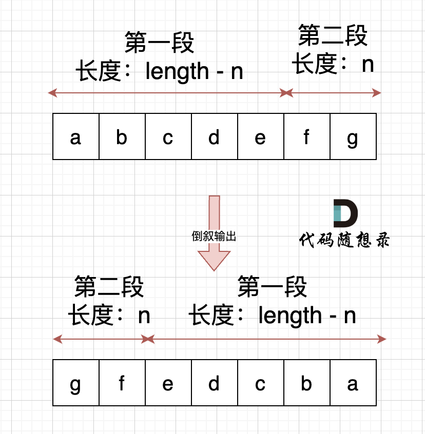
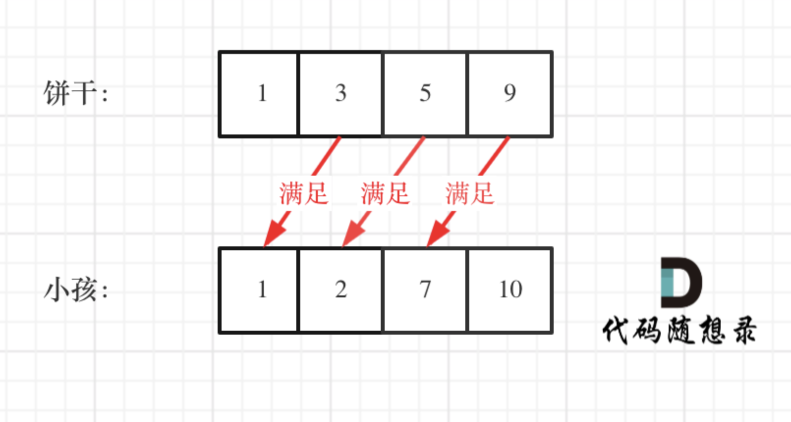
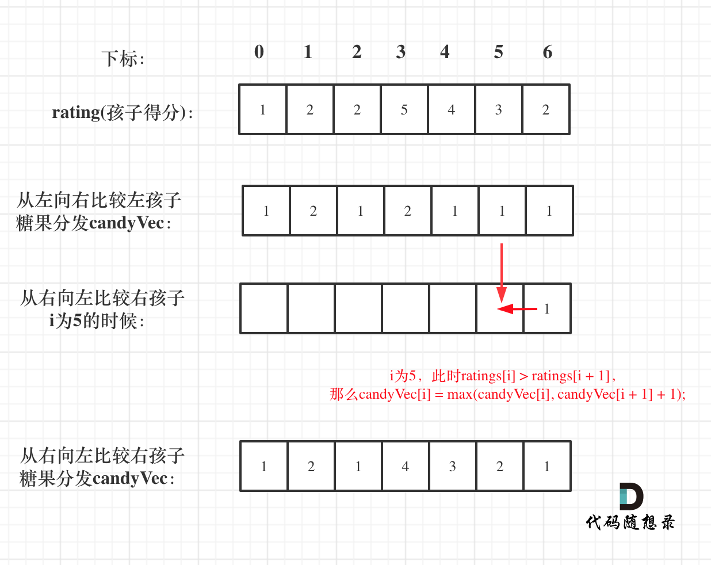
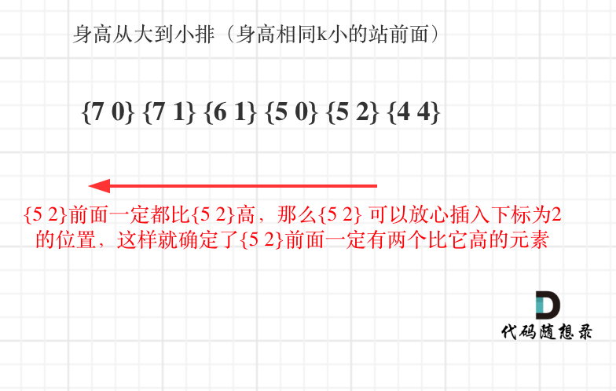
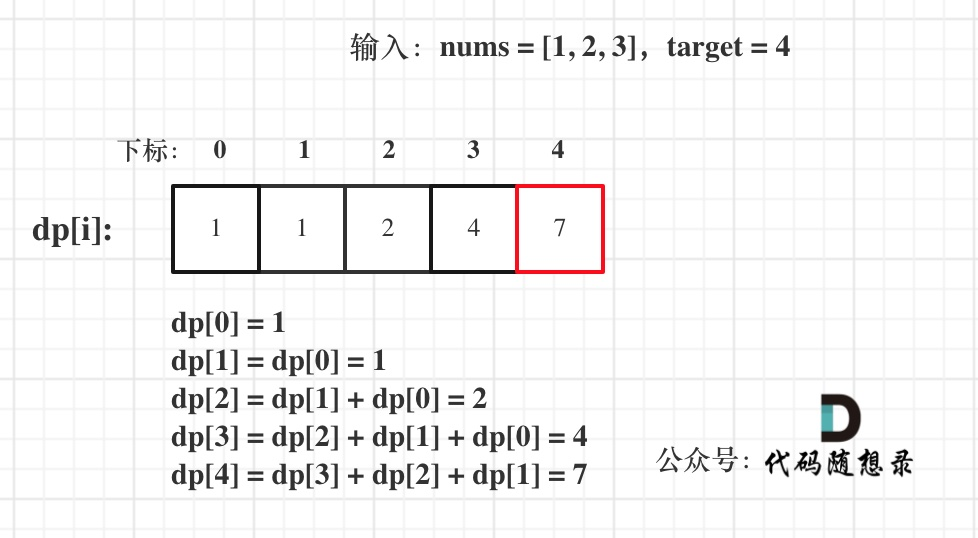

难点题目

1.滑窗

2.三数之和

3.KMP

4.滑动窗口最大值(栈与队列)

5.前 K 个高频元素

[TOC]

# 算法积累

## 数组

### 二分查找

重要思路：题目需要满足两个条件：

1.**是有序数组**；2.**数组中无重复元素**。

二分法程序最重要的就是**区间的定义**。一般分为两种：**左闭右闭**和**左闭右开**。两种写法对应两种不同的程序范式。

+ 左闭右闭区间

注意**右**边界要定义为==数组长度-1==；循环中right=middle - 1 而 left=middle +  1


有些题目可能需要涉及两个二分查找，比如[第34题](https://leetcode.cn/problems/find-first-and-last-position-of-element-in-sorted-array/description/)，我们需要筛选出所查找元素的第一个和最后一个位置。在刚接触二分查找时建议使用两个查找算法去寻找所查找元素的左右边界。边界的分布主要分为三种情况：

- 情况一：target 在数组范围的右边或者左边，例如数组{3, 4, 5}，target为2或者数组{3, 4, 5},target为6，此时应该返回{-1, -1}
- 情况二：target 在数组范围中，且数组中不存在target，例如数组{3,6,7},target为5，此时应该返回{-1, -1}
- 情况三：target 在数组范围中，且数组中存在target，例如数组{3,6,7},target为6，此时应该返回{1, 1}

在写程序时需要分别对这三种情况进行讨论：

```c++
int leftBorder = getLeftBorder(nums, target);
int rightBorder = getRightBorder(nums, target);
// 情况一
if (leftBorder == -2 || rightBorder == -2) return {-1, -1};
// 情况三
if (rightBorder - leftBorder > 1) return {leftBorder + 1, rightBorder - 1};
// 情况二
return {-1, -1};
```

想清楚三种情况之后，先专注于寻找右区间，然后专注于寻找左区间，左右根据左右区间做最后判断。

+ 小技巧

遍历时防止溢出的操作：

```c++
int middle = left + ((right - left) / 2);// 防止溢出 等同于(left + right)/2
```

### 移除元素

移除数组中的**指定元素**的方法有多种，思路最简单是的暴力求解法，使用两层for循环即可实现。这里主要介绍==双指针法(快慢指针法)==，这在考数组、链表的题目中是非常常见的，因此思路一定要清晰。


双指针法（快慢指针法）： **通过一个快指针和慢指针在一个for循环下完成两个for循环的工作。**

这种方法的特点是**没有改变元素的相对位置**。

定义快慢指针

- 快指针：寻找新数组的元素 ，新数组就是不含有目标元素的数组
- 慢指针：指向更新新数组下标的位置

```cpp
// 时间复杂度：O(n)
// 空间复杂度：O(1)
class Solution {
public:
    int removeElement(vector<int>& nums, int val) {
        int slowIndex = 0;
        for (int fastIndex = 0; fastIndex < nums.size(); fastIndex++) {
            //这里这个if相当于是更新慢指针的一个操作，他只有在快指针指向的值不是目标元素时才会执行
            if (val != nums[fastIndex]) {
                nums[slowIndex++] = nums[fastIndex];
            }
        }
        return slowIndex;
    }
};
```

需要注意移除元素不能增加新的内存空间，因此需要**原地操作**，也就是进行数组的覆盖。

简单来说，**快指针去寻找新数组的元素(这里新数组的元素是不含指定元素的)，找到的值赋值给慢指针，也就是说慢指针是新数组的下标值。**

### 有序数组的平方 

本题的关键是数组是有序的，**因此平方后数组最大的数只能是第一个或者最后一个**，通过双指针法可以求解此题。


此时可以考虑双指针法了，i指向起始位置，j指向终止位置。

定义一个新数组result，和A数组一样的大小，让k指向result数组终止位置。

如果`A[i] * A[i] < A[j] * A[j]`  那么`result[k--] = A[j] * A[j];`  。

如果`A[i] * A[i] >= A[j] * A[j]` 那么`result[k--] = A[i] * A[i];` 。

有如下题解：

```c++
class Solution {
public:
    vector<int> sortedSquares(vector<int>& A) {
        int k = A.size() - 1;
        vector<int> result(A.size(), 0);
        for (int i = 0, j = A.size() - 1; i <= j;) { // 注意这里要i <= j，因为最后要处理两个元素
            if (A[i] * A[i] < A[j] * A[j])  {
                result[k--] = A[j] * A[j];
                j--;
            }
            else {
                result[k--] = A[i] * A[i];
                i++;
            }
        }
        return result;
    }
};
```

### 长度最小的子数组

介绍滑动窗口法：

所谓滑动窗口，**就是不断的调节子序列的起始位置和终止位置，从而得出我们要想的结果**。

所以 只用一个for循环，那么这个循环的索引，一定是表示 滑动窗口的终止位置。

那么问题来了， 滑动窗口的起始位置如何移动呢？

这里还是以题目中的示例来举例，s=7， 数组是 2，3，1，2，4，3，来看一下查找的过程：


在本题中实现滑动窗口，主要确定如下三点：

- 窗口内是什么？
- 如何移动窗口的起始位置？
- 如何移动窗口的结束位置？

窗口就是满足其和 ≥ s 的长度最小的连续子数组。

窗口的起始位置如何移动：如果当前窗口的值大于s了，窗口就要向前移动了（也就是该缩小了）。

窗口的结束位置如何移动：窗口的结束位置就是遍历数组的指针，也就是for循环里的索引。

解题的关键在于 窗口的起始位置如何移动，如图所示：


可以发现**滑动窗口的精妙之处在于根据当前子序列和大小的情况，不断调节子序列的起始位置。从而将O(n^2)暴力解法降为O(n)。**

C++代码如下：

```cpp
class Solution {
public:
    int minSubArrayLen(int s, vector<int>& nums) {
        int result = INT32_MAX;
        int sum = 0; // 滑动窗口数值之和
        int i = 0; // 滑动窗口起始位置
        int subLength = 0; // 滑动窗口的长度
        for (int j = 0; j < nums.size(); j++) {
            sum += nums[j];
            // 注意这里使用while，每次更新 i（起始位置），并不断比较子序列是否符合条件
            while (sum >= s) {
                subLength = (j - i + 1); // 取子序列的长度
                result = result < subLength ? result : subLength;
                sum -= nums[i++]; // 这里体现出滑动窗口的精髓之处，不断变更i（子序列的起始位置）
            }
        }
        // 如果result没有被赋值的话，就返回0，说明没有符合条件的子序列
        return result == INT32_MAX ? 0 : result;
    }
};
```

**注：题目的精髓在于for循环中确定的j表示滑动窗口的结尾，首先动j，当满足滑窗中总和大于s时，动起始位置i，直到找到最小的长度。**

+ 注：除了76，最小滑窗外，还有最大滑窗[904](https://leetcode.cn/problems/fruit-into-baskets/solutions/1/shen-du-jie-xi-zhe-dao-ti-he-by-linzeyin-6crr/)这种类型。

求最大滑窗和最小滑窗在思路上有一些区别。

**最小滑窗模板**：给定数组 nums，定义滑窗的左右边界 i, j，求满足某个条件的滑窗的最小长度。

```c++
while j < len(nums):
    判断[i, j]是否满足条件
    while 满足条件：
        不断更新结果(注意在while内更新！)
        i += 1 （最大程度的压缩i，使得滑窗尽可能的小）
    j += 1
```

**最大滑窗模板**：给定数组 nums，定义滑窗的左右边界 i, j，求满足某个条件的滑窗的最大长度。

```c++
while j < len(nums):
    判断[i, j]是否满足条件
    while 不满足条件：
        i += 1 （最保守的压缩i，一旦满足条件了就退出压缩i的过程，使得滑窗尽可能的大）
    不断更新结果（注意在while外更新！）
    j += 1
```

是的，关键的区别在于，**最大滑窗是在迭代右移右边界的过程中更新结果，而最小滑窗是在迭代右移左边界的过程中更新结果**。

关于76和904这种题需要结合哈希表(unordered_map)和滑动窗口实现。

### 螺旋矩阵

螺旋矩阵更多的是考验对数组的掌控能力而不是什么特别的算法。可以说，螺旋矩阵的解法是充满套路的。总结来说，螺旋矩阵的要点是坚持**循环不变量原则**。一般需要定义4个for循环，每个for循环掌管遍历一个方向。

模拟顺时针画矩阵的过程:

- 填充上行从左到右
- 填充右列从上到下
- 填充下行从右到左
- 填充左列从下到上


对于不变量保持**左闭右开**的思路进行(也可以左闭右闭，但个人认为更加麻烦)。

```c++
class Solution {
public:
    vector<vector<int>> generateMatrix(int n) {
        vector<vector<int>> res(n, vector<int>(n, 0)); // 使用vector定义一个二维数组
        int startx = 0, starty = 0; // 定义每循环一个圈的起始位置
        int loop = n / 2; // 每个圈循环几次，例如n为奇数3，那么loop = 1 只是循环一圈，矩阵中间的值需要单独处理
        int mid = n / 2; // 矩阵中间的位置，例如：n为3， 中间的位置就是(1，1)，n为5，中间位置为(2, 2)
        int count = 1; // 用来给矩阵中每一个空格赋值
        int offset = 1; // 需要控制每一条边遍历的长度，每次循环右边界收缩一位
        int i,j;
        while (loop --) {
            i = startx;
            j = starty;

            // 下面开始的四个for就是模拟转了一圈
            // 模拟填充上行从左到右(左闭右开)
            for (j = starty; j < n - offset; j++) {
                res[startx][j] = count++;
            }
            // 模拟填充右列从上到下(左闭右开)
            for (i = startx; i < n - offset; i++) {
                res[i][j] = count++;
            }
            // 模拟填充下行从右到左(左闭右开)
            for (; j > starty; j--) {
                res[i][j] = count++;
            }
            // 模拟填充左列从下到上(左闭右开)
            for (; i > startx; i--) {
                res[i][j] = count++;
            }

            // 第二圈开始的时候，起始位置要各自加1， 例如：第一圈起始位置是(0, 0)，第二圈起始位置是(1, 1)
            startx++;
            starty++;

            // offset 控制每一圈里每一条边遍历的长度
            offset += 1;
        }

        // 如果n为奇数的话，需要单独给矩阵最中间的位置赋值
        if (n % 2) {
            res[mid][mid] = count;
        }
        return res;
    }
};
```

代码的核心思路是设置一个**总的循环圈数**，对于奇数次要单独遍历一次最中间的元素，对于偶数次则不需要。并且设置4个for循环依次操作矩阵四个方向的赋值。还需要设置一个**offset**用于控制每一条边遍历的长度。

关于螺旋矩阵还有一种巧妙的解题思路，如[这里](https://leetcode.cn/problems/spiral-matrix/solutions/7155/cxiang-xi-ti-jie-by-youlookdeliciousc-3/)，方法是不需要记录已经走过的路径，通过不断地更新上下边界进行确定。

+ 首先设定上下左右边界
+ 其次向右移动到最右，此时第一行因为已经使用过了，可以将其从图中删去，体现在代码中就是重新定义上边界
+ 判断若重新定义后，上下边界交错，表明螺旋矩阵遍历结束，跳出循环，返回答案
+ 若上下边界不交错，则遍历还未结束，接着向下向左向上移动，操作过程与第一，二步同理
+ 不断循环以上步骤，直到某两条边界交错，跳出循环，返回答案

```c++
class Solution {
public:
    vector<int> spiralOrder(vector<vector<int>>& matrix) {
        vector <int> ans;
        if(matrix.empty()) return ans; //若数组为空，直接返回答案
        int u = 0; //赋值上下左右边界
        int d = matrix.size() - 1;
        int l = 0;
        int r = matrix[0].size() - 1;
        while(true)
        {
            for(int i = l; i <= r; ++i) ans.push_back(matrix[u][i]); //向右移动直到最右
            if(++ u > d) break; //重新设定上边界，若上边界大于下边界，则遍历遍历完成，下同
            for(int i = u; i <= d; ++i) ans.push_back(matrix[i][r]); //向下
            if(-- r < l) break; //重新设定有边界
            for(int i = r; i >= l; --i) ans.push_back(matrix[d][i]); //向左
            if(-- d < u) break; //重新设定下边界
            for(int i = d; i >= u; --i) ans.push_back(matrix[i][l]); //向上
            if(++ l > r) break; //重新设定左边界
        }
        return ans;
    }
};
```

## 链表

什么是链表，链表是一种通过指针串联在一起的线性结构，每一个节点由两部分组成，一个是数据域一个是指针域（存放指向下一个节点的指针），最后一个节点的指针域指向null（空指针的意思）。

链表的入口节点称为链表的头结点也就是head。

如图所示：


链表有：单链表、双链表和循环链表三种类型。

单链表的基本定义：

```cpp
// 单链表
struct ListNode {
    int val;  // 节点上存储的元素
    ListNode *next;  // 指向下一个节点的指针
    ListNode(int x) : val(x), next(NULL) {}  // 节点的构造函数
};
```

**链表的基本操作：**

添加链表的节点：


删除链表的节点：


链表与数组的性能分析:


链表操作主要有两种方式：

+ **直接使用原来的链表来进行删除操作。**
+ **设置一个虚拟头结点在进行删除操作。**

使用第一种方法时，需要单独考虑删除头结点这种情况，而第二种方法不需要单独考虑。我这里更偏向使用第二种方法。

以下是一个链表删除元素的例题：

```c++
/**
 * Definition for singly-linked list.
 * struct ListNode {
 *     int val;
 *     ListNode *next;
 *     ListNode() : val(0), next(nullptr) {}
 *     ListNode(int x) : val(x), next(nullptr) {}
 *     ListNode(int x, ListNode *next) : val(x), next(next) {}
 * };
 */
class Solution {
public:
    ListNode* removeElements(ListNode* head, int val) {
        ListNode *dummyHead = new ListNode(0); //创建一个虚拟头结点
        dummyHead->next = head;

        ListNode *cur = dummyHead; //需要遍历的指针先指向虚拟的头结点
        while(cur->next != nullptr){
            if(cur->next->val == val){
                ListNode * tmp = cur->next; //指针tmp指向的是要被删除的元素
                cur->next = cur->next->next;
                delete tmp; //这里需要对被删掉的元素进行内存的回收，所以上面需要有一个指针指向它
            }else{
                cur = cur->next;
            }
        }
        head = dummyHead->next; //删除虚拟头节点
        delete dummyHead;
        return head;
    }
};
```

### 设计链表

设计链表需要我们实现链表的四种功能：

- get(index)：获取链表中第 index 个节点的值。如果索引无效，则返回-1。
- addAtHead(val)：在链表的第一个元素之前添加一个值为 val 的节点。插入后，新节点将成为链表的第一个节点。
- addAtTail(val)：将值为 val 的节点追加到链表的最后一个元素。
- addAtIndex(index,val)：在链表中的第 index 个节点之前添加值为 val  的节点。如果 index 等于链表的长度，则该节点将附加到链表的末尾。如果 index  大于链表长度，则不会插入节点。如果index小于0，则在头部插入节点。
- deleteAtIndex(index)：如果索引 index 有效，则删除链表中的第 index 个节点。

```c++
class MyLinkedList {
public:
    // 定义链表节点结构体
    struct LinkedNode {
        int val;
        LinkedNode* next;
        LinkedNode(int val):val(val), next(nullptr){}
    };
    
    //构造函数创建一个虚拟头结点以及初始化链表长度
    MyLinkedList(){
        _dummyHead = new LinkedNode(0);
        _size = 0;
    }
    
    int get(int index) {
        if(index < 0 || index >= _size){
            return -1;
        }
        LinkedNode* cur = _dummyHead->next; //从虚拟头节点的下一个(真正的头结点)开始遍历

        //不断遍历，直到index为0时，跳出while循环，此时cur指针也走了index次
        while(index--){
            cur = cur->next;
        }
        return cur->val;
    }
    
    void addAtHead(int val) {
        //这个函数的实现是有坑的，赋值的顺序有讲究，要先用cur赋值后面的量，再让dummy指向cur
        LinkedNode* cur = new LinkedNode(val);
        cur->next = _dummyHead->next;
        _dummyHead->next = cur;
        _size ++;
    }
    
    void addAtTail(int val) {
        LinkedNode* cur = _dummyHead;
        //找到链表的最后一个元素
        while(cur->next != NULL){
            cur = cur->next;
        }
        LinkedNode* tmp = new LinkedNode(val);
        cur->next = tmp;
        tmp->next = NULL;
        _size++;
    }
    
    void addAtIndex(int index, int val) {
        if(index < 0){
            index = 0;
        }else if (index > _size){
            return;
        }
        LinkedNode* tmp = new LinkedNode(val);
        LinkedNode* cur = _dummyHead;
        while(index--){
            cur = cur->next;
        }
        tmp->next = cur->next;
        cur->next = tmp;
        _size++;
    }
    
    void deleteAtIndex(int index) {
        if(index < 0 || index >= _size){
            return;
        }
        LinkedNode* cur = _dummyHead;
        int val = get(index);
        while(index--){
            cur = cur->next;
        }
        LinkedNode* tmp = cur->next;
        cur->next = cur->next->next;
        delete tmp;
        tmp = nullptr;
        _size--;
    }
        // 打印链表
    void printLinkedList() {
        LinkedNode* cur = _dummyHead;
        while (cur->next != nullptr) {
            cout << cur->next->val << " ";
            cur = cur->next;
        }
        cout << endl;
    }
private:
    int _size; //链表的长度
    LinkedNode* _dummyHead; //虚拟头节点
};

/**
 * Your MyLinkedList object will be instantiated and called as such:
 * MyLinkedList* obj = new MyLinkedList();
 * int param_1 = obj->get(index);
 * obj->addAtHead(val);
 * obj->addAtTail(val);
 * obj->addAtIndex(index,val);
 * obj->deleteAtIndex(index);
 */
```

第一次做这道题目的时候超时了，原因是遍历链表的操作写的太冗余，当给定的是链表的索引的时候，可以通过以下操作遍历链表：（十分的巧妙）

```c++
while(index--){
    cur = cur->next;
}
```

### 翻转链表(常考)

翻转链表是笔试中常考的题目，思路也较为简单，如动画所示：


```c++
class Solution {
public:
    ListNode* reverseList(ListNode* head) {

        ListNode* cur = head;
        ListNode* pre = nullptr;
        ListNode* tmp = nullptr;
        
        while(cur){
            tmp = cur->next; //暂存
            cur->next = pre;
            pre = cur;            
            cur = tmp;      
        }
        return pre;
    }
};
```

翻转链表的关键在于设定终止条件和设定一个暂存的指针tmp。终止条件就是当cur指向一个空指针的时候，这时pre指向链表最后一个元素，此时循环终止。

**注：翻转链表不需要设定虚拟头结点**


### 两两交换链表中的节点

在操作链表节点的时候，每次需要操作三个节点，因此判断的条件应该是：当当前节点的下个节点和下下个节点都不为空时，执行while循环。

+ note1：链表的操作顺序分为三个步骤：


执行完三个步骤后，链表变成这样：


循环这三个步骤，完成链表节点的交换。

```c++
class Solution {
public:
    ListNode* swapPairs(ListNode* head) {
        ListNode* dummyHead = new ListNode(0);
        dummyHead->next = head;

        ListNode* cur = dummyHead;
        while(cur->next != nullptr && cur->next->next !=nullptr){
            ListNode* tmp1 = cur->next; //暂存1节点
            ListNode* tmp2 = cur->next->next->next; //暂存3节点


            cur->next = cur->next->next;    // 步骤一
            cur->next->next = tmp1;  //步骤二
            cur->next->next->next = tmp2;  //步骤三

            cur = cur->next->next;
        }
        return dummyHead->next;
    }
```

### 删除链表的倒数第N个节点

这道题不难，但是思路很巧妙，值得学习。

双指针的经典应用，如果要删除倒数第n个节点，让fast移动n步，然后让fast和slow同时移动，直到fast指向链表末尾。删掉slow所指向的节点就可以了。

思路是这样的，但要注意一些细节。

分为如下几步：

- 首先这里我推荐大家使用虚拟头结点，这样方便处理删除实际头结点的逻辑。
- 定义fast指针和slow指针，初始值为虚拟头结点，如图：


- **fast首先走n + 1步 ，为什么是n+1呢，因为只有这样同时移动的时候slow才能指向删除节点的上一个节点（方便做删除操作），如图：** 
- fast和slow同时移动，直到fast指向末尾，如题： 
- 删除slow指向的下一个节点，如图： 

```c++
class Solution {
public:
    ListNode* removeNthFromEnd(ListNode* head, int n) {
        ListNode* dummyHead = new ListNode(0);
        dummyHead->next = head;
        ListNode* fast = dummyHead;
        while(n-- && fast != nullptr){
            fast = fast->next; //fast先走n步
        }
        fast = fast->next; // ※关键一步：fast再提前走一步，因为需要让slow指向删除节点的上一个节点
        ListNode* slow = dummyHead;
        while(fast != nullptr){
            fast = fast->next;
            slow = slow->next;
        }
        slow->next = slow->next->next;
        return dummyHead->next;
        
    }
};
```

### 链表相交

求两个链表交点节点的指针。需要注意，交点不是数值相等，而是指针相等。常见的做法是让短的链表与长链表的末尾对其。然后挨个遍历比较两个指针所指向的值是否相同，返回相同的指针。如果都不相同，返回空指针。


这里需要注意：一个编程技巧，不管链表A和链表B哪个链表长哪个短，都变换为链表A为长链表，B为短链表。

```c++
class Solution {
public:
    ListNode *getIntersectionNode(ListNode *headA, ListNode *headB) {
        ListNode* curA = headA;
        ListNode* curB = headB;

        int lenA = 0;
        int lenB = 0;
        while(curA != nullptr){
            lenA++;
            curA = curA->next;
        }
        while(curB != nullptr){
            lenB++;
            curB = curB->next;
        }
        curA = headA;
        curB = headB;
        //交换A和B，让A链表始终是最长的链表
        if(lenA < lenB){
            swap(curA, curB);
            swap(lenA, lenB);
        }
        int diff = lenA - lenB;

        while(diff--){
            curA = curA->next; //让A移动到和B平齐的位置
        }

        while(curA != nullptr){
            if(curA->val == curB->val){
                return curA;
            }else{
                curA = curA->next;
                curB = curB->next;
            }
        }
        return NULL;
    }
};
```

### 环形链表

这道题的代码比较好写，但是思路相对比较难想一些。主要的思想还是快慢指针。题目要求返回入环的第一个节点。

首先定义一个快指针fast和一个慢指针slow。那么当链表有环，**则快慢指针一定会相遇**。因为我们假设慢指针每次走一步，快指针每次走两步。快指针相对于慢指针每次多走一步，所以当快慢指针都入环时，二者一定会相遇。


假设头结点到入口的距离为$x$，快指针和慢指针相遇的节点距离入口$y$，相遇节点再到入口的距离为$z$，如图，那么快慢指针走过的距离分别为：

slow：$x+y$

fast: $x+y+n(y+z)$  这里$n(y+z)$表示快指针比慢指针多走了n圈

slow是$x+y$而不是$x+y+n(y+z)$的原因是**慢指针在第一圈走完之前就会被快指针追上。**

根据快节点走过的距离是慢节点的二倍列出等式：
$$
x+y=n(y+z)
$$
我们要求的是入环节点，也就是$x$，则
$$
x=n(y+z)-y
$$
整理后如下：
$$
x=(n-1))(y+z)+z
$$
当$n=1$时，$x=z$，这就意味着，**从头结点出发一个指针，从相遇节点 也出发一个指针，这两个指针每次只走一个节点， 那么当这两个指针相遇的时候就是 环形入口的节点**。

也就是在相遇节点处，定义一个指针index1，在头结点处定一个指针index2。

让index1和index2同时移动，每次移动一个节点， 那么他们相遇的地方就是 环形入口的节点。

动画如下：


```c++
**
 * Definition for singly-linked list.
 * struct ListNode {
 *     int val;
 *     ListNode *next;
 *     ListNode(int x) : val(x), next(NULL) {}
 * };
 */
class Solution {
public:
    ListNode *detectCycle(ListNode *head) {
        ListNode* fast = head;
        ListNode* slow = head;
        while(fast != NULL && fast->next != NULL) {
            slow = slow->next;
            fast = fast->next->next;
            // 快慢指针相遇，此时从head 和 相遇点，同时查找直至相遇
            if (slow == fast) {
                ListNode* index1 = fast;
                ListNode* index2 = head;
                while (index1 != index2) {
                    index1 = index1->next;
                    index2 = index2->next;
                }
                return index2; // 返回环的入口
            }
        }
        return NULL;
    }
};
```

## 哈希表

哈希表的基础理论见代码随想录：[here](https://www.programmercarl.com/%E5%93%88%E5%B8%8C%E8%A1%A8%E7%90%86%E8%AE%BA%E5%9F%BA%E7%A1%80.html#%E5%93%88%E5%B8%8C%E5%87%BD%E6%95%B0)。这里简单说一下解决哈希碰撞的方法：**拉链法**和**线性探测法**。

**拉链法：**

刚刚小李和小王在索引1的位置发生了冲突，发生冲突的元素都被存储在链表中。 这样我们就可以通过索引找到小李和小王了。

（数据规模是dataSize， 哈希表的大小为tableSize）

其实拉链法就是要选择适当的哈希表的大小，这样既不会因为数组空值而浪费大量内存，也不会因为链表太长而在查找上浪费太多时间。


**线性探测法：**

使用线性探测法，一定要保证tableSize大于dataSize。 我们需要依靠哈希表中的空位来解决碰撞问题。

例如冲突的位置，放了小李，那么就向下找一个空位放置小王的信息。所以要求tableSize一定要大于dataSize ，要不然哈希表上就没有空置的位置来存放 冲突的数据了。如图所示：


### 有效的字母异位词

这道题的思路较为简单，所谓有效字母的异位词，就是两个字符串s和t，如果两个字符串**出现字母的个数都相同**，那么两个字符串互为异位词，返回true，否则返回false。 

这道题的关键是定义一个数组用于记录字母出现的次数，==一个小技巧是记录字母相对于a的ASCII的值，而不是记录字母的原始ASCII，这样从字母a到z就是序号0-26。==

首先记录s中所有字母，record中相应位置加1，再遍历t中所有的字母，每出现一个字母，相应位置减1，这样当两个字符串中有不同字母时，整个数组不全为0，这时返回false，否则返回true。

```c++
class Solution {
public:
    bool isAnagram(string s, string t) {
        int record[26] = {0};
        for(int i = 0; i < s.size(); i++){
            record[s[i] - 'a'] ++; //s[i] - 'a'表示s字符串中的每个字母相对于a的ASCII的相对值，不需要记录完整的码。
        }
        for(int i = 0; i < t.size(); i++){
            record[t[i] - 'a'] --; 
        }
        for(auto i : record){
            if(i){
                return false;
            }
        }
        return true;
    }
};
```

### 快乐数 

```c++
class Solution {
public:
    int getNum(int n){
        int sum = 0;
        while(n){
            sum += (n % 10) * (n % 10);
            n /=10;
        }
        return sum;
    }
    bool isHappy(int n) {
        unordered_set<int> set;
        while(1){
            int sum = getNum(n);
            if(sum == 1){
                return true;
            }

            if(set.find(sum) != set.end()){
                return false;
            }else{
                set.insert(sum);
            }
            n = sum;
        }
    }
};
```

这道题的关键有两个：

1. 如何获取一个正整数的每位的平方和：

```c++
while(n){
    sum += (n % 10) * (n % 10);
    n /=10;
}
```

2. 如何判断终止条件：

```c++
// 如果这个sum曾经出现过，说明已经陷入了无限循环了，立刻return false
if(set.find(sum) != set.end()){
    return false;
}
```

## 哈希表

### 两数之和

首先我再强调一下 **什么时候使用哈希法**，当我们需要查询一个元素是否出现过，或者一个元素是否在集合里的时候，**就要第一时间想到哈希法**。

哈希法常用的数据结构有三种：数组，set和map。对于本题来说，我们不仅要知道元素有没有遍历过，还要知道这个元素对应的下标，**需要使用 key value结构来存放，key来存元素，value来存下标，那么使用map正合适**。

关于数组和set做哈希法的局限：

- 数组的大小是受限制的，而且如果元素很少，而哈希值太大会造成**内存空间的浪费**。
- set是一个集合，里面放的元素只能是一个key，而两数之和这道题目，不仅要判断y是否存在而且还要记录y的下标位置，因为要返回x 和 y的下标。所以set 也不能用。

那么判断**元素是否出现**，这个元素就要作为key，所以数组中的元素作为key，有key对应的就是value，value用来存下标。

在遍历数组的时候，**只需要向map去查询是否有和目前遍历元素匹配的数值**，如果有，就找到的匹配对，如果没有，就把目前遍历的元素放进map中，因为map存放的就是我们访问过的元素。

### 四数相加II

这道题目看起来有些绕，说白了就是在四个数组中取数，每个数组取一个数，统计四个取出的数字相加等于0的个数。这道题不需要考虑有重复的四个元素相加等于0的情况，相对于**18. 四数之和，题目15.三数之和**要简单一些。

**本题解题步骤：**

1. 首先定义 一个unordered_map，key放a和b两数之和，value 放a和b两数之和出现的次数。
2. 遍历大A和大B数组，统计两个数组元素之和，和出现的次数，放到map中。
3. 定义int变量count，用来统计 a+b+c+d = 0 出现的次数。
4. 在遍历大C和大D数组，找到如果 0-(c+d) 在map中出现过的话，就用count把map中key对应的value也就是出现次数统计出来。
5. 最后返回统计值 count 就可以了

==note:== 这道题的关键思路在于**将四个数组分成两组**，首先统计A和B数组中所有的两数和，然后在遍历C和D数组的时候统计如果有0-(c+d)出现，那么count就增加map中0-(c+d)出现的次数。

```c++
class Solution {
public:
    int fourSumCount(vector<int>& A, vector<int>& B, vector<int>& C, vector<int>& D) {
        unordered_map<int, int> umap; //key:a+b的数值，value:a+b数值出现的次数
        // 遍历大A和大B数组，统计两个数组元素之和，和出现的次数，放到map中
        for (int a : A) {
            for (int b : B) {
                umap[a + b]++;
            }
        }
        int count = 0; // 统计a+b+c+d = 0 出现的次数
        // 在遍历大C和大D数组，找到如果 0-(c+d) 在map中出现过的话，就把map中key对应的value也就是出现次数统计出来。
        for (int c : C) {
            for (int d : D) {
                if (umap.find(0 - (c + d)) != umap.end()) {
                    count += umap[0 - (c + d)];
                }
            }
        }
        return count;
    }
}
```

###赎金信

==note:== 涉及到字母的题都可以优先考虑数组，因为字母只有26个，而且使用数组十分节省内存。

本题只有两个需要注意的点：

- 第一点“为了不暴露赎金信字迹，要从杂志上搜索各个需要的字母，组成单词来表达意思” 这里*说明杂志里面的字母不可重复使用。*
- 第二点 “你可以假设两个字符串均只含有小写字母。” *说明只有小写字母*，这一点很重要

```c++
class Solution {
public:
    bool canConstruct(string ransomNote, string magazine) {
        int num_list[26] = {0};
        for(auto &i : magazine){
            num_list[i - 'a'] ++;
        }
        
        int count = 0;
        for(auto &i : ransomNote){
            if(num_list[i - 'a'] != 0){
                num_list[i - 'a'] --;
                count ++;
            }
        }
        if(count == ransomNote.size()){
            return true;
        }
        return false;
    }
};
```

### [三数之和(较难)](https://leetcode.cn/problems/3sum/)

==三数之和的难点在于如何去重。==

### 四数之和

四数之和和三数之和的思路一致，需要额外添加一层for循环。

## 字符串

###  反转字符串

这道题是典型的使用双指针进行解题。我们定义一个头指针和一个尾指针，让两个指针同时向中间移动。


```c++
void reverseString(vector<char>& s) {
    for (int i = 0, j = s.size() - 1; i < s.size()/2; i++, j--) {
        swap(s[i],s[j]);
    }
}
```

### 反转字符串II

这道题相当于对反转字符串添加了一系列规则，从字符串开头算起，每计数至 `2k` 个字符，就反转这 `2k` 字符中的前 `k` 个字符。在做翻转操作的时候，可以直接使用reverse库函数，要注意，reverse的区间是**左闭右开**的。

```c++
class Solution {
public:
    string reverseStr(string s, int k) {
        for(int i = 0; i < s.size(); i += (2 * k)){
            if(i + k <= s.size()){ //这里需要判断，i+k不能大于字符串的长度
                reverse(s.begin() + i, s.begin() + i + k); //对i到i+k的数组进行翻转
                continue;
            }
            reverse(s.begin() + i, s.end());
        }
        return s;
    }
};
```

### 替换数字

这道题目的思路主要是将字符串先扩增到指定大小，然后从后向前进行操作，过程如下图所示。


有同学问了，为什么要从后向前填充，从前向后填充不行么？

从前向后填充就是O(n^2)的算法了，因为每次添加元素都要将添加元素之后的所有元素整体向后移动。

**其实很多数组填充类的问题，其做法都是先预先给数组扩容带填充后的大小，然后在从后向前进行操作。**

这么做有两个好处：

1. 不用申请新数组。
2. 从后向前填充元素，避免了从前向后填充元素时，每次添加元素都要将添加元素之后的所有元素向后移动的问题。

```c++
#include<iostream>
using namespace std;
int main() {
    string s;
    while (cin >> s) {
        int count = 0; // 统计数字的个数
        int sOldSize = s.size();
        for (int i = 0; i < s.size(); i++) {
            if (s[i] >= '0' && s[i] <= '9') {
                count++;
            }
        }
        // 扩充字符串s的大小，也就是每个空格替换成"number"之后的大小
        s.resize(s.size() + count * 5);
        int sNewSize = s.size();
        // 从后先前将空格替换为"number"
        for (int i = sNewSize - 1, j = sOldSize - 1; j < i; i--, j--) {
            if (s[j] > '9' || s[j] < '0') {
                s[i] = s[j];
            } else {
                s[i] = 'r';
                s[i - 1] = 'e';
                s[i - 2] = 'b';
                s[i - 3] = 'm';
                s[i - 4] = 'u';
                s[i - 5] = 'n';
                i -= 5;
            }
        }
        cout << s << endl;
    }
}
```

### 反转字符串中的单词

这题是经典的双指针解法，我们定义一个快指针和一个慢指针，快指针用于搜索元素，而慢指针用于更新元素的位置。

这道题可以分成两个步骤进行，首先第一步用双指针删除多余的空格，然后再反转字符串中的顺序。因此这里我们写了两个函数。removeExtraSpaces和reverseWords。

```c++
class Solution {
public:
    void reverse(string& s, int start, int end){ //翻转，区间写法：左闭右闭 []
        for (int i = start, j = end; i < j; i++, j--) {
            swap(s[i], s[j]);
        }
    }

    void removeExtraSpaces(string& s) {//去除所有空格并在相邻单词之间添加空格, 快慢指针。
        int slow = 0;   //整体思想参考https://programmercarl.com/0027.移除元素.html
        for (int i = 0; i < s.size(); ++i) { //
            if (s[i] != ' ') { //遇到非空格就处理，即删除所有空格。
                if (slow != 0) s[slow++] = ' '; //手动控制空格，给单词之间添加空格。slow != 0说明不是第一个单词，需要在单词前添加空格。
                while (i < s.size() && s[i] != ' ') { //补上该单词，遇到空格说明单词结束。
                    s[slow++] = s[i++];
                }
            }
        }
        s.resize(slow); //slow的大小即为去除多余空格后的大小。
    }

    string reverseWords(string s) {
        removeExtraSpaces(s); //去除多余空格，保证单词之间之只有一个空格，且字符串首尾没空格。
        reverse(s, 0, s.size() - 1); //将整个字符串反转
        int start = 0; //removeExtraSpaces后保证第一个单词的开始下标一定是0。
        for (int i = 0; i <= s.size(); ++i) {
            if (i == s.size() || s[i] == ' ') { //到达空格或者串尾，说明一个单词结束。进行翻转。
                reverse(s, start, i - 1); //翻转，注意是左闭右闭 []的翻转。
                start = i + 1; //更新下一个单词的开始下标start
            }
        }
        return s;
    }
};
```

对于removeExtraSpaces函数，有一些注意的点：

+ 首先需要单独一个逻辑判断字符串的第一个是不是空格：

```c++
if (slow != 0) s[slow++] = ' '; //手动控制空格，给单词之间添加空格。slow != 0说明不是第一个单词，需要在单词前添加空格。
```

+ 之后对每个单词进行操作：

```c++
while (i < s.size() && s[i] != ' ') { //补上该单词，遇到空格说明单词结束。
    s[slow++] = s[i++];
}
```

对于reverseWords函数，有一些注意的点：

+ 反转单词采用的是整体反转+局部反转的方式

```c++
removeExtraSpaces(s); //去除多余空格，保证单词之间之只有一个空格，且字符串首尾没空格。
reverse(s, 0, s.size() - 1); //将整个字符串反转
int start = 0; //removeExtraSpaces后保证第一个单词的开始下标一定是0。
for (int i = 0; i <= s.size(); ++i) {
    if (i == s.size() || s[i] == ' ') { //到达空格或者串尾，说明一个单词结束。进行翻转。
        reverse(s, start, i - 1); //翻转，注意是左闭右闭 []的翻转。
        start = i + 1; //更新下一个单词的开始下标start
    }
}
```

### 右旋字符串

右旋字符串的思路比较巧妙，延续了前面反转单词**整体反转+局部反转**的思想，先将整个字符串反转过来，然后将分过段的两个子段再分别翻转，最终实现目的。




```c++
// 版本一
#include<iostream>
#include<algorithm>
using namespace std;
int main() {
    int n;
    string s;
    cin >> n;
    cin >> s;
    int len = s.size(); //获取长度

    reverse(s.begin(), s.end()); // 整体反转
    reverse(s.begin(), s.begin() + n); // 先反转前一段，长度n
    reverse(s.begin() + n, s.end()); // 再反转后一段

    cout << s << endl;

} 
```

### 实现 strStr() (KMP算法)

**KMP算法主要用于解决字符串的匹配问题。**

kmp算法关键在于：在当前对文本串和模式串检索的过程中，若出现了不匹配，**如何充分利用已经匹配的部分**。 

匹配到不正确的地方以前的子串跟上面的子串相等所以==下面的子串的最长前缀肯定跟上面最长子串的后缀有匹配==。

前后缀的定义：

前缀：包含首字母，不包含尾字母的**所有子串**。

后缀：包含尾字母，不包含首字母的**所有子串**。

例如一个字符串：aabaaf

前缀：a aa aab aabaa

后缀：f af aaf baaf abaaf

**我们需要求最长相等的前后缀的长度，构成next前缀表**

KMP算法的核心是计算出字符串的next数组，然后在匹配的过程中根据next数组指示我们应该跳过几个元素。

前缀表next的作用是什么：**前缀表是用来回退的，它记录了模式串与主串(文本串)不匹配的时候，模式串应该从哪里开始重新匹配。**

next数组的求法：

+ 初始化：

初始化需要定义两个指针i和j，==其中j指向前缀末尾的位置，i指向后缀末尾的位置。==

+ 前后缀不相同

因为j初始化为0，那么i就从1开始，进行s[i] 与 s[j+1]的比较。所以遍历模式串s的循环下标i 要从 1开始，代码如下：

```c++
for (int i = 1; i < s.size(); i++) {
```

如果 s[i] 与 s[j+1]不相同，也就是遇到 前后缀末尾不相同的情况，就要向前回退。

怎么回退呢？

next[j]就是记录着j（包括j）之前的子串的相同前后缀的长度。

那么 s[i] 与 s[j+1] 不相同，就要找 j+1前一个元素在next数组里的值（就是next[j]）。

所以，处理前后缀不相同的情况代码如下：

```c++
while (j >= 0 && s[i] != s[j + 1]) { // 前后缀不相同了
    j = next[j]; // 向前回退
}
```

+ 前后缀相同

如果 s[i] 与 s[j + 1] 相同，那么就同时向后移动i 和j 说明找到了相同的前后缀，同时还要将j（前缀的长度）赋给next[i], 因为next[i]要记录相同前后缀的长度。

```c++
if (s[i] == s[j + 1]) { // 找到相同的前后缀
    j++;
}
next[i] = j;
```

最后整体构建next数组的函数代码如下：

```c++
void getNext(int* next, const string& s){
    int j = 0;
    next[0] = j;
    for(int i = 1; i < s.size(); i++) { // 注意i从1开始
        while (j >= 0 && s[i] != s[j + 1]) { // 前后缀不相同了
            j = next[j]; // 向前回退
        }
        if (s[i] == s[j + 1]) { // 找到相同的前后缀
            j++;
        }
        next[i] = j; // 将j（前缀的长度）赋给next[i]
    }
}
```

最后用next数组来做匹配

```c++
int j = 0; // 因为next数组里记录的起始位置为0
for (int i = 0; i < s.size(); i++) { // 注意i就从0开始
    while(j > 0 && s[i] != t[j]) { // 不匹配
        j = next[j]; // j 寻找之前匹配的位置
    }
    if (s[i] == t[j]) { // 匹配，j和i同时向后移动
        j++; // i的增加在for循环里
    }
    if (j == t.size()  ) { // 文本串s里出现了模式串t
        return (i - t.size() + 1);
    }
```

计算next数组的过程其实和动态规划的过程类似，从第一个字符开始遍历，求出当前子串的最长相等前后缀，再逐个填写到next数组中。

问：为什么使用前缀表可以告诉我们匹配失败之后跳到哪里重新匹配？

**下标5之前这部分的字符串（也就是字符串aabaa）的最长相等的前缀 和 后缀字符串是 子字符串aa ，因为找到了最长相等的前缀和后缀，匹配失败的位置是后缀子串的后面，那么我们找到与其相同的前缀的后面重新匹配就可以了。**

提供一篇讲的比较好的知乎文章：https://www.zhihu.com/question/21923021/answer/281346746

完整代码：

```c++
`    void getNext(int* next, const string& s) {
        int j = 0; //初始化
        next[0] = 0;
        for(int i = 1; i < s.size(); i++) {
            //如果s[i] 不等于 s[j]的情况
            while (j > 0 && s[i] != s[j]) { // j要保证大于0，因为下面有取j-1作为数组下标的操作
                j = next[j - 1]; // 注意这里，是要找前一位的对应的回退位置了
            }
            //如果s[i]等于s[j]的情况
            if (s[i] == s[j]) {
                j++;
            }
            next[i] = j;
        }
    }
    int strStr(string haystack, string needle) {
        if (needle.size() == 0) {
            return 0;
        }
        int next[needle.size()];
        getNext(next, needle);
        int j = 0; //next数组里记录的起始位置为0
        for(int i = 0; i< haystack.size(); i++){
            //不匹配的情况
            while(j > 0 && haystack[i] != needle[j]){
                j = next[j - 1]; //当不匹配的时候，要选择next数组上一个位置的值
            }
            //匹配，则i和j同时加一
            if(haystack[i] == needle[j]){
                j++;
            }

            if(j == needle.size()){
                return (i - needle.size() + 1);
            }
        }
        return -1;
    }
```

## 栈与队列

### 基础知识扫盲

问题：

1.C++中stack 是容器么？

答：不是容器，而是容器适配器。

2.我们使用的stack是属于哪个版本的STL？

答： SGI STL。

3.我们使用的STL中stack是如何实现的？

答：栈是以底层容器完成其所有的工作，对外提供统一的接口，底层容器是可插拔的（也就是说我们可以控制使用哪种容器来实现栈的功能）。默认是以deque为缺省情况下栈的底层结构。

4.stack 提供迭代器来遍历stack空间么？

答：栈不提供走访功能，也不提供迭代器。

+ 栈

**栈先进后出**。栈提供push 和 pop 等等接口，所有元素**必须符合先进后出规则**，所以==栈不提供走访功能，也不提供迭代器(iterator)==。 不像是set 或者map 提供迭代器iterator来遍历所有元素。不像是set 或者map 提供迭代器iterator来遍历所有元素。

栈是以底层容器完成其所有的工作，对外提供统一的接口，底层容器是可插拔的（也就是说我们可以控制使用哪种容器来实现栈的功能）。所以STL中**栈往往不被归类为容器**，而被归类为container adapter（容器适配器）。

栈的内部结构：


我们常用的SGI STL，如果没有指定底层实现的话，默认是以**deque**为缺省情况下栈的底层结构。

+ 队列

deque是一个双向队列，只要封住一段，只开通另一端就可以实现栈的逻辑了。队列中先进先出的数据结构，同样不允许有遍历行为，不提供迭代器, **SGI STL中队列一样是以deque为缺省情况下的底部结构。**所以STL 队列也不被归类为容器，而被归类为container adapter（ 容器适配器）。

### 用栈实现队列


### 用队列实现栈

### 有效的括号

由于栈结构的特殊性，非常适合做**对称匹配类**的题目。

不匹配的情况只有三种情况：

1.字符串里左方向的括号多余了

2.括号没有多余，但是 括号的类型没有匹配上。

3.字符串里右方向的括号多余了，所以不匹配。

在代码中我们只需要解决上述的三种匹配错误的情况就可以了。

+ 第一种情况：已经遍历完了字符串，但是栈不为空，说明有相应的左括号没有右括号来匹配，所以return false

+ 第二种情况：遍历字符串匹配的过程中，发现栈里没有要匹配的字符。所以return false

+ 第三种情况：遍历字符串匹配的过程中，栈已经为空了，没有匹配的字符了，说明右括号没有找到对应的左括号return false

那么什么时候说明左括号和右括号全都匹配了呢，就是字符串遍历完之后，栈是空的，就说明全都匹配了。

```c++
class Solution {
public:
    bool isValid(string s) {
        stack<int> sl;
        if(s.size() % 2 != 0) return false;
        for(int i = 0; i < s.size(); i++){
            if(s[i] == '[') sl.push(']');
            else if(s[i] == '{') sl.push('}');
            else if(s[i] == '(') sl.push(')');
            else if(sl.empty() || sl.top() != s[i]) return false;  //这一行是整个代码中最难理解的
            //这里需要先判断是否为空，再判断是否匹配。
            else sl.pop();
        }
        if(!sl.empty()){
            return false;
        }
        return true;
    }
};
```

代码的第十行是相对最难理解的，判断字符是否匹配的关键是：sl.top() != s[i]；当前面三个if都不满足时，说明我们遇到了右边的括号，这时候我们查询栈中最外面的括号是否是匹配的，如果不匹配则直接返回false

### 删除字符串中的所有相邻重复项

这题也是典型的用栈去解决的问题，但是为了减少最后一步将栈转换成字符串，==这题我们可以用字符串去模拟栈！==

我们定义一个字符串，当我们遍历的字符串的元素和我们定义的字符串最后一个元素不相等时，我们就将这个遍历的字符串元素加入到我们定义的字符串的最后面

```c++
class Solution {
public:
    string removeDuplicates(string s) {
        string result;
        for(auto &i : s){
            if(result.empty() || result.back() != i) result.push_back(i);
            else result.pop_back();
        }
        return result;
    }
};
```

我们也可以用经典的stack实现，但是在将stack转换为string时有坑！

```c++
class Solution {
public:
    string removeDuplicates(string s) {
        stack<char> result;
        for(int i = 0; i < s.size(); i++){
            if(result.empty() || result.top() != s[i]) result.push(s[i]);
            else result.pop();
        }
        string aa;
        int num  = result.size(); 
        for(int i = 0; i < num; i++){ // 坑在这里for循环遍历的终止条件
            aa.push_back(result.top());
            result.pop();
        }
        reverse(aa.begin(), aa.end());
        return aa;
    }
};
```

因为栈没有迭代器，不能通过[]访问其元素，因此，只能执行top()，push()，pop()等操作，每当我们pop出一个新元素时，**栈内的长度就发生了变化**，此时如果for循环里面我们写入的是i < result.size() 就会出现意想不到的错误！

### 逆波兰表达式求值

逆波兰表达式实际上是后缀表达式，他是计算机处理多项式运算的一种十分方便的表达式类型。逆波兰表达式实际上是二叉树的后续遍历。比如(1 + 2) × (3 + 4)我们转换成逆波兰表达式就成：12+34×，也就是从二叉树的叶子节点向上不断地遍历。

这道题的思路是分为两种情况处理：

1.遇到运算符：

从栈中取出两个元素，进行相应的运算。

2.遇到数字：

加入到栈中。

```c++
class Solution {
public:
    int evalRPN(vector<string>& tokens) {
        stack<long long> st;
        for(int i = 0; i < tokens.size(); i++){
            if(tokens[i] == "+" || tokens[i] == "-" || tokens[i] == "*" || tokens[i] == "/"){
                long long num1 = st.top(); st.pop();
                long long num2 = st.top(); st.pop();
            if(tokens[i] == "+") st.push(num2 + num1); //这道题的坑是对于num1和num2的运算顺序
            if(tokens[i] == "-") st.push(num2 - num1);
            if(tokens[i] == "*") st.push(num2 * num1);
            if(tokens[i] == "/") st.push(num2 / num1);
            }else st.push(stoll(tokens[i]));
        }
        int result = st.top();
        st.pop();
        return result;
    }
};
```

这道题的坑是对于num1和num2的运算顺序，因为stack的存储顺序是后进先出，因此，num1存储的是后面的那个数，而num2存储的才是前面那个数。比如题目给出波兰表达式："12+" 实际上对应于"1+2"，那么num1是2，num2是1

### 滑动窗口最大值


### 前 K 个高频元素（优先级队列，大顶堆，小顶堆）

==note：对元素出现的频率进行排序，用map这种数据结构更合适！==

## 二叉树

### 理论基础

+ 二叉树的种类：满二叉树，完全二叉树，二叉搜索树，  平衡二叉搜索树。

**满二叉树**：满二叉树：如果一棵二叉树只有度为0的结点和度为2的结点，并且度为0的结点在同一层上，则这棵二叉树为满二叉树。


**完全二叉树**：除了最底层节点可能没填满外，其余每层节点数都达到最大值，并且最下面一层的节点都集中在该层最左边的若干位置。(**堆就是一棵完全二叉树**)


**二叉搜索树**：


若它的左子树不空，则左子树上所有结点的值均小于它的根结点的值；

若它的右子树不空，则右子树上所有结点的值均大于它的根结点的值；

它的左、右子树也分别为二叉排序树

**平衡二叉搜索树**：


它是一棵空树或它的左右两个子树的高度差的绝对值不超过1，并且左右两个子树都是一棵平衡二叉树。

最后一棵 不是平衡二叉树，因为它的左右两个子树的高度差的绝对值超过了1。

**C++中map、set、multimap，multiset的底层实现都是平衡二叉搜索树**，所以map、set的增删操作时间时间复杂度是logn

+ 二叉树的存储方式

**二叉树可以链式存储，也可以顺序存储。**

那么链式存储方式就用**指针**， 顺序存储的方式就是用**数组**。

链式存储方式：


顺序存储方式：


+ 二叉树的遍历方式

主要两种遍历方式：

1. 深度优先遍历：先往深走，遇到叶子节点再往回走。

   前中后序遍历 (递归法，迭代法)

   - 前序遍历：中左右
   - 中序遍历：左中右
   - 后序遍历：左右中 


1. 广度优先遍历：一层一层的去遍历。

​	层级遍历(迭代法)

最后再说一说二叉树中深度优先和广度优先遍历实现方式，我们做二叉树相关题目，经常会使用递归的方式来实现**深度优先遍历**，也就是实现前中后序遍历，使用递归是比较方便的。

**之前我们讲栈与队列的时候，就说过栈其实就是递归的一种实现结构**，也就说前中后序遍历的逻辑其实都是可以==借助栈使用递归的方式==来实现的。

而**广度优先遍历**的实现一般使用==队列==来实现，这也是队列先进先出的特点所决定的，因为需要先进先出的结构，才能一层一层的来遍历二叉树。


note:二叉树遍历：第i个节点的左子节点：2i+1 ；第i个节点的右子节点：2i+2

### ※二叉树的递归遍历

三步走：

1.确定递归函数的参数和返回值

2.确定终止条件

3.确定单层递归的逻辑

大多数二叉树的题目需要传入递归函数的参数不多，**一般就是传入一个根节点以及一个数组，用来放遍历的结果**。

**二叉树的前序遍历**

```c++
class Solution {
public:
    vector<int> preorderTraversal(TreeNode* root) {
        vector<int> result;
        traversal(root, result);
        return result;
    }

    void traversal(TreeNode* cur, vector<int>& vec){
        if(cur == nullptr){
            return;
        }
        vec.push_back(cur->val);    // 中
        traversal(cur->left, vec);  //左
        traversal(cur->right, vec);  //右
    }
};
```

前序，中序，后续遍历的思想都一样，只是13-15行的顺序不同，只需要遵循前面说的遍历顺序即可。

### 二叉树的迭代遍历

所有的递归操作在理论上都可以通过**栈**这种数据结构实现。

二叉树的前序遍历和后续遍历方法可以互相改，只需要更改三行即可。

+ 前序遍历和后序遍历

前序遍历：

```c++
vector<int> preorderTraversal(TreeNode* root) {
    stack<TreeNode*> st;
    vector<int> result;
    if (root == NULL) return result;
    st.push(root);
    while (!st.empty()) {
        TreeNode* node = st.top();                       // 中
        st.pop();
        result.push_back(node->val);
        if (node->right) st.push(node->right);           // 右（空节点不入栈）
        if (node->left) st.push(node->left);             // 左（空节点不入栈）
    }
    return result;
}
```

后序遍历：

```c++
vector<int> postorderTraversal(TreeNode* root) {
    stack<TreeNode*> st;
    vector<int> result;
    //判断result是否为空节点
    if (root == NULL) return result;
    st.push(root);
    while (!st.empty()) {
        TreeNode* node = st.top();                       
        st.pop();
        result.push_back(node->val);
        if (node->left) st.push(node->left);            

        if (node->right) st.push(node->right);           
    }
    reverse(result.begin(), result.end());
    return result;
}
```

由于前序遍历的顺序是中左右，在用迭代法实现的过程中，我们使用栈来模拟递归，那么根据栈后进先出的规则，就应该先将根节点放入栈中，再放**右节点，再放左节点**。因为查询栈中节点的时候是先查询后进入的节点。

后序遍历的顺序只需要先将左子节点放入，再将右子节点放入即可，最后注意要反转整个结果，结果才是左右中

由于中序遍历的访问顺序和处理顺序不一致，所以上面两种方法在这不适用。那么**在使用迭代法写中序遍历，就需要借用指针的遍历来帮助访问节点，栈则用来处理节点上的元素。**

中序遍历：

**思路：栈中存放之前遍历过的节点，在程序循环运行的时候，最先遍历所有的左子节点(直到叶子节点)，然后根据栈中遍历的历史节点再自下而上遍历。**

```c++
class Solution {
public:
    vector<int> inorderTraversal(TreeNode* root) {
        vector<int> result;
        stack<TreeNode*> st;
        TreeNode* cur = root;
        while (cur != NULL || !st.empty()) {
            if (cur != NULL) { // 指针来访问节点，访问到最底层
                st.push(cur); // 将访问的节点放进栈
                cur = cur->left;                // 左
            } else {
                cur = st.top(); // 从栈里弹出的数据，就是要处理的数据（放进result数组里的数据）
                st.pop();
                result.push_back(cur->val);     // 中
                cur = cur->right;               // 右
            }
        }
        return result;
    }
};
```

其实迭代法也是可以实现统一风格的代码的，我们需要对待处理的节点加上标记，使用一个栈完成所有的操作。

```c++
class Solution {
public:
    vector<int> inorderTraversal(TreeNode* root) {
        vector<int> result;
        stack<TreeNode*> st;
        if (root != NULL) st.push(root);
        while (!st.empty()) {
            TreeNode* node = st.top();
            if (node != NULL) {
                st.pop(); // 将该节点弹出，避免重复操作，下面再将右中左节点添加到栈中
                if (node->right) st.push(node->right);  // 添加右节点（空节点不入栈）

                st.push(node);                          // 添加中节点
                st.push(NULL); // 中节点访问过，但是还没有处理，加入空节点做为标记。

                if (node->left) st.push(node->left);    // 添加左节点（空节点不入栈）
            } else { // 只有遇到空节点的时候，才将下一个节点放进结果集
                st.pop();           // 将空节点弹出
                node = st.top();    // 重新取出栈中元素
                st.pop();
                result.push_back(node->val); // 加入到结果集
            }
        }
        return result;
    }
};
```

### 二叉树的层序遍历(广度优先搜索)

二叉树的层序遍历实际上思想就是图论中的广度优先搜索，而实现这种算法一般需要使用==队列==这种数据结构。记住层序遍历的代码模版即可完成一类这样的题。

```c++
class Solution {
public:
    vector<vector<int>> levelOrder(TreeNode* root) {
        queue<TreeNode*> que;
        if(root != NULL) que.push(root);
        vector<vector<int>> result;
        while(!que.empty()){
            int size = que.size(); //记录当前层节点的个数
            vector<int> line_;
            while(size --) { //这个循环中加入每一层的node，size-- 用于控制层数
                TreeNode* node = que.front();
                que.pop();
                if(node->left != NULL) que.push(node->left);
                if(node->right != NULL) que.push(node->right);
                line_.push_back(node->val);
            }
            result.push_back(line_);
        }
        return result;
        
    }
};
```

### 翻转二叉树

这道题使用递归做代码写的比价简单，**切记不要使用中序遍历**，前序和后序随便用。主要是注意递归的三部曲：

1.确定递归函数的参数和返回值

2.确定终止条件

3.确定单层递归的逻辑

这道题的思路就是按照顺序翻转子节点即可。

后序遍历：

```c++
class Solution {
public:
    TreeNode* invertTree(TreeNode* root) {
      if(root == NULL) return root;
      invertTree(root->left);
      invertTree(root->right); 
      swap(root->left, root->right);    
      return root;
    }
    };
```

前序遍历：

```c++
class Solution {
public:
    TreeNode* invertTree(TreeNode* root) {
      if(root == NULL) return root;
      swap(root->left, root->right);    
      invertTree(root->left);
      invertTree(root->right); 
      return root;
    }
    };
```

### 对称二叉树

对于二叉树是否对称，要比较的是根节点的左子树与右子树是不是相互翻转的，理解这一点就知道了**其实我们要比较的是两个树（这两个树是根节点的左右子树）**，所以在递归遍历的过程中，也是要同时遍历两棵树。

这道题的关键是分开进行判断，先判断树**外侧的是否是相等**的，再判断树**内侧是否相等**，当外侧和内侧都相等时才是对称二叉树。

**另一个关键的地方**在于对终止条件的判定，总共可以分为四种情况。

==为什么这里面一定用的是后序遍历的方式呢？==

因为后序遍历的顺序是左右中，也就是先处理孩子节点，最后处理父节点，这样的好处是可以**不断将孩子的信息返回给上级**，而对称二叉树求的就是根节点的左右子树能否翻转，所以应该用后序遍历。


```c++
class Solution {
public:
    bool isSymmetric(TreeNode* root) {
      if (root == NULL) return false;
      return compare(root->left, root->right);
    }
    bool compare(TreeNode* left, TreeNode* right) {
      // 这里需要着重讨论下终止条件！
      // 1.左边为空右边不为空
      // 2.左边不为空但右边为空
      // 3.左边右边都为空，此时应该返回true，需要这个条件的原因是避免下面操作空指针。
      // 4.左右都不为空但值不相等
      if (left == NULL && right != NULL) return false;
      else if (right == NULL && left != NULL) return false;
      else if (right == NULL && left == NULL) return true; //这里需要写的原因是避免下面操作空指针
      else if (left->val != right->val) return false;
      //对于左子树的遍历顺序：左右中
      //对于右子树的遍历顺序：右左中
        bool outside = compare(left->left, right->right); //找两侧的节点，对于左节点就是找左边，右节点找右边
      bool inside = compare(left->right, right->left); //找两侧的节点，对于右节点就是找左边，左节点找右边
      bool same = outside && inside; //比较
      return same;
    }
};
```

### 平衡二叉树

首先需要明白两个概念：

- 二叉树节点的深度：指从根节点到该节点的最长简单路径边的条数。
- 二叉树节点的高度：指从该节点到叶子节点的最长简单路径边的条数。

因为求深度可以从上到下去查 所以需要前序遍历（中左右），而高度只能从下到上去查，所以只能后序遍历（左右中）。

有的同学一定疑惑，为什么104.二叉树的最大深度中求的是二叉树的最大深度，也用的是后序遍历。**那是因为代码的逻辑其实是求的根节点的高度，而根节点的高度就是这棵树的最大深度，所以才可以使用后序遍历。**

**代码里面有一个地方需要注意：在递归获取子树高度的时候，需要判断子树里面是否已经不是平衡二叉了，也就是最后需要判断节点高度差是否大于1，如果大于1，则子树里面已经不是平衡二叉树，直接返回false，通过递归遍历完整个二叉树。**

```c++
class Solution {
 public:
  bool isBalanced(TreeNode* root) {
    return getHeight(root) != -1;

  }

  // param: 当前传入的节点
  // return: 以当前传入节点为根节点的树的高度
  // 使用后序遍历 左右中
  int getHeight(TreeNode* node) {
    if (node == NULL) return 0;

    int left_tree = getHeight(node->left); //获取左子树的高度
    if (left_tree == -1) return -1;
    int right_tree = getHeight(node->right); //获取右子树的高度
    if (right_tree == -1) return -1;

    int result = 1 + max(left_tree, right_tree); //中
    int is_balance = (abs(left_tree - right_tree) > 1);
    return is_balance ? -1 : result;
  }
};
```

### 二叉树的所有路径

这道题涉及到回溯法！

本题寻找二叉树的路径，很明显是从根节点一直找到叶子节点，首先考虑**前序法**(中左右)，在遍历完一条线路后我们的节点在叶子结点，这时我们需要**返回到父节点**，去寻找下一条路径，这里就用到了回溯的思想，因此在程序中我们需要定义一个path的vector用于存放我们遍历过的路径，然后每当遍历到叶子节点，下一步pop()出这个叶子节点，向上返回。


```c++
class Solution {
 public:
  vector<string> binaryTreePaths(TreeNode* root) {
    vector<int> path;  vector<string> result;
    getLine(root, path, result);
    return result;
  }

  // param node 当前传入的节点
  // param path 遍历过程中记录的节点
  // param result 返回的路径
  void getLine(TreeNode* node, vector<int>& path, vector<string>& result) {
    // 前序遍历
    path.push_back(node->val); //中 注意！！！这里一定要在终止条件的前面，否则最后一个节点不会被添加
    if (node->left == NULL && node->right == NULL) {
      //将path中记录的值添加到result中
      int size = path.size();
      string path_line;
      for (int i = 0; i < size; i++) {
        if(i == size - 1) path_line += to_string(path[i]);
        else path_line += to_string(path[i]) + "->";
      }
      result.push_back(path_line);
    }

    if (node->left) { //左
      getLine(node->left, path, result);
      path.pop_back(); //回溯
    }
    if (node->right) { //右
      getLine(node->right, path, result);
      path.pop_back(); //回溯
    }
  }


};
```

### 左叶子之和

这道题还是需要用后序遍历的方式，因为需要找到左叶子并且返回给上一层。

这道题的难点是如何找到左叶子：**如果一个节点的左节点不为空，且左节点的左节点和右节点都为空，则该节点是一个左叶子。**

```c++
class Solution {
  int sumOfLeftLeaves(TreeNode* root) {
    if (root == NULL) return 0;
    if(root->left == NULL && root->right ==NULL) return 0;
    int left_node = sumOfLeftLeaves(root->left);
    if(root->left != NULL && root->left->left == NULL && root->left->right == NULL) { //判断是左叶子
      left_node = root->left->val;
    }
    int right_node = sumOfLeftLeaves(root->right);
    int sum = left_node + right_node;
    return sum;

  }

};
```

### 找树左下角的值

此题是找到深度最大的最左边的叶子节点的值。这道题用层序遍历十分方便！，只需要先对二叉树进行一遍层序遍历，然后返回最下层的第一个值就可以。

```c++
class Solution {
 public:
  int findBottomLeftValue(TreeNode* root) {
    vector<vector<int>> result;
    queue<TreeNode*> que;
    if (root != NULL) que.push(root);

    while (!que.empty()) {
      int size = que.size();
      vector<int> vec;
      while(size --) {
        TreeNode* node = que.front();
        que.pop();
        if (node->left != NULL) que.push(node->left);
        if (node->right != NULL) que.push(node->right);
        vec.push_back(node->val);
      }
      result.push_back(vec);
    }
    return result.back()[0];
  }
};
```

当然用递归法去做也可以，但是有回溯的过程。

### 路径总和

本题的思路和前面二叉树的所有路径类似，都是需要通过**前序遍历法**从根节点一直找到叶子节点，算出此路径上的总和，然后判断是否和给的target相等，若相等，返回true，若不等，需要**回溯到其父节点**，然后遍历另一条路径上的总和。

整体代码需要关注的是递归函数的返回值，

```c++
class Solution {
 public:
  bool hasPathSum(TreeNode* root, int targetSum) {
    if (root == NULL) return false;
    vector<int> vec;
    return FindPathSum(root, vec, targetSum);
  }

  bool FindPathSum (TreeNode* node, vector<int>& vec, int targetSum) {
    vec.push_back(node->val); //中
    bool result = false;
    if (node->left == NULL && node->right == NULL) {
      int sum = 0;
      for (auto& i : vec) {
        sum += i;
      }
      if (sum == targetSum) return true;
      return false;
    }

    if(result == false && node->left) {
      result = FindPathSum(node->left, vec, targetSum);
      vec.pop_back();
    }

    if(result == false && node->right) {
      result = FindPathSum(node->right, vec, targetSum);
      vec.pop_back();
    }

    return result;
  }
};
```

官方的答案：

```cpp
class Solution {
private:
    bool traversal(TreeNode* cur, int count) {
        if (!cur->left && !cur->right && count == 0) return true; // 遇到叶子节点，并且计数为0
        if (!cur->left && !cur->right) return false; // 遇到叶子节点直接返回

        if (cur->left) { // 左
            count -= cur->left->val; // 递归，处理节点;
            if (traversal(cur->left, count)) return true;
            count += cur->left->val; // 回溯，撤销处理结果
        }
        if (cur->right) { // 右
            count -= cur->right->val; // 递归，处理节点;
            if (traversal(cur->right, count)) return true;
            count += cur->right->val; // 回溯，撤销处理结果
        }
        return false;
    }

public:
    bool hasPathSum(TreeNode* root, int sum) {
        if (root == NULL) return false;
        return traversal(root, sum - root->val);
    }
};
```

### [从中序与后序遍历序列构造二叉树(题目较难)](https://leetcode.cn/problems/construct-binary-tree-from-inorder-and-postorder-traversal/)

本题主要使用**中序和后序**去切分构造二叉树，还可以用中序和前序去构造，那么为什么不能用前序和后序去构造二叉树呢？因为三者的遍历顺序是这样的：

+ 前序 中左右
+ 中序 左中右
+ 后序 左右中

其中前序和后序中的左右是挨着的，因此我们无法找到二者之间的分界点，而中序中的中间节点将左和右分开了，因此可以用于切分。

本题我们使用**递归**的方法一层层的切割二叉树

来看一下一共分几步：

- 第一步：如果数组大小为零的话，说明是空节点了。
- 第二步：如果不为空，那么取后序数组最后一个元素作为节点元素。
- 第三步：找到后序数组最后一个元素在中序数组的位置，作为切割点
- 第四步：切割中序数组，切成中序左数组和中序右数组 （顺序别搞反了，一定是先切中序数组）
- 第五步：切割后序数组，切成后序左数组和后序右数组
- 第六步：递归处理左区间和右区间

```c++
class Solution {
public:
    TreeNode* buildTree(vector<int>& inorder, vector<int>& postorder) {
      //六步走
      if (inorder.size() == 0 || postorder.size() == 0) return NULL; //1.如果数组大小为0，返回空节点(递归的终止条件)
      return traversal(inorder, postorder);
    }
    TreeNode* traversal (vector<int>& inorder, vector<int>& postorder) {
      if (postorder.size() == 0) return NULL;
      int node_num = postorder.back(); //2.不为空，取后序数组最后一个元素作为节点元素,这个节点一定是根节点
      TreeNode* root = new TreeNode(node_num); //创建一个新的节点

      if (postorder.size() == 1) return root; //遍历到了叶子节点

      auto mid_idx = find(inorder.begin(), inorder.end(), root->val); //3.找到后序最后一个元素在中序数组的位置，作为切割点
      // std::cout << *mid_idx << '\n';
      vector<int> left_inorder; vector<int> right_inorder;
      for (auto itr = inorder.begin(); itr != inorder.end(); itr++) {
        if (itr < mid_idx) left_inorder.push_back(*itr);
        if (itr > mid_idx) right_inorder.push_back(*itr);
      }

      int left_size = left_inorder.size(); //左子树的个数
      //  int right_size = right_inorder.size(); // 右子树的个数

      vector<int> left_postorder; vector<int> right_postorder;
      for (int i = 0; i < postorder.size(); i++) {
        if (i < left_size) left_postorder.push_back(postorder[i]);
        else right_postorder.push_back(postorder[i]);
      }
      right_postorder.pop_back(); //for循环遍历的时候最后添加了分割节点，这里pop掉

      root->left = traversal(left_inorder, left_postorder);
      root->right = traversal(right_inorder, right_postorder);

      return root;

    }
};
```

### 最大二叉树

这道题和上面一道题十分的相似，都是需要去分割数组构造二叉树，因为我们需要从根节点开始构造，因此一般使用前序遍历法递归的去构造，本题我使用的是迭代器，所以内存占用相对较大一些。

```c++
class Solution {
public:
    TreeNode* constructMaximumBinaryTree(vector<int>& nums) {
      if (nums.empty()) return NULL;
      auto max_num = max_element(nums.begin(),nums.end());
      TreeNode* root = new TreeNode(*max_num); //构建一个新的节点
      vector<int> left_list; vector<int> right_list;
      for (auto itr = nums.begin(); itr != nums.end(); itr++) {
        if (itr < max_num) left_list.push_back(*itr);
        if (itr > max_num) right_list.push_back(*itr);
      }
      root->left = constructMaximumBinaryTree(left_list);
      root->right = constructMaximumBinaryTree(right_list);
      return root;

    }
};
```

### 合并二叉树

本题的难点在于同时操作两颗二叉树，为了方便起见，我们可以将二叉树合并的结果放到第一颗二叉树上，这样就不用再重复构建一颗二叉树了，本题使用前序递归法最简单代码如下：

```c++
class Solution {
public:
    TreeNode* mergeTrees(TreeNode* root1, TreeNode* root2) {
      if (root1 == NULL) return root2; //如果root1是NULL，则合并后是root2
      if (root2 == NULL) return root1; //如果root2是NULL，则合并后是root1     

      root1->val += root2->val;

      root1->left = mergeTrees(root1->left, root2->left);
      root1->right = mergeTrees(root1->right, root2->right);
      return root1;
    }
};
```

### 二叉搜索树中的搜索

首先明确概念二叉搜索树的定义：**一颗二叉搜索树的左子树的节点都比他小，右子树的节点都比他大**，这样的树就是一颗二叉搜索树。

由于二叉搜索树中已经为我们确定好了遍历的方向，因此我们不需要考虑前中后序去遍历，这道题的迭代法代码要更简单些：

```cpp
class Solution {
public:
    TreeNode* searchBST(TreeNode* root, int val) {
      TreeNode* result;
      while (root != nullptr) {
        if (val < root->val) root = root->left;
        else if (val > root->val) root = root->right;
        else return root;
      }
      return nullptr;
    }
};
```

递归法

```cpp
class Solution {
public:
    TreeNode* searchBST(TreeNode* root, int val) {
        if (root == NULL || root->val == val) return root;
        if (root->val > val) return searchBST(root->left, val);
        if (root->val < val) return searchBST(root->right, val);
        return NULL;
    }
};
```

### 验证二叉搜索树

本题思路：首先我们需要明确，什么样的树是二叉搜索树，也就是树的左子树都小于根节点，右子树都大于根节点，我们知道中序遍历的流程是：左中右，也就是先遍历左，再中，再右。我们将二叉搜索树用中序遍历，那么就能够得到一个递增的序列，如果遍历出来的得到的不是一个递增的序列，那么就不是二叉搜索时。

```cpp
class Solution {
public:
    TreeNode* pre = NULL; // 用来记录前一个节点
    bool isValidBST(TreeNode* root) {
        if (root == NULL) return true;
        bool left = isValidBST(root->left);

        if (pre != NULL && pre->val >= root->val) return false;
        pre = root; // 记录前一个节点

        bool right = isValidBST(root->right);
        return left && right;
    }
};
```

本题有两个陷阱：

陷阱1：

**不能单纯的比较左节点小于中间节点，右节点大于中间节点就完事了**。

写出了类似这样的代码：

```cpp
if (root->val > root->left->val && root->val < root->right->val) {
    return true;
} else {
    return false;
}
```

**我们要比较的是 左子树所有节点小于中间节点，右子树所有节点大于中间节点**。所以以上代码的判断逻辑是错误的。

陷阱2：测试样例中有int的最小值，不能单纯的将最小值设置为int的最小值，可以用节点左右比较法，也可以改为long

### 二叉搜索树的最小绝对差

这道题是在二叉树中使用双指针法！

我们要找的是一颗二叉树中任意两不同节点值之间的最小差值。我们所使用的方法是通过双指针，同时中序遍历二叉树，一个指向当前节点，另一个指向上一个节点，然后不断计算两个节点的差值，记录最小差值即可。

```c++
class Solution {
public:
    TreeNode* pre;
    int result = INT_MAX;
    int getMinimumDifference(TreeNode* root) {
      tarversal(root);
      return result;
    }
    void tarversal(TreeNode* cur) {
      if (cur == NULL) return ;
      tarversal(cur->left);
      if(pre != NULL) {
        result = min(result, cur->val - pre->val);
      }
      pre = cur;
      tarversal(cur->right);  
    }
};
```

注意第15行这里的操作，因为cur节点一直在递归遍历，当遍历到根节点会向上回溯，这时，pre节点相当于一直在追着cur节点走，这样就可以通过双指针一次遍历完整个二叉树。

### 二叉搜索树中的众数

这道题稍微复杂一些，主要是对于中序遍历的"中"的操作有些复杂。当然，为了节省空间，本题还是使用双指针法遍历，如果二叉树中使用了**双指针**，那么最好将**pre，result**这些声明成全局变量。

代码步骤：

+ 判断当前节点是否为空节点，为空则返回
+ 进行中序遍历(左中右)
+ 进行前后节点的计数
  + pre为空：count =1
  + 当前节点和上一个节点值相同：count++
  + 当前节点和上一个节点值不同：count = 1
+ 进行最大计数值的更新：
  + 如果count = max_count ，表明找到了当前的最大值，把他放到result中
  + 另外如果count比记录的max_count还要大，则清空原先的result，记录新的max_count，并把当前节点的值放入result

```cpp
class Solution {
public:
    TreeNode* pre;
    int max_count = INT_MIN;
    vector<int> result;
    int count = 1;
    vector<int> findMode(TreeNode* root) {
      tarversal(root);
      return result;
    }
    void tarversal(TreeNode* cur) {
      if (cur == NULL) return;
      tarversal(cur->left);

      if(pre == NULL) count = 1;
      else if (cur->val == pre->val) count++;
      else count = 1;

      if (count == max_count) result.push_back(cur->val); //找到了当前的最大的数，把他放到result中
      else if (count > max_count) { //如果当前count比记录的最大的count还要大，把result清空并更新max_count
        max_count = count;
        result.clear();
        result.push_back(cur->val);
      }
    
      pre = cur;
      tarversal(cur->right);
    }
};
```

### 二叉树的最近公共祖先

这道题的核心思想是通过**后序递归**从叶子结点向上遍历，通过**左右子树不断回溯**，最终找到最近的公共祖先。


```cpp
class Solution {
public:
    TreeNode* lowestCommonAncestor(TreeNode* root, TreeNode* p, TreeNode* q) {
        if (root == p || root == q || root == NULL) return root;
        //后序遍历
        auto left = lowestCommonAncestor(root->left, p, q); 
        auto right = lowestCommonAncestor(root->right, p, q);
        if (left != NULL && right != NULL) return root;

        if (left != NULL && right == NULL) return left; //这里要返回找到的左节点
        else if (left == NULL && right != NULL) return right; //这里返回找到的右节点
        else return NULL;
    }
};
```

其实这道题需要分类讨论两种情况的，如上面的图所示，但是在写代码的时候直接按照一种去写了，原因是实现情况一的逻辑，顺便包含了情况二。因为遇到 q 或者 p 就返回，这样也包含了 q 或者 p 本身就是公共祖先的情况。

### 二叉搜索树的最近公共祖先

由于二叉搜索树本身就具有顺序，因此我们在做题的过程中要合理利用这个顺序遍历。

本题思路：如果**当前节点比p和q的值都大**，表明我们要找的最近的公共祖先**在当前节点的左子树里**，同理如果**当前节点比p和q的值都小**，表明我们要找的最近的公共祖先**在当前节点的右子树里**，==如果当前节点在p和q之间，那么这个节点就是p和q的最近公共祖先==。

递归法：

```cpp
class Solution {
public:
    TreeNode* lowestCommonAncestor(TreeNode* root, TreeNode* p, TreeNode* q) {
      if (root == NULL) return root;

      if (root->val > p->val && root->val > q->val) {
        auto left = lowestCommonAncestor(root->left, p, q);
        if (left != NULL) return left;
      }
      if (root->val < p->val && root->val < q->val) {
        auto right = lowestCommonAncestor(root->right, p, q);
        if (right != NULL) return right;
      }
       return root;
    }
};
```

实际上本题由于二叉搜索树的特性使用迭代法更简单！！

```cpp
class Solution {
public:
    TreeNode* lowestCommonAncestor(TreeNode* root, TreeNode* p, TreeNode* q) {
     
     while (root) {
      if (root->val > p->val && root->val > q->val) root = root->left;
      else if (root->val < p->val && root->val < q->val) root = root->right;
      else return root;
     }
     return NULL;
    }
};
```

### 二叉搜索树中的插入操作

这道题的思路和上题差不多，我认为用迭代法更加简单！(二叉搜索树因为自带顺序，因此对于此类更加推荐迭代法)，整道题的思路：当节点不为空时，不断遍历，当前节点的值大于val，则节点往左子树移动，同理往右子树移动。直到找到两者之间的位置，插入新的节点。

本题需要注意的有两点：需要两个指针，一个指针指向当前需要遍历的节点，另一个指针指向它的上个节点，这样当找到插入顺序时，通过parent节点进行节点的插入。

```cpp
class Solution {
public:
    TreeNode* insertIntoBST(TreeNode* root, int val) {
      if (root == NULL) {
        TreeNode* node = new(TreeNode);
        node->val = val;
        root = node;
        return root;
      }
      TreeNode* cur = root;
      TreeNode* parent = root;
      while (cur) {
        parent = cur;
        if (cur->val > val) cur = cur->left;
        else if (cur->val < val) cur = cur->right;
      }
      TreeNode* node = new(TreeNode);
      node->val = val;
      if (parent->val > val)  parent->left = node;
      else parent->right = node;  
      return root;
    }
};
```

### 删除二叉搜索树中的节点

搜索树的节点删除要比节点增加复杂的多，有很多情况需要考虑，做好心理准备。

删除二叉搜索树的节点不需要遍历完整个树，当找到要删除的节点时，删除并返回删除后的子树即可。所以对于终止条件比较多，分成以下这几种情况：

+ 左不为空，右为空
  + 直接让左子树连接父节点的左子树即可

+ 左为空，右不为空
  + 直接让右子树连接父节点的右子树即可
+ 左右都为空(叶子结点)
  + 直接删除，返回NULL

+ 左右都不为空(最难处理)
  + 核心的处理思想为删除当前节点，**让其父节点直接连接自己的右子节点，然后把自己的左子节点直接连在右子树中的最左边的叶子节点上**，如动画所示。


```cpp
class Solution {
public:
    TreeNode* deleteNode(TreeNode* root, int key) {
      if (root == NULL) return NULL;
      if (root->val == key) {
        //1.左不为空，右为空
        //2.左为空，右不为空
        //3.左右都为空(叶子结点)
        //4.左右都不为空(最难处理)
        if(root->left != NULL && root->right == NULL) return root->left;
        else if (root->left == NULL && root->right != NULL) return root->right;
        else if (root->left == NULL && root->right == NULL) return NULL;
        else {
          TreeNode* cur = root->right;
          while(cur->left != NULL) cur = cur->left; //找到右子树最左边的叶子节点
          cur->left = root->left;
          TreeNode* tmp = root;   // 把root节点保存一下，下面来删除
          root = root->right;     // 返回旧root的右孩子作为新root
          delete tmp;             // 释放节点内存（这里不写也可以，但C++最好手动释放一下吧）
          return root;
        }
      }
      if (root->val > key) root->left =  deleteNode(root->left, key);
      if (root->val < key) root->right = deleteNode(root->right, key);
      return root;
    }
};
```

###  修剪二叉搜索树

这道题和上一题很相似，这道题需要删掉所有不在二叉树给定区间内的值，返回一个新的二叉树，注意需要删掉的节点可能不止一个。

note：这道题的问题是：如果左子树比low还要小，这时不能直接全部删掉整个左子树，因为左子树的右子树里面还可能有符合区间的值，因此需要递归遍历左子树的右子树，返回右子树删除后的值。右子树的遍历同理，最后将递归剔除后的根节点的左右子树返回给根节点。

```c++
class Solution {
public:
    TreeNode* trimBST(TreeNode* root, int low, int high) {
      if (root == nullptr) return root;
      if (root->val < low) {
        return trimBST(root->right, low, high); //如果root的左子树值小于low，那么递归向右子树遍历，返回值是符合区间的右子树
      }
      if (root->val > high) {
        return trimBST(root->left, low, high);
      }

      root->left = trimBST(root->left, low, high);
      root->right = trimBST(root->right, low, high);
      return root;
    }
};
```

### 将有序数组转换为二叉搜索树

这道题的核心思想是：

先找到递增数组的**中间**的数的**索引**，然后作为根节点，然后递归剩下的节点。其中每次新的子数组都使用二分构造根节点，**直到左索引比右索引还大停止**。

那么为什么终止条件要设计成这种形式呢？因为在二分递归遍历的过程中，对于左子数组，其右边界是在不断减小的，当right减小的比left还小，证明遍历该停止了。右子数组同理。

这道题的关键在于**循环不变量**，也就是固定好递归过程中我们选择的是什么样的区间，我们本题选择的是**左闭右闭的区间**。

```cpp
class Solution {
public:
    TreeNode* sortedArrayToBST(vector<int>& nums) {
        TreeNode* root = tarversal(nums, 0, nums.size() -1 );
        return root;
    }
    TreeNode* tarversal (vector<int>& nums, int left, int right) {
        if (left > right) return NULL;
        int mid = left + (right - left) / 2;
        TreeNode* node = new TreeNode(nums[mid]);
        node->left = tarversal(nums, left, mid - 1);
        node->right = tarversal(nums, mid + 1, right);
        return node;
    }
};
```

### 把二叉搜索树转换为累加树


这道题不难，关键是要想清楚递归遍历的顺序，我们要把一个二叉搜索树转为一个累加树，二叉搜索时按照中序遍历是一个递增的数组，我们要做的是从最后一个数开始向前累加，最终得到结果。

```cpp
class Solution {
public:
    int cur = 0;
    TreeNode* convertBST(TreeNode* root) {
        if (root == nullptr) return nullptr;
        //使用逆中序：右中左遍历方法
            convertBST(root->right);
            root->val += cur; 
            cur = root->val; //cur记录的是root子树返回的值
            convertBST(root->left);
        return root;
    }
};
```

## 回溯算法

### 基本理论

回溯法也可以叫做回溯搜索法，它是一种搜索的方式。回溯是递归的副产品，只要有递归就会有回溯。

回溯法，一般可以解决如下几种问题：

- 组合问题：N个数里面按一定规则找出k个数的集合
- 切割问题：一个字符串按一定规则有几种切割方式
- 子集问题：一个N个数的集合里有多少符合条件的子集
- 排列问题：N个数按一定规则全排列，有几种排列方式
- 棋盘问题：N皇后，解数独等等

**回溯法解决的问题都可以抽象为树形结构**，是的，我指的是所有回溯法的问题都可以抽象为树形结构！

因为回溯法解决的都是在集合中递归查找子集，**集合的大小就构成了树的宽度，递归的深度就构成了树的深度**。

回溯算法的模版：

回溯三部曲：

- 回溯函数模板返回值以及参数

在回溯算法中，我的习惯是函数起名字为backtracking，这个起名大家随意。

再来看一下参数，因为回溯算法需要的参数可不像二叉树递归的时候那么容易一次性确定下来，所以一般是先写逻辑，然后需要什么参数，就填什么参数。回溯算法中函数返回值一般为void。

+ 回溯函数终止条件

什么时候达到了终止条件？树中就可以看出，一般来说搜到叶子节点了，也就找到了满足条件的一条答案，把这个答案存放起来，并结束本层递归。

+ 回溯搜索的遍历过程

在上面我们提到了，回溯法一般是在集合中递归搜索，集合的大小构成了树的宽度，递归的深度构成的树的深度。


```cpp
void backtracking(参数) {
    if (终止条件) {
        存放结果;
        return;
    }

    for (选择：本层集合中元素（树中节点孩子的数量就是集合的大小）) {
        处理节点;
        backtracking(路径，选择列表); // 递归
        回溯，撤销处理结果
    }
}
```

### 组合问题

这道题是给定两个整数n和k，返回1...n中所有可能的k个数的组合。

其实所谓回溯法并不是什么很高深的算法，本质依然是暴力法，是使用了递归代替了for循环嵌套的问题。

回溯法可以抽象成一个N叉树的结构，如图


可以看出这棵树，一开始集合是 1，2，3，4， 从左向右取数，取过的数，不再重复取。

第一次取1，集合变为2，3，4 ，因为k为2，我们只需要再取一个数就可以了，分别取2，3，4，得到集合[1,2] [1,3] [1,4]，以此类推。

**每次从集合中选取元素，可选择的范围随着选择的进行而收缩，调整可选择的范围**。

**图中可以发现n相当于树的宽度，k相当于树的深度**。

那么如何在这个树上遍历，然后收集到我们要的结果集呢？

**图中每次搜索到了叶子节点，我们就找到了一个结果**。

相当于只需要把达到叶子节点的结果收集起来，就可以求得 n个数中k个数的组合集合。

我们使用之前说的回溯法的三部曲进行操作。

```cpp
class Solution {
public:
    vector<vector<int>> result;
    vector<int> path;
    vector<vector<int>> combine(int n, int k) {
        backtracking(n, k, 1);
        return result;
    }
    void backtracking (int n, int k, int startIdx) {
        if (path.size() == k) { //收获结果的时候
            result.push_back(path);
            return result;
        }
        for (int i = startIdx; i <= n ; i++) {
            path.push_back(i);
            backtracking(n, k, i + 1);
            path.pop_back(); //这里是回溯的精髓所在，每次需要将path中的值
            				//pop出来，再存入别的数，得到结果
        }
    }
};
```

### 组合问题中的剪枝操作：

对于上述的组合问题可以进行优化，也就是这一部分代码：

```cpp
for (int i = startIdx; i <= n ; i++) {
    path.push_back(i);
    backtracking(n, k, i + 1);
    path.pop_back(); 
}
```

当起始的位置遍历到n不满足k个数的时候，这种遍历就是无效的，可以减掉。比如当n=4，k=3，那么当起始位置是3往后的数，遍历到最后我们也就能获得两个结果，不够3个，这样的情况就要减掉。

写成公式如下：

+ 已经选择的元素个数：path.size();

+ 所需需要的元素个数为: k - path.size();
+ 列表中剩余元素要大于所需要的元素个数，这时候才是有效的：

（n-i） >= （k - path.size()）

+ 等式两边移项：

i <= n - (k - path.size())

因为包括起始位置，我们要是一个左闭的集合，最后还需要加1。

i <= n - (k - path.size()) + 1

```cpp
class Solution {
public:
    vector<vector<int>> result;
    vector<int> path;
    vector<vector<int>> combine(int n, int k) {
        backtracking(n, k, 1);
        return result;
    }
    void backtracking (int n, int k, int startIdx) {
        if (path.size() == k) { //收获结果的时候
            result.push_back(path);
            return;
        }
        //剪枝操作
        for (int i = startIdx; i <= n - (k - path.size()) + 1; i++) {
            path.push_back(i);
            backtracking(n, k, i + 1);
            path.pop_back();
        }
    }
};
```

### 组合总和III

这道题相对于上一道题来说整体思路类似，只是多了一些剪枝的操作。因为题目中国要求组合中的数只有1-9，且组合相加必须为k，那么就有这两种剪枝的情况：

1.  当所有数相加大于9，直接返回
2. 当path的数量为k，且相加等于n，收获结果
3. 当遍历剩余的数不足题目要求(9 - (k - path.size()) + 1)，直接剪掉

```cpp
class Solution {
public:
    vector<int> path;
    vector<vector<int>> result;
    vector<vector<int>> combinationSum3(int k, int n) {
        backtracking(k, n, 1);
        return result;
    }

    void backtracking(int k, int n, int startIdx) {
        if (sum(path) > n) return;
        if (path.size() == k && sum(path) == n) {
            result.push_back(path);
            return;
        }
        
        for (int i = startIdx; i <= 9 - (k - path.size()) + 1; i++) {
            path.push_back(i);
            backtracking(k, n, i + 1);
            path.pop_back();
        }
    }

    int sum (vector<int>& path) {
        int total = 0;
        for (auto& i : path) {
            total += i;
        }
        return total;
    }
};
```

### 电话号码的字母组合

这道题与上一道题的整体思路是类似的，但是区别是上一题是在一个集合中找组合，而这一题是在两个组合中，因此不需要特殊的变量去重。

1. 数字和字母如何映射。
2. 两个字母就两个for循环，三个字符我就三个for循环，以此类推，然后发现代码根本写不出来。
3. 输入1 * #按键等等异常情况。

关于字母的映射问题，一般使用数组更合适，用数字表示索引，里面存放内容。

```cpp
const string letterMap[10] = {
    "", // 0
    "", // 1
    "abc", // 2
    "def", // 3
    "ghi", // 4
    "jkl", // 5
    "mno", // 6
    "pqrs", // 7
    "tuv", // 8
    "wxyz", // 9
};
```

这道题画成树结构如下：


**其实对于回溯的题目，最好还是画一个图，分清楚哪些决定树的深度，哪些决定树的宽度，再去写代码思路就会更加的清晰**

对于本题来说，树的深度由输入的数字的个数决定，而树的宽度由输入的数字所映射的字母的个数决定。

本题我们使用一个 int idx作为我们遍历到哪个数字位置的记录，从0开始，直到最后一个数。

```cpp
class Solution {
public:
    string string_buff[10] = {
        "", // 0
        "", // 1
        "abc", // 2
        "def", // 3
        "ghi", // 4 
        "jkl", // 5
        "mno", //6
        "pqrs", //7
        "tuv", //8
        "wxyz", //9
    }; 
    vector<string> result;
    string s;
    vector<string> letterCombinations(string digits) {
        s.clear();
        result.clear();
        if (digits.size() == 0) return result;
        backtracking(digits, 0);
        return result;
    }

    void backtracking(const string& digits, int idx) {
        if (idx == digits.size()) { 
            result.push_back(s);
            return;
        }
        int num = digits[idx] - '0';
        string tmp = string_buff[num];
        for (int i = 0; i < tmp.size(); i++) {
            s.push_back(tmp[i]);
            backtracking(digits, idx + 1);
            s.pop_back();
        }
    }
};
```

==note: 回溯法的遍历一般遵循着下面的规则：for循环用于控制树的宽度，而回溯(递归)用于控制树的深度。==

### 组合总和

这道题又回到了求一个集合的元素，因此我们首先想到需要一个startIdx用于控制遍历的个数，但是这道题还说元素可以重复使用，因此不能像前面组合一样，将startIdx用于控制深度的遍历。

```cpp
class Solution {
public:
    vector<vector<int>> result;
    vector<int> path;
    vector<vector<int>> combinationSum (vector<int>& candidates, int target) {
        result.clear();
        path.clear();
        if (candidates.size() == 0) return result;
        backtracking(candidates, target, 0);

        return result;
    }
    void backtracking (vector<int>& candidates, int target, int startIdx) {
        if (sum(path) > target) return; // 重点1
        if (sum(path) == target) {
            result.push_back(path);
            return;
        }
        for (int i = startIdx; i < candidates.size(); i++) {
            path.push_back(candidates[i]);
            backtracking(candidates, target, i); // 重点2
            path.pop_back();
        }
    }
    int sum (vector<int>& path) {
        int total = 0;
        for (auto& i : path) {
            total += i;
        }
        return total;
    }
};
```

这里面有两块需要着重考虑，第一是我们要在合适的地方进行剪枝，减少运算量。

+ 重点一，也就是当path中存的数的总和大于target时，直接return
+ 重点二，就是传入回溯函数backtracking的参数，不能像之前组合那样，传入一个startIdx，这样每次深度递增，不会遍历到重复的数据，但这次我们可以遍历相同的数，只是所选的组合不同即可，如图：


因此我们选择传入i作为子树中开始的值，这样结果就是正确的。

### 组合总和II

这道题我认为是组合中最难的一道题，因为这道题的去重的逻辑不太好想。

本题同样是给一个数组和一个target，要我们找出数组里面所有相加为target的集合，但和之前的题不同的是，本题的数组中有重复的元素，这就很麻烦了，题目要求我们每个数只能用一次，但是对于重复的数来说，会出现问题。

比如一个集合[1,1,2]要我们找出相加为3的集合，我们可以选择第一个1和2构成[1,2]，但是我们也可以选择第二个1和2构成[1,2]，虽然我们选择的是不同的1，但是最终构成的集合是相同的，这种情况需要我们去除。


把这道题抽象成树的结构，也就是说我们可以在**树的深度上使用重复的元素**(因为数组中有重复的元素)，但是我们不能在树层上使用重复的元素，我们需要对**树层去重**。

考虑使用一个数组用于帮我们记录数字的使用情况：vector<bool> used ，当数字被使用了，置为true，被pop了再置为false。这里面最难的逻辑是如何进行树层去重？

==我们只使用所有重复数的第一个==，**因为第一个数和剩下所有数字的组合一定包含着后面重复数和剩下所有数字的组合**。

为了方便遍历，我们首先需要对数组进行排序，将所有相同的数字都放在一起。

```cpp
sort(candidates.begin(), candidates.end());
```

我们因此这样进行去重操作：

```cpp
if (num[i] == num[i - 1]) continue;
```

也就是说当我们发现遍历的这个数之前已经用过了，就不再使用，但是有个地方需要我们注意：当遍历第一个的时候，i-1 = -1，而对于c++，索引不能为负，所以我们需要添加判断第一个的逻辑：

```
if (i > 0 && num[i] == num[i - 1]) continue;
```

这个逻辑看上去是实现了数层去重，但是仔细观察可以发现，他同样把树枝方向的重复的也去掉了，这是不行的。因此我们需要用到我们之前定义的used数组：

```
if (num[i] == num[i - 1] && used[i - 1] == false) continue;
```

used[i - 1] 表示上一个数的使用情况，如果上一个数被使用过了(沿着树枝方向遍历)，那么used[i - 1] 为true，这种情况我们应该保留，而当used[i - 1] 为false时，表明前面那个树没有被用过，这种属于是树层的情况，需要进行去重。

```cpp
class Solution {
public:
    vector<vector<int>> result;
    vector<int> path;
    vector<vector<int>> combinationSum2(vector<int>& candidates, int target) {
        result.clear();
        path.clear();
        if (candidates.size() == 0) return result;
        sort(candidates.begin(), candidates.end());
        vector<bool> used(candidates.size(), false);
        backtracking(candidates, used, target, 0);
        return result;
    }

    void backtracking (vector<int>& candidates, vector<bool>& used, int target, int startIdx) {
        if (sum(path) > target) return;
        if (sum(path) == target) {
            result.push_back(path);
            return;
        }

        for (int i = startIdx; i < candidates.size(); i++) {
            if (i > 0 && candidates[i] == candidates[i - 1] && used[i - 1] == false) continue;
            path.push_back(candidates[i]);
            used[i] = true;
            backtracking(candidates, used, target, i + 1);
            path.pop_back();
            used[i] = false;

        }
    }

    int sum (vector<int>& path) {
        int total = 0;
        for (auto& i : path) {
            total += i;
        }
        return total;
    }
};
```

### 分割回文串

这道题我们需要明确两件事：

+ 如何分割字符串
+ 如何判断是否是回文子串

关于分割字符串大体思路和组合相同，我们需要注意的是如何进行划分：使用startIdx控制划分的位置。通过递归，进行树枝的遍历，通过for循环进行树层的遍历。

我们设定的终止条件是：当startIdx遍历到字符串的结尾，将path结果添加到result，而是否是回文串的判断我们写到单层搜索逻辑中。

单层搜索的逻辑：通过判断当前串是否是回文串，决定是否添加到path中。回文串通过双指针判断，当头和尾指针向中间遍历时，每次二者的值都相同，那么这个字符串是回文串。

```cpp
 bool isPalindrome(const string& s, int start, int end) {
     for (int i = start, j = end; i < j; i++, j--) {
         if (s[i] != s[j]) {
             return false;
         }
     }
     return true;
 }
```

那么整体代码如下：

```cpp
class Solution {
public:
    vector<vector<string>> result;
    vector<string> path;
    vector<vector<string>> partition(string s) {
        result.clear();
        path.clear();
        backtracking(s, 0);
        return result;
    }

    void backtracking (const string& s, int startIdx) {
        if (startIdx == s.size()) {
            result.push_back(path);
            return;
        };

        for (int i = startIdx; i < s.size(); i++) {
            if (isPalindrome(s, startIdx, i)) {
                string str = s.substr(startIdx, i - startIdx + 1); //注意substr中的第二个参数是count
                path.push_back(str);
            } else continue;
            backtracking(s, i + 1);
            path.pop_back();
        }
    }

 bool isPalindrome(const string& s, int start, int end) {
     for (int i = start, j = end; i < j; i++, j--) {
         if (s[i] != s[j]) {
             return false;
         }
     }
     return true;
 }

};
```

我们唯一需要注意的地方在第19行和20行。选取的区间是一个左闭右闭的区间，在一个for循环中，startIdx是不会变的，而每次循环i都会加1。还要注意string的substr方法的参数：substr(p, count) 形参传入：位置索引的序号，以及从索引开始包含的字符的个数，即返回区间[pos, pos + count)，因此这里需要传入i - startIdx + 1

### 复原IP地址

这一道题是上一道题的扩展，我们要在一个字符串中分割出有效的IP地址，其中所谓的有效IP地址的判断是首字母不为0，并且值不能超过255。因此本题主要需要完成两步：递归分割字符串，判断是否是有效的IP。

+ 判断有效IP我们单独写一个函数实现

```cpp
bool isValid(string& s, int left, int right)
```

我们传入字符串s，和左右区间left，right，如果s中从左到右区间(左闭右闭)都为有效，那么这个字符串为有效字符串。

```cpp
bool isValid(string& s, int left, int right) {
    if (left > right) return false;

    if (s[left] == '0' && left != right) return false; // 0开头的数字不合法
    int num = 0;
    for (int i = left; i <= right; i++) {
        if (s[i] > '9' || s[i] < '0') return false; // 遇到非数字字符不合法

        num = num * 10 + (s[i] - '0');
        if (num > 255)  return false; // 如果大于255了不合法 
    }
    return true;
}
```

+ 分割字符

我们通过回溯的方式进行字符串的分割，除了常规变量startIdx，这里我们需要声明一个特殊的变量作为递归的接口。pointNum，作用是控制分割的数量，递归结束的标志是当字符串中被插入了三个“.”，因为一个正确的IP地址必须是4段，右三个“.”作为分割。当已经存在三个“.”，我们需要判断最后一段是否也是有效字符，如果是则将最终分割的结果添加到结果集中。

本题和上题一样，分割线是startIdx，他的前面是已经分割好的字符串，后面是没有分割的，通过[startIdx, i]进行有效字符的判断并进行分割。

```cpp
class Solution {
public:
    vector<string> result;
    vector<string> restoreIpAddresses(string s) {
        result.clear();
        backtracking(s, 0, 0);
        return result;
    }
    void backtracking (string& s, int startIdx, int pointNum) {
        if (pointNum == 3) {
            if (isValid(s, startIdx, s.size() - 1)) {
                result.push_back(s);
                return;
            }
        }
        for (int i = startIdx; i < s.size(); i++) {
            if (isValid(s, startIdx, i)) {
                s.insert(s.begin() + i + 1 , '.');
                pointNum ++;
                backtracking(s, i + 2, pointNum);
                pointNum --;
                s.erase(s.begin() + i + 1); 
            }
        }
    }
    bool isValid(string& s, int left, int right) {
        if (left > right) return false;
        
        if (s[left] == '0' && left != right) return false; // 0开头的数字不合法
        int num = 0;
        for (int i = left; i <= right; i++) {
            if (s[i] > '9' || s[i] < '0') return false; // 遇到非数字字符不合法

            num = num * 10 + (s[i] - '0');
            if (num > 255)  return false; // 如果大于255了不合法 
        }
        return true;
    }
};
```

### 子集

这道题其实并不难，我们要收集数组中所有元素，给出所有的子集的集合(包括空子集)，因为不要求顺序，因此我们可以按照任意的顺序排列。

如果把 子集问题、组合问题、分割问题都抽象为一棵树的话，**那么组合问题和分割问题都是收集树的叶子节点，而子集问题是找树的所有节点！**

**那么既然是无序，取过的元素不会重复取，写回溯算法的时候，for就要从startIndex开始，而不是从0开始！**

有同学问了，什么时候for可以从0开始呢？

求排列问题的时候，就要从0开始，因为集合是有序的，{1, 2} 和{2, 1}是两个集合，排列问题我们后续的文章就会讲到的。


```cpp
class Solution {
public:
    vector<vector<int>> result;
    vector<int> path;
    vector<vector<int>> subsets(vector<int>& nums) {
        result.clear();
        path.clear();

        backtracking(nums, 0);
        return result;
    }
    void backtracking(vector<int>& nums, int startIdx) {
        result.push_back(path);
        if (startIdx >= nums.size()) return;
        for (int i = startIdx; i < nums.size(); i++ ) {
            path.push_back(nums[i]);
            backtracking(nums, i + 1);
            path.pop_back();
        }
        return;
    }
};
```

### 子集II

这题和组合II的思路完全一致，核心思想就是树层要去重，树枝不能去重，按照组合II的思路，我们定义一个used数组，树层去重的关键是：

```cpp
if (i > 0 && nums[i] == nums[i - 1] && used[i - 1] == false) continue;
```

也就是说我们在树层上只用所有重复数字的第一个，而对于树枝层面不做去重，因此used[i - 1]的作用就体现出来了。

剩下的与上一题思路一致。

```cpp
class Solution {
public:
    vector<vector<int>> result;
    vector<int> path;
    vector<vector<int>> subsetsWithDup(vector<int>& nums) {
        result.clear();
        path.clear();
        vector<bool> used(nums.size());
        sort(nums.begin(), nums.end());
        backtracking(nums, 0, used);
        return result;
    }
    void backtracking(vector<int>& nums, int startIdx, vector<bool>& used) {
        result.push_back(path);
        if (startIdx >= nums.size()) return;
        
        for (int i = startIdx; i < nums.size(); i++) {
            if (i > 0 && nums[i] == nums[i - 1] && used[i - 1] == false) continue;

                path.push_back(nums[i]);
                used[i] = true;
                backtracking(nums, i + 1, used);
                path.pop_back();
                used[i] = false;
        }
        return;
    }
};
```

### 递增子序列

这道题看似和前面的思路一致，但是实际上由于我们不能更改原数组的顺序，因此之前排序使用used的方法就不能用了，我们使用哈希表处理重复的情况。我们可以使用set或者数组进行数据的记录，当然和之前的题思路相同，我们需要对树层去重，不对树枝去重，因此我们的set或者数组是在每一层中是有用的，也就是在for循环遍历的过程中，而在递归的时候不起作用。

另外，题目要求是递增数组，因此我们可以写出这样的判断条件：

```cpp
if ((!path.empty() && nums[i] < path.back())
                    || uset.find(nums[i]) != uset.end()) continue;
```

这样每次递归时，set都是新设置的，不起作用，而当for循环时，set用于控制遍历过的元素。

整体代码如下：

unordered_set:

```cpp
class Solution {
  public:
  vector<vector<int>> result;
  vector<int> path;
  vector<vector<int>> findSubsequences(vector<int>& nums) {
    result.clear();
    path.clear();
    backtracking(nums, 0);
    return result;
  }
  void backtracking(const vector<int>& nums, int startIdx) {
    if (path.size() > 1) result.push_back(path);
    unordered_set<int> uset;
    for (int i = startIdx; i < nums.size(); i++) {
        if ((!path.empty() && nums[i] < path.back())
                    || uset.find(nums[i]) != uset.end()) continue;
        
        uset.insert(nums[i]);
        path.push_back(nums[i]);
        backtracking(nums, i + 1);
        path.pop_back();
      
    }
  }
};
```

数组：

```cpp
// 版本二
class Solution {
private:
    vector<vector<int>> result;
    vector<int> path;
    void backtracking(vector<int>& nums, int startIndex) {
        if (path.size() > 1) {
            result.push_back(path);
        }
        int used[201] = {0}; // 这里使用数组来进行去重操作，题目说数值范围[-100, 100]
        for (int i = startIndex; i < nums.size(); i++) {
            if ((!path.empty() && nums[i] < path.back())
                    || used[nums[i] + 100] == 1) {
                    continue;
            }
            used[nums[i] + 100] = 1; // 记录这个元素在本层用过了，本层后面不能再用了
            path.push_back(nums[i]);
            backtracking(nums, i + 1);
            path.pop_back();
        }
    }
public:
    vector<vector<int>> findSubsequences(vector<int>& nums) {
        result.clear();
        path.clear();
        backtracking(nums, 0);
        return result;
    }
};

```

### 全排列

排列问题要清楚与组合问题的区别，对于一个集合{1, 2}和{2, 1}，这是一个组合，因为组合中的元素可以是无序的，但是这是两个排列，因为顺序不同。

这就对去重的操作有影响，在组合问题中，我们需要一个变量startIdx用于控制元素的选取，在树枝方向，选过的元素不会再选，而对于排列问题，已经选过的元素也可以被再次选中，比如{1, 2, 3}，我们第一次选择了{1}，剩下{2, 3}，第二次选择了{2}，剩下{1, 3}。我们需要去掉的就是在同一分支上相同的元素。因此我们需要used数组。


```cpp
class Solution {
public:
    vector<vector<int>> result;
    vector<int> path;
    vector<bool> used;    
  vector<vector<int>> permute(vector<int>& nums) {
        result.clear();
        path.clear();
        used.resize(nums.size());
        backtracking(nums);
        return result;
    }
    void backtracking(vector<int>& nums) {
        if (path.size() == nums.size()) {
            result.push_back(path);
            return;
        } 
        for (int i = 0; i < nums.size(); i++) {
            if (used[i] == true) {
                continue;
            }
            path.push_back(nums[i]);
            used[i] = true; 
            backtracking(nums);
            path.pop_back();
            used[i] = false;
        }
    }
};
```

### 全排列II

这道题和上一题的区别是数组中可能有重复的元素，因此我们需要在树层上去重，而树枝上不需要去重，这和之前的逻辑都是相同的。我们需要如下判断进行树层去重：

```cpp
if (i > 0 && nums[i] == nums[i - 1] && used[i - 1] == false)
    ...
```

同样的，对于使用过的元素，我们进行跳过：

```
if (used[i]) continue; 
```

可以写出如下代码：

```cpp
class Solution {
public:
    vector<vector<int>> result;
    vector<int> path;
    vector<bool> used;
    vector<vector<int>> permuteUnique(vector<int>& nums) {
        result.clear();
        path.clear();
        used.resize(nums.size());
        sort(nums.begin(), nums.end());
        backtracking(nums);
        return result;
    }

    void backtracking(vector<int>& nums) {
        if (path.size() == nums.size()) {
            result.push_back(path);
            return;
        }

        for (int i = 0; i < nums.size(); i++) {
            if (used[i] == true) continue;
            if (i > 0 && nums[i] == nums[i - 1] && used[i - 1] == false) continue;

            path.push_back(nums[i]);
            used[i] = true;
            backtracking(nums);
            path.pop_back();
            used[i] = false;
        }
    }
};
```

## 贪心算法

贪心算法很多都是基于常识的，可能刷下来整体的感觉是东一下西一下，但这就是贪心的特点。

### 分发饼干

此题相对来说较为简单，大体思路如下：

为了满足更多的小孩，就不要造成饼干尺寸的浪费。

大尺寸的饼干既可以满足胃口大的孩子也可以满足胃口小的孩子，那么就应该优先满足胃口大的。

**这里的局部最优就是大饼干喂给胃口大的，充分利用饼干尺寸喂饱一个，全局最优就是喂饱尽可能多的小孩**。

可以尝试使用贪心策略，先将饼干数组和小孩数组排序。

然后从后向前遍历小孩数组，用大饼干优先满足胃口大的，并统计满足小孩数量。

如图：



在代码中，我们最外层的for循环用于遍历小孩的胃口，内层判断饼干与小孩的匹配关系。

```cpp
class Solution {
public:
    int findContentChildren(vector<int>& g, vector<int>& s) {
        sort(g.begin(), g.end());
        sort(s.begin(), s.end());
        int index = s.size() - 1; // 饼干数组的下标
        int result = 0;
        for (int i = g.size() - 1; i >= 0; i--) { // 遍历胃口
            if (index >= 0 && s[index] >= g[i]) { // 遍历饼干
                result++;
                index--;
            }
        }
        return result;
    }
};
```

代码中孩子的胃口相当于是被遍历的对象，我们从最大开始遍历，也就相当于拿着最大的饼干去喂胃口最大的孩子，如果喂不了，就换成胃口第二大的孩子，以此类推。

### 摆动序列

这道题的思路较为巧妙，我们要求得一个序列中最大长度得摆动序列得个数。那么我们势必会遇到三种情况：

情况一：上下坡中有平坡


情况二：数组首尾两端


情况三：单调坡中有平坡


对于数组中只有一个元素或两个不相等元素得情况，直接返回就可以。很容易想到用双指针，pre指向前一个差值，cur指向后一个插值。

即为：pre = nums[i] - nums[i - 1]       cur = nums[i+1] - nums[i]

那么每次都需要三个数据，这在for循环遍历中不是很方便，因为对于边界条件很难控制。

因此这里换一种思路，让cur保持nums[i+1] - nums[i]的形式，而pre在更新的时候直接等于cur

```cpp
for (int i = 0; i < nums.size() - 1; i++) {
	cur = nums[i+1] - nums[i]
	if(...){}
	pre = cur
}
```

那么if语句判断是否是波峰或波谷，当cur >=0且pre<0时，这种情况是不行的，同理cur<=0且pre>0也不行。因为初始的pre=0，那么这个判断条件就永不成立。因此应该为：

```
if((cur > 0 && pre <= 0) || (cur < 0 && pre >= 0))
```

判断条件解决了，但是这样每次循环pre都紧紧的跟着cur，遇到单调的情况就会出现问题，比如情况三。因此我们的改进策略是当判断出新的波峰或波谷时候，我们的pre才做一次更新，整体代码如下：

```cpp
class Solution {
public:
    int wiggleMaxLength(vector<int>& nums) {
        if (nums.size() <= 1) return nums.size();
        int curDiff = 0; // 当前一对差值
        int preDiff = 0; // 前一对差值
        int result = 1;  // 记录峰值个数，序列默认序列最右边有一个峰值
        for (int i = 0; i < nums.size() - 1; i++) {
            curDiff = nums[i + 1] - nums[i];
            // 出现峰值
            if ((preDiff <= 0 && curDiff > 0) || (preDiff >= 0 && curDiff < 0)) {
                result++;
                preDiff = curDiff; // 注意这里，只在摆动变化的时候更新prediff
            }
        }
        return result;
    }
};
```

### 最大子数组合

这道题要求我们在一个数组中找到最大的子数的和，我们只需要返回他的和即可。这道题贪心的思路比较巧妙，在一个数组中比如：[-3, 1, 2, 5, -2, 4]如果累加和小于0，那么其对于后面数字的累计一定是减小的作用，但是不能认为当前这个数是负数，就舍弃，这种思路是错误的，一定是累加和为负。当累加和为负时，我们重新选择子数组的起始值。


不难写出如下代码：

```cpp
class Solution {
public:
    int maxSubArray(vector<int>& nums) {
        int count = 0;
        int result = INT_MIN;
        for (int i = 0; i < nums.size(); i++) {
            count += nums[i];
            result = max(count, result);
            if (count < 0) count = 0;
        }
        return result;
    }
};
```

### 买卖股票的最佳时机II

买卖股票想要获得最大的利润，我们的贪心策略是统计每天买卖的盈亏，只统计挣钱的日期，那么得到的最大利润就是所有挣钱的总和。


```cpp
class Solution {
public:
    int maxProfit(vector<int>& prices) {
        if (prices.size() == 1) return 0;
        int profit = 0;
        int count = 0;
        for (int i = 0; i < prices.size() - 1; i++) {
            profit = prices[i + 1] - prices[i];
            if (profit > 0) {
                count += profit;
            }
        }
        return count;

    }
};
```

### 跳跃游戏

这道题和跳跃游戏II一起学习。相比之下，本题更加简单，我们需要在给定数组中判断能否跳跃到最后即可，而跳跃游戏II还需要统计最少的跳跃次数。

本题贪心的思路是每次寻求最大的覆盖范围，这里的覆盖范围指的是数组的覆盖范围，是从最左边开始数的。巧妙的思路在于，每次循环的条件设置为最大的覆盖范围，如果能覆盖到最后，则返回true，否则返回false。


```cpp
class Solution {
public:
    bool canJump(vector<int>& nums) {
        int cover = 0;
        if (nums.size() == 1) return true;
        for (int i = 0; i <= cover; i++) {
            cover = max( i + nums[i], cover);
            if (cover >=nums.size() - 1) return true;
        }

        return false;
    }
};
```

### 跳跃游戏II

本题的关键在于我们需要在当前的覆盖范围中遍历，如果在这个范围内可以遍历到终点，就不需要计数，当遍历完整个范围也不能到终点时，我们再增加覆盖范围，此时跳跃次数加1，这样就能获得最小的跳跃次数。

我之前的错误逻辑：我当时想在跳跃游戏的基础上直接进行修改：

```c++
class Solution {
public:
    int jump(vector<int>& nums) {
        if (nums.size() == 1) return 0;
        int count = 0;
        int cover = 0;
        for (int i = 0; i <= cover; i++) {
            if ( i + nums[i] > cover) {
                cover =  i + nums[i];
                count++;
            }
            if (cover >= nums.size() - 1) break;
            cout<<count<<'\n';
        }
        return count;
    }
};
```

但是这样得出的答案是错误的。因为在扩展覆盖范围的时候可能并不是最优的跳跃时机，正确的思路是当我们在所有的覆盖范围内遍历完，都无法到终点时，再增加跳跃次数。

```c++
class Solution {
public:
    int jump(vector<int>& nums) {
        if (nums.size() == 1) return 0;
        int count = 0;
        int cur = 0; //当前的覆盖范围
        int next = 0; //下一步的覆盖范围
        for (int i = 0; i < nums.size(); i++) {
            next = max(i + nums[i], next);
            if (i == cur && i != nums.size() - 1) {
                count ++;
                cur = next;
            }
        }
        return count;
    }
};
```

### K次取反后最大化的数组和

这道题比较偏向于常识性的题目，我们得到一个数组，里面有正有负。现给一个数k，要求翻转数组中的元素，使得总和最大。我们的贪心策略是要将所有的负数进行翻转，如果此时k没有用完，那么我们按照大小顺序，从大到小排序，翻转最后一个也就是最小的数，将k消耗掉。

```cpp
class Solution {
public:
    int largestSumAfterKNegations(vector<int>& nums, int k) {
        int result = 0;
        sort(nums.begin(), nums.end(), [](int a, int b) {return abs(a) > abs(b);});
        // sort(nums.begin(), nums.end());

        for (int i = 0; i < nums.size(); i++) {
            if (nums[i] < 0 && k > 0) {
                nums[i] *= -1;
                k--;
            }
        }
        if (k % 2 != 0) nums.back() *= -1;
        for (auto i : nums) {
            result += i;
        }
        return result;
    }
};
```

值得注意，这里面排序最好是按照从大到小的绝对值进行排序，因为我们需要把绝对值最小的数放在最后，且在遍历的过程中优先翻转大的负数。当k没有用完时，对最小值进行翻转。

### 加油站

这道题的贪心策略其实和前面的买卖股票有些类似。具体的思路是：我们去统计每一天的盈亏，然后计算累加和，当累加为负数时，重新选择起始点。同时我们需要在循环中统计所有的盈亏的和，如果整个和小于0，那么肯定无法循环一圈，这不管从哪个地方起始都是一样的。


那么为什么一旦[0，i] 区间和为负数，起始位置就可以是i+1呢，i+1后面就不会出现更大的负数？

如果出现更大的负数，就是更新i，那么起始位置又变成新的i+1了。

那有没有可能 [0，i] 区间 选某一个作为起点，累加到 i这里 curSum是不会小于零呢？ 如图：


如果 curSum<0 说明 区间和1 + 区间和2 < 0， 那么 假设从上图中的位置开始计数curSum不会小于0的话，就是 区间和2>0。

区间和1 + 区间和2 < 0 同时 区间和2>0，只能说明区间和1 < 0， 那么就会从假设的箭头初就开始从新选择其实位置了。

**那么局部最优：当前累加rest[i]的和curSum一旦小于0，起始位置至少要是i+1，因为从i之前开始一定不行。全局最优：找到可以跑一圈的起始位置**。

局部最优可以推出全局最优，找不出反例，试试贪心！

```c++
class Solution {
public:
    int canCompleteCircuit(vector<int>& gas, vector<int>& cost) {
        int start = 0;
        int cur_sum = 0;
        int total_sum = 0;
        for (int i = 0; i < gas.size(); i++) {
            cur_sum += gas[i] - cost[i];
            total_sum += gas[i] - cost[i];

            if (cur_sum < 0) {
                start = i + 1;
                cur_sum = 0;
            }
        }
        if (total_sum < 0)  return -1;
         else  return start;
    }
};
```

### 分发糖果

这是一道hard题，思路相对来说比较巧妙。题目要求我们给孩子分发糖果，每个孩子最少可以分到一颗糖果。每个孩子都有相应评分，相邻孩子之间评分更高的孩子可以获得更多的糖果。

这道题不能一次性顾两边，既要考虑左边的情况又要考虑右边的情况，这样是非常混乱的。正确的贪心思路是只考虑一边，再考虑另一边。

+ 我们先考虑右边孩子评分比左边孩子评分高的情况。以评分数组[1,2,2,5,4,3,2]为例

若只考虑右边比左边高，那我们需要**和左边的孩子比较评分**，再在**左边孩子糖果的基础上**进行添加。

第一个孩子左边没有人，所以是1，第二个孩子比左边孩子评分高，故得到2颗糖果。第三个孩子没有左边孩子评分高，所以仍然是一颗糖果。第四个孩子比左边高，故为2，第五个孩子到第七个孩子都没有其左侧孩子评分高，所以都还是1颗。得到数组：[1,2,1,2,1,1,1]


+ 再考虑左边孩子比右边高的情况，假设我们这次还是从左边开始遍历：

第一个孩子没有其右边高，得1，第二个孩子没有其右边高，得1，第三个孩子没有其右边高，得1，第四个孩子比右边高，得2，第五个孩子比右边高，仍然得2，第六个比右边高，都得2，第七个没有比较对象，得1。得到数组[1,1,1,2,2,2,1]。


这里有一个比较难理解得地方，就是第四个已经是2了，为什么第五个，第六个也都是2，按理应再加一。实际上这和我们的遍历顺序有关，我们是和右边的孩子评分比较，同时也是和他的糖果数量进行比较，如果我们从左开始遍历，后面的都还没有遍历到，因此都是从1开始加，我们无法用到之前得到的结果，因此这种情况我们应该从后向前遍历。得到这样的结果：[1,1,1,4,3,2,1]

由于题目我们需要同时考虑左右，那么我们对得到的两个数组取最大，得到最后的结果：[1,2,1,4,3,2,1]



```cpp
class Solution {
public:
    int candy(vector<int>& ratings) {
        vector<int> candy(ratings.size(), 1);

        //首先计算右边孩子比左边孩子大的情况
        for (int i = 1; i < ratings.size(); i++) {
            if (ratings[i] > ratings[i -1])  candy[i] = candy[i - 1] + 1; 
        }
        //再计算左边孩子比右边孩子大的情况
        for (int i = ratings.size() - 2; i >= 0; i--) {
            if (ratings[i] > ratings[i + 1]) candy[i] = max(candy[i], candy[i + 1] + 1);
            
        }

        int result = 0;
        for (auto i : candy) {
            result += i;
        }

        return result;
    }
};
```

### 柠檬水找零

这道题较为无脑，主要在于模拟过程。题目中顾客给的钱只有5，10，20美元三种。一杯水5元，因此这里有三种情况：

+ 如果给了5元，直接收下。
+ 如果给了10元，找5元。
+ 如果给了20元，找15元，可以选择10+5，也可以选择5*3.

前两种情况很固定，贪心的策略主要用在第三种情况，如果我们手里有10元和5元，那么优先找，如果没有10元，则找3张5元。因为10元只能给20元找钱，而5元还可以给10元找钱。我们按照三种情况进行讨论即可写出代码。

下面是我写的代码，使用map存储三种情况

```cpp
class Solution {
public:
    bool lemonadeChange(vector<int>& bills) {
        unordered_map<int, int> money_map;
        for (int i = 0; i < bills.size(); i ++) {
            if (bills[i] == 5) money_map[5] += 1;
            else if (bills[i] == 10) {
                money_map[10] += 1;
                if (money_map[5] == 0) return false;
                money_map[5] -= 1;
            } else {
                if (money_map[10] != 0 && money_map[5] != 0 )  {
                    money_map[10] -= 1;
                    money_map[5] -= 1;
                } else if (money_map[5] >= 3) {
                    money_map[5] -= 3;
                } else return false;
               
            }
        }
        return true;
    }
};
```

代码随想录答案：

```cpp
class Solution {
public:
    bool lemonadeChange(vector<int>& bills) {
        int five = 0, ten = 0, twenty = 0;
        for (int bill : bills) {
            // 情况一
            if (bill == 5) five++;
            // 情况二
            if (bill == 10) {
                if (five <= 0) return false;
                ten++;
                five--;
            }
            // 情况三
            if (bill == 20) {
                // 优先消耗10美元，因为5美元的找零用处更大，能多留着就多留着
                if (five > 0 && ten > 0) {
                    five--;
                    ten--;
                    twenty++; // 其实这行代码可以删了，因为记录20已经没有意义了，不会用20来找零
                } else if (five >= 3) {
                    five -= 3;
                    twenty++; // 同理，这行代码也可以删了
                } else return false;
            }
        }
        return true;
    }
};
```

### [ 根据身高重建队列](https://leetcode.cn/problems/queue-reconstruction-by-height/)

这道题是给我们一个二维的数组，每个元素的第一维是身高，第二维是前面比他高的人数(大于等于)。要我们对一个随机的数组进行排序。这道题的思路和前面分发糖果类似，不能同时考虑，要先考虑一边再考虑另一边，从局部最优推导到全局最优。

思路：我们对二维数组按照身高进行排序，从高到低，排序后身高部分满足要求，但是人数还是乱序的。如：

[[7,0],[4,4],[7,1],[5,0],[6,1],[5,2]]按照身高排序后：[[7,0], [7,1] [6,1], [5,0], [5,2], [4,4]]，

第二步我们运用贪心的思路，再对人数进行排序，我们按照人数作为新数组的索引，插入到对应位置。

[[5,0],[7,0],[5,2],[6,1],[4,4],[7,1]]

注意在插入的过程中，因为前面已经按照身高进行了排序，因此插入的元素并不会改变原本的身高的排序规则。



插入的过程：

- 插入[7,0]：[[7,0]]
- 插入[7,1]：[[7,0],[7,1]]
- 插入[6,1]：[[7,0],[6,1],[7,1]]
- 插入[5,0]：[[5,0],[7,0],[6,1],[7,1]]
- 插入[5,2]：[[5,0],[7,0],[5,2],[6,1],[7,1]]
- 插入[4,4]：[[5,0],[7,0],[5,2],[6,1],[4,4],[7,1]]

```cpp
class Solution {
public:
    vector<vector<int>> reconstructQueue(vector<vector<int>>& people) {
        vector<vector<int>> result;
        auto cmp = [](vector<int>&a, vector<int>&b){
            if (a[0] == b[0]) return a[1] < b[1];  //对于人数，按照从小到大排
            return a[0] > b[0]; //对于身高，按照从大到小排
            };

        //先按身高进行排序，从高到低
        sort(people.begin(), people.end(), cmp);

        for (int i = 0; i < people.size(); i++) {
                int pos = people[i][1];
                result.insert(result.begin() + pos, people[i]);
        }
        return result;

    }
}
```

**还有个注意的点，就是在按照身高排序时，相同身高的人，要将人数大的放在后面，如第6行。**

使用链表比数组更加节省计算资源：

```cpp
// 版本二
class Solution {
public:
    // 身高从大到小排（身高相同k小的站前面）
    static bool cmp(const vector<int>& a, const vector<int>& b) {
        if (a[0] == b[0]) return a[1] < b[1];
        return a[0] > b[0];
    }
    vector<vector<int>> reconstructQueue(vector<vector<int>>& people) {
        sort (people.begin(), people.end(), cmp);
        list<vector<int>> que; // list底层是链表实现，插入效率比vector高的多
        for (int i = 0; i < people.size(); i++) {
            int position = people[i][1]; // 插入到下标为position的位置
            std::list<vector<int>>::iterator it = que.begin();
            while (position--) { // 寻找在插入位置
                it++;
            }
            que.insert(it, people[i]);
        }
        return vector<vector<int>>(que.begin(), que.end());
    }
};
```

### 用最少数量的箭射爆气球

本题贪心的思路比较好想，但是代码相对较难想。我们需要用最少数量的箭射爆气球，那么贪心的策略就是尽可能的让气球堆叠一块，一箭射爆。

那么最开始肯定需要对数组进行排序。这里面是否增加弓箭的策略需要分类讨论：

+ 如果当前气球的左边界与上一个气球的右边界不相邻，那么一定需要添加一箭。(这个相对好理解)
+ 排除上一种情况后，剩下的就是当前气球的左边界与上一个气球右边界相邻的情况了。**但是需要考虑的是需不需要把下一个气球也带上，一起射**。


​	这里面考虑当前气球与上一个气球的最小右边界。如果当前最小有边界与下一个气球的左边界相邻，那么可以一箭射爆，如果不相邻，就需要再添加一只箭。

```cpp
class Solution {
public:
    int findMinArrowShots(vector<vector<int>>& points) {
        int arrow_num = 1;
        if (points.size() == 0) return 0;
        auto cmp = [](vector<int>& a, vector<int>& b) {
            if (a[0] == b[0]) return a[1] < b[1]; //短的在前
            return a[0] < b[0];
        };
        sort(points.begin(), points.end(), cmp);

        for (int i = 1; i < points.size();i++) {
            //两个气球不重叠的情况
            if (points[i][0] > points[i - 1][1]) { //气球左边界大于上一个气球的右边界，证明两个区间不重叠，需要加一个arrow
                arrow_num++;
            } else { //两气球一定重叠
                points[i][1] = min(points[i][1], points[i - 1][1]);
            }
        }
        return arrow_num;
    }
};
```

### [无重叠区间](https://leetcode.cn/problems/non-overlapping-intervals/)

这题的思路和上一题一样，都是判断相邻两个区间是否重叠，关键是找两个区间的最小的右区间，然后和下一个区间进行比较，看看能否带上下一个区间。代码如下:

```cpp
class Solution {
public:
    int eraseOverlapIntervals(vector<vector<int>>& intervals) {
        if (intervals.size() == 0) return 0;
        int count = 0;

        sort(intervals.begin(), intervals.end(), [](vector<int>& a, vector<int>&b){
            if (a[0] == b[0]) return a[1] < b[1];
            return a[0] < b[0];});

        for (int i = 1; i < intervals.size(); i++) {
            if (intervals[i][0] >= intervals[i - 1][1]){
                continue;
            } else {
                intervals[i][1] = min(intervals[i][1], intervals[i - 1][1]);
                count++;
            }
        }
        return count;
    }
};
```

### 划分字母区间

这道题和前面的思路不太相同，比较有难度，题目给你一个字符串 `s` 。我们要把这个字符串划分为尽可能多的片段，同一字母最多出现在一个片段中。

注意，划分结果需要满足：将所有划分结果按顺序连接，得到的字符串仍然是 `s` 。

返回一个表示每个字符串片段的长度的列表。

这道题最重要的两点：

+ 贪心思路：我们需要取遍历一遍字符串，统计每个字符出现的最远位置。方法是用一个数组hash，每个元素代表26个字母出现的最远位置，索引通过ASCII表示。每当这个字母再次出现时，覆盖掉相应位置。
+ 划分思路：我们需要设置一个flag用于统计当前所有遍历的字母最远的位置，当我们的索引值和这个最远位置重合的时候，结束划分，统计个数。


**需要注意，这里面需要维护的是当前已经遍历过的所有字母中的最远出现位置。当索引已经指向最远位置，且当前也没有更远的位置对这个值更新，证明这个已经是片段的结尾了**

```cpp
class Solution {
public:
    vector<int> partitionLabels(string s) {
        int hash[27] = {0};
        vector<int> result;
        for (int i = 0; i < s.size(); i++) {
            hash[s[i] - 'a'] = i;
        }
        int count = 0;
        int far = 0;
        for (int i = 0; i < s.size(); i++) {
            int max_pos = hash[s[i] - 'a']; //当前所遍历字母的最远距离
            far = max(far, max_pos);

            if (i == far) {
                result.emplace_back(count + 1);
                count = 0;
            }
            else {
                count++;
            }
        }
        return result;

    }
};
```

随想录代码：

```cpp
class Solution {
public:
    vector<int> partitionLabels(string S) {
        int hash[27] = {0}; // i为字符，hash[i]为字符出现的最后位置
        for (int i = 0; i < S.size(); i++) { // 统计每一个字符最后出现的位置
            hash[S[i] - 'a'] = i;
        }
        vector<int> result;
        int left = 0;
        int right = 0;
        for (int i = 0; i < S.size(); i++) {
            right = max(right, hash[S[i] - 'a']); // 找到字符出现的最远边界
            if (i == right) {
                result.push_back(right - left + 1);
                left = i + 1;
            }
        }
        return result;
    }
};
```

### 合并区间

这道题和前面的思路类似，但是实现细节上不同。前面的题目只需要我们进行统计，而这道题需要我们去算出合并后的结果并返回，稍微复杂一些。但核心的思想还是不变，我们判断当前区间和上一个区间是否有重叠，然后更新区间。同时我们还需要判断是否有多个重叠区间，也就是是否还要带上下一个区间。

如果按照前面的代码思路，会出现问题。前面的代码核心思路如下：

```cpp
for (int i = 1; i < intervals.size(); i++) {
    if (intervals[i][0] >= intervals[i - 1][1]){
    	continue;
    } else {
    	intervals[i][1] = min(intervals[i][1], intervals[i - 1][1]);
    count++;
    }
}
```

我们按照这个思路大体写出本题代码。

```cpp
vector<vector<int>> result;
for (int i = 1; i < intervals.size(); i++) {
    vector<int> tmp_buf;
    if (intervals[i][0] >= intervals[i - 1][1]){ //当前区间与前面的一个不重叠
    	tmp_buf.push_back(intervals[i - 1][0]);
        tmp_buf.push_back(intervals[i - 1][1]);
    } else {
      intervals[i][0] = min(intervals[i][0], intervals[i - 1][0]);//更新最小左区间，相当于合并操作    
    }
}
```

但是我们会发现，如果满足了重叠的条件后，我们不好去将更新完的区间添加到我们的新的vector中。因为我们会遇到很多种错误的情况，并且在for循环中我们是从1开始计数的，这意味着当所有区间都不重叠时，会漏掉第一个区间。

正确的做法是我们先对数组排序，然后直接将第一个元素加到结果的数组中。  在for循环的过程中，我们时刻对比的是当前是否需要将result的右边界扩增，如果不需要，直接加入。


```cpp
class Solution {
public:
    vector<vector<int>> merge(vector<vector<int>>& intervals) {
        vector<vector<int>> result;
        if (intervals.size() == 1) return intervals;
        sort(intervals.begin(), intervals.end());
        //把第一个元素先塞进去
        result.push_back(intervals[0]);
        for (int i = 1; i < intervals.size(); i++) {
            if (intervals[i][0] <= result.back()[1]) {
                result.back()[1] = max (intervals[i][1], result.back()[1]);
            } else result.push_back(intervals[i]);
        }
        return result;
    }
};
```

### [单调递增的数字](https://leetcode.cn/problems/monotone-increasing-digits/)

这道题设计上是比较巧妙的。容易让人搞错的是遍历的顺序，到底用从后往前遍历还是从前往后遍历比较好。

直观的想法是从前往后遍历。但是这样就不能利用之前得到的计算结果。

比如数字332，首先比较3和3，相等，符合条件。再比较第二个3和2，不是单调递增，3-1=2，2变成9，所以结果为329，错误的答案。

如果使用从后往前遍历的顺序，那么首先比较3和2，不是单调增，3-1=2，2变成9，然后比较第一个3和第二位的2，不是单调增，3-1=2，2再变成9，所以结果为299，符合题意。

另一个问题是题目给的是int类型的数，但是实际上我们需要根据每一位进行操作，因此需要先转换为字符串。

```cpp
class Solution {
public:
    int monotoneIncreasingDigits(int n) {
        string n_s = to_string(n); //为了便于对数字的每一位进行操作
        int flag =  n_s.size();
        for (int i = n_s.size() - 1; i > 0 ; i--) {
            if (n_s[i - 1] > n_s[i]) {
                flag = i;
                n_s[i - 1] --;
            }
        }
        for (int i = flag; i < n_s.size(); i++) {
            n_s[i] = '9';
        }   
        int result = stoi(n_s);
        return result;
    }
};
```

这道题还有一个容易出错的地方，就是对于flag的意义。很多时候按照上面的思路，比较直观的可能会把代码写成这样的形式：

```cpp
class Solution {
public:
    int monotoneIncreasingDigits(int n) {
        string n_s = to_string(n); //为了便于对数字的每一位进行操作
        for (int i = n_s.size() - 1; i > 0 ; i--) {
            if (n_s[i - 1] > n_s[i]) {
                n_s[i - 1] --;
                n_s[i] = '9';
            }
        }
        int result = stoi(n_s);
        return result;
    }
};
```

也就是说，我们从后往前比较后直接将后一位数字赋值为9。但是这样是有问题的。比如数字100。最开始比较0和0，满足条件，不做修改，但是后面比到1和0时，变成了0和9，但是个位还是零，结果变成了90。这明显错误，应该是我们赋值为9的后面所有位都赋值为9才为正确。因此我们需要一个flag记录。

### [监控二叉树](https://leetcode.cn/problems/binary-tree-cameras/)

这道题是二叉树和贪心算法的结合，但是实际上捋清楚思路后并没有那么困难。首先需要确定的是，我们需要根据左右子孩子的状态判断父节点的状态。总共分为三个状态：

+ 左右子孩子都被覆盖，父节点为未覆盖
+ 左右子孩子至少有一个被覆盖，父节点为安装摄像头
+ 左右子孩子至少有一个安装摄像头，父节点为覆盖状态

通过递归遍历二叉树，使用后序遍历法，也就是左右中的顺序。然后根据左右子孩子的状态返回父节点的状态。**需要注意的是，如果根节点为空，直接添加一个相机，否则根节点不能被覆盖。**


```cpp
/**
 * Definition for a binary tree node.
 * struct TreeNode {
 *     int val;
 *     TreeNode *left;
 *     TreeNode *right;
 *     TreeNode() : val(0), left(nullptr), right(nullptr) {}
 *     TreeNode(int x) : val(x), left(nullptr), right(nullptr) {}
 *     TreeNode(int x, TreeNode *left, TreeNode *right) : val(x), left(left), right(right) {}
 * };
 */
class Solution {
public:
    int result = 0;
    enum NodeType {
        uncover,
        set_mointor,
        cover,
        err
        
    };
    int minCameraCover(TreeNode* root) {
        NodeType root_type = BackFind(root);
        if (root_type == uncover) result++;
        return result;
    }

    NodeType BackFind(TreeNode* node) {
        if (node == nullptr) return cover;

        NodeType left = BackFind(node->left);
        NodeType right = BackFind(node->right);
        //1.左右孩子全被覆盖，父节点为无覆盖状态
        //2.左右孩子至少有一个是未覆盖状态，父节点安装摄像头
        //3.左右孩子至少有一个有摄像头，父节点被覆盖
        //4.当根节点是未覆盖状态，增加一个摄像头
        if (left == cover && right == cover) return uncover;
        else if (left == uncover || right == uncover) {
            result++;
            return set_mointor;
        }
        else if (left == set_mointor || right == set_mointor) return cover;
        else return err;
    }
};
```

## 动态规划

基础理论：

动态规划中每一个状态一定是由上一个状态推导出来的，**这一点就区分于贪心**，贪心没有状态推导，而是从局部直接选最优的。

+ 动态规划的解题步骤：五部曲

1. 确定dp数组（dp table）以及下标的含义
2. 确定递推公式
3. dp数组如何初始化
4. 确定遍历顺序
5. 举例推导dp数组

为什么要先确定递推公式，然后在考虑初始化呢？

因为一些情况是**递推公式决定了dp数组要如何初始化**！

### 斐波那契数列

这道题就算不会动态规划也可以写出来，但是我认为简单题就是用来对方法论进行深度理解的，所以仍然用五部法进行分析：

1. 确定dp数组以及下标的含义

dp[i]的定义为：第i个数的斐波那契数值是dp[i]

2. 确定递推公式

为什么这是一道非常简单的入门题目呢？

**因为题目已经把递推公式直接给我们了：状态转移方程 dp[i] = dp[i - 1] + dp[i - 2];**

3. dp数组如何初始化

**题目中把如何初始化也直接给我们了，如下：**

```cc
dp[0] = 0;
dp[1] = 1;
```

4. 确定遍历顺序

从递归公式dp[i] = dp[i - 1] + dp[i - 2];中可以看出，dp[i]是依赖 dp[i - 1] 和 dp[i - 2]，那么遍历的顺序一定是从前到后遍历的

5. 举例推导dp数组

按照这个递推公式dp[i] = dp[i - 1] + dp[i - 2]，我们来推导一下，当N为10的时候，dp数组应该是如下的数列：

0 1 1 2 3 5 8 13 21 34 55

如果代码写出来，发现结果不对，就把dp数组打印出来看看和我们推导的数列是不是一致的。

```cpp
class Solution {
public:
    int fib(int n) {
        if (n < 2) return n;
        vector<int> dp(n + 1);
        dp[0] = 0;
        dp[1] = 1;
        for (int i = 2; i <= n; i++) {
            dp[i] = dp[i - 1] + dp[i - 2];
        }
        return dp[n];
    }
};
```

也可以使用递归求解：

```cpp
class Solution {
public:
    int fib(int N) {
        if (N < 2) return N;
        return fib(N - 1) + fib(N - 2);
    }
};
```

### 爬楼梯

这道题分析后发现其实就是斐波那契数列，不过第一个元素不为0，为1。

虽然代码相似，但我们仍然用五部曲进行分析。

1. dp[i] 表示i阶楼梯有dp[i]种方法到达。
2. 确定递推公式。我们从头开始思考，假如i=1，那么只有一种方法,dp[1] = 1。i=2，有两种方法，1+1 和2。当i=3时，就是在前两种方案的组合，也就是i=1的方案加i=2的方案。dp[3] = 1 + 2 = 3。当i=4，就是i=2和i=3的方案的和。dp[4] = 2 + 3 = 5。所以递推公式dp[i] = dp[i - 1] + dp[i - 2]。由于题目说了n>0，所以不需要考虑dp[0]到底等于几，直接从1开始即可。
3. 初始条件，如果i = 1, dp[i]=1,如果i=2，dp[i]=2
4. 遍历顺序依然为从前到后
5. 举例推导dp数组

举例当n为5的时候，dp table（dp数组）应该是这样的


```cpp
class Solution {
public:
    int climbStairs(int n) {
        if (n < 2) return n;
            vector<int> dp(n + 1);
            dp[1] = 1;
            dp[2] = 2;
            for (int i = 3; i <= n; i++) {
                dp[i] = dp[i - 1] + dp[i - 2];
            }
        return dp[n];
    }
};
```

### 使用最小花费爬楼梯

1. 确定dp数组以及下标的含义

使用动态规划，就要有一个数组来记录状态，本题只需要一个一维数组dp[i]就可以了。

**dp[i]的定义：到达第i台阶所花费的最少体力为dp[i]**。

**对于dp数组的定义，大家一定要清晰！**

1. 确定递推公式

**可以有两个途径得到dp[i]，一个是dp[i-1] 一个是dp[i-2]**。

dp[i - 1] 跳到 dp[i] 需要花费 dp[i - 1] + cost[i - 1]。

dp[i - 2] 跳到 dp[i] 需要花费 dp[i - 2] + cost[i - 2]。

那么究竟是选从dp[i - 1]跳还是从dp[i - 2]跳呢？

一定是选最小的，所以dp[i] = min(dp[i - 1] + cost[i - 1], dp[i - 2] + cost[i - 2]);

1. dp数组如何初始化

看一下递归公式，dp[i]由dp[i - 1]，dp[i - 2]推出，既然初始化所有的dp[i]是不可能的，那么只初始化dp[0]和dp[1]就够了，其他的最终都是dp[0]dp[1]推出。

那么 dp[0] 应该是多少呢？ 根据dp数组的定义，到达第0台阶所花费的最小体力为dp[0]，那么有同学可能想，那dp[0] 应该是 cost[0]，例如 cost = [1, 100, 1, 1, 1, 100, 1, 1, 100, 1] 的话，dp[0] 就是 cost[0] 应该是1。

1. 确定遍历顺序

最后一步，递归公式有了，初始化有了，如何遍历呢？

本题的遍历顺序其实比较简单，简单到很多同学都忽略了思考这一步直接就把代码写出来了。

因为是模拟台阶，而且dp[i]由dp[i-1]dp[i-2]推出，所以是从前到后遍历cost数组就可以了。

> **但是稍稍有点难度的动态规划，其遍历顺序并不容易确定下来**。 例如：01背包，都知道两个for循环，一个for遍历物品嵌套一个for遍历背包容量，那么为什么不是一个for遍历背包容量嵌套一个for遍历物品呢？ 以及在使用一维dp数组的时候遍历背包容量为什么要倒序呢？

**这些都与遍历顺序息息相关。当然背包问题后续「代码随想录」都会重点讲解的！**

1. 举例推导dp数组

拿示例2：cost = [1, 100, 1, 1, 1, 100, 1, 1, 100, 1] ，来模拟一下dp数组的状态变化，如下：


我的代码：

```cpp
class Solution {
public:
    int minCostClimbingStairs(vector<int>& cost) {
        vector<int> dp(cost.size() + 1); //dp[i] 表示到达i个台阶的最低花费
        dp[0] = cost[0];
        dp[1] = cost[1];
        for (int i = 2; i <= cost.size(); i++) {
            if (i != cost.size()) {
                dp[i] = min(dp[i - 1], dp[i - 2]) + cost[i];
            } else {
                dp[i] = min(dp[i - 1], dp[i - 2]);
            }
        }
        return dp.back();
    }
};
```

随想录：

```cpp
class Solution {
public:
    int minCostClimbingStairs(vector<int>& cost) {
        vector<int> dp(cost.size() + 1);
        dp[0] = 0; // 默认第一步都是不花费体力的
        dp[1] = 0;
        for (int i = 2; i <= cost.size(); i++) {
            dp[i] = min(dp[i - 1] + cost[i - 1], dp[i - 2] + cost[i - 2]);
        }
        return dp[cost.size()];
    }
};
```

### 不同路径

题目给我们一个网格图，让我们算出从左上角到右下角的所有路径的总和，已知机器人只能向右或向下运动，不可以向左和向上。**除了第一行和第一列之外，剩下的格子的总的不同路径都为它上面的格子的不同路径加上它左边的格子的不同路径。**也就是每一步都是上一步推导过来的，因此考虑动态规划。


我们依然用五步法进行分析：

+ dp数组明显是二维数组，那么dp[i]表示第i个格子的不同路径的个数
+ 递推式：dp[i]\[j]=dp[i - 1]\[j] + dp[i]\[j - 1]
+ 初始化：因为我们只能向右和下走，因此第一行和第一列的路径只有一条。dp[0]\[i]和dp[j]\[0]全为1，剩下的格子全为0。**这里需要清楚二维vector的初始化方法**
+ 遍历顺序：由于机器人从左上角走到右下角，因此明显是从前往后遍历数组。
+ 举例推导dp数组


我的代码：

```cpp
class Solution {
public:
    int uniquePaths(int m, int n) {
        vector<vector<int>> dp(m, vector<int>(n)); //构造dp数组
        //初始化
        for (int i = 0; i < m; i++) dp[i][0] = 1;
        for (int i = 0; i < n; i++) dp[0][i] = 1;

        for (int i = 1; i < m; i++) {
            for (int j = 1; j < n; j++) {
                dp[i][j] = dp[i - 1][j] + dp[i][j - 1];
            }
        }
        return dp[m - 1][n - 1];
    }
};
```

### 不同路径II

这道题和上一题的区别在于，本题中给的是一个二维数组，由0和1组成，其中为1的格子表示有障碍物，不能通过。

那么依然考虑五步法，那么其实dp数组的含义，递推公式，遍历顺序都是相同的，只有初始化不同。

那么假设障碍物在第一行或第一列的某处，那么其实它后面的行或列只能被初始化为0，因为机器人只能往右或往下移动。


因此代码可以这样写，**注意如何根据一个已知的二维vector初始化二维dp数组**

```cpp
class Solution {
public:
    int uniquePathsWithObstacles(vector<vector<int>>& obstacleGrid) {
        if (obstacleGrid[0][0] == 1 || obstacleGrid.back().back() == 1) return 0;
        int rows = obstacleGrid.size();
        int cols = obstacleGrid[0].size();
        vector<vector<int>> dp(rows, vector<int>(cols));

        for (int i = 0; i < rows && obstacleGrid[i][0] == 0; i++) dp[i][0] = 1;
        for (int i = 0; i < cols && obstacleGrid[0][i] == 0; i++) dp[0][i] = 1;

        for (int i = 1; i < rows; i++) {
            for (int j = 1; j < cols; j++) {
                if (obstacleGrid[i][j] == 0) dp[i][j] = dp[i - 1][j] + dp[i][j - 1];
            }
        }
        
        return dp[rows - 1][cols - 1];
        

    }
};
```

### 整数拆分

我们用动态规划五步法进行分析。

+ dp[i]:第i个正整数拆分后乘积的最大值。
+ 递推公式：对于某个正整数$i$，可以拆分成$j$和$(i-j)$，其中$j$为从1-i，那么乘积就是$j×(i-j)$，但是$i-j$也可以继续拆分。比如5-> 1+4->1+1+3->...，那么我们需要比较的是$j×(i-j)$的值与$(i-j)$拆分后的最大值。也就是$max(j×(i-j), j×dp[i-j])$，同时，还要比较当前值与拆分的值的大小。$max(d[i], max(j×(i-j), j×dp[i-j]))$
+ 初始化：题目要求n>=2，所以dp[2]=1
+ 遍历顺序：从小到大遍历
+ 打印dp数组：


**那有同学问了，j怎么就不拆分呢？**

j是从1开始遍历，拆分j的情况，在遍历j的过程中其实都计算过了。那么从1遍历j，比较(i - j) * j和dp[i - j] * j 取最大的。递推公式：dp[i] = max(dp[i], max((i - j) * j, dp[i - j] * j));

也可以这么理解，j * (i - j) 是单纯的把整数拆分为两个数相乘，而j * dp[i - j]是拆分成两个以及两个以上的个数相乘。

如果定义dp[i - j] * dp[j] 也是默认将一个数强制拆成4份以及4份以上了。

所以递推公式：dp[i] = max({dp[i], (i - j) * j, dp[i - j] * j});

那么在取最大值的时候，为什么还要比较dp[i]呢？

因为在递推公式推导的过程中，每次计算dp[i]，取最大的而已。

```cpp
class Solution {
public:
    int integerBreak(int n) {
        vector<int> dp(n + 1); //dp[i]的含义为i的最大乘积
        dp[2] = 1;  
        for (int i = 3; i <= n; i++) {
            for (int j = 1; j <= i / 2; j++) {
                // dp[i] = max(max(j * (i - j), j * dp[i - j]), dp[i]);
                dp[i] = max(dp[i], max(j * (i - j), j * dp[i - j]));
            }
        }
        return dp[n];
    }
};
```

### 不同的二叉搜索树

其实这道题只是用到了二叉搜索树的性质，本身和二叉搜索树没有太大关系。题目是想让我们得出n个节点组成的二叉搜索树有多少种。其实就是从小到大的一个递推进行累加，我们按照五步法进行思考。

+ dp[i]：i这个正整数有dp[i]个互不相同的二叉搜索树
+ 递推公式：我们从小的数字开始思考，如果只有一个节点或没有节点，那只有一种情况。如果有两个节点，那有两种排列情况。


如果n为3，就有五种情况


其实我们可以发现里面的规律：n为节点的个数，j为根节点数字，那么按照二叉搜索树的性质，j左边一定是比j小的，所以有dp[j-1]种，右边是剩下的节点排列得到的，dp[i - j]，那么i是什么呢？，$i\in [2,n]$。我们看n=3的情况，根节点为1的下面有两种情况，其实和n=2的情况是一样的，所以我们进行从小到大的递推即可，当前的最优二叉树的个数为左右情况的乘积：dp[i] = dp[j - 1] * dp[i - j]，并且i需要从小累计加到n，所以最终的递推公式：dp[i] += dp[j - 1] * dp[i - j]


+ 初始化：易得dp[0]=dp[1]=1
+ 遍历顺序，从小到大。

```cpp
class Solution {
public:
    int numTrees(int n) {
        vector<int> dp(n + 1); //dp[i]表示整数i的二叉搜索树的个数为dp[i]
    
        dp[0] = 1;
        dp[1] = 1;
        for (int i = 2; i <= n; i++) {
            for (int j = 1; j <= i; j++) {
                dp[i] += dp[j - 1] * dp[i - j];
            }
        }
        return dp[n];
    }
};
```

###  0-1背包问题(重点，难点)

0-1背包基本概念：

有n件物品和一个最多能背重量为w 的背包。第i件物品的重量是weight[i]，得到的价值是value[i] 。**每件物品只能用一次**，求解将哪些物品装入背包里物品价值总和最大。

求解0-1背包基本上dp数组有两种形式：二维dp数组和一维dp数组。二维dp数组更好理解，但是相对来说耗时更长，占的内存更大。

**二维dp数组方法：**

+ dp[i]\[j]:即**dp[i]\[j] 表示从下标为[0-i]的物品里任意取，放进容量为j的背包，价值总和最大是多少**。


+ 状态转移方程：

dp[i]\[j]=max(dp[i-1]\[j], dp[i-1]\[j-weight(i)] +value(i));

含义：分为两块

**不放物品i**：由dp[i - 1]\[j]推出，即背包容量为j，里面不放物品i的最大价值，此时dp[i]\[j]就是dp[i - 1]\[j]。(其实就是当物品i的重量大于背包j的重量时，物品i无法放进背包中，所以背包内的价值依然和前面相同。)

**放物品i**：由dp[i - 1]\[j - weight[i]]推出，dp[i - 1]\[j - weight[i]] 为背包容量为j - weight[i]的时候不放物品i的最大价值，那么dp[i - 1]\[j - weight[i]] + value[i] （物品i的价值），就是背包放物品i得到的最大价值

+ 初始化：已知当前的状态由上一行的状态已经左上角的状态推出，那么我们需要初始化第一行和第一列。第一列很容易，全部为0，而第一行，当物品0重量小于j时，初始化为物品0的价值，否则初始化为0.
+ 遍历顺序： 由于是二维的dp数组，那么先遍历物品还是先遍历背包容量都是OK的。

代码示例：

```cpp
//二维dp数组实现
#include <bits/stdc++.h>
using namespace std;

int n, bagweight;// bagweight代表行李箱空间
void solve() {
    vector<int> weight(n, 0); // 存储每件物品所占空间
    vector<int> value(n, 0);  // 存储每件物品价值
    for(int i = 0; i < n; ++i) {
        cin >> weight[i];
    }
    for(int j = 0; j < n; ++j) {
        cin >> value[j];
    }
    // dp数组, dp[i][j]代表行李箱空间为j的情况下,从下标为[0, i]的物品里面任意取,能达到的最大价值
    vector<vector<int>> dp(weight.size(), vector<int>(bagweight + 1, 0));

    // 初始化, 因为需要用到dp[i - 1]的值
    // j < weight[0]已在上方被初始化为0
    // j >= weight[0]的值就初始化为value[0]
    for (int j = weight[0]; j <= bagweight; j++) {
        dp[0][j] = value[0];
    }

    for(int i = 1; i < weight.size(); i++) { // 遍历科研物品
        for(int j = 0; j <= bagweight; j++) { // 遍历行李箱容量
            // 如果装不下这个物品,那么就继承dp[i - 1][j]的值
            if (j < weight[i]) dp[i][j] = dp[i - 1][j];
            // 如果能装下,就将值更新为 不装这个物品的最大值 和 装这个物品的最大值 中的 最大值
            // 装这个物品的最大值由容量为j - weight[i]的包任意放入序号为[0, i - 1]的最大值 + 该物品的价值构成
            else dp[i][j] = max(dp[i - 1][j], dp[i - 1][j - weight[i]] + value[i]);
        }
    }
    cout << dp[weight.size() - 1][bagweight] << endl;
}

int main() {
    while(cin >> n >> bagweight) {
        solve();
    }
    return 0;
}

```

**一维数组方法：（滚动数组）**

对于背包问题其实状态都是可以压缩的。

在使用二维数组的时候，递推公式：dp[i][j] = max(dp[i - 1]\[j], dp[i - 1]\[j - weight[i]] + value[i]);

**其实可以发现如果把dp[i - 1]那一层拷贝到dp[i]上，表达式完全可以是：dp[i]\[j] = max(dp[i]\[j], dp[i]\[j - weight[i]] + value[i]);**

**与其把dp[i - 1]这一层拷贝到dp[i]上，不如只用一个一维数组了**，只用dp[j]（一维数组，也可以理解是一个滚动数组）。

这就是滚动数组的由来，需要满足的条件是上一层可以重复利用，直接拷贝到当前层。

读到这里估计大家都忘了 dp[i][j]里的i和j表达的是什么了，i是物品，j是背包容量。

还是用之前的做题方法：

+ dp[j]:容量为j的背包，所背的物品价值可以最大为dp[j]。

+ 一维dp数组的递推公式：dp[j] = max(dp[j], dp[j - weight[i]] + value[i]);

+ 初始化：全部初始化为0即可

+ 遍历顺序：二维dp遍历的时候，背包容量是从小到大，而一维dp遍历的时候，背包是从大到小。

  **倒序遍历是为了保证物品i只被放入一次！**。但如果一旦正序遍历了，那么物品0就会被重复加入多次！

  举一个例子：物品0的重量weight[0] = 1，价值value[0] = 15

  如果正序遍历

  dp[1] = dp[1 - weight[0]] + value[0] = 15

  dp[2] = dp[2 - weight[0]] + value[0] = 30

  此时dp[2]就已经是30了，意味着物品0，被放入了两次，所以不能正序遍历。

  为什么倒序遍历，就可以保证物品只放入一次呢？

  倒序就是先算dp[2]

  dp[2] = dp[2 - weight[0]] + value[0] = 15 （dp数组已经都初始化为0）

  dp[1] = dp[1 - weight[0]] + value[0] = 15

  所以从后往前循环，每次取得状态不会和之前取得状态重合，这样每种物品就只取一次了。


```cpp
// 一维dp数组实现
#include <iostream>
#include <vector>
using namespace std;

int main() {
    // 读取 M 和 N
    int M, N;
    cin >> M >> N;

    vector<int> costs(M);
    vector<int> values(M);

    for (int i = 0; i < M; i++) {
        cin >> costs[i];
    }
    for (int j = 0; j < M; j++) {
        cin >> values[j];
    }

    // 创建一个动态规划数组dp，初始值为0
    vector<int> dp(N + 1, 0);

    // 外层循环遍历每个类型的研究材料
    for (int i = 0; i < M; ++i) {
        // 内层循环从 N 空间逐渐减少到当前研究材料所占空间
        for (int j = N; j >= costs[i]; --j) {
            // 考虑当前研究材料选择和不选择的情况，选择最大值
            dp[j] = max(dp[j], dp[j - costs[i]] + values[i]);
        }
    }

    // 输出dp[N]，即在给定 N 行李空间可以携带的研究材料最大价值
    cout << dp[N] << endl;

    return 0;
}
```

### 分割等和子集

这道题连着下面一道题的思路都是类似的。这道题给我们一些正整数数组，问是否可以将这个数组分割成两个子集，使得两个子集的元素和相等。

这类题的难点是我们如何转化成0-1背包问题，然后利用0-1背包的方法进行求解。

**重点思路：**一个数组分成两个子集，且子集的元素和相等。**那么其实就要们找出数组中能否凑成sum/2**，如果可以，返回true，不行返回false。注意：

- 背包的体积为sum / 2
- 背包要放入的商品（集合里的元素）重量为 元素的数值，价值也为元素的数值
- 背包如果正好装满，说明找到了总和为 sum / 2 的子集。
- 背包中每一个元素是不可重复放入。

1. **确定dp数组以及下标的含义**

01背包中，dp[j] 表示： 容量为j的背包，所背的物品价值最大可以为dp[j]。

本题中每一个元素的数值既是重量，也是价值。

**套到本题，dp[j]表示 背包总容量（所能装的总重量）是j，放进物品后，背的最大重量为dp[j]**。

那么如果背包容量为target， dp[target]就是装满 背包之后的重量，所以 当 dp[target] == target 的时候，背包就装满了。

2.递推公式：

与前面的0-1背包非常类似。只不过本题中重量也是价值。

3.初始化：全零

4.遍历顺序：与一维dp顺序一样


```cpp
class Solution {
public:
    bool canPartition(vector<int>& nums) {
        int sum = 0;

        // dp[i]中的i表示背包内总和
        // 题目中说：每个数组中的元素不会超过 100，数组的大小不会超过 200
        // 总和不会大于20000，背包最大只需要其中一半，所以10001大小就可以了
        vector<int> dp(10001, 0);
        for (int i = 0; i < nums.size(); i++) {
            sum += nums[i];
        }
        // 也可以使用库函数一步求和
        // int sum = accumulate(nums.begin(), nums.end(), 0);
        if (sum % 2 == 1) return false;
        int target = sum / 2;

        // 开始 01背包
        for(int i = 0; i < nums.size(); i++) {
            for(int j = target; j >= nums[i]; j--) { // 每一个元素一定是不可重复放入，所以从大到小遍历
                dp[j] = max(dp[j], dp[j - nums[i]] + nums[i]);
            }
        }
        // 集合中的元素正好可以凑成总和target
        if (dp[target] == target) return true;
        return false;
    }
};
```

### 最后一块石头的重量II

这题和上一题类似，代码也几乎一样。

本题其实就是尽量让石头分成重量相同的两堆，相撞之后剩下的石头最小，**这样就化解成01背包问题了**。

1. 确定dp数组以及下标的含义

**dp[j]表示容量（这里说容量更形象，其实就是重量）为j的背包，最多可以背最大重量为dp[j]**。

可以回忆一下01背包中，dp[j]的含义，容量为j的背包，最多可以装的价值为 dp[j]。

2.递推公式，初始化以及遍历顺序和上一题相同，直接给出代码：

```cpp
class Solution {
public:
    int lastStoneWeightII(vector<int>& stones) {
        vector<int> dp(15001, 0);
        int sum = 0;
        for (int i = 0; i < stones.size(); i++) sum += stones[i];
        int target = sum / 2;
        for (int i = 0; i < stones.size(); i++) { // 遍历物品
            for (int j = target; j >= stones[i]; j--) { // 遍历背包
                dp[j] = max(dp[j], dp[j - stones[i]] + stones[i]);
            }
        }
        return sum - dp[target] - dp[target];
    }
};
```

### 目标和

这一题和上面的思路就不同了，之前要求的都是装满背包的最大价值是多少，而本题变成了，装满容量为x的背包，有几种方法。这里的x，就是bagSize，也就是我们后面要求的背包容量。

题目给我们一组正数以及一个target，问能有几种方法用数组中的组合出来target。

既然为target，那么就一定有 left组合 - right组合 = target。

left + right = sum，而sum是固定的。right = sum - left

公式来了， left - (sum - left) = target 推导出 left = (target + sum)/2 。

target是固定的，sum是固定的，left就可以求出来。

此时问题就是在集合nums中找出和为left的组合。

本题则是装满有几种方法。其实这就是一个组合问题了。

1. 确定dp数组以及下标的含义

dp[j] 表示：填满j（包括j）这么大容积的包，有dp[j]种方法

1. 确定递推公式

有哪些来源可以推出dp[j]呢？

只要搞到nums[i]，凑成dp[j]就有dp[j - nums[i]] 种方法。

例如：dp[j]，j 为5，

- 已经有一个1（nums[i]） 的话，有 dp[4]种方法 凑成 容量为5的背包。
- 已经有一个2（nums[i]） 的话，有 dp[3]种方法 凑成 容量为5的背包。
- 已经有一个3（nums[i]） 的话，有 dp[2]种方法 凑成 容量为5的背包
- 已经有一个4（nums[i]） 的话，有 dp[1]种方法 凑成 容量为5的背包
- 已经有一个5 （nums[i]）的话，有 dp[0]种方法 凑成 容量为5的背包

那么凑整dp[5]有多少方法呢，也就是把 所有的 dp[j - nums[i]] 累加起来。

所以求组合类问题的公式，都是类似这种：

```text
dp[j] += dp[j - nums[i]]
```

**这个公式在后面在讲解背包解决排列组合问题的时候还会用到！**

3.dp数组初始化：dp[0]=1

4. 确定遍历顺序：和前面一样，nums放在外循环，target在内循环，且内循环倒序。


```cpp
class Solution {
public:
    int findTargetSumWays(vector<int>& nums, int S) {
        int sum = 0;
        for (int i = 0; i < nums.size(); i++) sum += nums[i];
        if (abs(S) > sum) return 0; // 此时没有方案
        if ((S + sum) % 2 == 1) return 0; // 此时没有方案
        int bagSize = (S + sum) / 2;
        vector<int> dp(bagSize + 1, 0);
        dp[0] = 1;
        for (int i = 0; i < nums.size(); i++) {
            for (int j = bagSize; j >= nums[i]; j--) {
                dp[j] += dp[j - nums[i]];
            }
        }
        return dp[bagSize];
    }
};
```

### 1和0

本题代码比较简单，但意思较难。会被认为是多重背包。


这道题的难点在于如何将题转化为0-1背包问题。其实相比于之前的题目，这道题是要我们往一个二维的背包中放物品，物品就是题目中数组的元素。二维背包的容量就是m和n，代表0和1个个数，而答案就是dp[m]\[n]的值，因此我们仍然用动规5步进行求解：

1.dp[i]\[j]:表示最多有i个0和j个1的strs的最大子集的大小为dp[i]\[j]。

2.递推公式：dp[i]\[j] 可以由前一个strs里的字符串推导出来，strs里的字符串有zeroNum个0，oneNum个1。

dp[i]\[j] 就可以是 dp[i - zeroNum]\[j - oneNum] + 1。

然后我们在遍历的过程中，取dp[i]\[j]的最大值。

所以递推公式：dp[i]\[j] = max(dp[i]\[j], dp[i - zeroNum]\[j - oneNum] + 1);

此时大家可以回想一下01背包的递推公式：dp[j] = max(dp[j], dp[j - weight[i]] + value[i]);

对比一下就会发现，字符串的zeroNum和oneNum相当于物品的重量（weight[i]），字符串本身的个数相当于物品的价值（value[i]）。

**这就是一个典型的01背包！** 只不过物品的重量有了两个维度而已。

3.初始化:全为0

4.遍历顺序：先遍历物品个数，再遍历背包容量，并且要保证背包容量的遍历要倒序进行！对于本题，由于是二维背包，所以要有两个for循环倒序。

```cpp
class Solution {
public:
    int findMaxForm(vector<string>& strs, int m, int n) {
        vector<vector<int>> dp(m + 1, vector<int>(n + 1, 0));
        
        for (auto &str : strs) { //先遍历物品
            int x = 0; int y = 0;
            for (auto & c : str) {
                if (c == '0') x++;
                else y++;
            }

            for (int i = m; i >= x; i--) { //再遍历背包容量，但是这里容量时两个维度
                for (int j = n; j >= y; j--) {
                    dp[i][j] = max(dp[i][j], dp[i - x][j - y] + 1);
                }
            }
        }

        return dp[m][n];
    }
};
```

### 完全背包理论基础

完全背包其实是在0-1背包的基础上拓展过来的，0-1背包要求我们每件物品只能取一次，而完全背包每件物品可以任意取。

代码上的主要区别在**遍历顺序上**。

0-1背包一维滚动数组法必须先遍历物品，再遍历背包容量，并且背包容量要倒序遍历，就是因为如果正序遍历会取物品多次。

而完全背包因为本身就可以取物品多次，因此两重for循环中遍历都是正序遍历。

```cpp
#include <iostream>
#include <vector>
using namespace std;

// 先遍历背包，再遍历物品
void test_CompletePack(vector<int> weight, vector<int> value, int bagWeight) {

    vector<int> dp(bagWeight + 1, 0);

    for(int j = 0; j <= bagWeight; j++) { // 遍历背包容量
        for(int i = 0; i < weight.size(); i++) { // 遍历物品
            if (j - weight[i] >= 0) dp[j] = max(dp[j], dp[j - weight[i]] + value[i]);
        }
    }
    cout << dp[bagWeight] << endl;
}
int main() {
    int N, V;
    cin >> N >> V;
    vector<int> weight;
    vector<int> value;
    for (int i = 0; i < N; i++) {
        int w;
        int v;
        cin >> w >> v;
        weight.push_back(w);
        value.push_back(v);
    }
    test_CompletePack(weight, value, V);
    return 0;
}
```

对于纯完全背包问题，两重for循环的遍历顺序是可以颠倒的，而leecode上的一些题目则是完全背包的变种，因此并不能任意交换遍历顺序。

### 零钱兑换II

对于完全背包的应用类题目，主要分两种：

+ 一种是不强调结果集的顺序，比如(1,2,2)和(2,1,2)认为是一种情况，这种称为组合问题。
+ 另一种强调结果集的顺序，这种称为排列问题。

这道题要我们求组合数，也就是凑成总金额j的货币的组合的数量。

五步曲：

1. dp[j]:凑成总金额j的货币组合数为dp[j]

2. 确定递推公式

dp[j] 就是所有的dp[j - coins[i]]（考虑coins[i]的情况）相加。

所以递推公式：dp[j] += dp[j - coins[i]];

3. 初始化，为了使递推顺利，必须让dp[0]=1
4. 对于无序的组合问题，**我们必须先遍历物品再遍历背包容量**。

因为纯完全背包求得装满背包的最大价值是多少，和凑成总和的元素有没有顺序没关系，即：有顺序也行，没有顺序也行！

而本题要求凑成总和的组合数，元素之间明确要求没有顺序。

所以纯完全背包是能凑成总和就行，不用管怎么凑的。

本题是求凑出来的方案个数，且每个方案个数是为组合数。

那么本题，两个for循环的先后顺序可就有说法了。

我们先来看 外层for循环遍历物品（钱币），内层for遍历背包（金钱总额）的情况。

代码如下：

```cpp
for (int i = 0; i < coins.size(); i++) { // 遍历物品
    for (int j = coins[i]; j <= amount; j++) { // 遍历背包容量
        dp[j] += dp[j - coins[i]];
    }
}
```

假设：coins[0] = 1，coins[1] = 5。

那么就是先把1加入计算，然后再把5加入计算，得到的方法数量只有{1, 5}这种情况。而不会出现{5, 1}的情况。

**所以这种遍历顺序中dp[j]里计算的是组合数！**

如果把两个for交换顺序，代码如下：

```cpp
for (int j = 0; j <= amount; j++) { // 遍历背包容量
    for (int i = 0; i < coins.size(); i++) { // 遍历物品
        if (j - coins[i] >= 0) dp[j] += dp[j - coins[i]];
    }
}
```

背包容量的每一个值，都是经过 1 和 5 的计算，包含了{1, 5} 和 {5, 1}两种情况。

**此时dp[j]里算出来的就是排列数！**


分析后，不难写出代码，本题代码较为简短：

```cpp
class Solution {
public:
    int change(int amount, vector<int>& coins) {
        vector<int> dp(amount + 1, 0);
        dp[0] = 1;
        for (int i = 0; i < coins.size(); i++) { // 遍历物品
            for (int j = coins[i]; j <= amount; j++) { // 遍历背包
                dp[j] += dp[j - coins[i]];
            }
        }
        return dp[amount];
    }
};
```

### 组合总和IV

本题就是上一题的延续，要我们求得是排列数！，也就是不同顺序的序列被视作不同的组合。

本题的五部曲基本上和上一题相同，不同的是遍历的顺序：



我们需要先遍历背包容量，再遍历物品：

```cpp
 for (int i = 0; i <= target; i++) { // 遍历背包
            for (int j = 0; j < nums.size(); j++) { // 遍历物品
```

整体代码如下：

```cpp
class Solution {
public:
    int combinationSum4(vector<int>& nums, int target) {
        vector<int> dp(target + 1, 0);
        dp[0] = 1;
        for (int i = 0; i <= target; i++) { // 遍历背包
            for (int j = 0; j < nums.size(); j++) { // 遍历物品
                if (i - nums[j] >= 0 && dp[i] < INT_MAX - dp[i - nums[j]]) {
                    dp[i] += dp[i - nums[j]];
                }
            }
        }
        return dp[target];
    }
};
```

需要注意的是：不管是求排列还是组合，都是让我们求组成的方式，而不是传统背包问题所求的最大价值，因此递推公式都是dp[j]+=dp[j-nums[i]]这种的形式，本质上是从dp[0]到dp[target]的递推。

### 爬楼梯进阶版

进阶版的爬楼梯可以认为是完全背包问题，n个台阶可以认为是容量为n的背包，而每次可以爬m个台阶(1<=m<n)是每次放入的物品。

五部曲：

1. 确定dp数组以及下标的含义

**dp[i]：爬到有i个台阶的楼顶，有dp[i]种方法**。

2. 确定递推公式

​	求装满背包有几种方法，递推公式一般都是dp[i] += dp[i - nums[j]];

本题呢，dp[i]有几种来源，dp[i - 1]，dp[i - 2]，dp[i - 3] 等等，即：dp[i - j]

那么递推公式为：dp[i] += dp[i - j]

3. 初始化：dp[0]=1
4. 遍历顺序：

这题先上1个台阶再上2个台阶和先上2个台阶再上1个台阶是两种上法，因此属于排列问题。需要先遍历背包容量，再遍历物品：

```
#include <iostream>
#include <vector>
using namespace std;
int main() {
    int n, m;
    while (cin >> n >> m) {
        vector<int> dp(n + 1, 0);
        dp[0] = 1;
        for (int i = 1; i <= n; i++) { // 遍历背包
            for (int j = 1; j <= m; j++) { // 遍历物品
                if (i - j >= 0) dp[i] += dp[i - j];
            }
        }
        cout << dp[n] << endl;
    }
}
```

