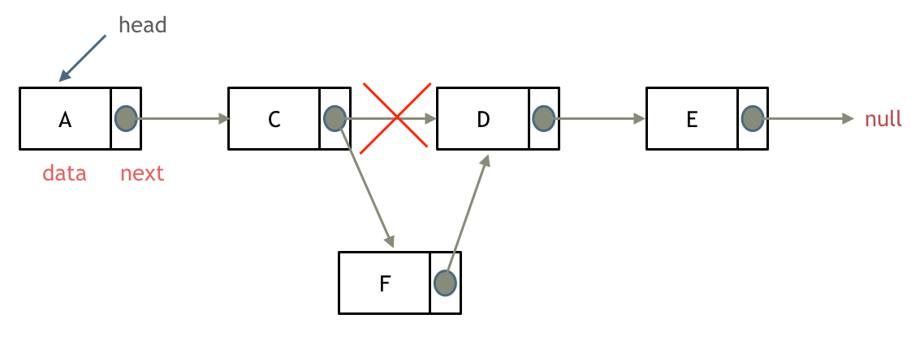
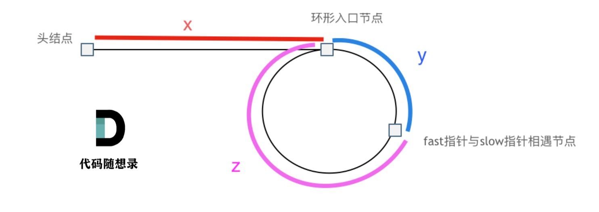
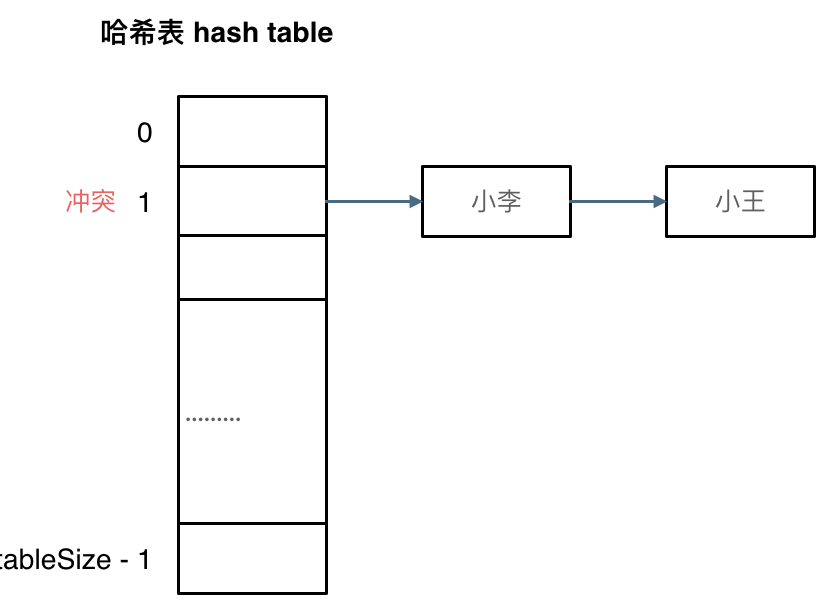

# 算法积累

## 数组

### 二分查找

重要思路：题目需要满足两个条件：

1.**是有序数组**；2.**数组中无重复元素**。

二分法程序最重要的就是**区间的定义**。一般分为两种：**左闭右闭**和**左闭右开**。两种写法对应两种不同的程序范式。

+ 左闭右闭区间

注意**右**边界要定义为==数组长度-1==；循环中right=middle - 1 而 left=middle +  1


有些题目可能需要涉及两个二分查找，比如[第34题](https://leetcode.cn/problems/find-first-and-last-position-of-element-in-sorted-array/description/)，我们需要筛选出所查找元素的第一个和最后一个位置。在刚接触二分查找时建议使用两个查找算法去寻找所查找元素的左右边界。边界的分布主要分为三种情况：

- 情况一：target 在数组范围的右边或者左边，例如数组{3, 4, 5}，target为2或者数组{3, 4, 5},target为6，此时应该返回{-1, -1}
- 情况二：target 在数组范围中，且数组中不存在target，例如数组{3,6,7},target为5，此时应该返回{-1, -1}
- 情况三：target 在数组范围中，且数组中存在target，例如数组{3,6,7},target为6，此时应该返回{1, 1}

在写程序时需要分别对这三种情况进行讨论：

```c++
int leftBorder = getLeftBorder(nums, target);
int rightBorder = getRightBorder(nums, target);
// 情况一
if (leftBorder == -2 || rightBorder == -2) return {-1, -1};
// 情况三
if (rightBorder - leftBorder > 1) return {leftBorder + 1, rightBorder - 1};
// 情况二
return {-1, -1};
```

想清楚三种情况之后，先专注于寻找右区间，然后专注于寻找左区间，左右根据左右区间做最后判断。

+ 小技巧

遍历时防止溢出的操作：

```c++
int middle = left + ((right - left) / 2);// 防止溢出 等同于(left + right)/2
```

### 移除元素

移除数组中的**指定元素**的方法有多种，思路最简单是的暴力求解法，使用两层for循环即可实现。这里主要介绍==双指针法(快慢指针法)==，这在考数组、链表的题目中是非常常见的，因此思路一定要清晰。


双指针法（快慢指针法）： **通过一个快指针和慢指针在一个for循环下完成两个for循环的工作。**

这种方法的特点是**没有改变元素的相对位置**。

定义快慢指针

- 快指针：寻找新数组的元素 ，新数组就是不含有目标元素的数组
- 慢指针：指向更新新数组下标的位置

```cpp
// 时间复杂度：O(n)
// 空间复杂度：O(1)
class Solution {
public:
    int removeElement(vector<int>& nums, int val) {
        int slowIndex = 0;
        for (int fastIndex = 0; fastIndex < nums.size(); fastIndex++) {
            //这里这个if相当于是更新慢指针的一个操作，他只有在快指针指向的值不是目标元素时才会执行
            if (val != nums[fastIndex]) {
                nums[slowIndex++] = nums[fastIndex];
            }
        }
        return slowIndex;
    }
};
```

需要注意移除元素不能增加新的内存空间，因此需要**原地操作**，也就是进行数组的覆盖。

简单来说，**快指针去寻找新数组的元素(这里新数组的元素是不含指定元素的)，找到的值赋值给慢指针，也就是说慢指针是新数组的下标值。**

### 有序数组的平方 

本题的关键是数组是有序的，**因此平方后数组最大的数只能是第一个或者最后一个**，通过双指针法可以求解此题。


此时可以考虑双指针法了，i指向起始位置，j指向终止位置。

定义一个新数组result，和A数组一样的大小，让k指向result数组终止位置。

如果`A[i] * A[i] < A[j] * A[j]`  那么`result[k--] = A[j] * A[j];`  。

如果`A[i] * A[i] >= A[j] * A[j]` 那么`result[k--] = A[i] * A[i];` 。

有如下题解：

```c++
class Solution {
public:
    vector<int> sortedSquares(vector<int>& A) {
        int k = A.size() - 1;
        vector<int> result(A.size(), 0);
        for (int i = 0, j = A.size() - 1; i <= j;) { // 注意这里要i <= j，因为最后要处理两个元素
            if (A[i] * A[i] < A[j] * A[j])  {
                result[k--] = A[j] * A[j];
                j--;
            }
            else {
                result[k--] = A[i] * A[i];
                i++;
            }
        }
        return result;
    }
};
```

### 长度最小的子数组

介绍滑动窗口法：

所谓滑动窗口，**就是不断的调节子序列的起始位置和终止位置，从而得出我们要想的结果**。

所以 只用一个for循环，那么这个循环的索引，一定是表示 滑动窗口的终止位置。

那么问题来了， 滑动窗口的起始位置如何移动呢？

这里还是以题目中的示例来举例，s=7， 数组是 2，3，1，2，4，3，来看一下查找的过程：


在本题中实现滑动窗口，主要确定如下三点：

- 窗口内是什么？
- 如何移动窗口的起始位置？
- 如何移动窗口的结束位置？

窗口就是满足其和 ≥ s 的长度最小的连续子数组。

窗口的起始位置如何移动：如果当前窗口的值大于s了，窗口就要向前移动了（也就是该缩小了）。

窗口的结束位置如何移动：窗口的结束位置就是遍历数组的指针，也就是for循环里的索引。

解题的关键在于 窗口的起始位置如何移动，如图所示：


可以发现**滑动窗口的精妙之处在于根据当前子序列和大小的情况，不断调节子序列的起始位置。从而将O(n^2)暴力解法降为O(n)。**

C++代码如下：

```cpp
class Solution {
public:
    int minSubArrayLen(int s, vector<int>& nums) {
        int result = INT32_MAX;
        int sum = 0; // 滑动窗口数值之和
        int i = 0; // 滑动窗口起始位置
        int subLength = 0; // 滑动窗口的长度
        for (int j = 0; j < nums.size(); j++) {
            sum += nums[j];
            // 注意这里使用while，每次更新 i（起始位置），并不断比较子序列是否符合条件
            while (sum >= s) {
                subLength = (j - i + 1); // 取子序列的长度
                result = result < subLength ? result : subLength;
                sum -= nums[i++]; // 这里体现出滑动窗口的精髓之处，不断变更i（子序列的起始位置）
            }
        }
        // 如果result没有被赋值的话，就返回0，说明没有符合条件的子序列
        return result == INT32_MAX ? 0 : result;
    }
};
```

**注：题目的精髓在于for循环中确定的j表示滑动窗口的结尾，首先动j，当满足滑窗中总和大于s时，动起始位置i，直到找到最小的长度。**

+ 注：除了76，最小滑窗外，还有最大滑窗[904](https://leetcode.cn/problems/fruit-into-baskets/solutions/1/shen-du-jie-xi-zhe-dao-ti-he-by-linzeyin-6crr/)这种类型。

求最大滑窗和最小滑窗在思路上有一些区别。

**最小滑窗模板**：给定数组 nums，定义滑窗的左右边界 i, j，求满足某个条件的滑窗的最小长度。

```c++
while j < len(nums):
    判断[i, j]是否满足条件
    while 满足条件：
        不断更新结果(注意在while内更新！)
        i += 1 （最大程度的压缩i，使得滑窗尽可能的小）
    j += 1
```

**最大滑窗模板**：给定数组 nums，定义滑窗的左右边界 i, j，求满足某个条件的滑窗的最大长度。

```c++
while j < len(nums):
    判断[i, j]是否满足条件
    while 不满足条件：
        i += 1 （最保守的压缩i，一旦满足条件了就退出压缩i的过程，使得滑窗尽可能的大）
    不断更新结果（注意在while外更新！）
    j += 1
```

是的，关键的区别在于，**最大滑窗是在迭代右移右边界的过程中更新结果，而最小滑窗是在迭代右移左边界的过程中更新结果**。

关于76和904这种题需要结合哈希表(unordered_map)和滑动窗口实现。

### 螺旋矩阵

螺旋矩阵更多的是考验对数组的掌控能力而不是什么特别的算法。可以说，螺旋矩阵的解法是充满套路的。总结来说，螺旋矩阵的要点是坚持**循环不变量原则**。一般需要定义4个for循环，每个for循环掌管遍历一个方向。

模拟顺时针画矩阵的过程:

- 填充上行从左到右
- 填充右列从上到下
- 填充下行从右到左
- 填充左列从下到上


对于不变量保持**左闭右开**的思路进行(也可以左闭右闭，但个人认为更加麻烦)。

```c++
class Solution {
public:
    vector<vector<int>> generateMatrix(int n) {
        vector<vector<int>> res(n, vector<int>(n, 0)); // 使用vector定义一个二维数组
        int startx = 0, starty = 0; // 定义每循环一个圈的起始位置
        int loop = n / 2; // 每个圈循环几次，例如n为奇数3，那么loop = 1 只是循环一圈，矩阵中间的值需要单独处理
        int mid = n / 2; // 矩阵中间的位置，例如：n为3， 中间的位置就是(1，1)，n为5，中间位置为(2, 2)
        int count = 1; // 用来给矩阵中每一个空格赋值
        int offset = 1; // 需要控制每一条边遍历的长度，每次循环右边界收缩一位
        int i,j;
        while (loop --) {
            i = startx;
            j = starty;

            // 下面开始的四个for就是模拟转了一圈
            // 模拟填充上行从左到右(左闭右开)
            for (j = starty; j < n - offset; j++) {
                res[startx][j] = count++;
            }
            // 模拟填充右列从上到下(左闭右开)
            for (i = startx; i < n - offset; i++) {
                res[i][j] = count++;
            }
            // 模拟填充下行从右到左(左闭右开)
            for (; j > starty; j--) {
                res[i][j] = count++;
            }
            // 模拟填充左列从下到上(左闭右开)
            for (; i > startx; i--) {
                res[i][j] = count++;
            }

            // 第二圈开始的时候，起始位置要各自加1， 例如：第一圈起始位置是(0, 0)，第二圈起始位置是(1, 1)
            startx++;
            starty++;

            // offset 控制每一圈里每一条边遍历的长度
            offset += 1;
        }

        // 如果n为奇数的话，需要单独给矩阵最中间的位置赋值
        if (n % 2) {
            res[mid][mid] = count;
        }
        return res;
    }
};
```

代码的核心思路是设置一个**总的循环圈数**，对于奇数次要单独遍历一次最中间的元素，对于偶数次则不需要。并且设置4个for循环依次操作矩阵四个方向的赋值。还需要设置一个**offset**用于控制每一条边遍历的长度。

关于螺旋矩阵还有一种巧妙的解题思路，如[这里](https://leetcode.cn/problems/spiral-matrix/solutions/7155/cxiang-xi-ti-jie-by-youlookdeliciousc-3/)，方法是不需要记录已经走过的路径，通过不断地更新上下边界进行确定。

+ 首先设定上下左右边界
+ 其次向右移动到最右，此时第一行因为已经使用过了，可以将其从图中删去，体现在代码中就是重新定义上边界
+ 判断若重新定义后，上下边界交错，表明螺旋矩阵遍历结束，跳出循环，返回答案
+ 若上下边界不交错，则遍历还未结束，接着向下向左向上移动，操作过程与第一，二步同理
+ 不断循环以上步骤，直到某两条边界交错，跳出循环，返回答案

```c++
class Solution {
public:
    vector<int> spiralOrder(vector<vector<int>>& matrix) {
        vector <int> ans;
        if(matrix.empty()) return ans; //若数组为空，直接返回答案
        int u = 0; //赋值上下左右边界
        int d = matrix.size() - 1;
        int l = 0;
        int r = matrix[0].size() - 1;
        while(true)
        {
            for(int i = l; i <= r; ++i) ans.push_back(matrix[u][i]); //向右移动直到最右
            if(++ u > d) break; //重新设定上边界，若上边界大于下边界，则遍历遍历完成，下同
            for(int i = u; i <= d; ++i) ans.push_back(matrix[i][r]); //向下
            if(-- r < l) break; //重新设定有边界
            for(int i = r; i >= l; --i) ans.push_back(matrix[d][i]); //向左
            if(-- d < u) break; //重新设定下边界
            for(int i = d; i >= u; --i) ans.push_back(matrix[i][l]); //向上
            if(++ l > r) break; //重新设定左边界
        }
        return ans;
    }
};
```

## 链表

什么是链表，链表是一种通过指针串联在一起的线性结构，每一个节点由两部分组成，一个是数据域一个是指针域（存放指向下一个节点的指针），最后一个节点的指针域指向null（空指针的意思）。

链表的入口节点称为链表的头结点也就是head。

如图所示：


链表有：单链表、双链表和循环链表三种类型。

单链表的基本定义：

```cpp
// 单链表
struct ListNode {
    int val;  // 节点上存储的元素
    ListNode *next;  // 指向下一个节点的指针
    ListNode(int x) : val(x), next(NULL) {}  // 节点的构造函数
};
```

**链表的基本操作：**

添加链表的节点：



删除链表的节点：


链表与数组的性能分析:


链表操作主要有两种方式：

+ **直接使用原来的链表来进行删除操作。**
+ **设置一个虚拟头结点在进行删除操作。**

使用第一种方法时，需要单独考虑删除头结点这种情况，而第二种方法不需要单独考虑。我这里更偏向使用第二种方法。

以下是一个链表删除元素的例题：

```c++
/**
 * Definition for singly-linked list.
 * struct ListNode {
 *     int val;
 *     ListNode *next;
 *     ListNode() : val(0), next(nullptr) {}
 *     ListNode(int x) : val(x), next(nullptr) {}
 *     ListNode(int x, ListNode *next) : val(x), next(next) {}
 * };
 */
class Solution {
public:
    ListNode* removeElements(ListNode* head, int val) {
        ListNode *dummyHead = new ListNode(0); //创建一个虚拟头结点
        dummyHead->next = head;

        ListNode *cur = dummyHead; //需要遍历的指针先指向虚拟的头结点
        while(cur->next != nullptr){
            if(cur->next->val == val){
                ListNode * tmp = cur->next; //指针tmp指向的是要被删除的元素
                cur->next = cur->next->next;
                delete tmp; //这里需要对被删掉的元素进行内存的回收，所以上面需要有一个指针指向它
            }else{
                cur = cur->next;
            }
        }
        head = dummyHead->next; //删除虚拟头节点
        delete dummyHead;
        return head;
    }
};
```

### 设计链表

设计链表需要我们实现链表的四种功能：

- get(index)：获取链表中第 index 个节点的值。如果索引无效，则返回-1。
- addAtHead(val)：在链表的第一个元素之前添加一个值为 val 的节点。插入后，新节点将成为链表的第一个节点。
- addAtTail(val)：将值为 val 的节点追加到链表的最后一个元素。
- addAtIndex(index,val)：在链表中的第 index 个节点之前添加值为 val  的节点。如果 index 等于链表的长度，则该节点将附加到链表的末尾。如果 index  大于链表长度，则不会插入节点。如果index小于0，则在头部插入节点。
- deleteAtIndex(index)：如果索引 index 有效，则删除链表中的第 index 个节点。

```c++
class MyLinkedList {
public:
    // 定义链表节点结构体
    struct LinkedNode {
        int val;
        LinkedNode* next;
        LinkedNode(int val):val(val), next(nullptr){}
    };
    
    //构造函数创建一个虚拟头结点以及初始化链表长度
    MyLinkedList(){
        _dummyHead = new LinkedNode(0);
        _size = 0;
    }
    
    int get(int index) {
        if(index < 0 || index >= _size){
            return -1;
        }
        LinkedNode* cur = _dummyHead->next; //从虚拟头节点的下一个(真正的头结点)开始遍历

        //不断遍历，直到index为0时，跳出while循环，此时cur指针也走了index次
        while(index--){
            cur = cur->next;
        }
        return cur->val;
    }
    
    void addAtHead(int val) {
        //这个函数的实现是有坑的，赋值的顺序有讲究，要先用cur赋值后面的量，再让dummy指向cur
        LinkedNode* cur = new LinkedNode(val);
        cur->next = _dummyHead->next;
        _dummyHead->next = cur;
        _size ++;
    }
    
    void addAtTail(int val) {
        LinkedNode* cur = _dummyHead;
        //找到链表的最后一个元素
        while(cur->next != NULL){
            cur = cur->next;
        }
        LinkedNode* tmp = new LinkedNode(val);
        cur->next = tmp;
        tmp->next = NULL;
        _size++;
    }
    
    void addAtIndex(int index, int val) {
        if(index < 0){
            index = 0;
        }else if (index > _size){
            return;
        }
        LinkedNode* tmp = new LinkedNode(val);
        LinkedNode* cur = _dummyHead;
        while(index--){
            cur = cur->next;
        }
        tmp->next = cur->next;
        cur->next = tmp;
        _size++;
    }
    
    void deleteAtIndex(int index) {
        if(index < 0 || index >= _size){
            return;
        }
        LinkedNode* cur = _dummyHead;
        int val = get(index);
        while(index--){
            cur = cur->next;
        }
        LinkedNode* tmp = cur->next;
        cur->next = cur->next->next;
        delete tmp;
        tmp = nullptr;
        _size--;
    }
        // 打印链表
    void printLinkedList() {
        LinkedNode* cur = _dummyHead;
        while (cur->next != nullptr) {
            cout << cur->next->val << " ";
            cur = cur->next;
        }
        cout << endl;
    }
private:
    int _size; //链表的长度
    LinkedNode* _dummyHead; //虚拟头节点
};

/**
 * Your MyLinkedList object will be instantiated and called as such:
 * MyLinkedList* obj = new MyLinkedList();
 * int param_1 = obj->get(index);
 * obj->addAtHead(val);
 * obj->addAtTail(val);
 * obj->addAtIndex(index,val);
 * obj->deleteAtIndex(index);
 */
```

第一次做这道题目的时候超时了，原因是遍历链表的操作写的太冗余，当给定的是链表的索引的时候，可以通过以下操作遍历链表：（十分的巧妙）

```c++
while(index--){
    cur = cur->next;
}
```

### 翻转链表(常考)

翻转链表是笔试中常考的题目，思路也较为简单，如动画所示：


```c++
class Solution {
public:
    ListNode* reverseList(ListNode* head) {

        ListNode* cur = head;
        ListNode* pre = nullptr;
        ListNode* tmp = nullptr;
        
        while(cur){
            tmp = cur->next; //暂存
            cur->next = pre;
            pre = cur;            
            cur = tmp;      
        }
        return pre;
    }
};
```

翻转链表的关键在于设定终止条件和设定一个暂存的指针tmp。终止条件就是当cur指向一个空指针的时候，这时pre指向链表最后一个元素，此时循环终止。

**注：翻转链表不需要设定虚拟头结点**


### 两两交换链表中的节点

在操作链表节点的时候，每次需要操作三个节点，因此判断的条件应该是：当当前节点的下个节点和下下个节点都不为空时，执行while循环。

+ note1：链表的操作顺序分为三个步骤：


执行完三个步骤后，链表变成这样：


循环这三个步骤，完成链表节点的交换。

```c++
class Solution {
public:
    ListNode* swapPairs(ListNode* head) {
        ListNode* dummyHead = new ListNode(0);
        dummyHead->next = head;

        ListNode* cur = dummyHead;
        while(cur->next != nullptr && cur->next->next !=nullptr){
            ListNode* tmp1 = cur->next; //暂存1节点
            ListNode* tmp2 = cur->next->next->next; //暂存3节点


            cur->next = cur->next->next;    // 步骤一
            cur->next->next = tmp1;  //步骤二
            cur->next->next->next = tmp2;  //步骤三

            cur = cur->next->next;
        }
        return dummyHead->next;
    }
```

### 删除链表的倒数第N个节点

这道题不难，但是思路很巧妙，值得学习。

双指针的经典应用，如果要删除倒数第n个节点，让fast移动n步，然后让fast和slow同时移动，直到fast指向链表末尾。删掉slow所指向的节点就可以了。

思路是这样的，但要注意一些细节。

分为如下几步：

- 首先这里我推荐大家使用虚拟头结点，这样方便处理删除实际头结点的逻辑。
- 定义fast指针和slow指针，初始值为虚拟头结点，如图：


- **fast首先走n + 1步 ，为什么是n+1呢，因为只有这样同时移动的时候slow才能指向删除节点的上一个节点（方便做删除操作），如图：** 
- fast和slow同时移动，直到fast指向末尾，如题： 
- 删除slow指向的下一个节点，如图： 

```c++
class Solution {
public:
    ListNode* removeNthFromEnd(ListNode* head, int n) {
        ListNode* dummyHead = new ListNode(0);
        dummyHead->next = head;
        ListNode* fast = dummyHead;
        while(n-- && fast != nullptr){
            fast = fast->next; //fast先走n步
        }
        fast = fast->next; // ※关键一步：fast再提前走一步，因为需要让slow指向删除节点的上一个节点
        ListNode* slow = dummyHead;
        while(fast != nullptr){
            fast = fast->next;
            slow = slow->next;
        }
        slow->next = slow->next->next;
        return dummyHead->next;
        
    }
};
```

### 链表相交

求两个链表交点节点的指针。需要注意，交点不是数值相等，而是指针相等。常见的做法是让短的链表与长链表的末尾对其。然后挨个遍历比较两个指针所指向的值是否相同，返回相同的指针。如果都不相同，返回空指针。


这里需要注意：一个编程技巧，不管链表A和链表B哪个链表长哪个短，都变换为链表A为长链表，B为短链表。

```c++
class Solution {
public:
    ListNode *getIntersectionNode(ListNode *headA, ListNode *headB) {
        ListNode* curA = headA;
        ListNode* curB = headB;

        int lenA = 0;
        int lenB = 0;
        while(curA != nullptr){
            lenA++;
            curA = curA->next;
        }
        while(curB != nullptr){
            lenB++;
            curB = curB->next;
        }
        curA = headA;
        curB = headB;
        //交换A和B，让A链表始终是最长的链表
        if(lenA < lenB){
            swap(curA, curB);
            swap(lenA, lenB);
        }
        int diff = lenA - lenB;

        while(diff--){
            curA = curA->next; //让A移动到和B平齐的位置
        }

        while(curA != nullptr){
            if(curA->val == curB->val){
                return curA;
            }else{
                curA = curA->next;
                curB = curB->next;
            }
        }
        return NULL;
    }
};
```

### 环形链表

这道题的代码比较好写，但是思路相对比较难想一些。主要的思想还是快慢指针。题目要求返回入环的第一个节点。

首先定义一个快指针fast和一个慢指针slow。那么当链表有环，**则快慢指针一定会相遇**。因为我们假设慢指针每次走一步，快指针每次走两步。快指针相对于慢指针每次多走一步，所以当快慢指针都入环时，二者一定会相遇。



假设头结点到入口的距离为$x$，快指针和慢指针相遇的节点距离入口$y$，相遇节点再到入口的距离为$z$，如图，那么快慢指针走过的距离分别为：

slow：$x+y$

fast: $x+y+n(y+z)$  这里$n(y+z)$表示快指针比慢指针多走了n圈

slow是$x+y$而不是$x+y+n(y+z)$的原因是**慢指针在第一圈走完之前就会被快指针追上。**

根据快节点走过的距离是慢节点的二倍列出等式：
$$
x+y=n(y+z)
$$
我们要求的是入环节点，也就是$x$，则
$$
x=n(y+z)-y
$$
整理后如下：
$$
x=(n-1))(y+z)+z
$$
当$n=1$时，$x=z$，这就意味着，**从头结点出发一个指针，从相遇节点 也出发一个指针，这两个指针每次只走一个节点， 那么当这两个指针相遇的时候就是 环形入口的节点**。

也就是在相遇节点处，定义一个指针index1，在头结点处定一个指针index2。

让index1和index2同时移动，每次移动一个节点， 那么他们相遇的地方就是 环形入口的节点。

动画如下：


```c++
**
 * Definition for singly-linked list.
 * struct ListNode {
 *     int val;
 *     ListNode *next;
 *     ListNode(int x) : val(x), next(NULL) {}
 * };
 */
class Solution {
public:
    ListNode *detectCycle(ListNode *head) {
        ListNode* fast = head;
        ListNode* slow = head;
        while(fast != NULL && fast->next != NULL) {
            slow = slow->next;
            fast = fast->next->next;
            // 快慢指针相遇，此时从head 和 相遇点，同时查找直至相遇
            if (slow == fast) {
                ListNode* index1 = fast;
                ListNode* index2 = head;
                while (index1 != index2) {
                    index1 = index1->next;
                    index2 = index2->next;
                }
                return index2; // 返回环的入口
            }
        }
        return NULL;
    }
};
```

## 哈希表

哈希表的基础理论见代码随想录：[here](https://www.programmercarl.com/%E5%93%88%E5%B8%8C%E8%A1%A8%E7%90%86%E8%AE%BA%E5%9F%BA%E7%A1%80.html#%E5%93%88%E5%B8%8C%E5%87%BD%E6%95%B0)。这里简单说一下解决哈希碰撞的方法：**拉链法**和**线性探测法**。

**拉链法：**

刚刚小李和小王在索引1的位置发生了冲突，发生冲突的元素都被存储在链表中。 这样我们就可以通过索引找到小李和小王了。

（数据规模是dataSize， 哈希表的大小为tableSize）

其实拉链法就是要选择适当的哈希表的大小，这样既不会因为数组空值而浪费大量内存，也不会因为链表太长而在查找上浪费太多时间。



**线性探测法：**

使用线性探测法，一定要保证tableSize大于dataSize。 我们需要依靠哈希表中的空位来解决碰撞问题。

例如冲突的位置，放了小李，那么就向下找一个空位放置小王的信息。所以要求tableSize一定要大于dataSize ，要不然哈希表上就没有空置的位置来存放 冲突的数据了。如图所示：


### 有效的字母异位词

这道题的思路较为简单，所谓有效字母的异位词，就是两个字符串s和t，如果两个字符串**出现字母的个数都相同**，那么两个字符串互为异位词，返回true，否则返回false。 

这道题的关键是定义一个数组用于记录字母出现的次数，==一个小技巧是记录字母相对于a的ASCII的值，而不是记录字母的原始ASCII，这样从字母a到z就是序号0-26。==

首先记录s中所有字母，record中相应位置加1，再遍历t中所有的字母，每出现一个字母，相应位置减1，这样当两个字符串中有不同字母时，整个数组不全为0，这时返回false，否则返回true。

```c++
class Solution {
public:
    bool isAnagram(string s, string t) {
        int record[26] = {0};
        for(int i = 0; i < s.size(); i++){
            record[s[i] - 'a'] ++; //s[i] - 'a'表示s字符串中的每个字母相对于a的ASCII的相对值，不需要记录完整的码。
        }
        for(int i = 0; i < t.size(); i++){
            record[t[i] - 'a'] --; 
        }
        for(auto i : record){
            if(i){
                return false;
            }
        }
        return true;
    }
};
```

### 快乐数 

```c++
class Solution {
public:
    int getNum(int n){
        int sum = 0;
        while(n){
            sum += (n % 10) * (n % 10);
            n /=10;
        }
        return sum;
    }
    bool isHappy(int n) {
        unordered_set<int> set;
        while(1){
            int sum = getNum(n);
            if(sum == 1){
                return true;
            }

            if(set.find(sum) != set.end()){
                return false;
            }else{
                set.insert(sum);
            }
            n = sum;
        }
    }
};
```

这道题的关键有两个：

1. 如何获取一个正整数的每位的平方和：

```c++
while(n){
    sum += (n % 10) * (n % 10);
    n /=10;
}
```

2. 如何判断终止条件：

```c++
// 如果这个sum曾经出现过，说明已经陷入了无限循环了，立刻return false
if(set.find(sum) != set.end()){
    return false;
}
```
