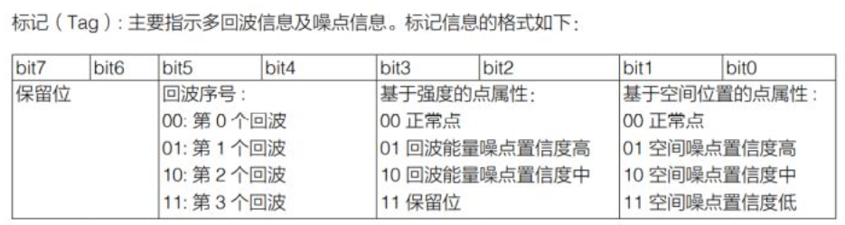

# Livox 激光雷达

## 如何使用 Livox 激光雷达点云中的 Tag 信息

在激光雷达应用场景中，雨雾和灰尘是常见的噪声来源。而噪声在一定程度上会影响算法的效果：如产生目标物误检等，因此我们需要根据实际情况对点云噪声进行滤除。基于这种情况，Livox 从雷达底层信息出发，在雷达输出的点云数据中内置标识点云多回波及噪点信息数据的Tag 信息，帮助用户更高效地应对点云噪声。

### 标记（Tag）是什么？

Tag 是激光雷达点云数据里指示多回波信息及噪点信息的数据。我们将Tag 信息的格式进行如下定义：

