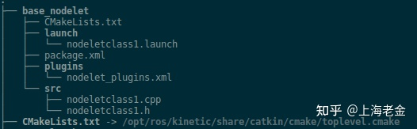

# learning Nodelet of ROS

ROS的数据通信是以XML-RPC的方式,在graph结构中以topic,service和param的方式传输数据，==天生的数据交互存在一定的延时和阻塞==。Nodelet 包就是改善这一状况设计的， **使得多个算法运行在同一个过程中**，并且算法间数据传输无需拷贝就可实现。 简单的讲就是可以**将以前启动的多个node捆绑在一起manager，使得同一个manager里面的topic的数据传输更快，数据通讯中roscpp采用boost shared pointer方式进行publish调用，实现zero copy。**  

从实现上讲，nodelet之间的topic通信，采用的是**共享内存的方式**，这也就消除了数据拷贝的开销。一般情况下，产生大量数据的传感器节点，都会有nodelet的实现形式。然后使用这个数据的算法节点也可以实现成nodelet的形式，然后启动一个nodelet manager加载这两个类，他们之间的通信就会舒服很多。  

+ Nodelet的特点

 1 nodelets间数据传输zero copy，有效避免数据copy和网络传输代价

 2 支持pulgin的方式动态加载（Nodelet本质上就是ROS的一个插件系统）

 3  使用C++ ROS的接口方式


# 实现一个Nodelet(c++)

Nodelet节点与传统的ros节点有点不一样，不一样在于，节点的源文件cpp里面并没有main函数。

其特点是：是一个类(Class)的形式

所以，编译的时候，并不是编译成可执行文件，**而是编译成库文件**

+ **项目文件树**

最终的package文件树大概这样：



使用Nodelets至少需要这三类文件：.cpp文件、.xml文件和.launch文件，分别放入功能包的src、plugins、launch中。（当然编译工程的CMakeLists.txt和package.xml是必须得）

+ src文件夹

**nodeletclass1.h**

```h
#include <nodelet/nodelet.h> //固定写法
 
class nodeletclass1 :public nodelet::Nodelet  //继承父类nodelet::Nodelet
{
public:
  nodeletclass1();         //构造函数，一般使用默认构造即可
public:
  virtual void onInit();   //这个虚函数，在启动本Nodelet节点时，自动调用（必须包含，就类似于main函数了）也是整个NodeLet的入口
};
```

**nodeletclass1.cpp**

```c++
#include "nodeletclass1.h"
#include <pluginlib/class_list_macros.h> //固定写法
#include <ros/ros.h>
 
nodeletclass1::nodeletclass1(){}
//重载虚函数，启动时自动调用
void nodeletclass1::onInit()
{
  //在这个函数里面继续完成整个工程
  //输出信息
  NODELET_DEBUG("Init nodelet...");
  ROS_INFO("Nodelet is OK for test");
}
 
//nodelet的本质是把节点作为插件来调用，因此需要PLUGINLIB的宏定义、
//第一个参数是类名，第二个参数是父类
PLUGINLIB_EXPORT_CLASS(nodeletclass1, nodelet::Nodelet); //nodelet中必须要有这个宏调用
```

+ plugins文件夹

**nodelet_plugins.xml**

```xml
<!--这里的path="",修改成path="lib/lib{项目名}",
    项目名就是CMakeLists.txt里面定义的project(base_nodelet)
    我这里就是path="lib/libbase_nodelet"
-->
<!--------------------------------------------------------->
<library path="lib/libbase_nodelet" >
 
  <!-- name: launch文件里面 load 后面接着的插件名
       type: c++文件定义的类名
       如 name="nodeletclass1",那么，launch文件对应启动如下：
       <node pkg="nodelet" type="nodelet" name="nodeletclass1"
       args="load nodeletclass1 nodelet_manager" output="screen">
  -->
  <class name="nodeletclass1" type="nodeletclass1" base_class_type="nodelet::Nodelet">
  <description>
  This is my nodelet.
  </description>
  </class>
</library>
```

对于上述xml文件来说，有几个nodelet就需要在xml文件中定义几套<library path>，可以参考s-msckf中的nodelets.xml，如下：

```xml
<library path="lib/libmsckf_vio_nodelet">
  <class name="msckf_vio/MsckfVioNodelet"
         type="msckf_vio::MsckfVioNodelet"
         base_class_type="nodelet::Nodelet">
    <description>
      Multi-State contraint Kalman filter for vision-
      aided inertial navigation with observability constain.
    </description>
  </class>
</library>

<library path="lib/libimage_processor_nodelet">
  <class name="msckf_vio/ImageProcessorNodelet"
         type="msckf_vio::ImageProcessorNodelet"
         base_class_type="nodelet::Nodelet">
    <description>
      Detect and track features in image sequence.
    </description>
  </class>
</library>

```

在s-msckf中，主要使用了两个nodelet，一个负责处理双目相机图像的传输：ImageProcessorNodelet；另一个是后端MSCKF的nodelet：MsckfVioNodelet

+ **CMakeLists.txt和package.xml内容**

```cmake
cmake_minimum_required(VERSION 2.8.3)
project(base_nodelet)
 
#启用c++11
set(CMAKE_CXX_FLAGS "${CMAKE_CXX_FLAGS} -std=c++11")
 
# Find catkin and all required ROS components
find_package(catkin REQUIRED COMPONENTS
    roscpp
    nodelet # ******
    )
 
# Set include directories
include_directories(include)
INCLUDE_DIRECTORIES(/opt/ros/noetic/include/)
 
catkin_package(
  #INCLUDE_DIRS include
  #CATKIN_DEPENDS ${ROS_CXX_DEPENDENCIES}
)
#Create node
#add_executable(${PROJECT_NAME} src/nodeletclass1.cpp)
add_library(${PROJECT_NAME} src/nodeletclass1.cpp)
add_dependencies(${PROJECT_NAME} ${${PROJECT_NAME}_EXPORTED_TARGETS} ${catkin_EXPORTED_TARGETS} )
target_link_libraries(${PROJECT_NAME} ${catkin_LIBRARIES})
```

与普通的ros节点对比，nodelet节点的CMakeLists.txt：

不生成二进制文件，即去掉

```cmake
add_executable(${PROJECT_NAME} src/nodeletclass1.cpp)
```

编译成库形式

```cmake
add_library(${PROJECT_NAME} src/nodeletclass1.cpp)
```

增加

```cmake
add_dependencies(${PROJECT_NAME} ${${PROJECT_NAME}_EXPORTED_TARGETS} ${catkin_EXPORTED_TARGETS} )
```

```xml
<?xml version="1.0"?>
<package format="2">
  <name>base_nodelet</name>
  <version>0.1.0</version>
  <description>The base_nodelet package</description>
  <maintainer email="msi@todo.todo">msi</maintainer>
  <license>Apache 2.0</license>
 
  <buildtool_depend>catkin</buildtool_depend>
 
  <!-- 插入内容 -->
  <build_depend>nodelet</build_depend>
  <build_depend>roscpp</build_depend>
  <exec_depend>nodelet</exec_depend>
  <exec_depend>roscpp</exec_depend>
 
  <!-- 指定nodelet插件xml路径 -->
  <export>
    <nodelet plugin="${prefix}/plugins/nodelet_plugins.xml" />
  </export>
</package>
```

对于上述package.xml文件来说，主要加入了以下内容：

```xml
<build_depend>nodelet</build_depend>
<build_depend>roscpp</build_depend>
<exec_depend>nodelet</exec_depend>
<exec_depend>roscpp</exec_depend>
```

和

```xml
<nodelet plugin="${prefix}/plugins/nodelet_plugins.xml"/>
```

+ launch文件

```xml
<launch>
  <node pkg="nodelet" type="nodelet" name="nodelet_manager"  args="manager" output="screen"/> 
 
  <node pkg="nodelet" type="nodelet" name="nodeletclass1" args="load nodeletclass1 nodelet_manager" output="screen">
  </node>
</launch>
```

一些参考文章：

https://gaoyichao.com/Xiaotu/?book=ros&title=nodelet

https://zhuanlan.zhihu.com/p/422745030

https://blog.csdn.net/zhaodeming000/article/details/122899566
