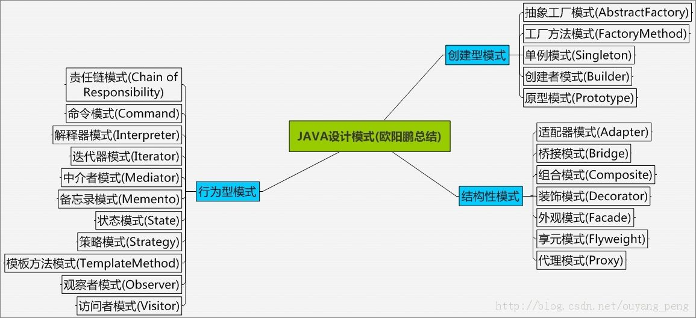

# c++ 设计模式

## 程序设计模式简介

1994年，Go四位大牛合著出版了一本名为《Design Patterns:Elements of Reusable Object-Oriented Software》的书，该书首次提到了软件开发中设计模式的概念，将设计模式理论提升到理论高度，并将之泛化。书中提及的设计模式总共有**23种**，在可复用面向对象设计软件的发展过程中，新的设计模式仍然不断出现。

## 设计模式的三大分类及关键点

设计模式主要分为三大类，创建型、行为型、结构型。

