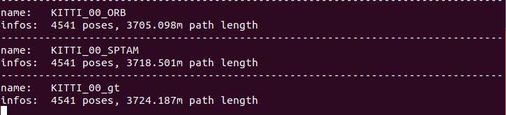

SLAM测评工具———evo安装与使用

## evo简介

evo是一个很好的测评工具，它可以根据[时间戳](https://so.csdn.net/so/search?q=时间戳&spm=1001.2101.3001.7020)将轨迹进行对齐，同时可以将不同尺度的轨迹按照你指定的标准轨迹进行拉伸对齐，并可以算出均方差等评定参数，用于测评slam算法性能

目前支持 TUM KITTI Euroc 等格式。

## evo安装

**1.切换python版本**
 新版evo的安装只支持python 3.6+
 Ubuntu18.04默认python2.7（catkin_make支持python2.7版本，即默认版本），需要切换

```bash
sudo update-alternatives --config python
```

**2.安装pip3**

```bash
sudo apt install python3-pip
```

查看版本：

```bash
pip3 -V
```


注：如果报下面错误，很可能是没有安装pip3，尤其是刚切换了python3，大概率是没有安装，安装后就不报错了，可以正常进行第三步evo的安装

```bash
Traceback (most recent call last):
  File "/usr/local/bin/pip", line 7, in <module>
    from pip._internal.cli.main import main
ModuleNotFoundError: No module named 'pip'

```

**3.安装evo**

```bash
sudo pip install evo --upgrade --no-binary evo
```

**4.自带test测试**

```bash
cd test/data
evo_traj kitti KITTI_00_ORB.txt KITTI_00_SPTAM.txt --ref=KITTI_00_gt.txt -p --plot_mode=xyz

```

报错：

```
ModuleNotFoundError: No module named 'tkinter'
[ERROR] evo module evo.main_traj crashed - no logfile written (disabled)

```

解决：

```bash
sudo apt-get install tcl-dev tk-dev python3-tk

```

```bash
//二维
evo_traj kitti KITTI_00_ORB.txt KITTI_00_SPTAM.txt --ref=KITTI_00_gt.txt -p --plot_mode=xz
//三维
evo_traj kitti KITTI_00_ORB.txt KITTI_00_SPTAM.txt --ref=KITTI_00_gt.txt -p --plot_mode=xyz
```



相对误差（地图用颜色深浅表示）

比较绝对位姿误差：eva_ape


官方文档中对该指令是这样介绍的：

    Absolute pose error, often used as absolute trajectory error. Corresponding poses are directly compared between estimate and reference given a pose relation. Then, statistics for the whole trajectory are calculated. This is useful to test the global consistency of a trajectory.
    绝对姿态误差，通常用作绝对轨迹误差。 给定姿势关系，可以在估计值和参考值之间直接比较相应的姿势。 然后，计算整个轨迹的统计量。 这对于测试轨迹的整体一致性很有用。


```bash
evo_ape tum data.tum KeyFrameTrajectoryloop.txt -r full -v -as -p --save_results ./results/1.zip
```

指令参数含义：

- `evo_ape`绝对误差比较命令
- `tum`轨迹数据集类型
- `data.tum` 和`KeyFrameTrajectoryloop.txt`分别为参考轨迹和待评价轨迹，即前者是参考轨迹，后者是估计轨迹
- `-r full`表示同时考虑旋转和平移误差得到的ape,无单位（unit-less）、
- `-v`是verbose mode，即详细模式，所谓详细模式目前我的发现主要是在命令行会输出更多相关信息，图片放在下边
- `-as`意思是采用Sim(3) Umeyama对齐，同时处理平移、旋转、尺度
- `-p`意味绘制轨迹
- `--save_results ./results/1.zip`意味把对比结果保存到相应目录下的1.zip文件内

比较相对位姿误差：evo_rpe

官方文档介绍如下：

    Instead of a direct comparison of absolute poses, the relative pose error compares motions (“pose deltas”). This metric gives insights about the local accuracy, i.e. the drift. For example, the translational or rotational drift per meter can be evaluated:
    相对姿态误差不是对绝对姿态进行直接比较，而是对运动（“姿态增量”）进行比较。 该度量提供有关局部精度（即漂移）的见解。 例如，可以评估每米的平移或旋转漂移：


```bash
evo_rpe tum data.tum KeyFrameTrajectoryloop.txt -r angle_deg --delta 1 --delta_unit m -v -as --plot --plot_mode xyz --save_results ./results/2.zip

```

指令参数含义：

    evo_rpe绘制相对位姿误差
    -r表示rpe所基于的姿态关系

-r	–pose_relation可选参数含义
full	表示同时考虑旋转和平移误差得到的ape,无单位（unit-less）
trans_part	考虑平移部分得到的ape，单位为m
rot_part	考虑旋转部分得到的ape，无单位（unit-less）
angle_deg	考虑旋转角得到的ape,单位°（deg）
angle_rad	考虑旋转角得到的ape,单位弧度（rad）

    --delta表示相对位姿之间的增量，默认为1
    --delta_unit表示增量的单位，可选参数为[f, d, r, m],分别表示[frames, deg, rad, meters]
    -v详细模式
    -as意思是采用Sim(3) Umeyama对齐，同时处理平移、旋转、尺度
    -p意味绘制轨迹
    --save_results ./results/2.zip意味把对比结果保存到相应目录下的2.zip文件内
# evo命令总结：

**指标命令**：

- evo_ape - absolute pose error 绝对位姿误差
- evo_rpe - relative pose error 相对位姿误差

**工具命令**：

+ evo_traj - tool for analyzing, plotting or exporting one or more trajectories，**最常用，绘制轨迹图，分析轨迹结果**
+ evo_res - tool for comparing one or multiple result files from evo_ape or evo_rpe，较常用，对结果进一步分析
+ evo_fig - (experimental) tool for re-opening serialized plots (saved with --serialize_plot)
+ evo_config - tool for global settings and config file manipulation

## 实例

### 绘制一条轨迹

+ 第1个evo_traj命令绘制轨迹；
+ 第2个参数euroc表示绘制的轨迹是EuRoc数据集的格式；
+ 第3个参数是绘制的轨迹文件。但是如果只到这里的话，这个指令只是显示轨迹的基本信息。
+ 若要绘制轨迹变成图像，则增加第4个参数 -p 或 --plot。
+ 第5个参数--plot_mode是对绘图的显示模式的设置，这里设置视角为xyz视角。

```bash
evo_traj euroc GT_MH_01_data.csv -p --plot_mode xyz
```

### 绘制两条轨迹，一条为真实参考轨迹

+ 第1个evo_traj命令绘制轨迹；
+ 第2个参数tum表示绘制的轨迹是TUM数据集的格式；
+ 第3个参数是绘制的轨迹文件；
+ 第4个参数用--ref=选项作为前缀表示真实参考轨迹；
+ 第5个参数中的-a选项表示对齐两条轨迹，第5个参数中的-v选项表示输出轨迹对齐的详细信息（即对齐的平移、旋转）；
+ 第6个参数用-p选项表示绘制图像，用--plot_mode选项表示对绘图显示模式的设置。

```bash
evo_traj tum vins_result_loop.tum --ref=GT_MH_01_data.tum -va -p --plot_mode xyz
```

### 绘制轨迹误差结果图

+ 第1个evo_ape命令计算绝对位姿误差；
+ 第2个参数tum表示绘制的轨迹是TUM数据集的格式；
+ 第3个参数是真实参考轨迹；
+ 第4个参数是绘制的轨迹文件；
+ 第5个参数中的-a选项表示对齐两条轨迹，第5个参数中的-v选项表示输出轨迹对齐的详细信息（即对齐的平移、旋转）；
+ 第6个参数用-p选项表示绘制图像，用--plot_mode选项表示对绘图显示模式的设置。

```bash
evo_ape tum GT_MH_01_data.tum vins_result_loop.tum -va -p --plot_mode xyz
```

### 转换euroc轨迹格式为tum格式

```bash
evo_traj euroc GT_V1_02_medium.csv --save_as_tum
```


