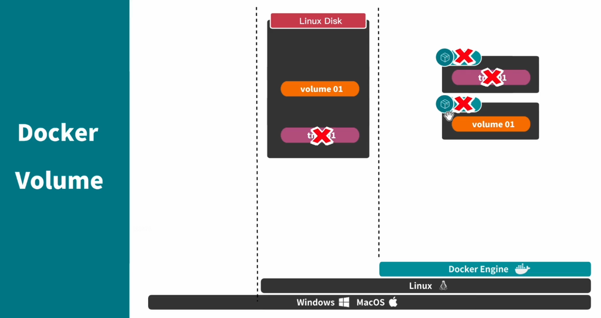

#docker 常用指令

## docker 基础命令

```bash
# 启动docker
systemctl start docker
# 关闭docker
systemctl stop docker
# 重启docker
systemctl restart docker
# docker设置随服务启动而自启动
systemctl enable docker
# 查看docker 运行状态 ------如果是在运行中 输入命令后 会看到绿色的active
systemctl status docker
# 查看docker 版本号信息
docker version
docker info
# docker 帮助命令
docker --help
# 比如 咱忘记了 拉取命令 不知道可以带哪些参数 咱可以这样使用
docker pull --help
```

## docker 镜像指令

```bash
# 查看自己服务器中docker 镜像列表
docker images
# 搜索镜像
docker search 镜像名
docker search --filter=STARS=9000 mysql 搜索 STARS >9000的 mysql 镜像
# 拉取镜像 不加tag(版本号) 即拉取docker仓库中 该镜像的最新版本latest 加:tag 则是拉取指定版本
docker pull 镜像名 
docker pull 镜像名:tag
# 运行镜像
docker run 镜像名
docker run 镜像名:Tag
# 删除镜像
##删除一个
docker rmi -f 镜像名/镜像ID
##删除多个 其镜像ID或镜像用用空格隔开即可 
docker rmi -f 镜像名/镜像ID 镜像名/镜像ID 镜像名/镜像ID
##删除全部镜像  -a 意思为显示全部, -q 意思为只显示ID
docker rmi -f $(docker images -aq)
# 强制删除镜像
docker image rm 镜像名称/镜像ID
# 保存镜像  将我们的镜像 保存为tar 压缩文件 这样方便镜像转移和保存 ,然后 可以在任何一台安装了docker的服务器上 加载这个镜像
docker save 镜像名/镜像ID -o 镜像保存在哪个位置与名字
## exmaple:docker save tomcat -o /myimg.tar
# 加载镜像 任何装 docker 的地方加载镜像保存文件,使其恢复为一个镜像
docker load -i 镜像保存文件位置
```

## docker 容器命令

```bash
# 查看正在运行容器列表
docker ps
# 查看所有容器 -----包含正在运行 和已停止的
docker ps -a
# 运行一个容器
## -it 表示 与容器进行交互式启动 -d 表示可后台运行容器 （守护式运行）  --name 给要运行的容器 起的名字  /bin/bash  交互路径
docker run -it -d --name 要取的别名 镜像名:Tag /bin/bash 
##例子
#1. 拉取redis 镜像
# docker pull redis:5.0.5
#2.命令启动
# docker run -it -d --name redis001 redis:5.0.5 /bin/bash

# 停止容器
docker stop 容器名/容器ID
# 重启容器
docker restart 容器ID/容器名
# 启动容器
docker start 容器ID/容器名
# kill 容器
docker kill 容器ID/容器名

# 删除容器

##删除一个容器
docker rm -f 容器名/容器ID
##删除多个容器 空格隔开要删除的容器名或容器ID
docker rm -f 容器名/容器ID 容器名/容器ID 容器名/容器ID
##删除全部容器
docker rm -f $(docker ps -aq)

# 进入容器
## 方式一(推荐)
docker exec -it 容器名/容器ID /bin/bash
# 例进入 前面的 redis001容器   
# docker exec -it redis001 /bin/bash
## 方式二
docker attach 容器名/容器ID
# 退出容器 注意两种方式的区别
# 方式一：-----直接退出  未添加 -d(持久化运行容器) 时 执行此参数 容器会被关闭  
exit
# 方式二： 优雅退出 --- 无论是否添加-d 参数 执行此命令容器都不会被关闭
Ctrl + p + q

# 容器文件拷贝(无论容器是否开启 都可以进行拷贝)
## docker cp 容器ID/名称:文件路径  要拷贝到外部的路径   |     要拷贝到外部的路径  容器ID/名称:文件路径
#从容器内 拷出
docker cp 容器ID/名称: 容器内路径  容器外路径
#从外部 拷贝文件到容器内
docker  cp 容器外路径 容器ID/名称: 容器内路径

# 查看容器日志
docker logs -f --tail=要查看末尾多少行 默认all 容器ID

# 设置容器开机自启动
## 方式是使用docker run 时，添加参数 --restart=always 便表示，该容器随docker服务启动而自动启动
# 例如：
docker run -itd --name redis002 -p 8888:6379 --restart=always  redis:5.0.5 /bin/bash
## 若不想删除容器，又想让这个容器设置开机自启动，则需要修改其启动配置
docker  update --restart=always 容器Id 或者 容器名   或
docker container update --restart=always 容器Id 或者 容器名

# 更换容器名
docker rename 容器ID/容器名 新容器名

# 自己提交一个镜像(重要)
## 我们运行的容器可能在镜像的基础上做了一些修改，有时候我们希望保存起来，封装成一个更新的镜像，这时候我们就需要使用 commit 命令来构建一个新的镜像
docker commit -m="提交信息" -a="作者信息" 容器名/容器ID 提交后的镜像名:Tag

```

**容器端口映射**：默认情况下，我们是无法通过宿主机（安装docker的服务器）端口来直接访问容器的 ,因为docker容器自己开辟空间的端口与宿主机端口没有联系，如果外部想要访问容器，那必须得让==容器中的端口与宿主机的端口建立联系绑定起来==。有了端口映射，我们就可以将宿主机端口与 容器端口绑定起来，比如 我们建立宿主机的6379端口与容器redis6379端口绑定起来，那么再访问宿主机Ip:6379 就可以访问到对应容器了！

```bash
# -p 8888:6379 解析 将容器内部的 6379端口与docker 宿主机（docker装在哪台服务器 哪台服务器就是宿主机）8888 端口进行映射 那通过外部访问宿主机8888端口 即可访问到 docker 容器 6379 端口了
docker run -itd --name redis002 -p 8888:6379 redis:5.0.5 /bin/bash

```

## docker运维命令

```bash
# 查看docker工作目录
sudo docker info | grep "Docker Root Dir"
# 查看docker磁盘占用总体情况
du -hs /var/lib/docker/ 
# 查看Docker的磁盘使用具体情况
docker system df
# 删除 无用的容器和 镜像
## 删除异常停止的容器
docker rm `docker ps -a | grep Exited | awk '{print $1}'` 
 
## 删除名称或标签为none的镜像
docker rmi -f  `docker images | grep '<none>' | awk '{print $3}'`

# 清除所有无容器使用的镜像
## 注意，此命令只要是镜像无容器使用（容器正常运行）都会被删除，包括容器临时停止
docker system prune -a
# 查找大文件
find / -type f -size +100M -print0 | xargs -0 du -h | sort -nr
# 查找指定docker使用目录下大于指定大小文件
find / -type f -size +100M -print0 | xargs -0 du -h | sort -nr |grep '/var/lib/docker/overlay2/*'
```

## docker 文件分层与数据卷挂载

**什么是数据挂载？**

简单来讲，就是将容器内的数据与外部宿主机文件绑定起来，类似一个双持久化，当容器删除时，宿主机文件数据目录仍在，下次启动容器只要将数据目录指向宿主机数据所在位置即可恢复！

```bash
# 如此操作，就将 容器内指定文件挂载到了宿主机对应位置，-v命令可以多次使用，即一个容器可以同时挂载多个文件
-v 宿主机文件存储位置:容器内文件位置
```

### 数据卷挂载



使用数据卷挂载相当于在我们的Linux系统上单独开辟一块空间用于存储数据，其与容器之间是相互隔离的关系，即使容器被删除了，我们修改过的文件也依然存在在volume中。

最基本的volume指令如下：

```bash
docker volume ls # 查看现有的volume
docker volume create v001 #创建一个volume，名字是v001
docker volume inspect v001 # 查看v001内部的信息
docker run -d --name apache-c002 -p 8092:80 -v v001:/var/www/localhost/htdocs apache-
image-001
```


## Dockerfile 详解

### 什么是Dockerfile？

Dockfile是一个用于编写==[docker](https://so.csdn.net/so/search?q=docker&spm=1001.2101.3001.7020)镜像生成过程==的文件，其有特定的语法。在一个文件夹中，如果有一个名字为Dockfile的文件，其内容满足语法要求，在这个文件夹路径下执行命令:docker build --tag name:tag  .，就可以按照描述构建一个镜像了。name是镜像的名称，tag是镜像的版本或者是标签号，不写就是lastest。注意后面有一个空格和点。

### Dockerfile 语法

Dockerfile的基本指令有十三个，分别是：FROM、MAINTAINER、RUN、CMD、EXPOSE、ENV、ADD、COPY、ENTRYPOINT、VOLUME、USER、WORKDIR、ONBUILD。

1、From <image> 

说明：其指定一个构建镜像的基础源镜像，如果本地没有就会从公共库中拉取，没有指定镜像的标签会使用默认的latest标签，可以出现多次，如果需要在一个Dockerfile中构建多个镜像。

2、MAINTAINER <name> <email>

说明：描述镜像的创建者，名称和邮箱

3、RUN "command" "param1" "param2" 

说明：RUN命令是一个常用的命令，执行完成之后会成为一个新的镜像，这里也是指镜像的分层构建。一句RUN就是一层，也相当于一个版本。这就是之前说的缓存的原理。我们知道docker是镜像层是只读的，所以你如果第一句安装了软件，用完在后面一句删除是不可能的。所以这种情况要在一句RUN命令中完成，可以通过&符号连接多个RUN语句。RUN后面的必须是双引号不能是单引号（没引号貌似也不要紧），command是不会调用shell的，所以也不会继承相应变量，要查看输入RUN "sh" "-c" "echo" "\$HOME"，而不是RUN "echo" "$HOME"。

4、CMD command param1 param2

说明：CMD在Dockerfile中==只能出现一次==，有多个，只有最后一个会有效。其作用是在启动容器的时候提供一个默认的命令项。如果用户执行docker run的时候提供了命令项，就会覆盖掉这个命令。没提供就会使用构建时的命令。

5、EXPOSE <port> [<port>...]

说明：告诉Docker服务器容器对外映射的容器端口号，在docker run -p的时候生效。

6、EVN <key> <value> 只能设置一个

　  EVN <key>=<value>允许一次设置多个

说明：设置容器的环境变量，可以让其后面的RUN命令使用，容器运行的时候这个变量也会保留。

7、ADD <src>  <dest>

说明：复制本机文件或目录或远程文件，添加到指定的容器目录，支持GO的正则模糊匹配。路径是绝对路径，不存在会自动创建。如果源是一个目录，只会复制目录下的内容，目录本身不会复制。ADD命令会将复制的压缩文件夹==自动解压==，这也是与COPY命令最大的不同。

8、COPY <src> <dest>

说明：COPY除了不能自动解压，也不能复制网络文件。其它功能和ADD相同。

9、ENTRYPOINT "command" "param1" "param2"

说明：这个命令和CMD命令一样，唯一的区别是不能被docker run命令的执行命令覆盖，如果要覆盖需要带上选项--entrypoint，如果有多个选项，只有最后一个会生效。

10、VOLUME["path"]

说明：在主机上创建一个挂载，挂载到容器的指定路径。docker run -v命令也能完成这个操作，而且更强大。这个命令不能指定主机的需要挂载到容器的文件夹路径。但docker run -v可以，而且其还可以挂载数据容器。

11、USER daemon

说明：指定运行容器时的用户名或UID，后续的RUN、CMD、ENTRYPOINT也会使用指定的用户运行命令。

12、WORKDIR path

说明：为RUN、CMD、ENTRYPOINT指令配置工作目录。可以使用多个WORKDIR指令，后续参数如果是相对路径，则会基于之前的命令指定的路径。如：WORKDIR  /home　　WORKDIR test  。最终的路径就是/home/test。path路径也可以是环境变量，比如有环境变量HOME=/home，WORKDIR  $HOME/test也就是/home/test。

13、ONBUILD [INSTRUCTION]

说明：配置当前所创建的镜像作为其它新创建镜像的基础镜像时，所执行的操作指令。意思就是，这个镜像创建后，如果其它镜像以这个镜像为基础，会先执行这个镜像的ONBUILD命令。

14、ARG

相当于docker中的模版，可以通过终端向模版传递参数。在Dockerfile中添加 ARG whoami 那么下面使用${whoami} 作为替换，在docker build的时候提供一个whoami的值

# 常见问题解决

## 解决 docker  WARNING: Error loading config file: /home/xxj/.docker/config.json: stat /home/xxj/.docker

参考链接：https://blog.csdn.net/weixin_41043145/article/details/89947641

步骤1：创建组

```bash
sudo groupadd docker
```

步骤2：将用户添加到该组

 ```bash
 sudo usermod -aG docker xxj  或 
 sudo gpasswd -a ${USER} docker 或 
 sudo usermod -aG docker $USER
 ```

步骤3：重启docker-daemon

```bash
sudo systemctl restart docker
```

步骤4：设置目录及其所有文件的权限

```bash
sudo chown "$USER":"$USER" /home/"$USER"/.docker -R

sudo chmod g+rwx "/home/$USER/.docker" -R
```

步骤5：验证

```bash
docker images
```

若没有出现WARNING，则证明配置成功。

# docker 更改默认镜像存储的位置

查看docker安装路径

```bash
sudo docker info   # 查看docker数据存储路径
sudo docker system df # 查看docker数据占用的存储空间，-v参数是详细列出
```

**默认存储路径:/var/lib/docker**

修改配置文件：

```bash
sudo vim /etc/docker/daemon.json  # 新建配置文件，在其中输入以下信息
 
{
"data-root": "/data/docker",  # 配置docker数据路径，/data/docker修改为需要的
"registry-mirrors": ["http://hub-mirror.c.163.com"]  # 配置国内源[可选]
}
```

拷贝原来的文件

```bash
# 将原来docker中存储的数据copy到新的存储目录下
sudo cp -r /var/lib/docker /data/docker
```

重启docker服务

```bash
sudo systemctl restart docker
 
# 查看image信息
docker images
 
# 可以将之前的目录中数据删除
rm -rf /var/lib/docker
```

