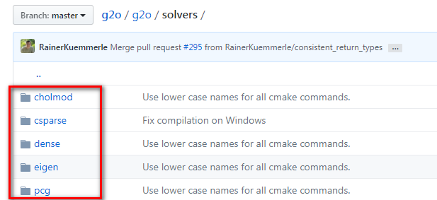

```c++
typedef g2o::BlockSolver< g2o::BlockSolverTraits<3,1> > Block;  // 每个误差项优化变量维度为3，误差值维度为1

// 第1步：创建一个线性求解器LinearSolver
Block::LinearSolverType* linearSolver = new g2o::LinearSolverDense<Block::PoseMatrixType>(); 

// 第2步：创建BlockSolver。并用上面定义的线性求解器初始化
Block* solver_ptr = new Block( linearSolver );      

// 第3步：创建总求解器solver。并从GN, LM, DogLeg 中选一个，再用上述块求解器BlockSolver初始化
g2o::OptimizationAlgorithmLevenberg* solver = new g2o::OptimizationAlgorithmLevenberg( solver_ptr );

// 第4步：创建终极大boss 稀疏优化器（SparseOptimizer）
g2o::SparseOptimizer optimizer;     // 图模型
optimizer.setAlgorithm( solver );   // 设置求解器
optimizer.setVerbose( true );       // 打开调试输出

// 第5步：定义图的顶点和边。并添加到SparseOptimizer中
CurveFittingVertex* v = new CurveFittingVertex(); //往图中增加顶点
v->setEstimate( Eigen::Vector3d(0,0,0) );
v->setId(0);
optimizer.addVertex( v );
for ( int i=0; i<N; i++ )    // 往图中增加边
{
  CurveFittingEdge* edge = new CurveFittingEdge( x_data[i] );
  edge->setId(i);
  edge->setVertex( 0, v );                // 设置连接的顶点
  edge->setMeasurement( y_data[i] );      // 观测数值
  edge->setInformation( Eigen::Matrix<double,1,1>::Identity()*1/(w_sigma*w_sigma) ); // 信息矩阵：协方差矩阵之逆
  optimizer.addEdge( edge );
}

// 第6步：设置优化参数，开始执行优化
optimizer.initializeOptimization();
optimizer.optimize(100);
```

结合上面的流程图和代码。下面一步步解释具体步骤。

### 1、创建一个线性求解器LinearSolver

我们要求的增量方程的形式是：$H△X=-b$，通常情况下想到的方法就是直接求逆，也就是$△X=-H.inv*b$。看起来好像很简单，但这有个前提，就是H的维度较小，此时只需要矩阵的求逆就能解决问题。但是当H的维度较大时，矩阵求逆变得很困难，求解问题也变得很复杂。

此时我们就需要一些特殊的方法对矩阵进行求逆:



```cpp
LinearSolverCholmod ：使用sparse cholesky分解法。继承自LinearSolverCCS
LinearSolverCSparse：使用CSparse法。继承自LinearSolverCCS
LinearSolverPCG ：使用preconditioned conjugate gradient 法，继承自LinearSolver
LinearSolverDense ：使用dense cholesky分解法。继承自LinearSolver
LinearSolverEigen： 依赖项只有eigen，使用eigen中sparse Cholesky 求解，因此编译好后可以方便的在其他地方使用，性能和CSparse差不多。继承自LinearSolver
```

#### 2、创建BlockSolver。并用上面定义的线性求解器初始化。

BlockSolver 内部包含 LinearSolver，用上面我们定义的线性求解器LinearSolver来初始化。

BlockSolver有两种定义方式

一种是指定的固定变量的solver，我们来看一下定义

```c++
 using BlockSolverPL = BlockSolver< BlockSolverTraits<p, l> >;
```

其中p代表pose的维度（注意一定是流形manifold下的最小表示），l表示landmark的维度

另一种是可变尺寸的solver，定义如下

```cpp
using BlockSolverX = BlockSolverPL<Eigen::Dynamic, Eigen::Dynamic>;
```

为何会有可变尺寸的solver呢？

这是因为在某些应用场景，我们的Pose和Landmark在程序开始时并不能确定，那么此时这个块状求解器就没办法固定变量，此时使用这个可变尺寸的solver，所有的参数都在中间过程中被确定

另外你看block_solver.h的最后，预定义了比较常用的几种类型，如下所示：

```cpp
BlockSolver_6_3 ：表示pose 是6维，观测点是3维。用于3D SLAM中的BA
BlockSolver_7_3：在BlockSolver_6_3 的基础上多了一个scale
BlockSolver_3_2：表示pose 是3维，观测点是2维
```

以后遇到了知道这些数字是什么意思就行了

我们来看[g2o](https://github.com/RainerKuemmerle/g2o)/[g2o](https://github.com/RainerKuemmerle/g2o/tree/master/g2o)/core/ 目录下，发现Solver的优化方法有三种：分别是高斯牛顿（GaussNewton）法，LM（Levenberg–Marquardt）法、Dogleg法，如下图所示，也和前面的图相匹配

上图最后那个OptimizationAlgorithmWithHessian 是干嘛的？

你点进去 GN、 LM、 Doglet算法内部，会发现他们都继承自同一个类：OptimizationWithHessian，如下图所示，这也和我们最前面那个图是相符的


然后，我们点进去看 OptimizationAlgorithmWithHessian，发现它又继承自OptimizationAlgorithm，这也和前面的相符


总之，在该阶段，我们可以选则三种方法：

```cpp
g2o::OptimizationAlgorithmGaussNewton
g2o::OptimizationAlgorithmLevenberg 
g2o::OptimizationAlgorithmDogleg 
```

#### 4、创建终极大boss 稀疏优化器（SparseOptimizer），并用已定义求解器作为求解方法。

创建稀疏优化器

```cpp
g2o::SparseOptimizer    optimizer;
```

用前面定义好的求解器作为求解方法：

```cpp
SparseOptimizer::setAlgorithm(OptimizationAlgorithm* algorithm)
```

其中setVerbose是设置优化过程输出信息用的

```cpp
SparseOptimizer::setVerbose(bool verbose)
```


#### 5、定义图的顶点和边。并添加到SparseOptimizer中。

这部分比较复杂，我们下一次再介绍。

#### 6、设置优化参数，开始执行优化。

设置SparseOptimizer的初始化、迭代次数、保存结果等。

初始化

```c++
SparseOptimizer::initializeOptimization(HyperGraph::EdgeSet& eset)
```

设置迭代次数，然后就开始执行图优化了。

```cpp
SparseOptimizer::optimize(int iterations, bool online)
```

#  掌握g2o顶点编程套路 

#### g2o的顶点（Vertex) 从哪里来的？

在《g2o:  A general Framework for (Hyper) Graph  Optimization》这篇文档里，我们找到那张经典的类结构图。也就是上次讲框架用到的那张结构图。其中涉及到顶点 （vertex） 的就是下面  加了序号的3个东东了。


对，下面我们一步步来看吧。先来看看上图中和vertex有关的第①个类： HyperGraph::Vertex，在g2o的GitHub上（https://github.com/RainerKuemmerle/g2o），它在这个路径

这个 HyperGraph::Vertex 是个abstract vertex，必须通过派生来使用。如下图所示


然后我们看g2o 类结构图中第②个类，我们看到HyperGraph::Vertex 是通过类OptimizableGraph 来继承的， 而OptimizableGraph的定义在

g2o/core/optimizable_graph.h

我们找到vertex定义，发现果然，OptimizableGraph 继承自 HyperGraph，如下图所示


不过，这个OptimizableGraph::Vertex 也非常底层，具体使用时一般都会进行扩展，因此g2o中提供了一个比较通用的适合大部分情况的模板。就是g2o 类结构图中 对应的第③个类：

BaseVertex

那么它在哪里呢？ 在这个路径：

g2o/core/base_vertex.h


BaseVertex继承自OptimizableGraph::Vertex继承自HyperGraph::Vertex，

#### g2o的顶点（Vertex) 参数如何理解？

我们来看一下模板参数 D 和 T，翻译一下上图红框：

D是int 类型的，表示vertex的最小维度，比如3D空间中旋转是3维的，那么这里 D = 3

T是待估计vertex的数据类型，比如用四元数表达三维旋转的话，T就是Quaternion 类型

我们进一步来细看一下D, T。这里的D 在源码里面是这样注释的

```c++
static const int Dimension = D; ///< dimension of the estimate (minimal) in the manifold space
```

可以看到这个D并非是顶点（更确切的说是状态变量）的维度，而是其在流形空间（manifold）的最小表示，这里一定要区别开，另外，源码里面也给出了T的作用

```c++
typedef T EstimateType;
EstimateType _estimate;
```

可以看到，这里T就是顶点（状态变量）的类型，跟前面一样。

#### 如何自己定义顶点？

我们知道了顶点的基本类型是 BaseVertex，那么下一步关心的就是如何使用了，因为在不同的应用场景（二维空间，三维空间），有不同的待优化变量（位姿，空间点），还涉及不同的优化类型（李代数位姿、李群位姿）

```c++
VertexSE2 : public BaseVertex<3, SE2>  //2D pose Vertex, (x,y,theta)
VertexSE3 : public BaseVertex<6, Isometry3>  //6d vector (x,y,z,qx,qy,qz) (note that we leave out the w part of the quaternion)
VertexPointXY : public BaseVertex<2, Vector2>
VertexPointXYZ : public BaseVertex<3, Vector3>
VertexSBAPointXYZ : public BaseVertex<3, Vector3>

// SE3 Vertex parameterized internally with a transformation matrix and externally with its exponential map
VertexSE3Expmap : public BaseVertex<6, SE3Quat>

// SBACam Vertex, (x,y,z,qw,qx,qy,qz),(x,y,z,qx,qy,qz) (note that we leave out the w part of the quaternion.
// qw is assumed to be positive, otherwise there is an ambiguity in qx,qy,qz as a rotation
VertexCam : public BaseVertex<6, SBACam>

// Sim3 Vertex, (x,y,z,qw,qx,qy,qz),7d vector,(x,y,z,qx,qy,qz) (note that we leave out the w part of the quaternion.
VertexSim3Expmap : public BaseVertex<7, Sim3>
```

重新定义顶点一般需要考虑重写如下函数：

```c++
virtual bool read(std::istream& is);
virtual bool write(std::ostream& os) const;
virtual void oplusImpl(const number_t* update);
virtual void setToOriginImpl();
```

+ read，write：分别是读盘、存盘函数，一般情况下不需要进行读/写操作的话，仅仅声明一下就可以
+ setToOriginImpl：顶点重置函数，设定被优化变量的原始值。
+ oplusImpl：顶点更新函数。非常重要的一个函数，主要用于优化过程中增量△x 的计算。我们根据增量方程计算出增量之后，就是通过这个函数对估计值进行调整的，因此这个函数的内容一定要重视。
+ 自己定义 顶点一般是下面的格式：
```c++
class myVertex: public g2::BaseVertex<Dim, Type>
  {
      public:
      EIGEN_MAKE_ALIGNED_OPERATOR_NEW

      myVertex(){}

      virtual void read(std::istream& is) {}
      virtual void write(std::ostream& os) const {}

      virtual void setOriginImpl()
      {
          _estimate = Type();
      }
      virtual void oplusImpl(const double* update) override
      {
          _estimate += /*update*/;
      }
  }

```

我们看例子就知道了，先看一个简单例子，来自十四讲中的曲线拟合，来源如下

``` ch6/g2o_curve_fitting/main.cpp```

曲线模型的顶点，模板参数：优化变量维度和数据类型

```c++
class CurveFittingVertex: public g2o::BaseVertex<3, Eigen::Vector3d>
{
public:
    EIGEN_MAKE_ALIGNED_OPERATOR_NEW
    virtual void setToOriginImpl() // 重置
    {
        _estimate << 0,0,0;
    }

    virtual void oplusImpl( const double* update ) // 更新
    {
        _estimate += Eigen::Vector3d(update);
    }
    // 存盘和读盘：留空
    virtual bool read( istream& in ) {}
    virtual bool write( ostream& out ) const {}
};
```

我们可以看到下面代码中顶点初值设置为0，更新时也是直接把更新量 update 加上去的

对于这个例子是可以直接加，因为顶点类型是Eigen::Vector3d，属于向量，是可以通过加法来更新的。但是但是有些例子就不行，比如下面这个复杂点例子：李代数表示位姿VertexSE3Expmap

```c++
/**

 \* \brief SE3 Vertex parameterized internally with a transformation matrix

 and externally with its exponential map

 */

class G2O_TYPES_SBA_API VertexSE3Expmap : public BaseVertex<6, SE3Quat>{
public:
  EIGEN_MAKE_ALIGNED_OPERATOR_NEW
  VertexSE3Expmap();
  bool read(std::istream& is);
  bool write(std::ostream& os) const;
  virtual void setToOriginImpl() {
    _estimate = SE3Quat();
  }

  virtual void oplusImpl(const number_t* update_)  {
    Eigen::Map<const Vector6> update(update_);
    setEstimate(SE3Quat::exp(update)*estimate());        //更新方式
  }
};
```

第一个参数6 表示内部存储的优化变量维度，这是个6维的李代数

第二个参数是优化变量的类型，这里使用了g2o定义的相机位姿类型：SE3Quat。

在这里可以具体查看g2o/types/slam3d/se3quat.h

它内部使用了四元数表达旋转，然后加上位移来存储位姿，同时支持李代数上的运算，比如对数映射（log函数）、李代数上增量（update函数）等操作

我们继续看例子，刚才是位姿的例子，下面是三维点的例子，空间点位置 VertexPointXYZ，维度为3，类型是Eigen的Vector3，比较简单，就不解释

```c++
 class G2O_TYPES_SBA_API VertexSBAPointXYZ : public BaseVertex<3, Vector3>
{
  public:
    EIGEN_MAKE_ALIGNED_OPERATOR_NEW    
    VertexSBAPointXYZ();
    virtual bool read(std::istream& is);
    virtual bool write(std::ostream& os) const;
    virtual void setToOriginImpl() {
      _estimate.fill(0);
    }

    virtual void oplusImpl(const number_t* update)
    {
      Eigen::Map<const Vector3> v(update);
      _estimate += v;
    }
};
```

#### 如何向图中添加顶点？

往图中增加顶点比较简单，我们还是先看看第一个曲线拟合的例子，```setEstimate(type) ```函数来设定初始值；```setId(int) ```定义节点编号

```c++
 // 往图中增加顶点
    CurveFittingVertex* v = new CurveFittingVertex();
    v->setEstimate( Eigen::Vector3d(0,0,0) );
    v->setId(0);
    optimizer.addVertex( v );
```

这个是添加 VertexSBAPointXYZ 的例子，都很容易看懂

/ch7/pose_estimation_3d2d.cpp

```c++
int index = 1;
    for ( const Point3f p:points_3d )   // landmarks
    {
        g2o::VertexSBAPointXYZ* point = new g2o::VertexSBAPointXYZ();
        point->setId ( index++ );
        point->setEstimate ( Eigen::Vector3d ( p.x, p.y, p.z ) );
        point->setMarginalized ( true ); 
        optimizer.addVertex ( point );
    }
```

## 初步认识g2o的边

我们主要关注一下上面红框内的三种边。

BaseUnaryEdge，BaseBinaryEdge，BaseMultiEdge 分别表示一元边，两元边，多元边。

一元边你可以理解为一条边只连接一个顶点，两元边理解为一条边连接两个顶点，也就是我们常见的边啦，多元边理解为一条边可以连接多个（3个以上）顶点


下面我们来看看他们的参数有什么区别？你看主要就是 几个参数：D, E, VertexXi, VertexXj，他们的分别代表：

D 是 int 型，表示测量值的维度 （dimension）
 E 表示测量值的数据类型
 VertexXi，VertexXj 分别表示不同顶点的类型

比如我们用边表示三维点投影到图像平面的重投影误差，就可以设置输入参数如下：

```c++
 BaseBinaryEdge<2, Vector2D, VertexSBAPointXYZ, VertexSE3Expmap>
```

你说说看 这个定义是什么意思？

首先这个是个二元边。第1个2是说测量值是2维的，也就是图像像素坐标x,y的差值，对应测量值的类型是Vector2D，两个顶点也就是优化变量分别是三维点 VertexSBAPointXYZ，和李群位姿VertexSE3Expmap

边和顶点的成员函数还是差别比较大的，边主要有以下几个重要的成员函数

```c++
virtual bool read(std::istream& is);
virtual bool write(std::ostream& os) const;
virtual void computeError();
virtual void linearizeOplus();
```

下面简单解释一下
read，write：分别是读盘、存盘函数，一般情况下不需要进行读/写操作的话，仅仅声明一下就可以
computeError函数：非常重要，是使用当前顶点的值计算的测量值与真实的测量值之间的误差
linearizeOplus函数：非常重要，是在当前顶点的值下，该误差对优化变量的偏导数，也就是我们说的Jacobian

除了上面几个成员函数，还有几个重要的成员变量和函数也一并解释一下：

```c++
_measurement：存储观测值
_error：存储computeError() 函数计算的误差
_vertices[]：存储顶点信息，比如二元边的话，_vertices[] 的大小为2，存储顺序和调用setVertex(int, vertex) 是设定的int 有关（0 或1）
setId(int)：来定义边的编号（决定了在H矩阵中的位置）
setMeasurement(type) 函数来定义观测值
setVertex(int, vertex) 来定义顶点
setInformation() 来定义协方差矩阵的逆
```

后面我们写代码的时候回经常遇到他们的。

## 如何自定义g2o的边？

```C++
 class myEdge: public g2o::BaseBinaryEdge<errorDim, errorType, Vertex1Type, Vertex2Type>
  {
      public:
      EIGEN_MAKE_ALIGNED_OPERATOR_NEW      
      myEdge(){}     
      virtual bool read(istream& in) {}
      virtual bool write(ostream& out) const {}      
      virtual void computeError() override
      {
          // ...
          _error = _measurement - Something;
      }      
      virtual void linearizeOplus() override
      {
          _jacobianOplusXi(pos, pos) = something;
          // ...         
          /*
          _jocobianOplusXj(pos, pos) = something;
          ...
          */
      }      
      private:
      // data
  }

```

我们可以发现，最重要的就是computeError()，linearizeOplus()两个函数了

这个是个一元边，主要是定义误差函数了，如下所示，你可以发现这个例子基本就是上面例子的一丢丢扩展，是不是感觉so easy？

```C++
// 误差模型 模板参数：观测值维度，类型，连接顶点类型
class CurveFittingEdge: public g2o::BaseUnaryEdge<1,double,CurveFittingVertex>
{
public:
    EIGEN_MAKE_ALIGNED_OPERATOR_NEW
    CurveFittingEdge( double x ): BaseUnaryEdge(), _x(x) {}
    // 计算曲线模型误差
    void computeError()
    {
        const CurveFittingVertex* v = static_cast<const CurveFittingVertex*> (_vertices[0]);
        const Eigen::Vector3d abc = v->estimate();
        _error(0,0) = _measurement - std::exp( abc(0,0)*_x*_x + abc(1,0)*_x + abc(2,0) ) ;
    }
    virtual bool read( istream& in ) {}
    virtual bool write( ostream& out ) const {}
public:
    double _x;  // x 值， y 值为 _measurement
};

```

下面是一个复杂一点例子，3D-2D点的PnP 问题，也就是最小化重投影误差问题，这个问题非常常见，使用最常见的二元边，弄懂了这个基本跟边相关的代码也差不多都一通百通了

代码在g2o的GitHub上这个地方可以看到
 g2o/types/sba/types_six_dof_expmap.h
 这里根据自己理解对代码加了注释，方便理解

```C++
//继承了BaseBinaryEdge类，观测值是2维，类型Vector2D,顶点分别是三维点、李群位姿
class G2O_TYPES_SBA_API EdgeProjectXYZ2UV : public  BaseBinaryEdge<2, Vector2D, VertexSBAPointXYZ, VertexSE3Expmap>{
  public:
    EIGEN_MAKE_ALIGNED_OPERATOR_NEW;
    //1. 默认初始化
    EdgeProjectXYZ2UV();
    //2. 计算误差
    void computeError()  {
      //李群相机位姿v1
      const VertexSE3Expmap* v1 = static_cast<const VertexSE3Expmap*>(_vertices[1]);
      // 顶点v2
      const VertexSBAPointXYZ* v2 = static_cast<const VertexSBAPointXYZ*>(_vertices[0]);
      //相机参数
      const CameraParameters * cam
        = static_cast<const CameraParameters *>(parameter(0));
     //误差计算，测量值减去估计值，也就是重投影误差obs-cam
     //估计值计算方法是T*p,得到相机坐标系下坐标，然后在利用camera2pixel()函数得到像素坐标。
      Vector2D obs(_measurement);
      _error = obs-cam->cam_map(v1->estimate().map(v2->estimate()));
    }
    //3. 线性增量函数，也就是雅克比矩阵J的计算方法
    virtual void linearizeOplus();
    //4. 相机参数
    CameraParameters * _cam; 
    bool read(std::istream& is);
    bool write(std::ostream& os) const;
};

```

有一个地方比较难理解

```C++
_error = obs - cam->cam_map(v1->estimate().map(v2->estimate()));
```

其实就是：误差 = 观测 - 投影

我们先来看看cam_map 函数，它的定义在
g2o/types/sba/types_six_dof_expmap.cpp
cam_map 函数功能是把相机坐标系下三维点（输入）用内参转换为图像坐标（输出），具体代码如下所示

```C++
Vector2  CameraParameters::cam_map(const Vector3 & trans_xyz) const {
  Vector2 proj = project2d(trans_xyz);
  Vector2 res;
  res[0] = proj[0]*focal_length + principle_point[0];
  res[1] = proj[1]*focal_length + principle_point[1];
  return res;
}
```

然后看 .map函数，它的功能是把世界坐标系下三维点变换到相机坐标系，函数在
g2o/types/sim3/sim3.h
具体定义是

```C++
   Vector3 map (const Vector3& xyz) const {
        return s*(r*xyz) + t;
      }

```
因此下面这个代码

```C++
v1->estimate().map(v2->estimate())
```

就是用V1估计的pose把V2代表的三维点，变换到相机坐标系下。

## 如何向图中添加边？

一元边的添加方法下面代码来自GitHub上，仍然是前面曲线拟合的例子

```C++
    // 往图中增加边
    for ( int i=0; i<N; i++ )
    {
        CurveFittingEdge* edge = new CurveFittingEdge( x_data[i] );
        edge->setId(i);
        edge->setVertex( 0, v );                // 设置连接的顶点
        edge->setMeasurement( y_data[i] );      // 观测数值
        edge->setInformation( Eigen::Matrix<double,1,1>::Identity()*1/(w_sigma*w_sigma) ); // 信息矩阵：协方差矩阵之逆
        optimizer.addEdge( edge );
    }

```

对于这个曲线拟合，观测值就是实际观测到的数据点。对于视觉SLAM来说，通常就是我们我们观测到的特征点坐标，下面就是一个例子。这个例子比刚才的复杂一点，因为它是二元边，需要用边连接两个顶点

```C++
    index = 1;
    for ( const Point2f p:points_2d )
    {
        g2o::EdgeProjectXYZ2UV* edge = new g2o::EdgeProjectXYZ2UV();
        edge->setId ( index );
        edge->setVertex ( 0, dynamic_cast<g2o::VertexSBAPointXYZ*> ( optimizer.vertex ( index ) ) );
        edge->setVertex ( 1, pose );
        edge->setMeasurement ( Eigen::Vector2d ( p.x, p.y ) );
        edge->setParameterId ( 0,0 );
        edge->setInformation ( Eigen::Matrix2d::Identity() );
        optimizer.addEdge ( edge );
        index++;
    }

```

这里的setMeasurement函数里的p来自向量points_2d，也就是特征点的图像坐标(x,y)

小白：这里的setMeasurement函数里的p来自向量points_2d，也就是特征点的图像坐标(x,y)了吧！
 师兄：对，这正好呼应我刚才说的。另外，你看setVertex 有两个一个是 0 和 VertexSBAPointXYZ 类型的顶点，一个是1 和pose。你觉得这里的0和1是什么意思？能否互换呢？

小白：0，1应该是分别指代哪个顶点吧，直觉告诉我不能互换，可能得去查查顶点定义部分的代码
 师兄：你的直觉没错！我帮你 查过啦，你看这个是setVertex在g2o官网的定义：

```C++
// set the ith vertex on the hyper-edge to the pointer supplied
void setVertex(size_t i, Vertex* v) { assert(i < _vertices.size() && "index out of bounds"); _vertices[i]=v;}
```

这段代码在g2o/core/hyper_graph.h里可以找到。你看 _vertices[i] 里的i就是我们这里的0和1，我们再去看看这里边的类型： g2o::EdgeProjectXYZ2UV的定义，前面我们也放出来了，就这两句

```C++
class G2O_TYPES_SBA_API EdgeProjectXYZ2UV 
.....
 //李群相机位姿v1
const VertexSE3Expmap* v1 = static_cast<const VertexSE3Expmap*>(_vertices[1]);
// 顶点v2
const VertexSBAPointXYZ* v2 = static_cast<const VertexSBAPointXYZ*>(_vertices[0]);

```

你看 _vertices[0] 对应的是 VertexSBAPointXYZ 类型的顶点，也就是三维点，_vertices[1]  对应的是VertexSE3Expmap 类型的顶点，也就是位姿pose。因此前面 1 对应的就应该是 pose，0对应的 应该就是三维点。

小白：原来如此，之前都没注意这些，看来g2o不会帮我区分顶点的类型啊，以后这里编程要对应好，不然错了都找不到原因呢！谢谢师兄，今天又是收获满满的一天！