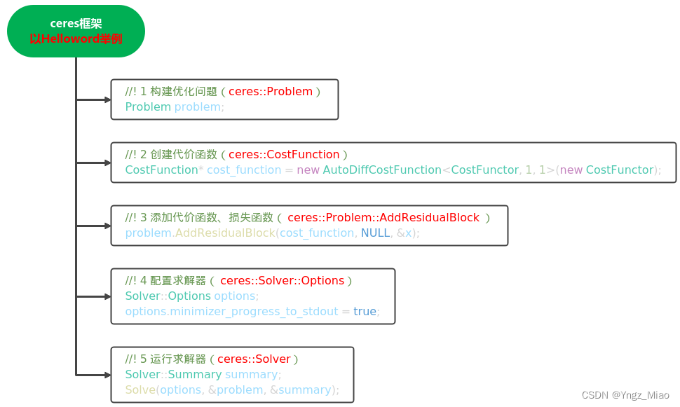
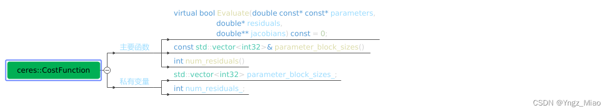

# ceres tutorial

## ceres 介绍

Ceres是由Google开发的开源C++通用非线性优化库，与g2o并列为目前视觉SLAM中应用最广泛的优化算法库。

对于任何一个优化问题，我们首先需要对问题进行建模，之后采用合适的优化方法，进行求解。在求解的过程中，往往需要进行梯度下降求取最优，这里涉及了导数计算。所以在代码中使用Ceres进行优化时，需要包含基本内容：**建模、优化、求导方法**。

[Ceres库](http://www.ceres-solver.org/)主要用于**求解无约束或者有界约束的最小二乘问题**。

## ceres 使用流程

如下面的示例代码所示，**一般我们需要定义三个对象，problem用于描述将要求解的问题，options提供了很多配置项，而summary用于记录求解过程**。

```c++
ceres::Problem problem;
ceres::Solver::Options options;
ceres::Solver::Summary summary;
```

Ceres的求解过程包括构建最小二乘和求解最小二乘问题两部分，其中构建最小二乘问题的相关方法均包含在Ceres::Problem类中，涉及的成员函数主要包括==Problem::AddResidualBlock()==和==Problem::AddParameterBlock()==。



一个简单的代码实现是：

```c++
// STEP1：构建优化问题
ceres::Problem problem;
// STEP2：构建代价函数
ceres::CostFunction* cost_function = ...; 
// STEP3：添加代价函数、核函数
problem.AddResidualBlock(cost_function, NULL, &x); 

// STEP4：配置求解器
ceres::Solver::Options options;
options.linear_solver_type = ceres::DENSE_QR;
options.minimizer_progress_to_stdout = true;
ceres::Solver::Summary summary;
// STEP5：运行求解器
ceres::Solve(options, &problem, &summary);
```

下面将会对其中的重要的几个STEP进行详细讲解。

### 构建代价函数（STEP2）



代价函数最重要的功能就是计算残差向量和雅可比矩阵。**Ceres提供了三种求导方法，分别是：解析求导、自动求导、数值求导**。**在SLAM中，使用的一般都是解析求导，这种方法需要自己填入雅克比函数**。

+ **基础代价函数类**

先看下最基础的代价函数类的声明：

```c++
class CostFunction {
 public:
  virtual bool Evaluate(double const* const* parameters,
                        double* residuals,
                        double** jacobians) const = 0;
  const vector<int32>& parameter_block_sizes();
  int num_residuals() const;

 protected:
  vector<int32>* mutable_parameter_block_sizes();
  void set_num_residuals(int num_residuals);
};
```

CostFunction的输入：参数块的数量和大小以及输出的数量，分别存储在CostFunction::parameter_block_sizes_和CostFunction::num_residuals_中。从此类继承的子类应使用对应的访问器设置这两个成员。当使用Problem::AddResidualBlock()添加代价函数时，此信息将由Problem验证。

纯虚函数的形参的解释：

+ parameters：输入参数块，大小为parameter_block_sizes.size()的数组（输入参数块的数量），parameters[i]是大小为parameter_block_sizes_[i]的数组（第i个输入参数块的维度）
+ residuals：残差，大小为num_residual_的数组_
+ jacobians：雅可比矩阵，大小为parameter_block_sizes.size()的数组的数组（输入参数块的数量），jacobians[i]是大小为num_residuals乘parameter_block_sizes_[i]的行优先数组（残差对第i个输入参数块求导，即大小为残差维度 乘 第i个输入参数块维度，再转化为行优先数据组）

parameters和residuals不能为nullptr，jacobians可能为nullptr。如果jacobians为nullptr，则用户只需计算残差即可。

纯虚函数的返回值指示残差或雅可比的计算是否成功。

如果输入参数块的大小和残差向量的大小在编译时已知（这是常见情况），则可以使用SizedCostFunction。这些已知值可以指定为模板参数，并且用户只需要实现CostFunction::Evaluate()。

```c++
template<int kNumResiduals, int... Ns>
class SizedCostFunction : public CostFunction {
 public:
  virtual bool Evaluate(double const* const* parameters,
                        double* residuals,
                        double** jacobians) const = 0;
};
```

该模板参数的含义为：

- kNumResiduals：残差的维度，即num_residuals_的值
- Ns：不定参数的数量为输入参数块的数量，即parameter_block_sizes.size()，每个不定参数对应的值为每个输入参数块的维度，即parameter_block_sizes_[i]的值

## ceres自动求导使用流程

相比于其它优化库(g20 gtsam),Ceres 一个很大的优点就是**自动求导功能**

Ceres的自动求导使用流程:

- 自定义一个模板类,或者结构体两者差不多.
- 重载()运算符
- ()运算符函数前几个参数是参数块的起始指针
- ()运算符函数最后一个参数是残差模块的指针
- ()运算符负责计算残差

## VINS 中利用ceres计算重投影误差

利用ceres计算重投影误差总共可以分为四步：

+ 构建代价函数CostFunction()

我们没有按照代码的顺序，而是先分析了最重要的部分：定义重投影误差的cost function。VINS定义了一个名为ReprojectionError3D的仿函数，即在结构体内对“()”进行了重载，也就是说ReprojectionError3D()可以当做一个函数去使用，而且可以方便的传递参数，具体细节参考【3】

```c++
struct ReprojectionError3D
{
	ReprojectionError3D(double observed_u, double observed_v)
		:observed_u(observed_u), observed_v(observed_v)
		{}

	template <typename T>
	bool operator()(const T* const camera_R, const T* const camera_T, const T* point, T* residuals) const
	{
		T p[3];
		ceres::QuaternionRotatePoint(camera_R, point, p);
		p[0] += camera_T[0]; p[1] += camera_T[1]; p[2] += camera_T[2];
		T xp = p[0] / p[2];
    	T yp = p[1] / p[2];
    	residuals[0] = xp - T(observed_u);
    	residuals[1] = yp - T(observed_v);
    	return true;
	}

	static ceres::CostFunction* Create(const double observed_x,
	                                   const double observed_y) 
	{
	  return (new ceres::AutoDiffCostFunction<
	          ReprojectionError3D, 2, 4, 3, 3>( //2，4，3，3分别代表:代价函数的维度，旋转维度，平移维度，3d													点维度。
	          	new ReprojectionError3D(observed_x,observed_y)));
	}
    //特征点的归一化坐标
	double observed_u;
	double observed_v;
};c++
```

其中的传入的参数前3个是优化变量，是有初始参数的，在 AddResidualBlock 时传入。最后一个是要求的残差项，在这个地方就是先将世界坐标系中的特征点转换到相机坐标系中，然后再投影到归一化平面中，再与测得的归一化平面中的点求坐标的误差。

+ 构建优化问题

首先定义类型为ceres::CostFunction*的代价函数，并使用上面构建的结构体：

```c++
ceres::CostFunction* cost_function = ReprojectionError3D::Create(sfm_f[i].observation[j].second.x(),
		sfm_f[i].observation[j].second.y());
problem.AddResidualBlock(cost_function, NULL, c_rotation[l], c_translation[l], sfm_f[i].position);
```

在problem.AddResidualBlock()中，后面的参数都是优化变量，传入前面的cost_function中。这是一个自动求导的代价函数，有固定的构造方法。

在new ceres::AutoDiffCostFunction<>中指定了代价函数的来源（结构体）、残差维度、以及输入的各个优化变量的维度。

+ 配置求解


### ceres 常用函数

#### AutoDiffCostFunction

```cpp
ceres::AutoDiffCostFunction<CostFunctor, int residualDim, int paramDim>(CostFunctor* functor);
```

模板参数依次为仿函数（functor）类型`CostFunctor`，残差维数`residualDim`和参数维数`paramDim`，接受参数类型为仿函数指针`CostFunctor*`。

#### Problem::AddResidualBlock( )

`AddResidualBlock()`顾名思义主要用于向`Problem`类传递残差模块的信息，函数原型如下，传递的参数主要包括代价函数模块、损失函数模块和参数模块。

```c++
ResidualBlockId Problem::AddResidualBlock(CostFunction *cost_function, 
										  LossFunction *loss_function, 
										  const vector<double *> parameter_blocks)
										  
ResidualBlockId Problem::AddResidualBlock(CostFunction *cost_function, 
										  LossFunction *loss_function,
										  double *x0, double *x1, ...)
```

代价函数：包含了参数模块的维度信息，内部使用仿函数定义误差函数的计算方式。AddResidualBlock( )函数会检测传入的参数模块是否和代价函数模块中定义的维数一致，维度不一致时程序会强制退出。代价函数模块的详解参见Ceres详解（二） CostFunction。
损失函数：用于处理参数中含有野值的情况，避免错误量测对估计的影响，常用参数包括HuberLoss、CauchyLoss等（完整的参数列表参见Ceres API文档）；该参数可以取NULL或nullptr，此时损失函数为单位函数。
参数模块：待优化的参数，可一次性传入所有参数的指针容器vector<double*>或依次传入所有参数的指针double\*。

==note：在ceres添加参数块的时候，每构建一个残差，就要调用这个函数添加参数块。==

#### Problem::AddParameterBlock( )

用户在调用AddResidualBlock( )时其实已经隐式地向Problem传递了参数模块，但在一些情况下，需要用户显示地向Problem传入参数模块（**通常出现在需要对优化参数进行重新参数化的情况**）。**比如重构旋转向量时，需要显式的添加参数块**。Ceres提供了Problem::AddParameterBlock( )函数用于用户显式传递参数模块：

```C++
void Problem::AddParameterBlock(double *values, int size)

void Problem::AddParameterBlock(double *values, int size, LocalParameterization *local_parameterization)
```

其中，第一种函数原型除了会增加一些额外的参数检查之外，功能上和隐式传递参数并没有太大区别。第二种函数原型则会额外传入`LocalParameterization`参数，用于重构优化参数的维数，这里我们着重讲解一下`LocalParameterization`类。

+ **LocalParameterization**

LocalParameterization类的作用是解决非线性优化中的**过参数化**问题。所谓过参数化，即待优化参数的实际自由度小于参数本身的自由度。**例如在SLAM中，当采用四元数表示位姿时，由于四元数本身的约束（模长为1），实际的自由度为3而非4。**此时，若直接传递四元数进行优化，冗余的维数会带来计算资源的浪费，需要使用Ceres预先定义的QuaternionParameterization对优化参数进行重构，当然，另一个原因是因为对于四元数或者旋转矩阵这种使用 `过参数化` 表示旋转的方式，**不支持广义的加法**（因为使用普通的加法就会打破其约束，比如旋转矩阵加旋转矩阵得到的就不再是旋转矩阵），所以我们在使用 Ceres 对其进行迭代更新的时候就需要自定义其更新方式了，

```C++
problem.AddParameterBlock(quaternion, 4);// 直接传递4维参数

ceres::LocalParameterization* local_param = new ceres::QuaternionParameterization();
problem.AddParameterBlock(quaternion, 4, local_param)//重构参数，优化时实际使用的是3维的等效旋转矢量
```

除此之外，ceres还允许用户自定义LocalParameterization，详见[here](https://blog.csdn.net/weixin_43991178/article/details/100532618)。

+ ceres预定义LocalParameterization

除了上面提到的QuaternionParameterization外，ceres还提供下述预定义LocalParameterization子类：

```c++
EigenQuaternionParameterization：除四元数排序采用Eigen的实部最后外，与QuaternionParameterization完全一致；
IdentityParameterizationconst：LocalSize与GlobalSize一致，相当于不传入LocalParameterization；
SubsetParameterization：GlobalSize为2，LocalSize为1，用于第一维不需要优化的情况；
HomogeneousVectorParameterization：具有共面约束的空间点；
ProductParameterization：7维位姿变量一同优化，而前4维用四元数表示的情况（这里源文档只举了一个例子，具体用法有待深化）；
```
note:注意，ceres 2.2版本开始，`LocalParameterization`方法不可用，需要用`Manifold`替代：

对比： LocalParameterization

```c++
    / 上略 /
    // Build the problem.
    double q[4];
	ceres::Problem problem;
	/****************************************/
	/* 省略调用AddResidualBlock() q是参数之一*/
	/****************************************/
    ceres::LocalParameterization* quaternion_parameterization = new ceres::QuaternionParameterization;
    problem.SetParameterization(q, quaternion_parameterization);
    / 下略 //
```

Manifold:

```c++
    / 上略 /
    // Build the problem.
    double q[4];
	ceres::Problem problem;
	/****************************************/
	/* 省略调用AddResidualBlock() q是参数之一*/
	/****************************************/
    ceres::Manifold* quaternion_manifold = new ceres::QuaternionManifold;
    problem.SetManifold(q, quaternion_manifold);
    / 下略 //
```


#### 其他成员函数

Probelm还提供了其他关于ResidualBlock和ParameterBlock的函数，例如获取模块维数、判断是否存在模块、存在的模块数目等，这里只列出几个比较重要的函数，完整的列表参见ceres API：

```c++
// 设定对应的参数模块在优化过程中保持不变
void Problem::SetParameterBlockConstant(double *values)
// 设定对应的参数模块在优化过程中可变
void Problem::SetParameterBlockVariable(double *values)
// 设定优化下界
void Problem::SetParameterLowerBound(double *values, int index, double lower_bound)
// 设定优化上界
void Problem::SetParameterUpperBound(double *values, int index, double upper_bound)
// 该函数紧跟在参数赋值后，在给定的参数位置求解Problem，给出当前位置处的cost、梯度以及Jacobian矩阵；
bool Problem::Evaluate(const Problem::EvaluateOptions &options, 
					   double *cost, vector<double>* residuals, 
					   vector<double> *gradient, CRSMatrix *jacobian)
```

#### Solve

```cpp
void Solve(const Solver::Options& options, Problem* problem, Solver::Summary* summary)
```

函数接受的三个参数分别为求解选项Solver::Options、求解问题Problem以及求解报告Solver::Summary。其中Problem类我们已经在第一讲详细介绍过；Solver::Summary只用于存储求解过程中的相关信息，并不影响求解器性能；Solver::Options则是Ceres求解的核心，包括消元顺序、分解方法、收敛精度等在内的求解器所有行为均由Solver::Options控制。

#### Solver::Options

Solver::Options含有的参数种类繁多，API文档中对于每个参数的作用和意义都给出了详细的说明。由于在大多数情况下，绝大多数参数我们都会使用Ceres的默认设置，这里只列出一些常用或较为重要的参数。

    minimizer_type：迭代求解方法，可选线性搜索方法（LINEAR_SEARCH）或信赖域方法（TRUST_REGION），默认为TRUST_REGION方法；由于大多数情况我们都会选择LM或DOGLEG方法，该选项一般直接采用默认值；
    
    trust_region_strategy_type：信赖域策略，可选LEVENBERG_MARQUARDT或DOGLEG，默认为LEVENBERG_MARQUARDT；
    
    linear_solver_type：信赖域方法中求解线性方程组所使用的求解器类型，默认为DENSE_QR，其他可选项如下：
        DENSE_QR：QR分解，用于小规模最小二乘问题求解；
        DENSE_NORMAL_CHOLESKY&SPARSE_NORMAL_CHOLESKY：Cholesky分解，用于具有稀疏性的大规模非线性最小二乘问题求解；
        CGNR：使用共轭梯度法求解稀疏方程；
        DENSE_SCHUR&SPARSE_SCHUR：SCHUR分解，用于BA问题求解；
        ITERATIVE_SCHUR：使用共轭梯度SCHUR求解BA问题；
    
    linear_solver_ordering：线性方程求解器的消元顺序，默认为NULL，即由Ceres自行决定消元顺序；在以BA为典型代表的，对消元顺序有特殊要求的应用中，可以通过成员函数reset设定消元顺序，稍后将详细说明；
    
    min_linear_solver_iteration/max_linear_solver_iteration：线性求解器的最小/最大迭代次数，默认为0/500，一般不需要更改；
    
    max_num_iterations：求解器的最大迭代次数；
    
    max_solver_time_in_seconds：求解器的最大运行秒数；
    
    num_threads：Ceres求解时使用的线程数，在老版本的Ceres中还有一个针对线性求解器的线程设置选项num_linear_solver_threads，最新版本的Ceres中该选项已被取消；虽然为了保证程序的兼容性，用户依旧可以设置该参数，但Ceres会自动忽略该参数，并没有实际意义；
    
    minimizer_progress_to_stdout：是否向终端输出优化过程信息，具体内容稍后详细说明；

在实际应用中，上述参数中对最终求解性能最大的就是线性方程求解器类型linear_solver_type和线程数，如果发现最后的求解精度或求解效率不能满足要求，应首先尝试更换这两个参数。

#### Solver::Summary

Solver::Summary包含了求解器本身和求解中各变量的信息，许多成员函数与Solver::Options一致，详细列表同样请参阅API文档，这里只给出另外两个常用的成员函数：

```c++
BriefReport()：输出单行的简单总结；
FullReport()：输出多行的完整总结。
```

现在我们来看本例中的Solver::Summary的使用：

```c++
ceres::Solver::Summary summary;
ceres::Solve(options, &problem, &summary);
std::cout << summary.FullReport() << "\n";// 输出完整的报告
```

# pyceres

pyceres是苏黎世联邦理工开发的基于python的ceres优化库，利用python调用c++的函数(pybind)

以下是一个基本的例子，展示了如何定义残差块并调用优化器

```python
import numpy as np

import pyceres
# ref: examples/helloworld_analytic_diff.cc
class HelloworldCostFunction(pyceres.CostFunction):
    def __init__(self):
        pyceres.CostFunction.__init__(self)
        self.set_num_residuals(1)
        self.set_parameter_block_sizes([1])

    def Evaluate(self, parameters, residuals, jacobians):
        x = parameters[0][0]
        residuals[0] = 10.0 - x
        if jacobians is not None:
            jacobians[0][0] = -1.0
        return True
def test_python_cost():
    x = np.array(5.0)
    x_ori = x.copy()
    prob = pyceres.Problem()
    cost = HelloworldCostFunction()
    prob.add_residual_block(cost, None, [x])
    options = pyceres.SolverOptions()
    options.minimizer_progress_to_stdout = True
    summary = pyceres.SolverSummary()
    pyceres.solve(options, prob, summary)
    print(summary.BriefReport())
    print(f"{x_ori} -> {x}")


if __name__ == "__main__":
    test_python_cost()
```

在Ceres库中，优化问题是由一系列的**参数块**和代价函数构成的。**参数块就是你想要优化的变量**，而**代价函数**则是你想要**最小化的函数**。

另外，如果想要在优化过程中保持某些参数块不变，可以调用**set_parameter_block_constant(cam.params)**函数，如下：

```
prob = pyceres.Problem()
prob.set_parameter_block_constant(cam.params)
```


