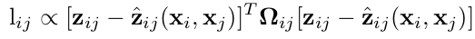
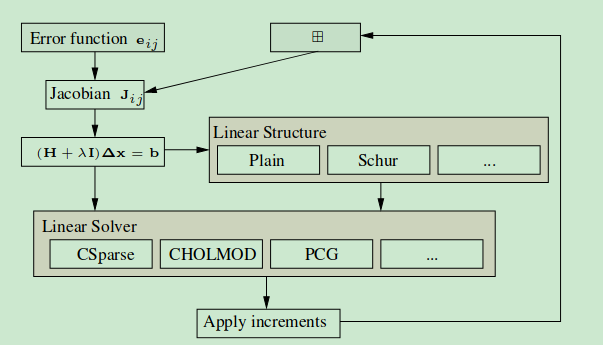
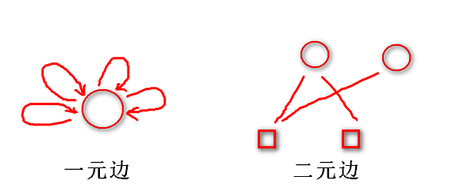

# grah slam tutorial 

在graph-based SLAM中，机器人的位姿是一个节点（node）或顶点(vertex)，位姿之间的关系构成边(edge)。

一个比较重要的概念：我们知道传感器的精度是有差别的，也就是说我们==对传感器的相信程度==应该不同。比如假设这里编码器信息很精确，测得的路标距离不准，我们应该赋予编码器信息更高的权重。请记住这种思想，这里的权重就是在后面将要经常提到的边的**信息矩阵**

## 信息矩阵

对于传感器的测量，我们可以假设它受**高斯白噪声**的影响。所以每一个测量值的分布可以看作是以真值为中心的高斯分布。如果测量是多变量的，那就是多元高斯分布。
$$
f_x(x_1,...,x_k)=\frac{1}{\sqrt{(2\pi)^k|\sigma|}}\exp (-\frac{1}{2}(x-\mu)^T\Sigma^{-1}(x-\mu))
$$
多元高斯分布的协方差矩阵的**某一维越大，高斯曲线越矮胖**，表示在这个方向上越不确定。并且高斯分布中，均值部位概率最大。所以，对于某个测量，我们应该使它出现在概率最大的地方，这就是最大似然概率。可以得到似然概率的log形式的计算公式：



误差的权重矩阵（正式名称为信息矩阵）等于协方差矩阵的逆。由于图优化里每一条边代表一个测量值，如表示相邻位姿关系的编码器测量值或者图像（激光）匹配得到的位姿变换矩阵。所以图优化里每一条边的信息矩阵就是这些测量协方差矩阵的逆。如果协方差越小，表示这次测量越准越值得相信，信息权重就越大。

## g2o库的使用

### 顶点和边

顶点和边都提供了基类，用户可以通过重写虚函数定义具体的结构。同时，大多数的内部操作都是使用模版参数实现的，以提高效率。



g2o的基本框架如图所示 ，用户只需要定义灰色框中的内容即可完成一个优化任务。

用户定义了误差函数$e_{ij}$（边）后，雅可比矩阵就可以被算出来了，但是如果想要得到更高的执行效率，用户也可以通过重写基类中的虚函数自己定义雅可比矩阵。

流程图：


我们在使用过程中，主要需要维护的就是**稀疏求解器**（SparseOptimizer），一个稀疏求解器中含有很多个顶点和边。我们用**SparseOptimizer.addVertex**和**SparseOptimizer.addEdge** 向一个图中添加顶点和边，最后调用 **SparseOptimizer.optimize** 完成优化。

但是在优化之前，需要指定我们用的求解器和迭代算法。从图中下半部分可以看到，一个 SparseOptimizer 拥有一个 Optimization Algorithm，继承自Gauss-Newton, Levernberg-Marquardt,  Powell's dogleg 三者之一（我们常用的是GN或LM）。同时，这个 Optimization Algorithm  拥有一个Solver，它含有两个部分。一个是 SparseBlockMatrix ，用于计算稀疏的雅可比和海塞矩阵；  一个是用于计算迭代过程中最关键的一步
$$
H\Delta x=-b
$$
这就需要一个线性方程的求解器。而这个求解器，可以从 PCG, CSparse, Choldmod 三者选一。

## 使用大致流程

在使用过程中，通常首先是定义**优化器**，主要包括三个过程：

+ 定义一个稀疏线性方程求解器，如CG，CSparse，Cholmod等，用于计算雅可比矩阵和海森矩阵的解析形式。
+ 定义所使用的优化算法，通常为GN或LM算法。
+ 定义优化器。之后定义图的顶点和边，将其加入优化器，最终求解得到优化结果。

```c++
#include <g2o/core/block_solver.h>
#include <g2o/core/optimization_algorithm_gauss_newton.h>
//#include <g2o/core/optimization_algorithm_levenberg.h>
//#include <g2o/core/optimization_algorithm_dogleg.h>
#include <g2o/solvers/dense/linear_solver_dense.h>
#include <Eigen/Core>
//宏定义，分别定义了BlockSolver的类型以及LinearSolver的类型
typedef g2o::BlockSolver<g2o::BlockSolverTraits<3, 1>> BlockSolverType;  // 每个误差项优化变量维度为3，误差值维度为1
typedef g2o::LinearSolverDense<BlockSolverType::PoseMatrixType> LinearSolverType; // 线性求解器类型
int main()
{
	//第一步 选择优化方法
    auto solver = new g2o::OptimizationAlgorithmGaussNewton(g2o::make_unique<BlockSolverType>(g2o::make_unique<LinearSolverType>())); //最内层是线性求解器，外面套着Block求解器
    //第二步 初始化稀疏求解器
	g2o::SparseOptimizer optimizer; 
    //第三步 设置系数
    optimizer.setAlgorithm(solver);   // 设置求解器
  	optimizer.setVerbose(true);       // 打开调试输出
}
```

**第二步十分重要，定义节点和边**

### 定义顶点

顶点的基本类型是BaseVertex，他有两个参数：D和T，其中D是指状态变量在其流形空间的最小表示，不能单纯的理解为是状态变量的维度。T是状态变量的数据类型。

基本类型：

```c++
VertexSE2 : public BaseVertex<3, SE2>  //2D pose Vertex, (x,y,theta)
VertexSE3 : public BaseVertex<6, Isometry3>  //6d vector (x,y,z,qx,qy,qz) (note that we leave out the w part of the quaternion)
VertexPointXY : public BaseVertex<2, Vector2>
VertexPointXYZ : public BaseVertex<3, Vector3>
VertexSBAPointXYZ : public BaseVertex<3, Vector3> //新版g2o不再有这个函数

// SE3 Vertex parameterized internally with a transformation matrix and externally with its exponential map
VertexSE3Expmap : public BaseVertex<6, SE3Quat>

// SBACam Vertex, (x,y,z,qw,qx,qy,qz),(x,y,z,qx,qy,qz) (note that we leave out the w part of the quaternion.
// qw is assumed to be positive, otherwise there is an ambiguity in qx,qy,qz as a rotation
VertexCam : public BaseVertex<6, SBACam>

// Sim3 Vertex, (x,y,z,qw,qx,qy,qz),7d vector,(x,y,z,qx,qy,qz) (note that we leave out the w part of the quaternion.
VertexSim3Expmap : public BaseVertex<7, Sim3>
```

重新定义顶点一般需要考虑重写如下函数：

```c++
virtual bool read(std::istream& is);
virtual bool write(std::ostream& os) const;
virtual void oplusImpl(const number_t* update); //顶点更新
virtual void setToOriginImpl(); //顶点变量的初始化
```

+ read，write：分别是读盘、存盘函数，一般情况下不需要进行读/写操作的话，仅仅声明一下就可以
+ setToOriginImpl：顶点重置函数，设定被优化变量的原始值。
+ oplusImpl：顶点更新函数。非常重要的一个函数，主要用于优化过程中增量△x 的计算。我们根据增量方程计算出增量之后，就是通过这个函数对估计值进行调整的，因此这个函数的内容一定要重视。

以下是一个自己定义 顶点的格式：

```c++
class myVertex: public g2o::BaseVertex<Dim, Type>
  {
      public:
      EIGEN_MAKE_ALIGNED_OPERATOR_NEW

      myVertex(){}

      virtual void read(std::istream& is) {}
      virtual void write(std::ostream& os) const {}

      virtual void setOriginImpl()
      {
          _estimate = Type();
      }
      virtual void oplusImpl(const double* update) override
      {
          _estimate += /*update*/;
      }
  }
```

+ 定义相机位姿顶点：

```c++
/**
 \* \brief SE3 Vertex parameterized internally with a transformation matrix
 and externally with its exponential map
 */
class VertexSE3Expmap : public BaseVertex<6, SE3Quat>{
public:
  EIGEN_MAKE_ALIGNED_OPERATOR_NEW
  VertexSE3Expmap();
  bool read(std::istream& is);
  bool write(std::ostream& os) const;
  virtual void setToOriginImpl() {
    _estimate = SE3Quat();
  }

  virtual void oplusImpl(const number_t* update_)  {
    Eigen::Map<const g2o::Vector6> v(update_);
    _estimate = g2o::SE3Quat::exp(v) * _estimate;        //更新方式
  }
   //Eigen::Map 和std::map没有直接关系，Eigen::Map能够将现有的内存块(如数组或指针)映射到Eigen对象上，而无需数据的拷贝
    /**
    例子：
    // 假设有一个已存在的内存块（数组或指针）
    double data[6] = {1.0, 2.0, 3.0, 4.0, 5.0, 6.0};
    // 将内存块映射到Eigen向量对象
    Eigen::Map<Eigen::VectorXd> vectorMap(data, 6);
    // 使用映射后的Eigen向量对象进行操作
    vectorMap *= 2.0;
    // 输出修改后的内存块数据
    for (int i = 0; i < 6; ++i)
    {
        std::cout << data[i] << " ";
    }
    std::cout << std::endl;
    **/
};
```

第一个参数6 表示内部存储的优化变量维度，这是个6维的李代数

第二个参数是优化变量的类型，这里使用了g2o定义的相机位姿类型：SE3Quat。

在这里可以具体查看g2o/types/slam3d/se3quat.h

它内部使用了四元数表达旋转，然后加上位移来存储位姿，同时支持李代数上的运算，比如对数映射（log函数）、李代数上增量（update函数）等操作

+ 定义路标点

```c++
 class VertexSBAPointXYZ : public BaseVertex<3, g2o::Vector3>
{
  public:
    EIGEN_MAKE_ALIGNED_OPERATOR_NEW    
    VertexSBAPointXYZ();
    virtual bool read(std::istream& is);
    virtual bool write(std::ostream& os) const;
    virtual void setToOriginImpl() {
      _estimate.fill(0);
    }

    virtual void oplusImpl(const double* update)
    {
      Eigen::Map<const g2o::Vector3> v(update);
      _estimate += v;
    }
};
```

+ 向图中增加顶点

```c++
 // 往图中增加顶点
    CurveFittingVertex* v = new CurveFittingVertex();
    v->setEstimate( Eigen::Vector3d(0,0,0) );
    v->setId(0);
    optimizer.addVertex(v);
```

**常用顶点总结：**

==1.相机位姿(SE3)==

```c++
class  VertexSE3Expmap : public BaseVertex<6, SE3Quat>
```

需要设置的模板参数：

- 参数`6` ：`SE3Quat`类型为六维，三维旋转，三维平移
- 参数`SE3Quat` ：该类型旋转在前，平移在后，注意：类型内部使用的其实是四元数，不是李代数

该顶点需要设置的参数：

```c++
g2o::VertexSE3Expmap * vSE3 = new g2o::VertexSE3Expmap();
//【1】设置待优化位姿（这是粗略位姿）
vSE3->setEstimate(Converter::toSE3Quat(pKFi->GetPose()));
//【2】设置Id号
vSE3->setId(pKFi->mnId);
//【3】设置是否固定，第一帧固定
vSE3->setFixed(pKFi->mnId==0);
```

==2.空间点位置==

```c++
class VertexSBAPointXYZ : public BaseVertex<3, Vector3d>
```

该顶点需要设置的参数：

```c++
g2o::VertexSBAPointXYZ* vPoint = new g2o::VertexSBAPointXYZ();
//【1】设置待优化空间点3D位置XYZ
vPoint->setEstimate(Converter::toVector3d(pMP->GetWorldPos()));
//【2】设置Id号
vPoint->setId(id);
//【3】是否边缘化（以便稀疏化求解）
vPoint->setMarginalized(true);
```

### 边

主要有：BaseUnaryEdge，**BaseBinaryEdge**，BaseMultiEdge 分别表示一元边，**两元边**，多元边。

一元边你可以理解为一条边只连接一个顶点，**两元边理解为一条边连接两个顶点，也就是我们常见的边**，多元边理解为一条边可以连接多个（3个以上）顶点



主要有以下几个参数：

D：是 int 型，表示测量值的维度 （dimension）

E：表示测量值的数据类型

VertexXi，VertexXj：分别表示不同顶点的类型(二元边的话就表示两个节点的类型)

比如我们用边表示三维点投影到图像平面的重投影误差，就可以设置输入参数如下：

```c++
 BaseBinaryEdge<2, Vector2D, VertexSBAPointXYZ, VertexSE3Expmap>
```

首先这个是个二元边。第1个2是说测量值是2维的，也就是图像像素坐标x,y的差值，对应测量值的类型是Vector2D，两个顶点也就是优化变量分别是三维点 VertexSBAPointXYZ，和李群位姿VertexSE3Expmap。

边和顶点的成员函数还是差别比较大的，边主要有以下几个重要的成员函数

```c++
virtual bool read(std::istream& is);
virtual bool write(std::ostream& os) const;
virtual void computeError();
virtual void linearizeOplus();
```

read，write：分别是读盘、存盘函数，一般情况下不需要进行读/写操作的话，仅仅声明一下就可以
computeError函数：==非常重要==，是使用当前顶点的值计算的测量值与真实的测量值之间的误差
linearizeOplus函数：==非常重要==，是在当前顶点的值下，该误差对优化变量的偏导数，也就是我们说的Jacobian

除了上面几个成员函数，还有几个重要的成员变量和函数也一并解释一下：

```c++
_measurement：存储观测值
_error：存储computeError() 函数计算的误差
_vertices[]：存储顶点信息，比如二元边的话，_vertices[] 的大小为2，存储顺序和调用setVertex(int, vertex) 是设定的int 有关（0 或1）
setId(int)：来定义边的编号（决定了在H矩阵中的位置）
setMeasurement(type) 函数来定义观测值
setVertex(int, vertex) 来定义顶点
setInformation() 来定义协方差矩阵的逆(信息矩阵)
```

**自定义边：**

```c++
 class myEdge: public g2o::BaseBinaryEdge<errorDim, errorType, Vertex1Type, Vertex2Type>
  {
      public:
      EIGEN_MAKE_ALIGNED_OPERATOR_NEW      
      myEdge(){}     
      virtual bool read(istream& in) {}
      virtual bool write(ostream& out) const {}      
      virtual void computeError() override
      {
          // ...
          _error = _measurement - Something;
      }      
      virtual void linearizeOplus() override
      {
          _jacobianOplusXi(pos, pos) = something;
          // ...         
          /*
          _jocobianOplusXj(pos, pos) = something;
          ...
          */
      }      
      private:
      // data
  }
```

例子：3D-2D点的PnP问题，也就是重投影误差问题

```c++
//继承了BaseBinaryEdge类，观测值是2维，类型Vector2D,顶点分别是三维点、李群位姿
class G2O_TYPES_SBA_API EdgeProjectXYZ2UV : public  BaseBinaryEdge<2, Vector2D, VertexSBAPointXYZ, VertexSE3Expmap>{
  public:
    EIGEN_MAKE_ALIGNED_OPERATOR_NEW;
    //1. 默认初始化
    EdgeProjectXYZ2UV();
    //2. 计算误差
    void computeError()  {
      //李群相机位姿v1
      const VertexSE3Expmap* v1 = static_cast<const VertexSE3Expmap*>(_vertices[1]);
      // landmark v2
      const VertexSBAPointXYZ* v2 = static_cast<const VertexSBAPointXYZ*>(_vertices[0]);
      //相机参数
      const CameraParameters * cam
        = static_cast<const CameraParameters *>(parameter(0));
     //误差计算，测量值减去估计值，也就是重投影误差obs-cam
     //估计值计算方法是T*p,得到相机坐标系下坐标，然后在利用camera2pixel()函数得到像素坐标。
      Vector2D obs(_measurement);
      _error = obs-cam->cam_map(v1->estimate().map(v2->estimate()));
    }
    //3. 线性增量函数，也就是雅克比矩阵J的计算方法
    virtual void linearizeOplus();
    //4. 相机参数
    CameraParameters * _cam; 
    bool read(std::istream& is);
    bool write(std::ostream& os) const;
};
```

有一个地方比较难理解

```C++
_error = obs - cam->cam_map(v1->estimate().map(v2->estimate()));
```

其实就是：误差 = 观测 - 投影

我们先来看看cam_map 函数，它的定义在
g2o/types/sba/types_six_dof_expmap.cpp
==cam_map 函数功能是把相机坐标系下三维点（输入）用内参转换为图像坐标（输出）==，具体代码如下所示

```C++
Vector2  CameraParameters::cam_map(const Vector3 & trans_xyz) const {
  Vector2 proj = project2d(trans_xyz);
  Vector2 res;
  res[0] = proj[0]*focal_length + principle_point[0];
  res[1] = proj[1]*focal_length + principle_point[1];
  return res;
}
```

然后看 .map函数，==它的功能是把世界坐标系下三维点变换到相机坐标系==，函数在g2o/types/sim3/sim3.h具体定义是

```C++
   Vector3 map (const Vector3& xyz) const {
        return s*(r*xyz) + t;
      }
//map方法是SE3Quat类型的一个成员函数，用于将一个三维点从一个坐标系变换到另一个坐标系。
```

因此下面这个代码

```C++
v1->estimate().map(v2->estimate())
```

就是用V1估计的pose把V2代表的三维点，变换到相机坐标系下。

#### **如何向图中添加边？**

一元边的添加方法下面代码来自GitHub上，仍然是前面曲线拟合的例子

```C++
    // 往图中增加边
    for ( int i=0; i<N; i++ )
    {
        CurveFittingEdge* edge = new CurveFittingEdge( x_data[i] );
        edge->setId(i);
        edge->setVertex( 0, v );                // 设置连接的顶点
        edge->setMeasurement( y_data[i] );      // 观测数值
        edge->setInformation( Eigen::Matrix<double,1,1>::Identity()*1/(w_sigma*w_sigma) ); // 信息矩阵：协方差矩阵之逆
        optimizer.addEdge( edge );
    }

```

对于这个曲线拟合，观测值就是实际观测到的数据点。对于视觉SLAM来说，通常就是我们我们观测到的特征点坐标，下面就是一个例子。这个例子比刚才的复杂一点，因为它是二元边，需要用边连接两个顶点

```C++
    index = 1;
    for ( const Point2f p:points_2d )
    {
        g2o::EdgeProjectXYZ2UV* edge = new g2o::EdgeProjectXYZ2UV();
        edge->setId ( index );
        edge->setVertex ( 0, dynamic_cast<g2o::VertexSBAPointXYZ*> ( optimizer.vertex ( index ) ) );
        edge->setVertex ( 1, pose );
        edge->setMeasurement ( Eigen::Vector2d ( p.x, p.y ) );
        edge->setParameterId ( 0,0 );
        edge->setInformation ( Eigen::Matrix2d::Identity() );
        optimizer.addEdge ( edge );
        index++;
    }

```

这里的setMeasurement函数里的p来自向量points_2d，也就是特征点的图像坐标(x,y)

小白：这里的setMeasurement函数里的p来自向量points_2d，也就是特征点的图像坐标(x,y)了吧！
 师兄：对，这正好呼应我刚才说的。另外，你看setVertex 有两个一个是 0 和 VertexSBAPointXYZ 类型的顶点，一个是1 和pose。你觉得这里的0和1是什么意思？能否互换呢？

小白：0，1应该是分别指代哪个顶点吧，直觉告诉我不能互换，可能得去查查顶点定义部分的代码
 师兄：你的直觉没错！我帮你 查过啦，你看这个是setVertex在g2o官网的定义：

```C++
// set the ith vertex on the hyper-edge to the pointer supplied
void setVertex(size_t i, Vertex* v) { assert(i < _vertices.size() && "index out of bounds"); _vertices[i]=v;}
```

这段代码在
g2o/core/hyper_graph.h
里可以找到。你看 _vertices[i] 里的i就是我们这里的0和1，我们再去看看这里边的类型： g2o::EdgeProjectXYZ2UV
的定义，前面我们也放出来了，就这两句

```C++
class G2O_TYPES_SBA_API EdgeProjectXYZ2UV 
.....
 //李群相机位姿v1
const VertexSE3Expmap* v1 = static_cast<const VertexSE3Expmap*>(_vertices[1]);
// 顶点v2
const VertexSBAPointXYZ* v2 = static_cast<const VertexSBAPointXYZ*>(_vertices[0]);

```

你看 _vertices[0] 对应的是 VertexSBAPointXYZ 类型的顶点，也就是三维点，_vertices[1]  对应的是VertexSE3Expmap 类型的顶点，也就是位姿pose。因此前面 1 对应的就应该是 pose，0对应的 应该就是三维点。

**小白：原来如此，之前都没注意这些，看来g2o不会帮我区分顶点的类型啊，以后这里编程要对应好，不然错了都找不到原因呢！谢谢师兄，今天又是收获满满的一天！**

**常用边总结：**

==1.Point_Pose 二元边==（$Point_{XYZ}-SE3$边） 即要优化MapPoints的位置，又要优化相机的位姿

```c++
class  EdgeSE3ProjectXYZ: public  BaseBinaryEdge<2, Vector2d, VertexSBAPointXYZ, VertexSE3Expmap>
```

需要设置的模板参数：

- 参数`2` ：观测值（这里是3D点在像素坐标系下的投影坐标）的维度
- 参数`Vector` ：观测值类型，piexl.x，piexl.y
- 参数`VertexSBAPointXYZ`：第一个顶点类型
- 参数`VertexSE3Expmap` ：第二个顶点类型

该边需要设置的参数：

```c++
g2o::EdgeSE3ProjectXYZ* e = new g2o::EdgeSE3ProjectXYZ();

//【1】设置第一个顶点，注意该顶点类型与模板参数第一个顶点类型对应
e->setVertex(0, dynamic_cast<g2o::OptimizableGraph::Vertex*>(optimizer.vertex(id)));
//【2】设置第二个顶点
e->setVertex(1, dynamic_cast<g2o::OptimizableGraph::Vertex*>(optimizer.vertex(pKFi->mnId)));
//【3】设置观测值，类型与模板参数对应
e->setMeasurement(obs);
const float &invSigma2 = pKFi->mvInvLevelSigma2[kpUn.octave];
//【4】设置信息矩阵，协方差
e->setInformation(Eigen::Matrix2d::Identity()*invSigma2);

//【5】设置鲁棒核函数
g2o::RobustKernelHuber* rk = new g2o::RobustKernelHuber;
e->setRobustKernel(rk);
rk->setDelta(thHuberMono);

//【6】设置相机内参
e->fx = pKFi->fx;
e->fy = pKFi->fy;
e->cx = pKFi->cx;
e->cy = pKFi->cy;
```

2. Pose 一元边（SE3）仅优化相机位姿，为了构造出投影方程，需要按下面的方式把MapPoints的位置作为常量加入

```c++
class  EdgeSE3ProjectXYZOnlyPose: public  BaseUnaryEdge<2, Vector2d, VertexSE3Expmap>
```

该边需要设置的参数：

```c++
g2o::EdgeSE3ProjectXYZOnlyPose* e = new g2o::EdgeSE3ProjectXYZOnlyPose();

// 注意这里只设置一个顶点，其它一样
e->setVertex(0, dynamic_cast<g2o::OptimizableGraph::Vertex*>(optimizer.vertex(0)));
e->setMeasurement(obs);
const float invSigma2 = pFrame->mvInvLevelSigma2[kpUn.octave];
e->setInformation(Eigen::Matrix2d::Identity()*invSigma2);

g2o::RobustKernelHuber* rk = new g2o::RobustKernelHuber;
e->setRobustKernel(rk);
rk->setDelta(deltaMono); /** @attention 设置阈值，卡方自由度为2，内点概率95%对应的临界值*/

e->fx = pFrame->fx;
e->fy = pFrame->fy;
e->cx = pFrame->cx;
e->cy = pFrame->cy;

/** @attention 需要在这里设置<不做优化>的MapPoints的位置*/
cv::Mat Xw = pMP->GetWorldPos();
e->Xw[0] = Xw.at<float>(0);
e->Xw[1] = Xw.at<float>(1);
e->Xw[2] = Xw.at<float>(2);
```

== 2.Pose-Pose 二元边==（SE3-SE3边）优化变量是相机相邻两个关键帧位姿，约束来自对这两个关键帧位姿变换的测量（里程计、IMU等）

需要设置的参数如下：

```c++
Se2 measure_se2 = pMsrOdo->se2;
// 【1】里程计测量的协方差
g2o::Matrix3D covariance = toEigenMatrixXd(pMsrOdo->info).inverse(); 

// 【2】将里程计测量转换成g2o::SE3Quat类型
Eigen::AngleAxisd rotz(measure_se2.theta, Eigen::Vector3d::UnitZ());
g2o::SE3Quat relativePose_SE3Quat(rotz.toRotationMatrix(), Eigen::Vector3d(measure_se2.x, measure_se2.y, 0));

// 【3】将`里程计测量协方差`转换为`相机坐标系下协方差`
// 注意：g2o::SE3Quat是旋转在前，平移在后
g2o::Matrix6d covariance_6d = g2o::Matrix6d::Identity();
covariance_6d(0,0) = covariance(2,2);
covariance_6d(0,4) = covariance(2,0); covariance_6d(0,5) = covariance(2,1);
covariance_6d(4,0) = covariance(0,2); covariance_6d(5,0) = covariance(1,2);
covariance_6d(3,3) = covariance(0,0);
covariance_6d(4,4) = covariance(1,1);
covariance_6d(1,1) = 0.00001;
covariance_6d(2,2) = 0.01;
covariance_6d(5,5) = 0.0001;

g2o::Matrix6d Info = g2o::Matrix6d::Identity();
Info = covariance_6d.inverse();

// 【4】构造边
g2o::EdgeOnlineCalibration* e = new g2o::EdgeOnlineCalibration;
e->vertices()[0] = optimizer.vertex(id0);
e->vertices()[1] = optimizer.vertex(id1);
e->setMeasurement(relativePose_SE3Quat);
e->setInformation(Info);
optimizer.addEdge(e);
```

g2o中经常使用的`BlockSolver_6_3`、`BlockSolver_7_3`定义如下：

```c++
  // solver for BA/3D SLAM
  typedef BlockSolver< BlockSolverTraits<6, 3> > BlockSolver_6_3;  
  // solver fo BA with scale
  typedef BlockSolver< BlockSolverTraits<7, 3> > BlockSolver_7_3; 
```

